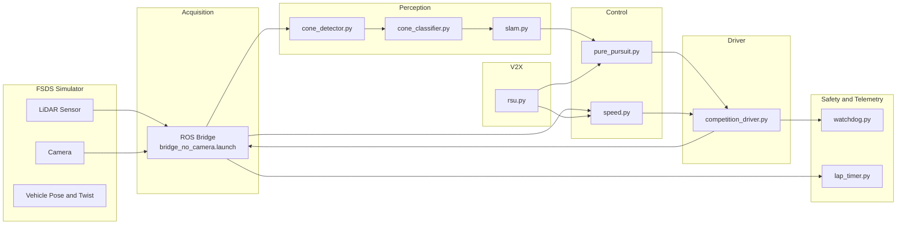

# HYCU FSDS Autonomous Driving / HYCU FSDS 자율주행

> Formula Student Driverless Simulator 기반 자율주행 시스템  
> Autonomous driving stack for the Formula Student Driverless Simulator (FSDS)


---

## Overview / 개요

**EN**  
HYCU FSDS Autonomous Driving is an autonomous driving project for Formula Student Driverless Simulator (FSDS) workflows. It provides Dockerized ROS Noetic components for perception (cone detection, classification, SLAM), control (pure pursuit, speed), safety monitoring (watchdog), lap timing, simulator integration, V2X support, and competition-style submission packaging. The repository is split into a development-oriented stack and a packaged submission stack so that the same algorithms can be iterated locally and re-built as a frozen runtime for evaluation.

**KR**  
HYCU FSDS Autonomous Driving은 Formula Student Driverless Simulator(FSDS) 워크플로우를 위한 자율주행 프로젝트입니다. ROS Noetic 기반의 Docker 컨테이너 구성으로 콘 감지·분류·SLAM 인지 모듈, Pure Pursuit·속도 제어 모듈, 워치독 안전 감시, 랩 타이머, 시뮬레이터 연동, V2X 지원, 대회 제출 패키징을 제공합니다. 저장소는 개발용 스택과 제출용 패키지 스택으로 분리되어 있어, 동일한 알고리즘을 로컬에서 반복 개발하고 평가용 동결 런타임(frozen runtime)으로 다시 빌드할 수 있습니다.

The repository provides two execution paths / 저장소는 두 가지 실행 경로를 제공합니다:

1. `src/autonomous/` — Development-oriented stack / 개발 및 실험용 자율주행 스택.
2. `submission/` — Frozen runtime stack for competition submission or evaluation / 대회 제출 또는 평가를 위한 동결 실행 스택.

---

## Features / 주요 기능

### Perception / 인지
- **Cone Detection** (`cone_detector.py`) — LiDAR 포인트 클라우드에서 콘(cone) 후보 추출 / Extract cone candidates from LiDAR point clouds.
- **Cone Classification** (`cone_classifier.py`) — 색상·형상 기반 콘 분류 (좌/우/대형) / Classify cones by color and shape (left / right / large).
- **SLAM** (`slam.py`) — 동시 위치 추정 및 트랙 경계 지도 작성 / Simultaneous localization and mapping for track boundaries.

### Control / 제어
- **Pure Pursuit** (`pure_pursuit.py`) — Pure Pursuit 기하학 기반 경로 추종 조향 / Path-following steering via pure pursuit geometry.
- **Speed Controller** (`speed.py`) — 곡률 기반 종방향 속도 계획 / Curvature-aware longitudinal speed planning.

### Safety and Telemetry / 안전 및 텔레메트리
- **Watchdog** (`watchdog.py`) — 비정상 상태 감시 및 안전 정지 폴백 / Health monitoring with safe-stop fallback.
- **Lap Timer** (`lap_timer.py`) — 구간·랩 시간 측정 / Sector and lap time recording.
- **Race Recorder** (`record_race.sh`) — ROS bag 기반 주행 기록 / Record race runs to ROS bags.

### V2X / 차량-인프라 통신
- **RSU Client** (`submission/src/v2x/rsu.py`) — Roadside Unit과의 정보 교환 / Communicate with roadside infrastructure (signal phase, track conditions).

### Driver Layer / 드라이버 계층
- **Competition Driver** (`competition_driver.py`) — 계획 출력을 차량 명령으로 변환 / Translates planning output into vehicle control commands.
- **Driver Variants** (`submission/src/drivers/`) — `basic.py`, `advanced.py`, `autonomous.py`, `competition.py` 다단계 추상화 / Tiered driver abstractions for different competition classes.

### Tooling and Packaging / 도구 및 패키징
- **Docker / docker-compose** — FSDS 연동용 컨테이너 런타임 / Containerized runtime for FSDS integration.
- **ROS Launch** (`bridge_no_camera.launch`, `competition.launch`) — 노드 그래프 부트스트랩 / Bootstrap the ROS node graph.
- **Package Script** (`scripts/package.sh`) — 대회 제출용 아카이브 생성 / Build a submission-ready archive.

---

## Architecture / 아키텍처

### Module Pipeline / 모듈 파이프라인

The perception-control loop is identical in both stacks. The development stack (`src/autonomous/`) and the submission stack (`submission/`) share the same module implementations for the inner loop; only the driver, launch, and packaging differ.

인지-제어 루프는 두 스택에서 동일합니다. 개발 스택(`src/autonomous/`)과 제출 스택(`submission/`)은 내부 루프의 모듈 구현을 공유하며, 드라이버·런치·패키징에서만 차이가 있습니다.



### Stack Comparison / 스택 비교

| Concern / 항목 | `src/autonomous/` (Dev) | `submission/` (Frozen) |
| --- | --- | --- |
| Driver / 드라이버 | `competition_driver.py` | `drivers/{basic,advanced,autonomous,competition}.py` |
| Launch / 런치 | `bridge_no_camera.launch` | `competition.launch` |
| V2X / V2X | — | `v2x/rsu.py` |
| Tests / 테스트 | `tests/test_algorithms.py` | Inherits dev tests / 개발 테스트 상속 |
| Container / 컨테이너 | `Dockerfile` + `docker-compose.yml` | `Dockerfile` + `docker-compose.yml` (+ `autonomous/`) |
| Entrypoint / 진입점 | `entrypoint.sh`, `start.sh` | `run.sh`, `dev.sh` |
| Race Tools / 레이스 도구 | `start_race.py`, `record_race.sh`, `run_all.sh` | Inherits via `submission/autonomous/` |

---

## Automation Inventory / 자동화 인벤토리

This repository is operated by **16 GitHub Actions workflows**. There are no Go-based automation tools in this repo.

이 저장소는 **16개의 GitHub Actions 워크플로우**로 운영됩니다. 본 저장소에는 Go 기반 자동화 도구가 없습니다.

### Workflows / 워크플로우

| File | Purpose (EN) | 목적 (KR) |
| --- | --- | --- |
| `ci.yml` | Continuous integration (build, lint, test). | 지속적 통합 (빌드, 린트, 테스트). |
| `01_branch-to-pr.yml` | Open a PR when a feature branch is pushed. | 기능 브랜치 푸시 시 PR 자동 생성. |
| `02_issue-to-branch.yml` | Create a branch from an issue. | 이슈에서 브랜치 자동 생성. |
| `10_pr-review.yml` | AI-assisted PR review (qodo-ai/pr-agent). | AI 기반 PR 리뷰 (qodo-ai/pr-agent). |
| `11_security-pr-review.yml` | Security-focused PR review. | 보안 관점 PR 리뷰. |
| `12_dependabot-auto-merge.yml` | Auto-merge trusted Dependabot PRs. | 신뢰된 Dependabot PR 자동 병합. |
| `13_pr-auto-merge.yml` | Auto-merge PRs meeting policy. | 정책 충족 PR 자동 병합. |
| `14_bot-auto-fix.yml` | Bot-driven auto-fix on issues / PRs. | 이슈 / PR에 대한 봇 자동 수정. |
| `15_merged-pr-cleanup.yml` | Delete merged feature branches. | 병합된 기능 브랜치 정리. |
| `19_issue-backfill.yml` | Backfill missing issue metadata. | 누락된 이슈 메타데이터 보강. |
| `24_release-notes.yml` | Draft release notes. | 릴리스 노트 초안 작성. |
| `25_release-publish.yml` | Publish a GitHub release. | GitHub 릴리스 게시. |
| `29_downstream-health-check.yml` | Monitor downstream consumers. | 다운스트림 컨슈머 헬스 체크. |
| `37_ci-failure-issues.yml` | File an issue on CI failure. | CI 실패 시 이슈 자동 생성. |
| `60_ci-auto-heal.yml` | Auto-heal recurring CI failures. | 반복 CI 실패 자동 복구. |
| `91_issue-classification.yml` | Classify and label new issues. | 신규 이슈 분류 및 라벨링. |

PR review is powered by [qodo-ai/pr-agent](https://github.com/qodo-ai/pr-agent).

PR 리뷰는 [qodo-ai/pr-agent](https://github.com/qodo-ai/pr-agent)로 동작합니다.

---

## Quick Start / 빠른 시작

### Prerequisites / 사전 요구사항

- Docker 20.10+ and docker-compose v2 / Docker 20.10+ 및 docker-compose v2
- Formula Student Driverless Simulator (FSDS) installed and runnable on the host
- ROS Noetic-compatible GPU drivers (recommended for perception)
- ~8 GB free disk for images and ROS bags / 이미지와 ROS bag용 여유 디스크 약 8 GB 권장

### Clone / 클론

```bash
git clone <your-fork-or-origin-url> hycu-fsds
cd hycu-fsds
```

### Run the Development Stack / 개발 스택 실행

```bash
cd src/autonomous
docker compose up --build
```

In a separate terminal, attach to the running container:

```bash
docker compose exec autonomous bash
roslaunch config/bridge_no_camera.launch
```

### Run the Submission Stack / 제출 스택 실행

```bash
cd submission
docker compose up --build
./run.sh
```

The submission stack uses `submission/run.sh` as the canonical entrypoint. Use `dev.sh` for an interactive development shell.

제출 스택은 `submission/run.sh`를 정식 진입점으로 사용합니다. 인터랙티브 개발 셸이 필요하면 `dev.sh`를 사용하세요.

---

## Local Development / 로컬 개발

### Repository Layout / 저장소 구조

```text
.
├── AGENTS.md
├── CONTRIBUTING.md
├── LICENSE
├── OWNERS
├── README.md
├── in-memoria.db
├── src/
│   ├── autonomous/                       # Dev stack (Docker, ROS launch, race scripts)
│   │   ├── AGENTS.md
│   │   ├── Dockerfile
│   │   ├── docker-compose.yml
│   │   ├── entrypoint.sh
│   │   ├── record_race.sh
│   │   ├── run_all.sh
│   │   ├── start.sh
│   │   ├── scripts/
│   │   │   └── start_race.py
│   │   ├── config/
│   │   │   ├── bridge_no_camera.launch
│   │   │   └── params.yaml
│   │   ├── driver/
│   │   │   └── competition_driver.py
│   │   ├── modules/
│   │   │   ├── perception/               # cone_detector, cone_classifier, slam
│   │   │   ├── control/                  # pure_pursuit, speed
│   │   │   └── utils/                    # lap_timer, watchdog
│   │   └── tests/
│   │       └── test_algorithms.py
│   └── simulator/
│       ├── README.md
│       └── settings.json
├── scripts/
│   └── package.sh
├── docs/
│   ├── SUBMISSION_GUIDE.md
│   └── reference_materials/
│       ├── lecture1_fsds_install.txt
│       ├── lecture4_slam.ipynb
│       └── lecture6_v2x.ipynb
└── submission/                           # Frozen submission stack
    ├── AGENTS.md
    ├── Dockerfile
    ├── README.md
    ├── dev.sh
    ├── docker-compose.yml
    ├── run.sh
    ├── launch/
    │   └── competition.launch
    ├── src/
    │   ├── __init__.py
    │   ├── drivers/                      # basic, advanced, autonomous, competition
    │   ├── perception/                   # cone_detector, cone_classifier, slam
    │   ├── v2x/                          # rsu
    │   ├── control/                      # pure_pursuit, speed
    │   └── utils/                        # lap_timer, watchdog
    └── autonomous/                       # Submission-time autonomous container
        ├── Dockerfile
        ├── docker-compose.yml
        ├── entrypoint.sh
        ├── run_all.sh
        ├── start.sh
        ├── config/
        │   └── params.yaml
        ├── driver/
        │   └── competition_driver.py
        └── modules/
            └── perception/               # cone_classifier, cone_detector
```

### Iterating on a Module / 모듈 반복 개발

1. Edit the module under `src/autonomous/modules/<area>/<file>.py`.  
   `src/autonomous/modules/<영역>/<파일>.py`에서 모듈을 수정합니다.
2. Run the relevant unit test:  
   관련 단위 테스트 실행:

   ```bash
   cd src/autonomous
   python -m pytest tests/test_algorithms.py -k <module_name>
   ```
3. Rebuild and re-run:  
   재빌드 및 재실행:

   ```bash
   docker compose up --build
   ```

### Syncing to the Submission Stack / 제출 스택으로 동기화

When a module is stable, copy the implementation to the submission stack. The layout under `submission/src/<area>/` is intentionally parallel to `src/autonomous/modules/<area>/`.

모듈이 안정화되면 제출 스택에 동일한 구현을 복사합니다. `submission/src/<영역>/`의 레이아웃은 `src/autonomous/modules/<영역>/`과 의도적으로 병렬 구조입니다.

```bash
cp src/autonomous/modules/perception/cone_detector.py \
   submission/src/perception/cone_detector.py
```

### Recording a Race / 주행 기록

```bash
cd src/autonomous
./record_race.sh          # captures a rosbag of the current run
./run_all.sh              # runs the full autonomous pipeline end-to-end
python scripts/start_race.py
```

### Packaging a Submission / 제출 패키징

```bash
./scripts/package.sh      # produces a tarball ready for evaluation
```

See `docs/SUBMISSION_GUIDE.md` for the full submission procedure.

전체 제출 절차는 `docs/SUBMISSION_GUIDE.md`를 참조하세요.

---

## Commands Reference / 명령어 레퍼런스

### Top-level / 최상위

| Command | Description (EN) | 설명 (KR) |
| --- | --- | --- |
| `./scripts/package.sh` | Build a competition-ready archive. | 대회 제출용 아카이브 생성. |

### `src/autonomous/` / 개발 스택

| Command | Description (EN) | 설명 (KR) |
| --- | --- | --- |
| `docker compose up --build` | Build and run the dev container. | 개발 컨테이너 빌드 및 실행. |
| `./start.sh` | Start the autonomous stack. | 자율주행 스택 시작. |
| `./run_all.sh` | Run the entire pipeline end-to-end. | 전체 파이프라인 종단 실행. |
| `./record_race.sh` | Record a race to a ROS bag. | 주행을 ROS bag으로 기록. |
| `python scripts/start_race.py` | Programmatic race entrypoint. | 프로그래매틱 레이스 진입점. |
| `roslaunch config/bridge_no_camera.launch` | Launch the ROS bridge (no camera). | 카메라 미사용 ROS 브리지 런치. |
| `python -m pytest tests/test_algorithms.py` | Run algorithm unit tests. | 알고리즘 단위 테스트 실행. |

### `submission/` / 제출 스택

| Command | Description (EN) | 설명 (KR) |
| --- | --- | --- |
| `docker compose up --build` | Build and run the submission container. | 제출 컨테이너 빌드 및 실행. |
| `./run.sh` | Canonical submission entrypoint. | 제출 정식 진입점. |
| `./dev.sh` | Interactive development shell. | 인터랙티브 개발 셸. |
| `roslaunch launch/competition.launch` | Launch the competition graph. | 대회용 노드 그래프 런치. |

---

## Contribution Guide / 기여 가이드

Contributions are welcome. Please read `CONTRIBUTING.md` and `AGENTS.md` before opening an issue or PR.

기여를 환영합니다. 이슈나 PR을 열기 전에 `CONTRIBUTING.md`와 `AGENTS.md`를 읽어 주세요.

### Workflow / 작업 흐름

1. Pick or open an issue. / 이슈를 선택하거나 새로 엽니다.
2. `02_issue-to-branch.yml` can create a branch from the issue.  
   `02_issue-to-branch.yml`이 이슈에서 브랜치를 생성할 수 있습니다.
3. Push your branch; `01_branch-to-pr.yml` opens a PR automatically.  
   브랜치를 푸시하면 `01_branch-to-pr.yml`이 PR을 자동으로 엽니다.
4. `10_pr-review.yml` (qodo-ai/pr-agent) and `11_security-pr-review.yml` review the PR.  
   `10_pr-review.yml`(qodo-ai/pr-agent)와 `11_security-pr-review.yml`이 PR을 리뷰합니다.
5. `13_pr-auto-merge.yml` may auto-merge once checks pass.  
   검사를 통과하면 `13_pr-auto-merge.yml`이 자동으로 병합할 수 있습니다.
6. `15_merged-pr-cleanup.yml` deletes the merged branch.  
   `15_merged-pr-cleanup.yml`이 병합된 브랜치를 삭제합니다.

### Conventions / 컨벤션

- Follow ROS Noetic and PEP 8 Python style. / ROS Noetic 및 PEP 8 스타일을 따릅니다.
- Keep module signatures stable between `src/autonomous/modules/` and `submission/src/`.  
  `src/autonomous/modules/`와 `submission/src/` 간 모듈 시그니처를 동일하게 유지합니다.
- Add or update tests in `src/autonomous/tests/test_algorithms.py`.  
  `src/autonomous/tests/test_algorithms.py`에 테스트를 추가/갱신합니다.
- Sensitive configuration (private network addresses, container numbers, API keys) must remain as placeholders in committed files.  
  비공개 네트워크 주소, 컨테이너 번호, API 키 등은 커밋 파일에 플레이스홀더로만 유지합니다.

### CI and Health / CI 및 헬스 체크

- `ci.yml` is the primary CI pipeline. / `ci.yml`이 주 CI 파이프라인입니다.
- `37_ci-failure-issues.yml` files an issue on persistent CI failure.  
  `37_ci-failure-issues.yml`은 반복되는 CI 실패 시 이슈를 생성합니다.
- `60_ci-auto-heal.yml` attempts auto-remediation for known CI failure modes.  
  `60_ci-auto-heal.yml`은 알려진 CI 실패 패턴에 대해 자동 복구를 시도합니다.
- `29_downstream-health-check.yml` verifies downstream consumers stay green.  
  `29_downstream-health-check.yml`은 다운스트림 컨슈머의 정상 동작을 확인합니다.
- `91_issue-classification.yml` auto-labels incoming issues.  
  `91_issue-classification.yml`은 신규 이슈를 자동 라벨링합니다.
- `19_issue-backfill.yml` enriches issues with missing metadata.  
  `19_issue-backfill.yml`은 누락된 메타데이터를 보강합니다.
- `14_bot-auto-fix.yml` may push automated fixes in response to triggers.  
  `14_bot-auto-fix.yml`은 트리거에 따라 자동 수정 커밋을 푸시할 수 있습니다.
- `12_dependabot-auto-merge.yml` handles Dependabot PRs.  
  `12_dependabot-auto-merge.yml`은 Dependabot PR을 처리합니다.

### Releases / 릴리스

- `24_release-notes.yml` drafts release notes. / `24_release-notes.yml`이 릴리스 노트를 초안 작성합니다.
- `25_release-publish.yml` publishes the release. / `25_release-publish.yml`이 릴리스를 게시합니다.

### Ownership / 소유권

Code ownership is defined in `OWNERS`. / 코드 소유권은 `OWNERS` 파일에 정의되어 있습니다.

---

## License / 라이선스

This project is released under the MIT License. See `LICENSE` for details.

본 프로젝트는 MIT 라이선스로 배포됩니다. 자세한 내용은 `LICENSE`를 참조하세요.

---

## References / 참고 자료

- Simulator / 시뮬레이터: Formula Student Driverless Simulator (FSDS)
- Reference materials / 참고 자료: `docs/reference_materials/`
  - `lecture1_fsds_install.txt` — FSDS 설치 가이드 / FSDS installation guide
  - `lecture4_slam.ipynb` — SLAM 강의 노트 / SLAM lecture notes
  - `lecture6_v2x.ipynb` — V2X 강의 노트 / V2X lecture notes
- PR review tool / PR 리뷰 도구: [qodo-ai/pr-agent](https://github.com/qodo-ai/pr-agent)

---

<sub>Current README-gen primary model: gpt-5.5 (fallback: minimax-m3 via CLIProxyAPI). / 본 README 생성 주 모델: gpt-5.5 (대체: CLIProxyAPI 경유 minimax-m3).</sub>