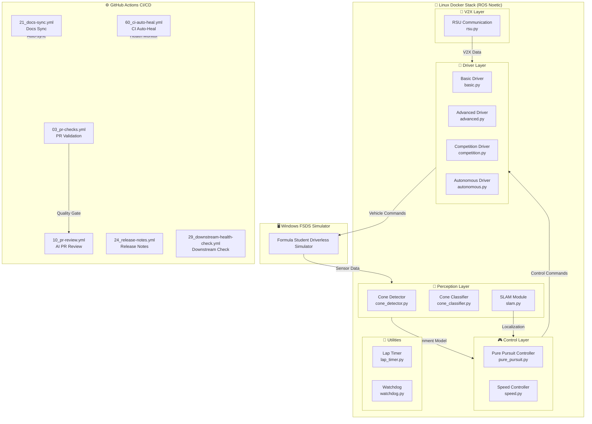

# HYCU FSDS Autonomous Driving

# HYCU FSDS 자율주행

> Formula Student Driverless Simulator 기반 자율주행 시스템  
> Formula Student Driverless Simulator (FSDS) Based Autonomous Driving System

[](LICENSE)
[](http://wiki.ros.org/noetic)
[](https://www.python.org/)
[](https://www.docker.com/)

---

## 목차 (Table of Contents)

- [개요 (Overview)](#개요-overview)
- [주요 기능 (Key Features)](#주요-기능-key-features)
- [시스템 아키텍처 (Architecture)](#시스템-아키텍처-architecture)
- [자동화 인벤토리 (Automation Inventory)](#자동화-인벤토리-automation-inventory)
- [빠른 시작 (Quick Start)](#빠른-시작-quick-start)
- [로컬 개발 (Local Development)](#로컬-개발-local-development)
- [명령어 참고서 (Commands Reference)](#명령어-참고서-commands-reference)
- [기여 가이드 (Contribution)](#기여-가이드-contribution)

---

## 개요 (Overview)

본 프로젝트는 **Formula Student Driverless Simulator (FSDS)** 기반으로 개발된 자율주행 시스템입니다. Windows 환경의 시뮬레이터와 Linux (ROS Noetic) Docker 기반 자율주행 스택을 결합한 이중 플랫폼架构으로,cone 检测 (콘 감지), SLAM, 경로 계획 및 제어 기능을 통합합니다.

This project is an autonomous driving system based on the **Formula Student Driverless Simulator (FSDS)**. It combines a Windows-based simulator with a Linux (ROS Noetic) Docker-based autonomous driving stack, integrating cone detection, SLAM, path planning, and control functions.

---

## 주요 기능 (Key Features)

### 자율주행 모듈 (Autonomous Driving Modules)

| 모듈 (Module) | 설명 (Description) |
|---------------|-------------------|
| **Perception** | Cone detection, classification, SLAM |
| **Control** | Pure pursuit, speed control |
| **Drivers** | Basic, Advanced, Competition, Autonomous modes |
| **V2X** | RSU (Roadside Unit) communication |

### 개발 인프라 (Development Infrastructure)

| 기능 (Feature) | 설명 (Description) |
|---------------|-------------------|
| **이중 플랫폼** | Windows FSDS + Linux Docker (ROS Noetic) |
| **컨테이너화** | Docker & docker-compose 기반 일관된 개발 환경 |
| **모듈식 설계** | Perception, Control, Drivers, V2X 분리 아키텍처 |
| **자동화 파이프라인** | PR 리뷰, CI/CD, 이슈 관리, 문서 동기화 자동화 |

---

## 시스템 아키텍처 (Architecture)



---

## 자동화 인벤토리 (Automation Inventory)

### GitHub Actions 워크플로우 (GitHub Actions Workflows)

#### PR 및 코드 품질 (PR & Code Quality)

| 워크플로우 파일 | 설명 | 주요 도구 |
|---------------|------|----------|
| `03_pr-checks.yml` | PR 기본 검증 (린트, 테스트) | actionlint, gitleaks, pytest |
| `04_actionlint.yml` | 워크플로우 YAML 문법 검증 | actionlint |
| `05_gitleaks.yml` |Secrets 스캐닝 | gitleaks |
| `06_codeql.yml` | 정적 코드 분석 | GitHub CodeQL |
| `07_dependency-review.yml` | 의존성 보안 검토 | dependency-review-action |
| `08_scorecard.yml` | 보안 점수 평가 | scorecard-action |
| `09_semantic-pr.yml` | Semantic PR 검증 | amannn/action-semantic-pull-request |
| `10_pr-review.yml` | AI 기반 PR 리뷰 | qodo-ai/pr-agent |
| `11_pr-review.yml` (security/) | 보안 이슈 PR 리뷰 | qodo-ai/pr-agent |

#### 병합 및 자동화 (Merge & Automation)

| 워크플로우 파일 | 설명 | 주요 도구 |
|---------------|------|----------|
| `12_dependabot-auto-merge.yml` | Dependabot 자동 병합 | mergify/hey-antonio-auto-merge |
| `13_pr-auto-merge.yml` | PR 자동 병합 | mergify/hey-antonio-auto-merge |
| `14_bot-auto-fix.yml` | 봇 수정 자동 적용 | qodo-ai/pr-agent |
| `15_merged-pr-cleanup.yml` | 병합 후 브랜치 정리 | GitHub CLI |
| `auto-merge.yml` | 범용 자동 병합 | mergify |

#### 이슈 및 프로젝트 관리 (Issue & Project Management)

| 워크플로우 파일 | 설명 | 주요 도구 |
|---------------|------|----------|
| `02_issue-to-branch.yml` | 이슈 → 브랜치 자동 생성 | GitHub CLI |
| `18_issue-management.yml` | 이슈 수명주기 관리 |机械化 (automation) |
| `19_issue-backfill.yml` | 이슈 백필 태스크 |机械化 |
| `37_ci-failure-issues.yml` | CI 실패 이슈 생성 | GitHub CLI |
| `43_reusable-issue-management.yml` | 재사용 가능 이슈 관리 |机械化 (reusable workflow) |

#### 문서 및 릴리스 (Documentation & Release)

| 워크플로우 파일 | 설명 | 주요 도구 |
|---------------|------|----------|
| `20_readme-gen.yml` | README 자동 생성 | minimax-m2.7 / gpt-5.5 via CLIProxyAPI |
| `21_docs-sync.yml` | 문서 동기화 |机械化 |
| `24_release-notes.yml` | Release Notes 생성 | release-drafter |
| `25_release-publish.yml` | Release 게시 | gh release |
| `42_reusable-docs-sync.yml` | 재사용 가능 문서 동기화 |机械化 (reusable workflow) |

#### 브랜치 및 downstream 관리 (Branch & Downstream Management)

| 워크플로우 파일 | 설명 | 주요 도구 |
|---------------|------|----------|
| `01_branch-to-pr.yml` | 브랜치 → PR 변환 | GitHub CLI |
| `29_downstream-health-check.yml` | Downstream 저장소 상태 확인 |机械化 |
| `45_reusable-gitleaks.yml` | 재사용 가능 gitleaks 스캐닝 | gitleaks (reusable workflow) |
| `44_reusable-pr-checks.yml` | 재사용 가능 PR 검증 |机械化 (reusable workflow) |

#### CI/CD 자동 복구 (CI/CD Auto-Healing)

| 워크플로우 파일 | 설명 | 주요 도구 |
|---------------|------|----------|
| `60_ci-auto-heal.yml` | CI 실패 자동 복구 |机械化 |

#### 기타 자동화 (Other Automation)

| 워크플로우 파일 | 설명 | 주요 도구 |
|---------------|------|----------|
| `ci.yml` | 기본 CI 파이프라인 | GitHub Actions |
| `labeler.yml` | PR 라벨 자동 분류 | actions/labeler |
| `welcome.yml` | 신규 기여자 환영 메시지 | actions/first-interaction |

### 외부 서비스 통합 (External Service Integration)

| 서비스 | 엔드포인트 | 용도 |
|--------|-----------|------|
| **CLIProxyAPI** | `https://cliproxy.jclee.me/v1` | README 생성 (minimax-m2.7, gpt-5.5 fallback) |
| **PR-Agent** | `https://bot.jclee.me` | AI 기반 PR 리뷰 및 자동 수정 |
| **qodo-ai/pr-agent** | GitHub Marketplace | 코드 리뷰, 설명 생성, 태그 적용 |

---

## 빠른 시작 (Quick Start)

### 전제 조건 (Prerequisites)

- Docker & docker-compose
- Python 3.8+
- ROS Noetic (Linux 환경)
- Windows (FSDS 시뮬레이터용)

### Docker 환경 실행 (Running with Docker)

```bash
# 전체 스택 실행 (competition mode)
cd submission
docker-compose up --build

# 개발 모드로 실행
docker-compose -f submission/docker-compose.yml up --build
```

### 단일 모듈 실행 (Running Individual Modules)

```bash
# Competition driver 실행
python submission/scripts/competition_driver.py

# Advanced driver 실행
python submission/scripts/advanced_driver.py

# Simple SLAM 실행
python submission/scripts/simple_slam.py
```

---

## 로컬 개발 (Local Development)

### 프로젝트 구조 (Project Structure)

```
hycu-fsds/
├── README.md                     # 본 문서
├── AGENTS.md                     # 자율주행 에이전트 설명
├── CONTRIBUTING.md               # 기여 가이드
├── LICENSE                       # MIT 라이선스
├── OWNERS                        # 프로젝트 소유자
├── in-memoria.db                 # 인메모리 데이터베이스
├── submission/                   # 제출용 자율주행 코드
│   ├── src/
│   │   ├── perception/           # 인식 모듈 (cone detection, SLAM)
│   │   │   ├── cone_detector.py
│   │   │   ├── cone_classifier.py
│   │   │   └── slam.py
│   │   ├── control/              # 제어 모듈 (pure pursuit, speed)
│   │   │   ├── pure_pursuit.py
│   │   │   └── speed.py
│   │   ├── drivers/               # 드라이버 모듈
│   │   │   ├── basic.py
│   │   │   ├── advanced.py
│   │   │   ├── competition.py
│   │   │   └── autonomous.py
│   │   ├── v2x/                   # V2X 통신 모듈
│   │   │   └── rsu.py
│   │   └── utils/                 # 유틸리티
│   │       ├── lap_timer.py
│   │       └── watchdog.py
│   ├── config/
│   │   └── driver_params.yaml     # 드라이버 파라미터
│   ├── scripts/
│   │   ├── competition_driver.py
│   │   ├── advanced_driver.py
│   │   ├── fsds_driver.py
│   │   └── simple_slam.py
│   ├── tests/
│   │   └── test_algorithms.py
│   ├── docs/
│   │   └── ARCHITECTURE.md        # 상세 아키텍처 문서
│   ├── Dockerfile
│   ├── docker-compose.yml
│   ├── run.sh
│   └── dev.sh
├── autonomous/                   # 자율주행 독립 실행 환경
│   ├── modules/
│   │   ├── perception/
│   │   ├── control/
│   │   └── utils/
│   ├── config/
│   │   └── params.yaml
│   ├── driver/
│   │   └── competition_driver.py
│   ├── tests/
│   ├── Dockerfile
│   ├── docker-compose.yml
│   ├── entrypoint.sh
│   ├── start.sh
│   └── run_all.sh
└── .github/
    └── workflows/                # GitHub Actions 워크플로우 (32개)
```

### 개발 환경 설정 (Development Environment Setup)

```bash
# 저장소 클론
git clone <repository-url>
cd hycu-fsds

# Python 의존성 설치
pip install -r requirements.txt  # if available

# Docker 컨테이너 빌드
cd submission
docker-compose build

# ROS 환경 설정 (Linux)
source /opt/ros/noetic/setup.bash
```

---

## 명령어 참고서 (Commands Reference)

### Docker 명령어 (Docker Commands)

```bash
# 전체 자율주행 스택 실행
docker-compose up

# 개발 환경 실행 (파일 변경 감시)
docker-compose -f submission/docker-compose.yml up

# 단일 서비스 실행
docker-compose up perception

# 컨테이너 정리
docker-compose down -v

# 로그 확인
docker-compose logs -f competition_driver
```

### Python 스크립트 (Python Scripts)

```bash
# Competition driver 실행
python submission/scripts/competition_driver.py

# Advanced driver 실행
python submission/scripts/advanced_driver.py

# FSDS driver 실행
python submission/scripts/fsds_driver.py

# Simple SLAM 실행
python submission/scripts/simple_slam.py

# 알고리즘 테스트 실행
pytest submission/tests/test_algorithms.py
```

### ROS 명령어 (ROS Commands)

```bash
# Launch 파일 실행
roslaunch submission competition.launch

# 노드 실행 (개별)
rosrun hycu_fsds competition_driver.py

# 토픽 확인
rostopic list
rostopic echo /cone_detections
```

---

## 기여 가이드 (Contribution)

### 브랜치 전략 (Branch Strategy)

```text
master (보호 브랜치)
├── feature/*      # 기능 개발
├── fix/*          # 버그 수정
├── docs/*         # 문서 업데이트
├── refactor/*     # 코드 리팩토링
└── automation/*   # 자동화 개선
```

### 워크플로우 (Workflow)

1. **이슈 생성** (`02_issue-to-branch.yml` 참고)
   - Bug, Feature, Documentation 유형 선택

2. **브랜치 생성** (`01_branch-to-pr.yml` 참고)
   - 자동 브랜치 생성 활용 가능

3. **PR 작성** (`03_pr-checks.yml` 참고)
   - 모든 CI 체크 통과 필요

4. **AI 리뷰** (`10_pr-review.yml` 참고)
   - qodo-ai/pr-agent가 자동 리뷰 수행

5. **병합** (`13_pr-auto-merge.yml` 참고)
   - 자동 병합 또는 수동 병합

### 커밋 메시지 규칙 (Commit Message Rules)

```
<type>(<scope>): <subject>

Types: feat, fix, docs, style, refactor, test, chore
Scopes: perception, control, drivers, v2x, ci, etc.

Example:
feat(perception): add cone detection with YOLOv8 integration
fix(control): resolve pure pursuit corner case oscillation
docs(architecture): update system architecture diagram
```

### 코드 품질 표준 (Code Quality Standards)

| 체크 항목 | 도구 | 설정 파일 |
|----------|------|----------|
| Python 린트 | flake8, pylint | `pyproject.toml` |
| YAML 검증 | actionlint | `.actionlint.yml` |
|Secrets 스캐닝 | gitleaks | `gitleaks.toml` |
| 코드 분석 | CodeQL | `.github/workflows/06_codeql.yml` |
| 의존성 검토 | dependency-review-action | `.github/workflows/07_dependency-review.yml` |

### 문서화 표준 (Documentation Standards)

- 모든 모듈은 docstring 필수
- PUBLIC 함수/클래스는 타입 힌트 포함
- README 자동 생성 (`20_readme-gen.yml`) 활용
- architecture 문서는 `submission/docs/ARCHITECTURE.md` 참조

---

## 라이선스 (License)

MIT License - 자세한 내용은 [LICENSE](LICENSE) 파일 참조

---

## 소유자 (Owners)

프로젝트 소유자는 [OWNERS](OWNERS) 파일 참조

---

## 추가 자료 (Additional Resources)

- [Formula Student Driverless Simulator](https://www.formulastudent.de/) (외부 링크)
- [ROS Noetic Documentation](http://wiki.ros.org/noetic) (외부 링크)
- [qodo-ai/pr-agent](https://github.com/qodo-ai/pr-agent) (외부 링크)

---

*본 문서는 `20_readme-gen.yml` 워크플로우에 의해 자동으로 생성 및 업데이트됩니다.*
