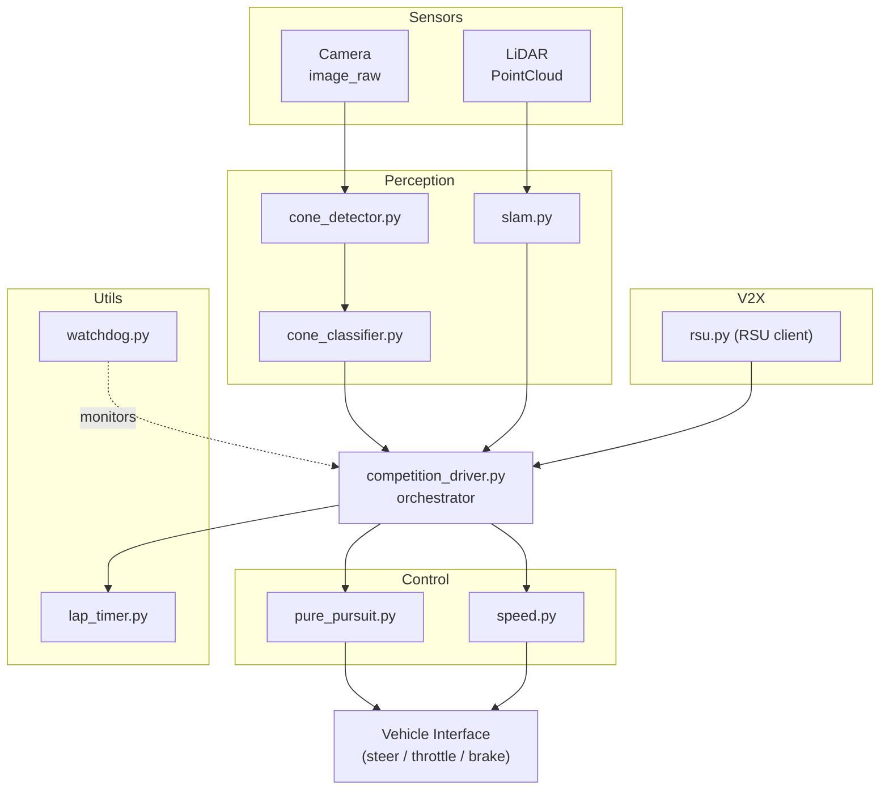

# Formula Student Driverless — Autonomous Racing Stack

> **FSD (Formula Student Driverless) 자율주행 레이싱 소프트웨어 스택**
> Autonomous racing software stack for the Formula Student Driverless competition

이 저장소는 FSD 대회를 위한 완전 자율주행 레이싱 차량 소프트웨어를 제공합니다. SLAM, 콘 감지/분류, Pure Pursuit 추종 제어, 랩 타이머, V2X(차량-사물 통신) 어댑터, 그리고 대회용 Docker 제출 패키지를 포함합니다.

This repository provides a full-stack autonomous driving system for the Formula Student Driverless competition. It bundles SLAM, cone detection/classification, pure-pursuit lane following, lap timing, a V2X adapter, and a competition-ready Docker submission package.

---

## Table of Contents / 목차

1. [Overview / 개요](#overview--개요)
2. [Target Users / 대상 사용자](#target-users--대상-사용자)
3. [Features / 주요 기능](#features--주요-기능)
4. [Architecture / 아키텍처](#architecture--아키텍처)
5. [Repository Layout / 저장소 구조](#repository-layout--저소-구조)
6. [Quick Start / 빠른 시작](#quick-start--빠른-시작)
7. [Configuration / 설정](#configuration--설정)
8. [Commands Reference / 명령어 레퍼런스](#commands-reference--명령어-레퍼런스)
9. [Local Development / 로컬 개발](#local-development--로컬-개발)
10. [Testing / 테스트](#testing--테스트)
11. [Simulation / 시뮬레이션](#simulation--시뮬레이션)
12. [Submission Package / 제출 패키지](#submission-package--제출-패키지)
13. [Reference Materials / 참고 자료](#reference-materials--참고-자료)
14. [Contributing / 기여](#contributing--기여)
15. [License / 라이선스](#license--라이선스)

---

## Overview / 개요

FSD 대회는 카메라와 LiDAR로 트랙을 인식하고, 노란색/파란색 콘으로 정의된 미니멀 패스 레인을 따라 자율 주행을 수행하며, V2X 인프라(RSU)와 통신해 추가 정보를 받는 종목입니다. 본 스택은 그 파이프라인을 ROS 1 기반 노드들로 구현합니다.

The Formula Student Driverless competition asks teams to detect the track, follow a cone-defined lane (yellow/blue), and exchange data with a Roadside Unit (RSU) over V2X — all without a human driver. This stack implements that pipeline as a set of ROS 1 nodes.

핵심 설계 원칙 / Core design principles:

- **모듈화 (Modular)** — perception, control, utils, v2x를 독립 패키지로 분리
  Each subsystem (perception, control, utils, v2x) lives in its own module.
- **대회 즉시 실행 가능 (Competition-ready)** — 동일 트리가 Docker 컨테이너로 묶여 대회 심사 환경에서 그대로 실행됩니다
  The same tree runs inside a Docker container so the judges' environment matches local runs.
- **관측 가능성 (Observable)** — 랩 타이머와 워치독으로 차량 상태와 시스템 헬스를 모니터링
  A lap timer and a watchdog give you runtime visibility into state and health.

---

## Target Users / 대상 사용자

| Audience / 대상 | Why this repo exists / 사용 목적 |
|---|---|
| FSD 출전 팀 / FSD competing teams | 콘 기반 트랙에서 미션(Acceleration, Skidpad, Autocross, Trackdrive)을 완수하는 자율주행 스택 |
| 학생/연구자 / Students & researchers | 카메라+LiDAR 융합, SLAM, 콘 기반 추종, V2X 통신을 ROS 1 환경에서 학습/실험 |
| 심사위원/운영자 / Judges & organizers | 대회 제출물 형태로 재현 가능한 결과물을 검토 |

---

## Features / 주요 기능

### Perception / 인지

- **콘 감지 (Cone detection)** — `src/autonomous/modules/perception/cone_detector.py`
  Camera- and/or LiDAR-based cone candidate extraction.
- **콘 분류 (Cone classification)** — `src/autonomous/modules/perception/cone_classifier.py`
  Classifies cones into the FSD color set (yellow left / blue right / large orange start–finish).
- **SLAM** — `src/autonomous/modules/perception/slam.py`
  Online localization and mapping using 2D/3D sensor input.

### Control / 제어

- **Pure Pursuit** — `src/autonomous/modules/control/pure_pursuit.py`
  Geometric path tracker that follows the centerline between detected cones.
- **Speed profile** — `src/autonomous/modules/control/speed.py`
  Curvature-aware target velocity computation.

### Utils / 유틸리티

- **Lap timer** — `src/autonomous/modules/utils/lap_timer.py`
  Counts completed laps and emits lap-time events.
- **Watchdog** — `src/autonomous/modules/utils/watchdog.py`
  Monitors node liveness and triggers safe-stop on timeout.

### V2X

- **RSU adapter** — `submission/src/v2x/rsu.py`
  Communicates with a Roadside Unit for signal phase, timing, or map-extension data.

### Drivers / 드라이버

- **Competition driver** — `src/autonomous/driver/competition_driver.py`
  Top-level orchestrator that wires perception → control → utils → V2X and feeds the vehicle interface.
- **Driver variants** — `submission/src/drivers/{basic,advanced,autonomous,competition}.py`
  Tiered entry points (basic/advanced/autonomous/competition) for development and graded runs.

### Ops / 운영

- **Docker packaging** — `src/autonomous/Dockerfile`, `src/autonomous/docker-compose.yml`
- **Launcher scripts** — `src/autonomous/{start.sh,run_all.sh,record_race.sh,entrypoint.sh}`
- **Submission wrapper** — `submission/{run.sh,dev.sh,docker-compose.yml,launch/competition.launch}`
- **Package script** — `scripts/package.sh` — produces the submission archive

---

## Architecture / 아키텍처



핵심 흐름 / Data flow at a glance:

1. **Sensors** publish raw camera frames and LiDAR point clouds.
2. **Perception** turns those into cone candidates, classified colors, and a pose/map estimate.
3. **Competition driver** fuses perception + V2X messages and feeds a centerline + speed target.
4. **Control** (Pure Pursuit + Speed profile) translates that into steer/throttle/brake commands.
5. **Utils** (Lap timer / Watchdog) observe progress and enforce safe-stop on faults.

`src/autonomous`은 로컬 개발/실험용 트리이고, `submission/`은 동일한 모듈을 대회 제출 규격(Docker 이미지 + launch 파일)으로 묶은 트리입니다. 모듈 자체는 양쪽 트리에서 동일한 인터페이스를 갖습니다.

`src/autonomous` is the development tree; `submission/` re-bundles the same modules into the competition format (Docker image + ROS launch). The module interfaces are identical in both trees.

---

## Repository Layout / 저장소 구조

```
.
├── AGENTS.md                       # AI assistant / contributor operating notes
├── CONTRIBUTING.md                 # Contribution guidelines
├── LICENSE
├── OWNERS                          # Code ownership / review routing
├── README.md                       # This file
├── in-memoria.db                   # Local persistence (e.g., lap history cache)
├── src/
│   ├── autonomous/                 # Primary autonomous driving stack
│   │   ├── AGENTS.md
│   │   ├── Dockerfile              # Container image for the autonomous stack
│   │   ├── docker-compose.yml      # One-shot run of the stack
│   │   ├── entrypoint.sh           # Container entrypoint
│   │   ├── start.sh                # Local start helper
│   │   ├── run_all.sh              # End-to-end run helper
│   │   ├── record_race.sh          # Race recorder (rosbag + logs)
│   │   ├── scripts/
│   │   │   └── start_race.py       # Race-start orchestrator
│   │   ├── config/
│   │   │   ├── bridge_no_camera.launch   # ROS bridge (no camera) config
│   │   │   └── params.yaml               # Tunable params
│   │   ├── driver/
│   │   │   └── competition_driver.py     # Top-level orchestrator
│   │   ├── modules/
│   │   │   ├── perception/
│   │   │   │   ├── cone_classifier.py
│   │   │   │   ├── cone_detector.py
│   │   │   │   └── slam.py
│   │   │   ├── control/
│   │   │   │   ├── pure_pursuit.py
│   │   │   │   └── speed.py
│   │   │   └── utils/
│   │   │       ├── lap_timer.py
│   │   │       └── watchdog.py
│   │   └── tests/
│   │       └── test_algorithms.py
│   └── simulator/                  # Lightweight simulator
│       ├── README.md
│       └── settings.json
├── scripts/
│   └── package.sh                  # Build the competition submission archive
├── docs/
│   ├── SUBMISSION_GUIDE.md
│   └── reference_materials/         # Lecture notes & notebooks
│       ├── lecture1_fsds_install.txt
│       ├── lecture4_slam.ipynb
│       └── lecture6_v2x.ipynb
└── submission/                     # Competition-ready packaging
    ├── AGENTS.md
    ├── Dockerfile
    ├── docker-compose.yml
    ├── README.md
    ├── dev.sh                      # Dev shell inside the submission container
    ├── run.sh                      # Run script for the judge environment
    ├── launch/
    │   └── competition.launch      # Master launch for the competition
    ├── src/
    │   ├── drivers/                # basic, advanced, autonomous, competition
    │   ├── perception/             # cone_*, slam
    │   ├── control/                # pure_pursuit, speed
    │   ├── utils/                  # lap_timer, watchdog
    │   └── v2x/rsu.py
    └── autonomous/                 # Mirrored runtime assets (Dockerfile, params, driver)
```

---

## Quick Start / 빠른 시작

### Prerequisites / 사전 준비

- ROS 1 (Noetic 권장 / Noetic recommended)
- Python 3.8+
- Docker + Docker Compose (제출 이미지 빌드 시)
- 카메라/LiDAQ 드라이버 또는 시뮬레이터 입력
- CUDA (선택 / optional) — 비전 모델 추론 가속

### Run locally (without Docker) / 로컬 직접 실행

```bash
# 1) Source ROS
source /opt/ros/noetic/setup.bash

# 2) Source this workspace
cd src/autonomous
# (catkin 워크스페이스라면 상위에서 catkin_make 후 source)

# 3) Launch the competition driver
roslaunch config/bridge_no_camera.launch    # 또는 시뮬레이터 launch
rosrun driver competition_driver.py
```

대체 실행 스크립트 / Convenience scripts:

```bash
./src/autonomous/start.sh          # 로컬 시작
./src/autonomous/run_all.sh        # 전체 파이프라인 실행
./src/autonomous/record_race.sh    # rosbag + 로그 기록
```

### Run inside Docker / Docker로 실행

```bash
cd src/autonomous
docker compose up --build
```

### Build the submission package / 제출 패키지 빌드

```bash
./scripts/package.sh
# 결과물은 submission/ 아래 또는 패키지 스크립트가 정의한 경로에 생성
```

자세한 내용은 [docs/SUBMISSION_GUIDE.md](docs/SUBMISSION_GUIDE.md) 참고 / See `docs/SUBMISSION_GUIDE.md` for the full submission walkthrough.

---

## Configuration / 설정

주요 파라미터는 YAML 파일 하나로 관리됩니다 / Tunables live in a single YAML file:

- `src/autonomous/config/params.yaml` — 개발용 파라미터 (perception 임계값, control gain, speed limits 등)
- `submission/autonomous/config/params.yaml` — 대회 환경용 동일 스키마의 사본

예시 / Example:

```yaml
perception:
  cone_detector:
    min_area: 40
    nms_iou: 0.3
  cone_classifier:
    colors: ["yellow", "blue", "orange_large"]

control:
  pure_pursuit:
    lookahead_m: 1.5
    wheelbase_m: 1.55
  speed:
    max_mps: 12.0
    curvature_gain: 2.5

utils:
  watchdog:
    heartbeat_hz: 10
    timeout_ms: 500

v2x:
  rsu:
    enabled: true
    host: <RSU_HOST>
    port: <RSU_PORT>
```

> 실제 호스트/포트 값은 대회 인프라에 맞춰 환경 변수 또는 오버레이 YAML로 주입하세요.
> Inject real RSU host/port via environment variables or an overlay YAML at deploy time.

---

## Commands Reference / 명령어 레퍼런스

| Command / 명령어 | Purpose / 용도 |
|---|---|
| `./src/autonomous/start.sh` | 핵심 노드를 로컬에서 기동 / Launch core nodes locally |
| `./src/autonomous/run_all.sh` | 전체 스택 실행 (perception + control + utils + v2x) / Run full stack |
| `./src/autonomous/record_race.sh` | rosbag 기록 + 콘솔 로그 수집 / Record rosbag + logs |
| `python3 src/autonomous/scripts/start_race.py` | 레이스 시작 시퀀스 / Programmatic race start |
| `docker compose -f src/autonomous/docker-compose.yml up --build` | Docker로 스택 실행 / Run stack in Docker |
| `./scripts/package.sh` | 제출 아카이브 생성 / Build submission archive |
| `submission/run.sh` | 대회 심사 환경에서 실행 / Run in judges' environment |
| `submission/dev.sh` | 제출 컨테이너 내부 개발 셸 / Dev shell inside submission container |
| `roslaunch submission/launch/competition.launch` | 대회 마스터 런치 / Master competition launch |
| `python3 -m unittest src/autonomous/tests/test_algorithms.py` | 알고리즘 단위 테스트 / Algorithm unit tests |

---

## Local Development / 로컬 개발

1. **브랜치 / Branch**: 기능 단위로 짧은 브랜치를 만들고 PR을 엽니다 / Use short feature branches and open a PR.
2. **코드 스타일 / Style**: PEP 8, 타입 힌트 권장. ROS 1 콜백은 가능하면 단일 책임으로 분리합니다 / PEP 8 with type hints; keep ROS callbacks single-purpose.
3. **모듈 경계 / Module boundaries**:
   - `modules/perception/*` 는 raw sensor → 트랙/포즈 추정까지만 책임집니다 / Perception produces cone lists and pose only.
   - `modules/control/*` 는 perception 결과만 입력으로 받습니다 / Control consumes perception only.
   - `driver/competition_driver.py` 가 모듈을 wire-up 합니다 / The driver wires modules together.
4. **튜닝 / Tuning**: `params.yaml` 만 변경하고 커밋 메시지에 영향(랩 타임, 안전성)을 명시합니다 / Change `params.yaml` only and document expected impact.
5. **디버깅 / Debugging**: RViz로 cone marker / path / pose를 시각화하고, `record_race.sh` 의 rosbag을 오프라인 재생합니다.

---

## Testing / 테스트

- **알고리즘 단위 테스트** / Algorithm unit tests:
  `src/autonomous/tests/test_algorithms.py` — Pure Pursuit, speed profile, cone 분류/감지 등 핵심 알고리즘을 격리해 검증 / unit tests for control & perception algorithms.

```bash
cd src/autonomous
python3 -m unittest tests/test_algorithms.py
```

- **시뮬레이터 통합 테스트** / Simulator integration:
  `src/simulator/` (설정: `settings.json`) 로 차량 없이 전체 미션을 반복 실행합니다 / Drive full missions loop without hardware.

- **Docker 검증** / Container smoke test:

```bash
docker compose -f src/autonomous/docker-compose.yml up --build
# 컨테이너 내부에서 competition_driver가 정상 기동하는지 확인
# Verify competition_driver comes up healthy inside the container.
```

- **리그레션 체크리스트** / Pre-race regression checklist:
  1. 콘 감지/분류 mIoU ≥ 목표치
  2. 직선 구간 Pure Pursuit 종방향 오차 ≤ 한계값
  3. 워치독 heartbeat 정상 (timeout 0회)
  4. 랩 타이머가 시뮬레이터에서 N바퀴 정상 집계

---

## Simulation / 시뮬레이션

시뮬레이터는 `src/simulator/` 에 위치하며, 실제 차량 없이 미션(Acceleration/Skidpad/Autocross/Trackdrive) 흐름을 검증할 수 있도록 합니다.

The simulator under `src/simulator/` lets you rehearse missions without the real car.

- 설정 파일 / Settings: `src/simulator/settings.json`
- 사용 예시 / Usage:

```bash
# (시뮬레이터 상세 실행 방법은 src/simulator/README.md 참고)
cat src/simulator/settings.json
```

시뮬레이터는 ROS 토픽(`/cones`, `/odom`, `/cmd_vel` 등)을 모의 발행하며, 동일한 `competition_driver` 가 이를 소비합니다 — 즉 **개발 트리와 제출 트리에서 동일 코드를 그대로 검증**할 수 있습니다.

---

## Submission Package / 제출 패키지

제출 트리는 `submission/` 으로, 대회 심사 환경에서 그대로 실행되도록 Docker 이미지로 패키징됩니다.

`submission/` is the competition-ready tree, packaged as a Docker image that runs verbatim in the judges' environment.

구성 / Contents:

- `submission/Dockerfile` + `submission/docker-compose.yml` — 빌드/실행 정의
- `submission/run.sh` — 대회 런타임 엔트리포인트
- `submission/dev.sh` — 디버깅용 셸 진입점
- `submission/launch/competition.launch` — 전체 노드를 기동하는 마스터 launch
- `submission/src/{drivers,perception,control,utils,v2x}/` — 대회 환경에서 로드되는 모듈
- `submission/autonomous/` — 런타임 자산(Dockerfile, params, driver) 미러

빌드 & 제출 / Build & submit:

```bash
./scripts/package.sh
# 또는 직접
docker build -t fsd-submission ./submission
```

자세한 절차는 [docs/SUBMISSION_GUIDE.md](docs/SUBMISSION_GUIDE.md) 를 따르세요 / Follow `docs/SUBMISSION_GUIDE.md` for the full procedure.

---

## Reference Materials / 참고 자료

`docs/reference_materials/` 에 학습용 자료를 함께 보관합니다 / The `docs/reference_materials/` folder contains course-style material:

- `lecture1_fsds_install.txt` — FSDS(Full Self-Driving Sim) 설치 가이드
- `lecture4_slam.ipynb` — SLAM 강의 노트북
- `lecture6_v2x.ipynb` — V2X 강의 노트북

이 자료들은 본 스택을 직접 구동하지 않더라도 알고리즘 배경을 이해하는 데 유용합니다.

These are background reading; they are not required to run the stack.

---

## Contributing / 기여

기여 절차는 [CONTRIBUTING.md](CONTRIBUTING.md) 를 따릅니다 / See [CONTRIBUTING.md](CONTRIBUTING.md) for the contribution process.

핵심 요약 / Quick summary:

1. 이슈 또는 작업 항목 생성 / Open an issue or pick an existing one.
2. 기능 브랜치 생성 → 변경 → 테스트 추가 → PR
3. 리뷰어 지정은 [OWNERS](OWNERS) 참고 / Reviewers are routed via [OWNERS](OWNERS).
4. AI 어시스턴트 작업 규약은 [AGENTS.md](AGENTS.md) 참고 / AI-assistant operating rules are in [AGENTS.md](AGENTS.md).

---

## License / 라이선스

본 저장소의 라이선스는 [LICENSE](LICENSE) 파일을 따릅니다 / See [LICENSE](LICENSE) for the license under which this repository is distributed.