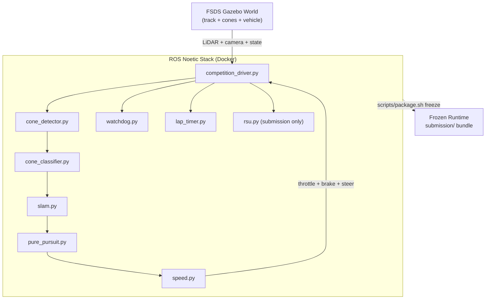

# HYCU FSDS Autonomous Driving / HYCU FSDS 자율주행

> Formula Student Driverless Simulator 기반 자율주행 시스템  
> Autonomous driving stack for the Formula Student Driverless Simulator (FSDS)


---

## Overview / 개요

**EN**
HYCU FSDS Autonomous Driving is an autonomous driving project for Formula Student Driverless Simulator (FSDS) workflows. It provides Dockerized ROS Noetic components for perception (cone detection, classification, SLAM), control (pure pursuit, speed), safety monitoring (watchdog), lap timing, simulator integration, V2X support, and competition-style submission packaging. The repository is split into a development-oriented stack and a packaged submission stack so that the same algorithms can be iterated locally and re-built as a frozen runtime for evaluation.

**KR**
HYCU FSDS Autonomous Driving은 Formula Student Driverless Simulator(FSDS) 워크플로우를 위한 자율주행 프로젝트입니다. ROS Noetic 기반의 Docker 컨테이너 구성으로 콘 감지·분류·SLAM 인지 모듈, Pure Pursuit·속도 제어 모듈, 워치독 안전 감시, 랩 타이머, 시뮬레이터 연동, V2X 지원, 대회 제출 패키징을 제공합니다. 저장소는 개발용 스택과 제출용 패키지 스택으로 분리되어 있어, 동일한 알고리즘을 로컬에서 반복 개발하고 평가용 동결 런타임(frozen runtime)으로 다시 빌드할 수 있습니다.

The repository provides two execution paths / 저장소는 두 가지 실행 경로를 제공합니다:

1. `src/autonomous/` — Development-oriented stack / 개발 및 실험용 자율주행 스택.
2. `submission/` — Frozen runtime stack for competition submission or evaluation / 대회 제출 또는 평가를 위한 동결 실행 스택.

---

## Features / 주요 기능

### Perception / 인지
- **Cone Detection** (`cone_detector.py`) — LiDAR- and camera-based cone candidate extraction with clustering and filtering. (LiDAR + 카메라 기반 콘 후보 추출, 클러스터링 및 필터링)
- **Cone Classification** (`cone_classifier.py`) — Color/shape classification that distinguishes left (yellow), right (blue), and large/orange start–finish cones. (좌/우/시작-종료 콘 색상·형태 분류)
- **SLAM** (`slam.py`) — Track-localization and cone-map refinement for robust re-entry on lap 2+. (트랙 위치 추정 및 콘 맵 정제, 2랩 이상 재진입 안정화)

### Control / 제어
- **Pure Pursuit** (`pure_pursuit.py`) — Geometric path-following controller using the nearest lookahead point on the cone-derived midline. (중심선 기반 룩어헤드 포인트 추종)
- **Speed Planning** (`speed.py`) — Curvature-aware velocity profile with bounded acceleration and jerk. (곡률 인지 속도 프로파일, 가속/저크 제한)

### Safety & Telemetry / 안전·계측
- **Watchdog** (`watchdog.py`) — Heartbeat, sensor-staleness, and emergency-stop supervisor. (심박수, 센서 스테일니스, 비상 정지 감시)
- **Lap Timer** (`lap_timer.py`) — Lap detection, sector times, and race-recording trigger. (랩 감지, 섹터 타임, 레이스 기록)

### V2X / 차량-인프라 통신
- **RSU** (`v2x/rsu.py`) — Roadside-unit interface for cooperative perception messaging in the submission stack. (협력 인지를 위한 RSU 인터페이스, 제출 스택에 포함)

### Drivers / 드라이버
- **Basic** (`drivers/basic.py`) — Minimal follow-line driver. (최소 라인 팔로우 드라이버)
- **Advanced** (`drivers/advanced.py`) — Extended driver with extra tuning hooks. (튜닝 후크 확장 드라이버)
- **Autonomous** (`drivers/autonomous.py`) — Full perception/control pipeline orchestration. (인지+제어 파이프라인 오케스트레이션)
- **Competition** (`drivers/competition.py`, `competition_driver.py`) — Race-grade driver used as the FSDS competition entry. (대회 등급 드라이버, FSDS 출전용)

### Simulator Integration / 시뮬레이터 연동
- ROS launch files `bridge_no_camera.launch` (development) and `competition.launch` (submission) wire the FSDS Gazebo world into ROS topics, sensor pipelines, and control outputs. (`bridge_no_camera.launch` 개발용, `competition.launch` 제출용 — FSDS Gazebo 월드와 ROS 토픽/센서/제어를 연결)

### Submission Packaging / 제출 패키징
- `scripts/package.sh` produces a frozen, self-contained submission bundle that can be evaluated without source access. (`scripts/package.sh`로 동결된 자급식 제출 번들 생성)

### Reference Material / 참고 자료
- `docs/reference_materials/` contains the FSDS install notes, a SLAM lecture notebook, and a V2X lecture notebook aligned with the course curriculum. (FSDS 강의 커리큘럼 기반 설치 노트, SLAM/V2X 노트북)

---

## Architecture / 아키텍처

The dataflow follows a classic perception → planning → control loop with a parallel safety channel and a one-way freeze into the submission bundle. (데이터 흐름은 인지→계획→제어 루프와 병렬 안전 채널, 그리고 제출 번들로의 단방향 동결(freeze)로 구성됩니다.)



---

## Repository Structure / 저장소 구조

```text
.
├── AGENTS.md                    # Agent / contributor guidance
├── CONTRIBUTING.md              # Contribution rules
├── LICENSE                      # MIT license
├── OWNERS                       # Code owners
├── README.md                    # This file
├── in-memoria.db                # Local in-memoria snapshot
├── src/
│   ├── autonomous/              # Development-oriented autonomous stack
│   │   ├── AGENTS.md
│   │   ├── Dockerfile
│   │   ├── docker-compose.yml
│   │   ├── entrypoint.sh
│   │   ├── start.sh / run_all.sh / record_race.sh
│   │   ├── scripts/start_race.py
│   │   ├── config/              # params.yaml, bridge_no_camera.launch
│   │   ├── driver/competition_driver.py
│   │   ├── modules/
│   │   │   ├── perception/      # cone_detector, cone_classifier, slam
│   │   │   ├── control/         # pure_pursuit, speed
│   │   │   └── utils/           # lap_timer, watchdog
│   │   └── tests/test_algorithms.py
│   └── simulator/               # FSDS sim settings
│       ├── README.md
│       └── settings.json
├── scripts/
│   └── package.sh               # Build the submission bundle
├── docs/
│   ├── SUBMISSION_GUIDE.md
│   └── reference_materials/     # FSDS lecture notes / notebooks
└── submission/                  # Frozen competition stack
    ├── AGENTS.md
    ├── Dockerfile
    ├── docker-compose.yml
    ├── dev.sh / run.sh
    ├── README.md
    ├── launch/competition.launch
    ├── src/
    │   ├── drivers/             # basic, advanced, autonomous, competition
    │   ├── perception/          # cone_classifier, cone_detector, slam
    │   ├── control/             # pure_pursuit, speed
    │   ├── utils/               # lap_timer, watchdog
    │   └── v2x/rsu.py
    └── autonomous/              # Mirrors src/autonomous/ for runtime freeze
```

---

## Automation Inventory / 자동화 목록

This repository ships **16 GitHub Actions workflows** and **0 Go automation tools**. (저장소는 16개의 GitHub Actions 워크플로우와 0개의 Go 자동화 도구를 제공합니다.)

### CI & Build / CI 및 빌드
| Workflow / 워크플로우 | Purpose / 용도 |
|---|---|
| `ci.yml` | Main CI entrypoint — lint, build, algorithm tests. (메인 CI 진입점 — 린트, 빌드, 알고리즘 테스트) |
| `60_ci-auto-heal.yml` | Auto-recovers from known transient CI failures. (알려진 일시적 CI 실패 자동 복구) |
| `37_ci-failure-issues.yml` | Auto-files an issue when CI is red. (CI 실패 시 이슈 자동 생성) |
| `29_downstream-health-check.yml` | Health-checks downstream consumers of the submission bundle. (제출 번들의 다운스트림 헬스 체크) |

### PR & Branch Automation / PR·브랜치 자동화
| Workflow / 워크플로우 | Purpose / 용도 |
|---|---|
| `01_branch-to-pr.yml` | Promotes a working branch into a pull request. (작업 브랜치를 PR로 승격) |
| `02_issue-to-branch.yml` | Creates a branch from a tracked issue. (이슈에서 작업 브랜치 자동 생성) |
| `10_pr-review.yml` | AI PR review using `qodo-ai/pr-agent`. (`qodo-ai/pr-agent` 기반 AI PR 리뷰) |
| `11_security-pr-review.yml` | Security-focused PR review pass. (보안 중심 PR 리뷰) |
| `12_dependabot-auto-merge.yml` | Auto-merge for trusted Dependabot PRs. (신뢰된 Dependabot PR 자동 병합) |
| `13_pr-auto-merge.yml` | Auto-merge for qualifying PRs. (조건 충족 PR 자동 병합) |
| `14_bot-auto-fix.yml` | Bot-driven auto-fix patch flow. (봇 기반 자동 수정 패치 흐름) |
| `15_merged-pr-cleanup.yml` | Deletes head branches after merge. (병합 후 헤드 브랜치 정리) |

### Issue & Release Automation / 이슈·릴리스 자동화
| Workflow / 워크플로우 | Purpose / 용도 |
|---|---|
| `19_issue-backfill.yml` | Backfills missing issue metadata. (누락된 이슈 메타데이터 보강) |
| `91_issue-classification.yml` | Auto-classifies incoming issues. (유입 이슈 자동 분류) |
| `24_release-notes.yml` | Drafts release notes. (릴리스 노트 초안 작성) |
| `25_release-publish.yml` | Publishes the release. (릴리스 게시) |

### Go Automation Tools / Go 자동화 도구
_None — no Go automation tools are shipped in this repository. (없음 — 본 저장소에는 Go 자동화 도구가 포함되어 있지 않습니다.)_

---

## Quick Start / 빠른 시작

> **Prerequisites / 사전 요구사항**
> Docker 20.10+, Docker Compose v2, an X11 server (for sim GUI), and the FSDS asset bundle. (Docker 20.10+, Docker Compose v2, X11 서버, FSDS 자산 번들)

### 1. Clone / 클론
```bash
git clone <your-fork-url> hycu-fsds
cd hycu-fsds
```

### 2. Launch the development stack / 개발 스택 실행
```bash
cd src/autonomous
docker compose up --build
```

### 3. Start a race / 레이스 시작
```bash
# Inside the container
roslaunch config/bridge_no_camera.launch
python3 driver/competition_driver.py
# Or use the helper:
./start.sh
```

### 4. Build a submission bundle / 제출 번들 빌드
```bash
./scripts/package.sh
# The resulting bundle under submission/ is fully self-contained.
```

See `docs/SUBMISSION_GUIDE.md` for the full evaluation flow. (전체 평가 절차는 `docs/SUBMISSION_GUIDE.md` 참조)

---

## Local Development / 로컬 개발

### Without Docker / Docker 없이
```bash
# Native ROS Noetic host
sudo apt install ros-noetic-desktop-full
source /opt/ros/noetic/setup.bash

cd src/autonomous
catkin_make
source devel/setup.bash
roslaunch config/bridge_no_camera.launch
```

### Tests / 테스트
```bash
cd src/autonomous
python3 -m pytest tests/
```

### Recording a race / 레이스 녹화
```bash
cd src/autonomous
./record_race.sh
# Saves a rosbag and telemetry snapshot under the data/ directory.
```

### Simulator settings / 시뮬레이터 설정
`src/simulator/settings.json` controls the FSDS world, vehicle dynamics, and sensor configuration. (`src/simulator/settings.json`이 FSDS 월드, 차량 동역학, 센서 설정을 제어)

### Working on the submission stack / 제출 스택 작업
```bash
cd submission
./dev.sh        # Dev-mode entrypoint
./run.sh        # End-to-end run of the frozen stack
```

---

## Commands Reference / 명령어 레퍼런스

| Command / 명령어 | Description / 설명 |
|---|---|
| `./start.sh` | Start the development autonomous stack. (개발용 자율주행 스택 시작) |
| `./run_all.sh` | Run the full pipeline (sim + driver). (전체 파이프라인 실행: 시뮬 + 드라이버) |
| `./record_race.sh` | Record a race as a rosbag. (레이스를 rosbag으로 녹화) |
| `python3 scripts/start_race.py` | Programmatic race entry point. (프로그래매틱 레이스 진입점) |
| `./scripts/package.sh` | Build the frozen submission bundle. (동결 제출 번들 빌드) |
| `submission/run.sh` | Run the frozen bundle end-to-end. (동결 번들 엔드투엔드 실행) |
| `submission/dev.sh` | Dev-mode entrypoint for the submission stack. (제출 스택 개발 모드 진입점) |
| `python3 -m pytest src/autonomous/tests` | Algorithm-level unit tests. (알고리즘 단위 테스트) |
| `docker compose up --build` | Bring up the Dockerized ROS Noetic stack. (Docker ROS Noetic 스택 기동) |

---

## Contribution Guide / 기여 가이드

Please read `CONTRIBUTING.md` before opening a pull request. Key points / PR을 열기 전 `CONTRIBUTING.md`를 먼저 읽어 주세요. 주요 항목:

1. **Branching / 브랜치 전략** — Branch from `master`, prefix with the area (e.g. `perception/`, `control/`, `infra/`, `v2x/`). (`master`에서 분기, 영역 접두사 사용)
2. **Commits / 커밋** — Imperative mood, scoped subject (e.g. `control: clamp lookahead radius`). (명령형, 스코프 명시)
3. **PRs / PR** — One logical change per PR; ensure `ci.yml` and `10_pr-review.yml` (qodo-ai/pr-agent) pass. (논리적 변경 단위 PR, CI 및 PR 리뷰 통과 필수)
4. **Dependabot / 디펜다봇** — Trusted Dependabot PRs are auto-merged by `12_dependabot-auto-merge.yml`. (신뢰된 디펜다봇 PR은 `12_dependabot-auto-merge.yml`로 자동 병합)
5. **Issues / 이슈** — Use the provided templates; auto-classified by `91_issue-classification.yml`. (제공 템플릿 사용, 자동 분류됨)
6. **Code owners / 코드 오너** — See `OWNERS`. (`OWNERS` 참조)

The repo also exposes `AGENTS.md` at the root, inside `src/autonomous/`, and inside `submission/` for agent-style contributors. (루트, `src/autonomous/`, `submission/`의 `AGENTS.md`도 함께 참고)

---

## License / 라이선스

Released under the **MIT License** — see `LICENSE`. (MIT 라이선스 — `LICENSE` 참조)