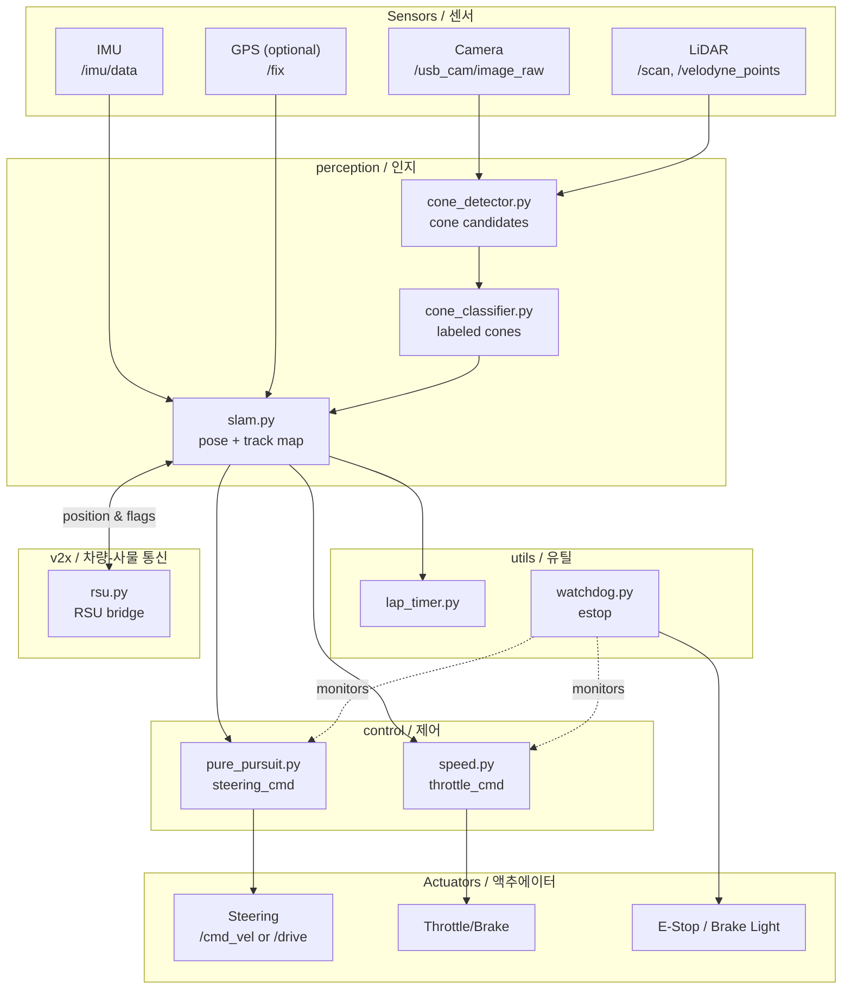

# Formula Student Driverless — Autonomous Racing Stack

> **FSD (Formula Student Driverless) 자율주행 레이싱 소프트웨어 스택**
> Autonomous racing software stack for the Formula Student Driverless competition

이 저장소는 FSD 대회를 위한 완전 자율주행 레이싱 차량 소프트웨어를 제공합니다. SLAM, 콘 감지/분류, Pure Pursuit 추종 제어, 랩 타이머, V2X(차량-사물 통신) 어댑터, 그리고 대회용 Docker 제출 패키지를 포함합니다.

This repository provides a full-stack autonomous driving system for the Formula Student Driverless competition. It bundles SLAM, cone detection/classification, pure-pursuit lane following, lap timing, a V2X adapter, and a competition-ready Docker submission package.

---

## Table of Contents / 목차

1. [Overview / 개요](#overview--개요)
2. [Target Users / 대상 사용자](#target-users--대상-사용자)
3. [Features / 주요 기능](#features--주요-기능)
4. [Architecture / 아키텍처](#architecture--아키텍처)
5. [Repository Layout / 저장소 구조](#repository-layout--저장소-구조)
6. [Quick Start / 빠른 시작](#quick-start--빠른-시작)
7. [Configuration / 설정](#configuration--설정)
8. [Commands Reference / 명령어 레퍼런스](#commands-reference--명령어-레퍼런스)
9. [Local Development / 로컬 개발](#local-development--로컬-개발)
10. [Testing / 테스트](#testing--테스트)
11. [Simulation / 시뮬레이션](#simulation--시뮬레이션)
12. [Submission Package / 제출 패키지](#submission-package--제출-패키지)
13. [Reference Materials / 참고 자료](#reference-materials--참고-자료)
14. [Contributing / 기여](#contributing--기여)
15. [License / 라이선스](#license--라이선스)

---

## Overview / 개요

FSD 대회는 카메라와 LiDAR로 트랙을 인식하고, 노란색/파란색 콘으로 정의된 미니멀 패스 레인을 따라 자율 주행을 수행하며, V2X 인프라(RSU)와 통신해 추가 정보를 받는 종목입니다. 본 스택은 그 파이프라인을 ROS 1 기반 노드들로 구현합니다.

The Formula Student Driverless competition asks teams to detect the track, follow a cone-defined lane (yellow/blue), and exchange data with a Roadside Unit (RSU) over V2X — all without a human driver. This stack implements that pipeline as a set of ROS 1 nodes.

핵심 설계 원칙 / Core design principles:

- **모듈화 (Modular)** — perception, control, utils, v2x를 독립 패키지로 분리
  Each subsystem (perception, control, utils, v2x) lives in its own module.
- **대회 즉시 실행 가능 (Competition-ready)** — `submission/` 디렉터리에 Docker 기반 제출 산출물 내장
  A self-contained Docker submission lives under `submission/`.
- **시뮬레이터-차량 양립 (Sim-to-real)** — `src/simulator/`의 FSSim 설정으로 알고리즘을 시뮬레이션에서 먼저 검증
  Validate algorithms in the FSSim simulator before going on-car.
- **안전 페일세이프 (Fail-safe)** — watchdog 노드가 비정상 상태를 감지하면 차량을 정지
  A watchdog node brings the vehicle to a safe stop on anomaly.

---

## Target Users / 대상 사용자

- FSD 대회에 참가하는 팀의 자율주행 SW 엔지니어
  Autonomous-driving SW engineers on FSD teams
- SLAM / computer vision / control 알고리즘을 실제 차량에 배포하려는 연구자
  Researchers who want to deploy SLAM / CV / control algorithms on a real race car
- 본 코드를 베이스라인으로 삼아 자신의 차량 스택을 구축하려는 학생 팀
  Student teams that want a battle-tested baseline to fork and extend

---

## Features / 주요 기능

### Perception (인지) — `src/autonomous/modules/perception/`, `submission/src/perception/`

| Module | 책임 / Responsibility |
| --- | --- |
| `cone_detector.py` | 카메라/LiDAR 입력에서 콘 후보 추출 / Detect cone candidates from camera and LiDAR |
| `cone_classifier.py` | 노란/파란 콘 및 크기 분류 / Classify cones as yellow / blue and assign size bucket |
| `slam.py` | 콘 기반 트랙 맵 작성 및 차량 위치 추정 / Build a cone-based track map and localize the car |

### Control (제어) — `src/autonomous/modules/control/`, `submission/src/control/`

| Module | 책임 / Responsibility |
| --- | --- |
| `pure_pursuit.py` | Pure Pursuit 스티어링 추종 / Pure-pursuit lateral control along the midline |
| `speed.py` | 곡률 기반 종방향 속도 프로파일 / Curvature-aware longitudinal speed profile |

### Utilities (유틸) — `src/autonomous/modules/utils/`, `submission/src/utils/`

| Module | 책임 / Responsibility |
| --- | --- |
| `lap_timer.py` | 시작/종료선 통과 감지 및 랩 타임 기록 / Detect start/finish crossings and log lap times |
| `watchdog.py` | 노드 헬스 체크 및 비상 정지 / Health-monitor nodes and trigger emergency stop |

### V2X — `submission/src/v2x/`

| Module | 책임 / Responsibility |
| --- | --- |
| `rsu.py` | RSU(Roadside Unit)와의 메시지 송수신 어댑터 / Adapter that exchanges messages with the RSU |

### Drivers — `submission/src/drivers/`

| Driver | 책임 / Responsibility |
| --- | --- |
| `basic.py` | 수동/원격 조작용 최소 드라이버 / Minimal driver for manual and teleop runs |
| `advanced.py` | 확장 가능한 텔레메트리 드라이버 / Extensible telemetry driver |
| `autonomous.py` | 자율주행 모드 진입점 / Entry point for autonomous mode |
| `competition.py` | 대회 규정 준수 런타임 / Competition-rule-compliant runtime |

### Tooling

- `competition_driver.py` — 차량용 단일 진입 스크립트 / Single entry script that runs the stack on the car
- `scripts/package.sh` — 제출용 tarball 생성 / Build the submission tarball
- `submission/Dockerfile` & `submission/docker-compose.yml` — 대회 환경에서 그대로 실행되는 컨테이너 / Containers that run as-is in the competition environment

---

## Architecture / 아키텍처

ROS 1 토픽 버스를 중심으로 한 노드 그래프는 다음과 같습니다. 모든 화살표는 ROS 토픽/서비스 흐름을 의미합니다.

The stack is a directed graph of ROS 1 nodes. Edges below denote topic and service flows.



핵심 토픽 / Key topics:

- `/cones` — 분류된 콘 리스트 (`cones.header`, `cones.points[]`)
- `/track_map` — SLAM이 작성한 트랙의 좌표계
- `/vehicle/steering_cmd`, `/vehicle/throttle_cmd`, `/vehicle/brake_cmd` — 제어 출력
- `/rsu/in`, `/rsu/out` — V2X 메시지

---

## Repository Layout / 저장소 구조

```
.
├── AGENTS.md
├── CONTRIBUTING.md
├── LICENSE
├── OWNERS
├── README.md
├── in-memoria.db                  # 메모리 캐시 / in-memory state cache
├── scripts/
│   └── package.sh                 # 제출 산출물 패키징 / build submission tarball
├── docs/
│   ├── SUBMISSION_GUIDE.md        # 제출 절차 / submission procedure
│   └── reference_materials/       # 강의 노트/주피터 노트북 / lecture notes & notebooks
├── src/
│   ├── autonomous/                # 자율주행 핵심 스택 / core autonomous stack
│   │   ├── Dockerfile
│   │   ├── docker-compose.yml
│   │   ├── entrypoint.sh
│   │   ├── record_race.sh
│   │   ├── run_all.sh
│   │   ├── start.sh
│   │   ├── scripts/start_race.py
│   │   ├── config/
│   │   │   ├── bridge_no_camera.launch
│   │   │   └── params.yaml
│   │   ├── driver/competition_driver.py
│   │   ├── modules/
│   │   │   ├── perception/  (cone_classifier, cone_detector, slam)
│   │   │   ├── control/     (pure_pursuit, speed)
│   │   │   └── utils/       (lap_timer, watchdog)
│   │   └── tests/test_algorithms.py
│   └── simulator/                 # FSSim 통합 / FSSim integration
│       ├── README.md
│       └── settings.json
└── submission/                    # 대회 제출 패키지 / competition submission
    ├── AGENTS.md
    ├── Dockerfile
    ├── docker-compose.yml
    ├── README.md
    ├── dev.sh
    ├── run.sh
    ├── launch/competition.launch
    ├── src/
    │   ├── drivers/         (basic, advanced, autonomous, competition)
    │   ├── perception/      (cone_classifier, cone_detector, slam)
    │   ├── v2x/rsu.py
    │   ├── utils/           (lap_timer, watchdog)
    │   └── control/         (pure_pursuit, speed)
    └── autonomous/
        ├── Dockerfile
        ├── docker-compose.yml
        ├── entrypoint.sh
        ├── run_all.sh
        ├── start.sh
        ├── config/params.yaml
        ├── driver/competition_driver.py
        └── modules/perception/ ...
```

`src/autonomous/`는 알고리즘을 반복 개발하기 위한 작업 트리이며, `submission/`은 대회 규정(오프라인 동작, 결정성, 재현 가능)을 만족하도록 동일 모듈을 컨테이너로 묶어 다시 배치한 산출물입니다. `scripts/package.sh`는 `submission/`을 대회 규정 형태로 빌드합니다.

`src/autonomous/` is the iteration tree for development; `submission/` is the same modules repackaged to satisfy the competition's offline / deterministic / reproducible requirements. `scripts/package.sh` builds `submission/` into the deliverable artifact.

---

## Quick Start / 빠른 시작

### Prerequisites / 사전 요구사항

- Linux (Ubuntu 20.04 LTS 권장 / recommended)
- ROS 1 (Noetic) — 호스트 또는 컨테이너 내부 / on the host or inside the dev container
- Docker 20.10+ 및 docker compose v2
- Python 3.8+

### 1. 클론 / Clone

```bash
git clone <repository-url> fsd-stack
cd fsd-stack
```

### 2. 시뮬레이터에서 실행 / Run in simulator (no hardware)

FSSim 통합을 통해 카메라·LiDAR 없이 알고리즘만 빠르게 검증할 수 있습니다.

You can validate algorithms quickly without real sensors via the FSSim integration.

```bash
# 1) ROS Noetic + 의존성 컨테이너 기동 / bring up the dev container
docker compose -f src/autonomous/docker-compose.yml up -d

# 2) 컨테이너 내부에서 전체 스택 실행 / run the full stack inside the container
docker compose -f src/autonomous/docker-compose.yml exec autonomous bash
roscore &
roslaunch src/simulator/launch/fsds.launch            # 시뮬레이터 (별도 설치)
roslaunch src/autonomous/config/bridge_no_camera.launch
rosrun autonomous_driver competition_driver.py
```

### 3. 실제 차량 / On-car

차량에 SSH로 접속한 뒤, 사전에 검증된 컨테이너 이미지를 적재하고 단일 명령으로 부팅합니다.

On the car, load a pre-validated container image and boot the stack with a single command.

```bash
./src/autonomous/run_all.sh
```

`run_all.sh`는 roscore → bridge → perception → control → watchdog 순으로 노드를 띄우고, 10초 이내에 핸들오프 가능한 상태가 됩니다. `start.sh`는 이미 roscore가 떠 있는 경우에增量 기동용입니다.

`run_all.sh` starts roscore → bridge → perception → control → watchdog in order and reaches a drivable state within ~10 s. `start.sh` is the incremental bring-up for when roscore is already running.

---

## Configuration / 설정

주요 파라미터는 `src/autonomous/config/params.yaml`에 있으며, ROS `param` 서버를 통해 로드됩니다. 일반적으로 손대야 할 항목:

The main parameters live in `src/autonomous/config/params.yaml` and are loaded via the ROS `param` server. Common knobs:

```yaml
perception:
  cone_detector:
    min_area_px: 80
    hsv_yellow: [[20, 80, 80], [40, 255, 255]]
    hsv_blue:   [[100, 80, 80], [140, 255, 255]]
  cone_classifier:
    small_radius_m: 0.10
    large_radius_m: 0.23

control:
  pure_pursuit:
    lookahead_m: 2.5
    wheelbase_m: 1.53
  speed:
    v_max_mps: 8.0
    curvature_slowdown: true

v2x:
  rsu:
    endpoint: "rsu.local:9100"
    tls: false

watchdog:
  heartbeat_timeout_s: 1.0
  estop_on_timeout: true
```

`bridge_no_camera.launch`는 카메라가 없는 빌드/테스트 환경에서 `/usb_cam` 토픽을 더미로 대체하기 위한 런치 파일입니다.

`bridge_no_camera.launch` replaces the `/usb_cam` topic with a dummy stream for builds and tests without a physical camera.

---

## Commands Reference / 명령어 레퍼런스

### 셸 스크립트 / Shell scripts

| Script | 용도 / Purpose |
| --- | --- |
| `src/autonomous/start.sh` | 기존 roscore 위에 노드를 올림 / Launch nodes on an existing roscore |
| `src/autonomous/run_all.sh` | roscore부터 모든 노드를 일괄 기동 / Bring up roscore + all nodes |
| `src/autonomous/entrypoint.sh` | Docker 컨테이너 진입점 / Docker entrypoint |
| `src/autonomous/record_race.sh` | `rosbag record` 래퍼 / Wrapper around `rosbag record` for race logging |
| `src/autonomous/scripts/start_race.py` | 미션 시작 시퀀스 (armed → driving) / Mission start sequence |
| `scripts/package.sh` | `submission/`을 대회 제출 형태로 묶음 / Build the submission tarball |
| `submission/run.sh` | 제출 이미지로 런타임 기동 / Run the packaged image at the venue |
| `submission/dev.sh` | 제출 이미지 내부 개발 셸 진입 / Dev shell into the packaged image |

### Docker Compose / Docker Compose

```bash
# 개발 컨테이너 / dev container
docker compose -f src/autonomous/docker-compose.yml up -d
docker compose -f src/autonomous/docker-compose.yml exec autonomous bash

# 제출 컨테이너 / submission container
docker compose -f submission/docker-compose.yml build
docker compose -f submission/docker-compose.yml up -d
```

### ROS 노드 / ROS nodes (직접 실행 / direct)

```bash
roscore &

# 인지
rosrun perception cone_detector.py
rosrun perception cone_classifier.py
rosrun perception slam.py

# 제어
rosrun control pure_pursuit.py
rosrun control speed.py

# 유틸
rosrun utils lap_timer.py
rosrun utils watchdog.py

# V2X
rosrun v2x rsu.py

# 드라이버
rosrun drivers competition.py
```

### 패키징 / Packaging

```bash
./scripts/package.sh
# → dist/fsd_submission_<commit-sha>.tar.gz
```

---

## Local Development / 로컬 개발

권장 워크플로우 / Recommended workflow:

1. `src/autonomous/`에서 알고리즘을 수정하고 `pytest src/autonomous/tests/`로 유닛 테스트를 돌린다.
   Modify algorithms under `src/autonomous/`, then run unit tests with `pytest src/autonomous/tests/`.
2. `src/simulator/settings.json`으로 FSSim 트랙/센서 구성을 잡고 시뮬레이션 회귀 테스트를 수행한다.
   Drive simulator regressions via `src/simulator/settings.json`.
3. 동일 모듈을 `submission/src/`로 동기화한 뒤 `submission/dev.sh`로 결정성을 검증한다.
   Mirror the changes into `submission/src/`, then validate determinism with `submission/dev.sh`.
4. `scripts/package.sh`로 산출물을 빌드하고, `submission/README.md`의 체크리스트로 제출 준비를 확인한다.
   Build the artifact with `scripts/package.sh` and walk through `submission/README.md`.

코드 스타일 / Code style:

- Python: PEP 8, `black`, `isort`, `flake8` (CI 통과가 필수)
  Python: PEP 8, `black`, `isort`, `flake8` enforced by CI.
- ROS launch 파일은 변경 시 `roslaunch --files`로 검사
  Validate launch files with `roslaunch --files` before committing.
- 파라미터 추가는 `params.yaml`에 단일 진실 공급원(SSoT) 유지
  New parameters belong in `params.yaml` — single source of truth.

---

## Testing / 테스트

`src/autonomous/tests/test_algorithms.py`는 perception/control 알고리즘의 결정성을 검증합니다. 알고리즘을 변경할 때 동일 입력에 대해 동일 출력이 나오는지 확인합니다.

`src/autonomous/tests/test_algorithms.py` asserts determinism for the perception and control algorithms. When you change an algorithm, the same input must produce the same output.

```bash
# 컨테이너 내부 / inside the dev container
pytest src/autonomous/tests/test_algorithms.py -v

# 시뮬레이터 회귀 / simulator regression
roslaunch src/simulator/launch/fsds.launch track:=skidpad
rosbag play tests/fixtures/skidpad.bag
```

테스트 픽스처는 `src/autonomous/tests/fixtures/`에 추가합니다 (이미지·포인트클라우드·예상 경로).

Add fixtures (images, point clouds, expected paths) under `src/autonomous/tests/fixtures/`.

---

## Simulation / 시뮬레이션

`src/simulator/`는 FSSim(Full Self-Driving Simulator)을 위한 설정 묶음입니다. `settings.json`은 트랙 선택, 차량 파라미터, 카메라/LiDAR 마운트, 날씨 시드를 정의합니다.

`src/simulator/` is a configuration bundle for the Full Self-Driving Simulator (FSSim). `settings.json` defines the track, vehicle parameters, sensor mounts, and weather seed.

```bash
# FSSim 별도 설치 후 / after installing FSSim separately
roslaunch fssim_interface fssim.launch settings:=src/simulator/settings.json
roslaunch src/autonomous/config/bridge_no_camera.launch
rosrun autonomous_driver competition_driver.py
```

자세한 트랙/시나리오 정의는 `src/simulator/README.md`를 참고하세요.

See `src/simulator/README.md` for track and scenario definitions.

---

## Submission Package / 제출 패키지

`submission/`은 대회 규정에서 요구하는 “오프라인에서 실행 가능한 단일 이미지” 형태로 빌드하기 위한 산출물입니다. 핵심:

`submission/` is the artifact that satisfies the competition's "single image runnable offline" requirement.

- `Dockerfile` — 모든 의존성을 컨테이너에 동결 / All dependencies frozen in a container.
- `docker-compose.yml` — 단일 명령 기동 / Bring up with one command.
- `run.sh` — 대회 운영자가 그대로 실행하는 진입점 / The script organizers run as-is.
- `launch/competition.launch` — 모든 노드를 한 번에 띄우는 런치 / Single launch that starts every node.
- `autonomous/` — 알고리즘 모듈 미러 / Mirror of the algorithm modules.

제출 절차 전체는 `docs/SUBMISSION_GUIDE.md`에 정리되어 있습니다.

The full submission procedure is documented in `docs/SUBMISSION_GUIDE.md`.

---

## Reference Materials / 참고 자료

`docs/reference_materials/`에는 본 스택 설계에 참고한 강의 자료가 포함되어 있습니다.

`docs/reference_materials/` contains the lecture material that informed the design of this stack.

- `lecture1_fsds_install.txt` — FSDS 설치 절차 / FSDS install procedure
- `lecture4_slam.ipynb` — SLAM 강의 노트북 / SLAM lecture notebook
- `lecture6_v2x.ipynb` — V2X 강의 노트북 / V2X lecture notebook

추가 자료 / Further reading:

- [Formula Student Driverless 규칙 / rules](https://www.formulastudent.de/fsg/) — 공식 규정은 본 저장소와 독립적으로 갱신됩니다
- ROS 1 Noetic 문서 / ROS 1 Noetic docs
- FSSim 문서 / FSSim docs

---

## Contributing / 기여

기여 절차는 `CONTRIBUTING.md`에 명시되어 있습니다. 요약:

See `CONTRIBUTING.md` for the full process. In short:

1. 이슈를 먼저 열거나 기존 이슈에 댓글을 답니다.
   Open an issue or comment on an existing one first.
2. 포크 → 피처 브랜치 → PR을 생성합니다.
   Fork → feature branch → PR.
3. CI가 통과해야 리뷰가 시작됩니다 (lint + tests).
   CI must pass (lint + tests) before review.
4. 리뷰어 승인 후 squash merge합니다.
   Squash-merge after approval.

리뷰어 및 권한 정보는 `OWNERS`를 확인하세요.

Reviewers and permissions live in `OWNERS`.

---

## License / 라이선스

본 저장소는 `LICENSE` 파일에 명시된 라이선스를 따릅니다. 별도 명시가 없는 한 모든 소스 코드는 해당 라이선스 조건을 상속합니다.

This repository is released under the license stated in `LICENSE`. Unless stated otherwise, all source code inherits those terms.