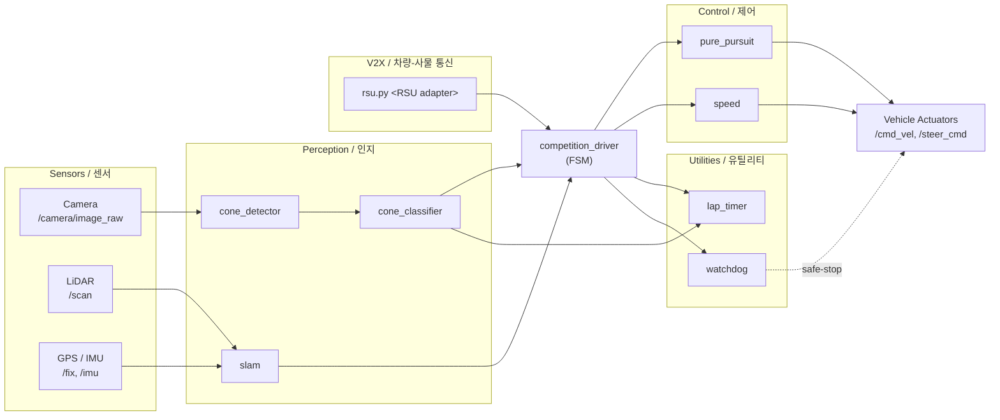

# Formula Student Driverless — Autonomous Racing Stack

> FSD(Formula Student Driverless) 자율주행 레이싱 소프트웨어 스택
> Autonomous racing software stack for the Formula Student Driverless competition

이 저장소는 FSD 대회를 위한 완전 자율주행 레이싱 차량 소프트웨어를 제공합니다. SLAM, 콘 감지/분류, Pure Pursuit 추종 제어, 랩 타이머, V2X(차량-사물 통신) 어댑터, 그리고 대회용 Docker 제출 패키지를 포함합니다.

This repository provides a full-stack autonomous driving system for the Formula Student Driverless competition. It bundles SLAM, cone detection/classification, pure-pursuit lane following, lap timing, a V2X adapter, and a competition-ready Docker submission package.

---

## Table of Contents / 목차

1. [Overview / 개요](#overview--개요)
2. [Features / 주요 기능](#features--주요-기능)
3. [Architecture / 아키텍처](#architecture--아키텍처)
4. [Repository Layout / 저장소 구조](#repository-layout--저소-구조)
5. [Quick Start / 빠른 시작](#quick-start--빠른-시작)
6. [Configuration / 설정](#configuration--설정)
7. [Commands Reference / 명령어 레퍼런스](#commands-reference--명령어-레퍼런스)
8. [Local Development / 로컬 개발](#local-development--로컬-개발)
9. [Testing / 테스트](#testing--테스트)
10. [Simulation / 시뮬레이션](#simulation--시뮬레이션)
11. [Submission Package / 제출 패키지](#submission-package--제출-패키지)
12. [Contributing / 기여](#contributing--기여)
13. [License / 라이선스](#license--라이선스)

---

## Overview / 개요

FSD 대회는 카메라와 LiDAR로 트랙을 인식하고, 노란색/파란색 콘으로 정의된 미니멀 패스 레인을 따라 자율 주행을 수행하며, V2X 인프라(RSU)와 통신해 추가 정보를 받는 종목입니다. 본 스택은 그 파이프라인을 ROS 1 기반 노드들로 구현합니다.

The Formula Student Driverless competition asks teams to detect the track, follow a cone-defined lane (yellow/blue), and exchange data with a Roadside Unit (RSU) over V2X — all without a human driver. This stack implements that pipeline as a set of ROS 1 nodes.

대상 사용자 / Target users:

- FSD 대회에 참가하는 팀의 자율주행 SW 엔지니어
  Autonomous-driving SW engineers on FSD teams
- SLAM / computer vision / control 알고리즘을 실제 차량에 배포하려는 연구자
  Researchers who want to deploy SLAM / CV / control algorithms on a real race car
- 본 코드를 베이스라인으로 포크해 팀 고유 알고리즘을 시험하려는 학생 팀
  Student teams forking this codebase as a baseline for their own algorithms

핵심 디스크립터 / Key descriptors:

- **Framework**: ROS 1 (Noetic) on Ubuntu 20.04
- **Perception**: OpenCV-based cone detector + color classifier, ORB-SLAM2 wrapper
- **Control**: Pure Pursuit path tracker with longitudinal speed controller
- **V2X**: UDP-based RSU adapter (simulated or real roadside unit)
- **Packaging**: Docker + docker-compose for reproducible runs and competition submission

---

## Features / 주요 기능

### Perception / 인지

- **Cone detection** (`modules/perception/cone_detector.py`): HSV-thresholded segmentation + contour filtering on camera frames to extract cone candidates.
- **Cone classification** (`modules/perception/cone_classifier.py`): Distinguishes yellow vs. blue cones and resolves left/right lane boundary.
- **SLAM** (`modules/perception/slam.py`): Visual/LiDAR odometry wrapper that publishes `/map`, `/odom`, and `/tf` for downstream path planning.

### Control / 제어

- **Pure Pursuit** (`modules/control/pure_pursuit.py`): Geometric path tracker that steers toward a lookahead point on the detected lane centerline.
- **Speed controller** (`modules/control/speed.py`): Closed-loop longitudinal controller that targets corner-aware reference velocities.

### Utilities / 유틸리티

- **Lap timer** (`modules/utils/lap_timer.py`): Counts completed laps using start/finish line crossings and publishes timing topics.
- **Watchdog** (`modules/utils/watchdog.py`): Monitors node liveness; triggers safe-stop when any critical topic goes stale.

### Driver orchestration / 드라이버 오케스트레이션

- **Competition driver** (`driver/competition_driver.py`): Top-level finite-state machine coordinating perception, control, lap counting, and emergency stop.

### V2X

- **RSU adapter** (`submission/src/v2x/rsu.py`): UDP socket client/server for receiving track-side signals (e.g., track closure, weather, sector flags) from a Roadside Unit.

### Submission tooling / 제출 도구

- **Dockerized runner** (`submission/Dockerfile` + `docker-compose.yml`): Bundles the full stack into a single image with a deterministic entrypoint.
- **Packaging script** (`scripts/package.sh`): Builds the tarball required by the official FSD submission portal.

---

## Architecture / 아키텍처



노드 간 통신은 ROS 토픽으로 이루어지며, 모든 노드는 단일 ROS 마스터 하에서 동작합니다. `competition_driver`는 FSM(Finite-State Machine)으로서 `WAITING_FOR_GREEN → DRIVING → FINISHED / EMERGENCY_STOP` 전이를 관리합니다.

All node-to-node communication happens over ROS topics under a single ROS master. `competition_driver` is a finite-state machine that manages `WAITING_FOR_GREEN → DRIVING → FINISHED / EMERGENCY_STOP` transitions.

---

## Repository Layout / 저장소 구조

```
.
├── AGENTS.md                     # Agent / contributor operating manual
├── CONTRIBUTING.md               # Contribution guidelines
├── LICENSE                       # Project license
├── OWNERS                        # CODEOWNERS mapping
├── README.md                     # This file
├── in-memoria.db                 # Cached perception/control telemetry DB
│
├── src/
│   ├── autonomous/               # In-repo autonomous stack
│   │   ├── AGENTS.md
│   │   ├── Dockerfile
│   │   ├── docker-compose.yml
│   │   ├── entrypoint.sh
│   │   ├── record_race.sh        # rosbag recorder wrapper
│   │   ├── run_all.sh            # Bring up full stack
│   │   ├── start.sh              # Bring up driver only
│   │   ├── scripts/start_race.py
│   │   ├── config/
│   │   │   ├── bridge_no_camera.launch
│   │   │   └── params.yaml
│   │   ├── driver/competition_driver.py
│   │   ├── modules/
│   │   │   ├── perception/{cone_classifier,cone_detector,slam}.py
│   │   │   ├── utils/{lap_timer,watchdog}.py
│   │   │   └── control/{pure_pursuit,speed}.py
│   │   └── tests/test_algorithms.py
│   │
│   └── simulator/                # Lightweight simulator config
│       ├── README.md
│       └── settings.json
│
├── scripts/
│   └── package.sh                # Build competition submission tarball
│
├── docs/
│   ├── SUBMISSION_GUIDE.md       # FSD official submission walkthrough
│   └── reference_materials/      # Lecture notes & notebooks
│
└── submission/                   # Standalone submission package
    ├── AGENTS.md
    ├── Dockerfile
    ├── README.md
    ├── dev.sh
    ├── docker-compose.yml
    ├── run.sh
    ├── launch/competition.launch
    ├── src/
    │   ├── drivers/{basic,advanced,autonomous,competition}.py
    │   ├── perception/{cone_classifier,cone_detector,slam}.py
    │   ├── v2x/rsu.py
    │   ├── utils/{lap_timer,watchdog}.py
    │   └── control/{pure_pursuit,speed}.py
    └── autonomous/               # Mirrored autonomous stack for submission
        ├── Dockerfile
        ├── docker-compose.yml
        ├── entrypoint.sh
        ├── run_all.sh
        ├── start.sh
        ├── config/params.yaml
        ├── driver/competition_driver.py
        └── modules/perception/{cone_classifier,cone_detector}.py
```

---

## Quick Start / 빠른 시작

### Prerequisites / 사전 준비

- **OS**: Ubuntu 20.04 (or 22.04 with Noetic Docker base)
- **Docker**: 24.0+ with Compose v2
- **NVIDIA Container Toolkit** (optional, for GPU-accelerated perception)
- **ROS**: Noetic (provided inside the Docker image — no host install required)

### 1. Clone / 클론

```bash
git clone https://github.com/<your-org>/fsd-autonomous-stack.git
cd fsd-autonomous-stack
```

### 2. Launch the in-repo stack / 인-repo 스택 실행

```bash
cd src/autonomous
docker compose up --build
```

`run_all.sh`는 카메라 토픽을 제외한 전체 스택을 띄웁니다. 카메라가 연결된 실제 차량에서는 `bridge_no_camera.launch`를 제거하고 `camera.launch`를 사용하세요.

`run_all.sh` brings up the full stack **without** a real camera. On a real car with a USB/CSI camera, remove `bridge_no_camera.launch` and substitute your camera launch file.

### 3. Run the competition submission package / 대회 제출 패키지 실행

```bash
cd submission
./dev.sh           # interactive dev shell inside the container
# or:
./run.sh           # one-shot race run
```

### 4. Smoke test (no hardware) / 하드웨어 없는 스모크 테스트

```bash
cd src/simulator
# See src/simulator/README.md for a recorded bag replay flow
```

---

## Configuration / 설정

주요 설정 파일 / Primary configuration files:

| File / 파일 | Purpose / 용도 |
|---|---|
| `src/autonomous/config/params.yaml` | Perception thresholds, control gains, topic names |
| `src/autonomous/config/bridge_no_camera.launch` | ROS launch bridging synthetic topics when no camera is present |
| `submission/launch/competition.launch` | Top-level launch for the submission package |
| `src/simulator/settings.json` | Simulator world & track layout |

`params.yaml` 예시 / Example `params.yaml` excerpt:

```yaml
perception:
  cone_detector:
    hsv_lower_yellow: [20, 100, 100]
    hsv_upper_yellow: [35, 255, 255]
    hsv_lower_blue:  [100, 150, 50]
    hsv_upper_blue:  [130, 255, 255]
    min_area_px: 250

control:
  pure_pursuit:
    lookahead_m: 2.5
    wheelbase_m: 1.55
  speed:
    v_max_mps: 8.0
    v_min_mps: 1.5
    kp: 0.6

v2x:
  rsu_host: 0.0.0.0
  rsu_port: 5005
```

> **Tip**: `params.yaml` is loaded with `rosparam load` on container start. Mount your own override at `/catkin_ws/params.yaml:ro` in `docker-compose.yml` to tweak values per run.

---

## Commands Reference / 명령어 레퍼런스

| Command / 명령어 | Description / 설명 |
|---|---|
| `cd src/autonomous && docker compose up --build` | Build & run the in-repo autonomous stack |
| `cd src/autonomous && ./start.sh` | Start the competition driver only (assumes perception already running) |
| `cd src/autonomous && ./run_all.sh` | Bring up the full stack |
| `cd src/autonomous && ./record_race.sh` | Record all topics to a rosbag in `~/bags/` |
| `cd src/autonomous && python3 scripts/start_race.py` | Programmatic race start (used by entrypoint) |
| `cd src/autonomous && python3 -m pytest tests/` | Run unit tests |
| `cd submission && ./dev.sh` | Drop into an interactive container shell |
| `cd submission && ./run.sh` | One-shot submission run |
| `cd submission && docker compose up` | Compose-based submission run |
| `bash scripts/package.sh` | Build the FSD submission tarball |
| `rosnode list` | List live ROS nodes (inside container) |
| `rostopic echo /cmd_vel` | Watch steering/velocity commands live |
| `rosbag play <bag>` | Replay a recorded race bag |
| `rqt_graph` | Visualize the live node/topic graph |

---

## Local Development / 로컬 개발

### Inside the container / 컨테이너 내부

The recommended workflow is to develop inside the provided Docker image so that ROS, OpenCV, and Python deps stay reproducible.

```bash
cd src/autonomous
docker compose run --rm autonomous bash
```

Inside the container:

```bash
source /opt/ros/noetic/setup.bash
source /catkin_ws/devel/setup.bash
roscore &
roslaunch config/bridge_no_camera.launch
rosrun competition_driver competition_driver.py
```

### Editing code / 코드 수정

- Python nodes live under `src/autonomous/modules/` and `submission/src/`.
- After editing, either rebuild the image (`docker compose build`) or — for fast iteration — mount the source as a volume and re-source the workspace:

```bash
# in docker-compose.yml
volumes:
  - ./modules:/catkin_ws/src/competition/modules
```

### Adding a new perception node / 새 인지 노드 추가

1. Drop the node under `src/autonomous/modules/perception/`.
2. Add the launch line to `src/autonomous/config/bridge_no_camera.launch` (or a new `.launch` file).
3. Register any new ROS params in `params.yaml`.
4. Add a unit test under `tests/test_algorithms.py`.

---

## Testing / 테스트

```bash
cd src/autonomous
python3 -m pytest tests/ -v
```

`tests/test_algorithms.py` covers:

- Cone detector returns expected bounding boxes for synthetic HSV frames
- Cone classifier color thresholds classify yellow/blue correctly
- Pure Pursuit steering angle matches the analytic solution for straight & curved paths
- Speed controller saturates within `[v_min, v_max]`
- Lap timer increments on a crossing event and resets on second crossing
- Watchdog triggers safe-stop when a critical topic stops publishing

For end-to-end testing, replay a recorded rosbag through the stack and assert that `/cmd_vel` and `/steer_cmd` are produced.

---

## Simulation / 시뮬레이션

`src/simulator/` ships a minimal config used to replay recorded bags or to drive the stack against a synthetic track.

```bash
cd src/simulator
# 1) Start ROS + the autonomous stack (in another terminal, see Quick Start)
# 2) Replay a bag
rosbag play ../autonomous/recordings/sample.bag --clock
```

See `src/simulator/README.md` for track layout definitions and how to publish a synthetic `/scan` and `/camera/image_raw`.

---

## Submission Package / 제출 패키지

`submission/` is a self-contained directory mirroring the in-repo stack, plus:

- A polished `Dockerfile` and `docker-compose.yml` that match the FSD organizer rubric.
- Multiple driver variants under `submission/src/drivers/`:
  - `basic.py` — minimum viable driver for rule compliance
  - `advanced.py` — adds curvature-aware speed scaling
  - `autonomous.py` — full FSM implementation
  - `competition.py` — recommended driver for the live event
- A `v2x/` module wired to the organizer-supplied RSU.
- `dev.sh` and `run.sh` as the official entry points for the technical inspection.

Build the submission tarball:

```bash
bash scripts/package.sh
# → ./dist/fsd-submission-<version>.tar.gz
```

Refer to [`docs/SUBMISSION_GUIDE.md`](docs/SUBMISSION_GUIDE.md) for the full checklist (AS-acceleration, skidpad, trackdrive, EBS test).

---

## Contributing / 기여

기여 절차 / How to contribute:

1. Read [`CONTRIBUTING.md`](CONTRIBUTING.md) and [`AGENTS.md`](AGENTS.md) for coding conventions and review workflow.
2. Fork the repository and create a topic branch (`git checkout -b feat/my-feature`).
3. Make your changes; add or update unit tests in `src/autonomous/tests/`.
4. Run the test suite locally (`pytest src/autonomous/tests/`).
5. Ensure `docker compose build` succeeds for both `src/autonomous/` and `submission/`.
6. Open a pull request describing motivation, design, and test results.

코드 스타일 / Code style:

- Python: PEP 8, `black` for formatting, `ruff` for linting.
- ROS: snake_case node & topic names; document every published/subscribed topic in the node docstring.

---

## License / 라이선스

본 프로젝트는 저장소 루트의 [`LICENSE`](LICENSE) 파일에 명시된 라이선스를 따릅니다.

This project is released under the terms described in the [`LICENSE`](LICENSE) file at the repository root.

---

## References / 참고 자료

- [`docs/SUBMISSION_GUIDE.md`](docs/SUBMISSION_GUIDE.md) — FSD 공식 제출 가이드 요약
- [`docs/reference_materials/`](docs/reference_materials/) — SLAM, V2X 강의 노트 & 노트북
- [`src/autonomous/AGENTS.md`](src/autonomous/AGENTS.md), [`submission/AGENTS.md`](submission/AGENTS.md) — 운영 매뉴얼
- [Formula Student Driverless — official rules & rulebooks](https://www.formulastudent.de/fsd/)