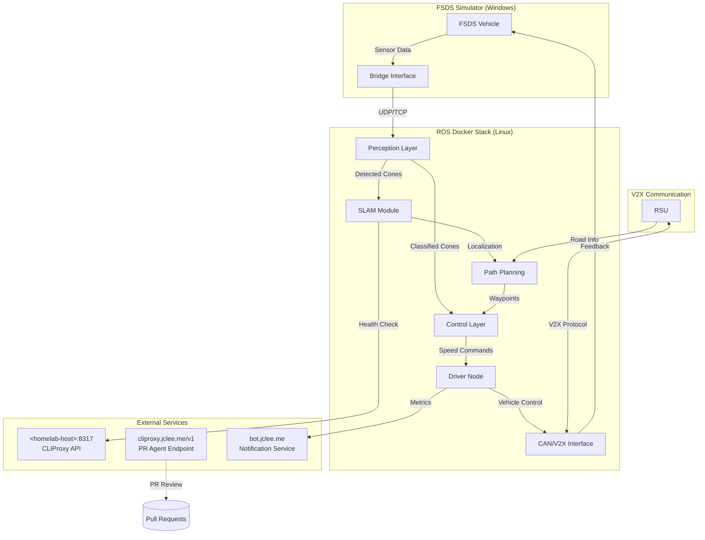

# HYCU FSDS Autonomous Driving / HYCU FSDS 자율주행

> Formula Student Driverless Simulator 기반 자율주행 시스템  
> Formula Student Driverless Simulator (FSDS) Based Autonomous Driving System

[](LICENSE)
[](http://wiki.ros.org/noetic)
[](https://www.python.org/)
[](https://www.docker.com/)
[](https://github.com/qws941/HYCU-FSDS/actions)
[](https://github.com/qodo-ai/pr-agent)

---

## 목차 (Table of Contents)

- [개요 (Overview)](#개요-overview)
- [주요 기능 (Key Features)](#주요-기능-key-features)
- [시스템 아키텍처 (System Architecture)](#시스템-아키텍처-system-architecture)
- [자동화 인벤토리 (Automation Inventory)](#자동화-인벤토리-automation-inventory)
- [빠른 시작 (Quick Start)](#빠른-시작-quick-start)
- [로컬 개발 (Local Development)](#로컬-개발-local-development)
- [명령어 참고서 (Commands Reference)](#명령어-참고서-commands-reference)
- [기여 가이드 (Contribution Guide)](#기여-가이드-contribution-guide)

---

## 개요 (Overview)

본 프로젝트는 **Formula Student Driverless Simulator (FSDS)** 기반으로 개발된 자율주행 시스템입니다. Windows 환경의 시뮬레이터와 Linux (ROS Noetic) Docker 기반 자율주행 스택을 결합한 이중 플랫폼 아키텍처로, 콘 감지 (Cone Detection), SLAM, 경로 계획 및 제어 기능을 통합합니다.

This project is an autonomous driving system based on the **Formula Student Driverless Simulator (FSDS)**. It combines a Windows-based simulator with a Linux (ROS Noetic) Docker-based autonomous driving stack, integrating cone detection, SLAM, path planning, and control functions.

### 프로젝트 배경 (Project Background)

본 프로젝트는 자율주행 알고리즘 연구 및 경진 대회 준비를 위해 구축되었으며, 다음 목표를 달성합니다:

- FSDS 시뮬레이터 환경에서의 실시간 자율주행 구현
- ROS Noetic 기반의 모듈화된 자율주행 스택 제공
- Cone Detection 및 SLAM을 통한 환경 인식 능력 확보
- Pure Pursuit 및 속도 제어를 통한 경로 추종 성능 확보

This project was established for autonomous driving algorithm research and competition preparation, achieving the following objectives:

- Real-time autonomous driving implementation in FSDS simulator environment
- Modular autonomous driving stack based on ROS Noetic
- Environment perception capability through Cone Detection and SLAM
- Path following performance through Pure Pursuit and speed control

---

## 주요 기능 (Key Features)

### 자율주행 모듈 (Autonomous Driving Modules)

| 모듈 (Module) | 설명 (Description) |
|---------------|-------------------|
| **Perception** | 콘 감지 (Cone Detection), SLAM, 콘 분류 (Cone Classification) |
| **Control** | Pure Pursuit 경로 추종, 속도 제어 (Speed Control) |
| **Drivers** | Basic, Advanced, Competition, Autonomous drivers |
| **V2X** | RSU (Roadside Unit) 통신 모듈 |

### 개발 환경 (Development Environment)

- **ROS Noetic**: 로봇 운영 체제
- **Python 3.8+**: 주요 개발 언어
- **Docker**: 컨테이너화된 개발 및 배포
- **FSDS Simulator**: Windows 기반 시뮬레이션

### 자동화 기능 (Automation Features)

- GitHub Actions 기반 CI/CD
- 자동 PR 리뷰 (Auto PR Review via qodo-ai/pr-agent)
- 의존성 자동 관리 (Dependabot)
- 코딩 보안 스캔 (Gitleaks, CodeQL)
- 릴리스 자동化管理

---

## 시스템 아키텍처 (System Architecture)



### 데이터 흐름 (Data Flow)

1. **시뮬레이터 → Docker**: FSDS에서 생성된 센서 데이터가 브릿지 인터페이스를 통해 ROS Docker로 전송
2. **Perception → Planning**: 감지된 콘 데이터를 SLAM이 처리하여 위치 추정
3. **Planning → Control**: 경로 계획模块가 Pure Pursuit控制器에 웨이포인트 제공
4. **Control → Vehicle**: 제어 명령이 CAN 버스 또는 V2X를 통해 차량에 전송

1. **Simulator → Docker**: Sensor data from FSDS transmitted to ROS Docker via bridge interface
2. **Perception → Planning**: Detected cone data processed by SLAM for localization
3. **Planning → Control**: Path planning module provides waypoints to Pure Pursuit controller
4. **Control → Vehicle**: Control commands transmitted to vehicle via CAN bus or V2X

---

## 자동화 인벤토리 (Automation Inventory)

### GitHub Actions 워크플로우 (Workflows)

#### 브랜치 및 PR 관리 (Branch & PR Management)

| 워크플로우 파일 (Workflow File) | 설명 (Description) |
|--------------------------------|-------------------|
| `01_branch-to-pr.yml` | 브랜치에서 PR로 자동 전환 |
| `02_issue-to-branch.yml` | 이슈 기반 브랜치 생성 |
| `03_pr-checks.yml` | PR 필수 체크 실행 |
| `09_semantic-pr.yml` | Semantic PR 네이밍 검증 |
| `10_pr-review.yml` | 자동 PR 리뷰 (qodo-ai/pr-agent) |
| `13_pr-auto-merge.yml` | 자동 병합 조건 충족 시 자동 병합 |
| `15_merged-pr-cleanup.yml` | 병합 후 브랜치 정리 |
| `security/11_pr-review.yml` | 보안 관련 PR 리뷰 |

#### CI/CD 및 품질 관리 (CI/CD & Quality)

| 워크플로우 파일 (Workflow File) | 설명 (Description) |
|--------------------------------|-------------------|
| `03_pr-checks.yml` | 기본 PR 체크 (린트, 테스트) |
| `04_actionlint.yml` | GitHub Actions 워크플로우 린트 |
| `05_gitleaks.yml` |Secrets 스캔 |
| `06_codeql.yml` | 코드 품질 분석 |
| `07_dependency-review.yml` | 의존성 보안 검토 |
| `08_scorecard.yml` | OSSF Scorecard 분석 |
| `auto-merge.yml` | 자동 병합Orchestrator |
| `ci.yml` | 기본 CI 파이프라인 |
| `labeler.yml` | 자동 라벨링 |

#### 의존성 관리 (Dependency Management)

| 워크플로우 파일 (Workflow File) | 설명 (Description) |
|--------------------------------|-------------------|
| `12_dependabot-auto-merge.yml` | Dependabot 업데이트 자동 병합 |
| `13_pr-auto-merge.yml` | 일반 자동 병합 |

#### 이슈 관리 (Issue Management)

| 워크플로우 파일 (Workflow File) | 설명 (Description) |
|--------------------------------|-------------------|
| `18_issue-management.yml` | 이슈 자동 관리 |
| `19_issue-backfill.yml` | 이슈 백필 작업 |
| `37_ci-failure-issues.yml` | CI 실패 시 이슈 생성 |
| `91_issue-classification.yml` | 이슈 자동 분류 |

#### 릴리스 및 배포 (Release & Deploy)

| 워크플로우 파일 (Workflow File) | 설명 (Description) |
|--------------------------------|-------------------|
| `24_release-notes.yml` | 자동 릴리스 노트 생성 |
| `25_release-publish.yml` | 릴리스 게시 및 배포 |

#### 문서 및 동기화 (Documentation & Sync)

| 워크플로우 파일 (Workflow File) | 설명 (Description) |
|--------------------------------|-------------------|
| `20_readme-gen.yml` | README 자동 생성 |
| `21_docs-sync.yml` | 문서 동기화 |
| `42_reusable-docs-sync.yml` | 재사용可能な 문서 동기화 템플릿 |

#### 복구 및 모니터링 (Recovery & Monitoring)

| 워크플로우 파일 (Workflow File) | 설명 (Description) |
|--------------------------------|-------------------|
| `29_downstream-health-check.yml` | 하위 프로젝트 상태 확인 |
| `60_ci-auto-heal.yml` | CI 자동 복구 |

#### 재사용 가능한 워크플로우 (Reusable Workflows)

| 워크플로우 파일 (Workflow File) | 설명 (Description) |
|--------------------------------|-------------------|
| `43_reusable-issue-management.yml` | 이슈 관리 재사용 템플릿 |
| `44_reusable-pr-checks.yml` | PR 체크 재사용 템플릿 |
| `45_reusable-gitleaks.yml` | Gitleaks 재사용 템플릿 |

#### 기타 자동화 (Other Automation)

| 워크플로우 파일 (Workflow File) | 설명 (Description) |
|--------------------------------|-------------------|
| `14_bot-auto-fix.yml` | 봇 자동 수정 |
| `welcome.yml` | 새 기여자 환영 메시지 |

### 외부 자동화 도구 (External Automation Tools)

| 도구 (Tool) | 용도 (Purpose) | 엔드포인트 (Endpoint) |
|-------------|----------------|----------------------|
| **qodo-ai/pr-agent** | 자동 PR 리뷰 및 분석 | cliproxy.jclee.me/v1 |
| **CLIProxy** | CI/CD 프록시 및 로깅 | `<homelab-host>:8317` |
| **ELK Stack** | 로그 수집 및 분석 | `<homelab-elk>` |
| **Bot Service** | 알림 및 웹훅 | bot.jclee.me |

---

## 빠른 시작 (Quick Start)

### 전제 조건 (Prerequisites)

- Docker 20.10+
- Python 3.8+
- ROS Noetic (Linux 환경)
- FSDS 시뮬레이터 (Windows)

### Docker 기반 실행 (Docker-based Execution)

```bash
# 자율주행 Docker 이미지 빌드
cd autonomous
docker-compose build

# 컨테이너 실행
docker-compose up -d

# 또는 단일 명령어로 실행
./run_all.sh
```

### 시뮬레이터 연결 (Simulator Connection)

1. Windows에서 FSDS 시뮬레이터 실행
2. Linux에서 브릿지 노드 시작:

```bash
# 소스 코드 디렉토리에서
cd submission
./run.sh
```

---

## 로컬 개발 (Local Development)

### 프로젝트 구조 (Project Structure)

```
HYCU-FSDS/
├── submission/                 # 메인 자율주행 코드
│   ├── src/
│   │   ├── perception/        # 콘 감지 및 SLAM
│   │   ├── control/          # 경로 추종 및 속도 제어
│   │   ├── drivers/          # 차량 드라이버
│   │   └── v2x/              # V2X 통신
│   ├── config/               # 설정 파일
│   ├── tests/               # 단위 테스트
│   ├── launch/              # ROS 런치 파일
│   └── scripts/             # 실행 스크립트
├── autonomous/               # Docker 스택
│   ├── modules/             # Python 모듈
│   ├── config/             # 설정 파일
│   ├── driver/             # 드라이버 코드
│   └── entrypoint.sh       # 진입점
├── _bot-scripts/           # CI/CD 자동화 스크립트
└── .github/                # GitHub 설정
    └── workflows/          # GitHub Actions 워크플로우
```

### 개발 환경 설정 (Development Environment Setup)

```bash
# Python 의존성 설치
pip install -r _bot-scripts/requirements.txt

# ROS 패키지 설치 (Linux)
source /opt/ros/noetic/setup.bash
catkin_make

# 테스트 실행
pytest submission/tests/test_algorithms.py -v
```

---

## 명령어 참고서 (Commands Reference)

### Docker 명령어 (Docker Commands)

```bash
# Docker Compose
docker-compose -f submission/docker-compose.yml up     # 제출용 실행
docker-compose -f submission/docker-compose.yml down   # 중지
docker-compose -f autonomous/docker-compose.yml build  # 자율주행 빌드

# 개별 이미지 빌드
docker build -t hycu-fsds-submission -f submission/Dockerfile submission/
docker build -t hycu-fsds-autonomous -f autonomous/Dockerfile autonomous/
```

### ROS 명령어 (ROS Commands)

```bash
# ROS 노드 실행
roslaunch hycu_fsd_launch competition.launch

# 토픽 확인
rostopic list
rostopic echo /cone_detections

# 파라미터 설정
rosparam set /pure_pursuit/lookahead_distance 2.5
```

### 테스트 명령어 (Test Commands)

```bash
# 모든 테스트 실행
python -m pytest submission/tests/ -v

# 특정 테스트 실행
python -m pytest submission/tests/test_algorithms.py::test_pure_pursuit -v

# 코드 분석
python -m flake8 submission/src/
python -m mypy submission/src/
```

### CI/CD 명령어 (CI/CD Commands)

```bash
# 로컬에서 액션린트 실행
docker run --rm -v "$PWD:/workspace" aeci/actionlint

# Gitleaks 스캔
docker run --rm -v "$PWD:/data" zricetheazv/gitleaks detect --source /data
```

---

## 기여 가이드 (Contribution Guide)

### 기여 방법 (How to Contribute)

1. **포크 (Fork)**: 이 저장소를 포크합니다
2. **브랜치 생성 (Create Branch)**: `02_issue-to-branch.yml` 패턴에 따라 브랜치 생성

   ```bash
   git checkout -b feature/cone-detection-improvement
   ```

3. **변경 사항 개발 (Develop)**: 코드 작성 및 테스트
4. **커밋 (Commit)**: conventional commit 규칙 준수

   ```bash
   git commit -m "feat: add advanced cone detection algorithm"
   ```

5. **푸시 및 PR (Push & PR)**: 브랜치 푸시 후 PR 생성

### 커밋 메시지 규칙 (Commit Message Rules)

```
<type>(<scope>): <subject>

Types: feat, fix, docs, style, refactor, test, chore
Examples:
  - feat(perception): add SLAM module
  - fix(control): resolve pure pursuit instability
  - docs: update README
```

### PR 리뷰 프로세스 (PR Review Process)

1. **자동 체크**: `03_pr-checks.yml` 실행
2. **자동 리뷰**: qodo-ai/pr-agent가 코드 리뷰 수행
3. **수동 리뷰**: 유지관리자가 최종 검토
4. **자동 병합**: `13_pr-auto-merge.yml` 조건 충족 시 병합

### 코드 표준 (Code Standards)

- Python: PEP 8 스타일 가이드
- ROS: ros-style-guide 준수
- 테스트: pytest + pytest-cov 사용
- 문서화: Google Docstring 형식

### 이슈 보고 (Reporting Issues)

버그 또는 기능 요청은 [GitHub Issues](https://github.com/qws941/HYCU-FSDS/issues/new/choose)를 사용하세요.  
templated 폼을 이용하여 필수 정보를 포함해 주세요.

For bugs or feature requests, use [GitHub Issues](https://github.com/qws941/HYCU-FSDS/issues/new/choose).  
Please include required information using the issue template.

---

## 라이선스 (License)

이 프로젝트는 MIT 라이선스 하에 배포됩니다. 자세한 내용은 [LICENSE](LICENSE) 파일을 참조하세요.

This project is distributed under the MIT License. See [LICENSE](LICENSE) for more information.

---

## 연락처 (Contact)

- **프로젝트 URL**: <https://github.com/qws941/HYCU-FSDS>
- **자동화 이슈**: <https://github.com/qws941/HYCU-FSDS/issues>
- **PR Agent**: <https://cliproxy.jclee.me/v1>

---

*이 README는 `_bot-scripts/scripts/AGENTS.md`의 정보를 기반으로 자동 생성되었습니다.*  
*This README was auto-generated based on information from `_bot-scripts/scripts/AGENTS.md`.*
