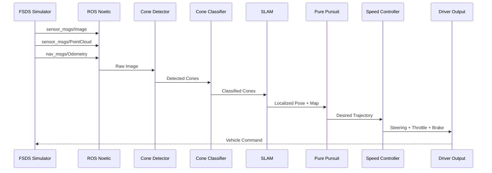
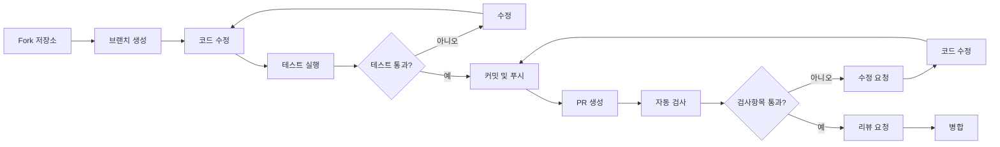

# HYCU FSDS Autonomous Driving / HYCU FSDS 자율주행

> Formula Student Driverless Simulator 기반 자율주행 시스템  
> Formula Student Driverless Simulator (FSDS) Based Autonomous Driving System

[](LICENSE)
[](http://wiki.ros.org/noetic)
[](https://www.python.org/)
[](https://www.docker.com/)
[](https://github.com/qws941/HYCU-FSDS/actions)

---

## 목차 (Table of Contents)

- [개요 (Overview)](#개요-overview)
- [주요 기능 (Key Features)](#주요-기능-key-features)
- [시스템 아키텍처 (System Architecture)](#시스템-아키텍처-system-architecture)
- [자동화 인벤토리 (Automation Inventory)](#자동화-인벤토리-automation-inventory)
- [빠른 시작 (Quick Start)](#빠른-시작-quick-start)
- [로컬 개발 (Local Development)](#로컬-개발-local-development)
- [명령어 참고서 (Commands Reference)](#명령어-참고서-commands-reference)
- [기여 가이드 (Contribution Guide)](#기여-가이드-contribution-guide)

---

## 개요 (Overview)

본 프로젝트는 **Formula Student Driverless Simulator (FSDS)** 기반으로 개발된 자율주행 시스템입니다. Windows 환경의 시뮬레이터와 Linux (ROS Noetic) Docker 기반 자율주행 스택을 결합한 이중 플랫폼 아키텍처로, 콘 감지 (Cone Detection), SLAM, 경로 계획 및 제어 기능을 통합합니다.

This project is an autonomous driving system based on the **Formula Student Driverless Simulator (FSDS)**. It combines a Windows-based simulator with a Linux (ROS Noetic) Docker-based autonomous driving stack, integrating cone detection, SLAM, path planning, and control functions.

### 프로젝트 배경 (Project Background)

본 프로젝트는 자율주행 알고리즘 연구 및 경진 대회 준비를 위해 구축되었으며, 다음 목표를 달성합니다:

- FSDS 시뮬레이터 환경에서의 실시간 자율주행 구현
- ROS Noetic 기반의 모듈화된 자율주행 스택 제공
- Cone Detection 및 SLAM을 통한 환경 인식 능력 확보
- Pure Pursuit 및 속도 제어를 통한 경로 추종 성능 확보

This project was established for autonomous driving algorithm research and competition preparation, achieving the following objectives:

- Real-time autonomous driving in FSDS simulator environment
- Modular autonomous driving stack based on ROS Noetic
- Environment perception through cone detection and SLAM
- Path following performance through Pure Pursuit and speed control

---

## 주요 기능 (Key Features)

### 자율주행 핵심 모듈 (Autonomous Driving Core Modules)

| 모듈 (Module) | 설명 (Description) |
|---------------|---------------------|
| **Cone Detection** | 시뮬레이터에서 콘 감지 및 분류 (Cone detection and classification) |
| **SLAM** | 실시간 위치 추정 및 지도 구축 (Real-time localization and mapping) |
| **Path Planning** | 경로 계획 및 최적화 (Path planning and optimization) |
| **Pure Pursuit** | 경로 추종 제어 알고리즘 (Path tracking control algorithm) |
| **Speed Control** | 속도 프로파일 관리 및 제어 (Speed profile management and control) |

### 개발 환경 (Development Environment)

- **ROS Noetic**: 로봇 운영 체제
- **Python 3.8+**: 주요 개발 언어
- **Docker**: 컨테이너화된 실행 환경
- **FSDS**: 시뮬레이션 플랫폼

---

## 시스템 아키텍처 (System Architecture)

### 전체 시스템 흐름 (Overall System Flow)

```mermaid
flowchart TB
    subgraph SIM["🖥️ FSDS Simulator (Windows)"]
        direction TB
        SIM_CAM["카메라 센서<br/>Camera Sensor"]
        SIM_LIDAR["라이다 센서<br/>LIDAR Sensor"]
        SIM_STATE["차량 상태<br/>Vehicle State"]
    end

    subgraph STACK["🐳 Docker Stack (Linux/ROS)"]
        direction TB
        PERCEPTION["👁️ Perception Layer"]
        CONTROL["🎮 Control Layer"]
        DRIVERS["🔧 Drivers"]

        PERCEPTION -->|"토픽/IMAGE|POINT|ODOM|", CONTROL
        CONTROL -->|"토픽/CMD|ACK|", DRIVERS
    end

    subgraph AUTO["🤖 Autonomous Driving"]
        direction TB
        CONE_DET["Cone Detector"]
        CONE_CLS["Cone Classifier"]
        SLAM["SLAM Module"]
        PP["Pure Pursuit"]
        SPEED["Speed Controller"]

        CONE_DET --> CONE_CLS
        CONE_CLS --> SLAM
        SLAM --> PP
        PP --> SPEED
    end

    subgraph V2X["📡 V2X Communication"]
        direction TB
        RSU["RSU Module<br/>&lt;homelab-host&gt;:8317"]
        PROXY["CLIProxy API<br/>cliproxy.jclee.me/v1"]
    end

    SIM_CAM -->|" IMAGE|", PERCEPTION
    SIM_LIDAR -->|" POINT|", PERCEPTION
    SIM_STATE -->|" ODOM|", PERCEPTION

    PERCEPTION --> AUTO
    AUTO --> CONTROL
    CONTROL --> DRIVERS

    DRIVERS -->|"명령|", SIM_STATE

    RSU -->|"V2X|", AUTO
    PROXY -->|"원격監視|", V2X
```

### 데이터 흐름 (Data Flow)



### 디렉토리 구조 (Directory Structure)

```
HYCU-FSDS/
├── README.md                    # 본 문서 (This file)
├── LICENSE                      # MIT 라이선스
├── AGENTS.md                    # AI 에이전트용 프로젝트 지식 베이스
├── CONTRIBUTING.md              # 기여 가이드
├── OWNERS                       # 코드 소유자 정의
├── in-memoria.db                # 내부 데이터베이스 (로컬 개발용)
│
├── submission/                  # 제출용 패키지
│   ├── src/                    # 소스 코드
│   │   ├── perception/         # 인식 모듈 (cone_detector, cone_classifier, slam)
│   │   ├── control/            # 제어 모듈 (pure_pursuit, speed)
│   │   ├── drivers/            # 드라이버 (basic, autonomous, competition, advanced)
│   │   └── utils/              # 유틸리티 (lap_timer, watchdog)
│   ├── config/                 # 설정 파일 (driver_params.yaml)
│   ├── tests/                  # 단위 테스트
│   ├── launch/                 # ROS 런치 파일
│   ├── scripts/                # 실행 스크립트
│   └── docs/                   # 문서 (ARCHITECTURE.md)
│
├── autonomous/                  # 완전한 자율주행 스택 (Docker 독립 실행)
│   ├── modules/                # 핵심 모듈
│   │   ├── perception/         # 인식 (cone_detector, cone_classifier, slam)
│   │   ├── control/            # 제어 (pure_pursuit, speed)
│   │   └── utils/              # 유틸리티 (lap_timer, watchdog)
│   ├── driver/                 # 드라이버 모듈
│   ├── config/                 # 설정 (params.yaml)
│   ├── tests/                  # 테스트
│   ├── Dockerfile              # Docker 이미지 정의
│   ├── docker-compose.yml      # Docker 컴포즈 설정
│   ├── entrypoint.sh           # 컨테이너 진입점
│   ├── start.sh                # 실행 스크립트
│   └── run_all.sh              # 전체 실행 스크립트
│
├── _bot-scripts/                # GitHub 자동화 봇 스크립트
│   ├── scripts/                # 자동화 스크립트
│   ├── workflows/              # (내부 사용, 공개 X)
│   ├── requirements.txt        # Python 의존성
│   ├── requirements-dev.txt    # 개발 의존성
│   ├── pyproject.toml          # 프로젝트 설정
│   └── Makefile                # 빌드 자동화
│
└── .github/                    # GitHub 설정 ( workflows/, issue templates )
    ├── workflows/              # CI/CD 워크플로우 (33개)
    ├── ISSUE_TEMPLATE/         # 이슈 템플릿
    └── config/                 # 추가 설정
```

---

## 자동화 인벤토리 (Automation Inventory)

본 프로젝트는 GitHub Actions 기반의 포괄적인 CI/CD 자동화 시스템을 갖추고 있습니다.

### CI/CD 워크플로우 (CI/CD Workflows)

#### 코드 품질 및 보안 (Code Quality & Security)

| 워크플로우 파일 | 설명 | 주요 도구 |
|----------------|-------|----------|
| `03_pr-checks.yml` | PR 기본 검사항목 (린트, 테스트) | Ruff, Pytest |
| `04_actionlint.yml` | GitHub Actions 워크플로우 문법 검증 | actionlint |
| `05_gitleaks.yml` | 비밀키/토큰 스캔 | gitleaks |
| `06_codeql.yml` | 정적 분석 | CodeQL |
| `07_dependency-review.yml` | 의존성 보안 검토 | dependency-review |
| `08_scorecard.yml` | OpenSSF 보안 점수 | scorecard |
| `44_reusable-pr-checks.yml` | 재사용 가능한 PR 검사 (워크플로우 호출) | Ruff, Pytest |
| `45_reusable-gitleaks.yml` | 재사용 가능한 비밀 스캔 (워크플로우 호출) | gitleaks |

#### PR 관리 및 병합 (PR Management & Merge)

| 워크플로우 파일 | 설명 | 주요 도구 |
|----------------|-------|----------|
| `09_semantic-pr.yml` | Semantic PR 커밋 검증 | semantic-pull-request |
| `10_pr-review.yml` | 자동 PR 리뷰 (AI) | qodo-ai/pr-agent |
| `13_pr-auto-merge.yml` | 자동 병합 (레이블 기반) | mergify |
| `14_bot-auto-fix.yml` | 봇 자동 수정 실행 | CLIProxyAPI |
| `15_merged-pr-cleanup.yml` | 병합 후 정리 (브랜치 삭제) | GitHub CLI |
| `security/11_pr-review.yml` | 보안 관련 PR 리뷰 | qodo-ai/pr-agent |
| `12_dependabot-auto-merge.yml` | Dependabot 자동 병합 | dependabot-action |
| `01_branch-to-pr.yml` | 브랜치→PR 자동 전환 | gh CLI |

#### 이슈 관리 (Issue Management)

| 워크플로우 파일 | 설명 | 주요 도구 |
|----------------|-------|----------|
| `02_issue-to-branch.yml` | 이슈→브랜치 자동 생성 | gh CLI |
| `18_issue-management.yml` | 이슈 수명 주기 관리 | GitHub Actions |
| `19_issue-backfill.yml` | 이슈 백필 (대량 생성) | CLIProxyAPI |
| `91_issue-classification.yml` | 이슈 자동 분류 (레이블) | qodo-ai/pr-agent |
| `43_reusable-issue-management.yml` | 재사용 가능한 이슈 관리 (워크플로우 호출) | GitHub Actions |
| `37_ci-failure-issues.yml` | CI 실패 시 자동 이슈 생성 | gh CLI |

#### 문서 및 정보同期 (Documentation & Sync)

| 워크플로우 파일 | 설명 | 주요 도구 |
|----------------|-------|----------|
| `20_readme-gen.yml` | README 자동 생성 | CLIProxyAPI |
| `21_docs-sync.yml` | 문서同期 (위키/콘텐츠) | git |
| `42_reusable-docs-sync.yml` | 재사용 가능한 문서同期 (워크플로우 호출) | git |

#### 릴리스 및 배포 (Release & Deploy)

| 워크플로우 파일 | 설명 | 주요 도구 |
|----------------|-------|----------|
| `24_release-notes.yml` | 자동 릴리스 노트 생성 | release-drafter |
| `25_release-publish.yml` | 릴리스 게시 및 배포 | gh CLI |
| `29_downstream-health-check.yml` | 다운스트림 리포지토리 상태 확인 | health check |
| `60_ci-auto-heal.yml` | CI 자동 복구 (재시도/복원) | GitHub Actions |

#### 환영 인사 및 초기화 (Welcome & Onboarding)

| 워크플로우 파일 | 설명 | 주요 도구 |
|----------------|-------|----------|
| `welcome.yml` | 신규 기여자 환영 인사 | welcome-bot |
| `labeler.yml` | 자동 라벨링 | labeler-action |

#### 지속적 통합 (Continuous Integration)

| 워크플로우 파일 | 설명 | 주요 도구 |
|----------------|-------|----------|
| `ci.yml` | 통합 CI 파이프라인 | GitHub Actions |
| `auto-merge.yml` | 자동 병합 인프라 | mergify |

### 자동화 도구 (Automation Tools)

#### Python 기반 도구 (Python-based Tools)

| 도구 | 용도 | 참조 |
|------|------|------|
| **CLIProxyAPI** | GitHub 봇 API (CLIProxy 기반 원격 호출) | cliproxy.jclee.me/v1 |
| **pr-agent** | AI 기반 PR 리뷰 및 분석 | qodo-ai/pr-agent |
| **gitleaks** | 비밀 정보 스캐닝 | gitleaks-gha |
| **CodeQL** | 코드 정적 분석 | github/codeql-action |
| **scorecard** | 보안 평가 | ossf/scorecard-action |

#### GitHub 기본 기능 (GitHub Built-in)

| 도구 | 용도 |
|------|------|
| **Dependabot** | 의존성 자동 업데이트 |
| **Actions** | CI/CD 파이프라인 |
| **Pages** | 문서 호스팅 |
| **Environments** | 배포 환경 관리 |

### 재사용 가능한 워크플로우 (Reusable Workflows)

`securefigs/github-actions` 인프라를 통한 공통 워크플로우 (Workflow Templates):

```text
_workflow_call 지원:
├── _auto-approve-runs.yml       # 실행 자동 승인
├── _auto-merge.yml              # 자동 병합
├── _branch-cleanup.yml          # 브랜치 정리
├── _ci-notify-failure.yml       # 실패 알림
├── _codex-pr-review.yml         # PR 리뷰
├── _codex-auto-issue.yml        # 자동 이슈
├── _dependabot-auto-fix.yml     # Dependabot 수정
├── _stale.yml                   # 오래된 이슈 정리
├── _release-drafter.yml         # 릴리스 노트
└── _elk-ingest.yml              # ELK 로그 수집
```

---

## 빠른 시작 (Quick Start)

### 전제 조건 (Prerequisites)

- **OS**: Linux (Ubuntu 20.04+), macOS, 또는 Windows (WSL2)
- **Docker**: 20.10+
- **Docker Compose**: 1.29+
- **Python**: 3.8+
- **ROS Noetic**: 시뮬레이션 실행 시

### Docker를 통한 빠른 실행 (Quick Run with Docker)

```bash
# 1. 저장소 복제
git clone https://github.com/qws941/HYCU-FSDS.git
cd HYCU-FSDS

# 2. 완전한 자율주행 스택 실행
cd autonomous
docker-compose up --build

# 3. 또는 제출용 패키지 실행
cd submission
docker-compose up --build
```

### 로컬 개발 환경 설정 (Local Development Setup)

```bash
# 1. 저장소 복제
git clone https://github.com/qws941/HYCU-FSDS.git
cd HYCU-FSDS

# 2. Python 가상환경 생성
python3 -m venv venv
source venv/bin/activate  # Linux/macOS
# venv\Scripts\activate   # Windows

# 3. 의존성 설치
pip install -r _bot-scripts/requirements.txt

# 4. 단위 테스트 실행
cd submission
pytest tests/ -v
```

### ROS Noetic 설치 (ROS Noetic Installation)

```bash
# 1. ROS Noetic 설치
sudo sh -c 'echo "deb http://packages.ros.org/ros/ubuntu focal main" > /etc/apt/sources.list.d/ros-latest.list'
curl -s https://raw.githubusercontent.com/ros/rosdistro/master/ros.asc | sudo apt-key add -
sudo apt update
sudo apt install ros-noetic-desktop-full

# 2. 워크스페이스 초기화
source /opt/ros/noetic/setup.bash
mkdir -p ~/catkin_ws/src
cd ~/catkin_ws/src
catkin_init_workspace

# 3. 프로젝트 빌드
cd ~/catkin_ws
catkin build
source devel/setup.bash
```

---

## 로컬 개발 (Local Development)

### 모듈 구조 설명 (Module Structure)

#### 인식 모듈 (Perception Modules)

| 모듈 | 경로 | 설명 |
|------|------|------|
| `ConeDetector` | `src/perception/cone_detector.py` | 시뮬레이터 이미지에서 콘 bounding box 검출 |
| `ConeClassifier` | `src/perception/cone_classifier.py` | 검출된 콘을 색상/형태로 분류 |
| `SLAM` | `src/perception/slam.py` | EKF 기반 실시간 위치 추정 및 지도 구축 |

#### 제어 모듈 (Control Modules)

| 모듈 | 경로 | 설명 |
|------|------|------|
| `PurePursuit` | `src/control/pure_pursuit.py` | 경로 추종용 Pure Pursuit 알고리즘 |
| `SpeedController` | `src/control/speed.py` | 속도 프로파일 생성 및 추종 |

#### 드라이버 모듈 (Driver Modules)

| 모듈 | 경로 | 설명 |
|------|------|------|
| `BasicDriver` | `src/drivers/basic.py` | 기본 원격 조작 드라이버 |
| `AutonomousDriver` | `src/drivers/autonomous.py` | 자율주행 주 모드 |
| `CompetitionDriver` | `src/drivers/competition.py` | 경진 대회용 드라이버 |
| `AdvancedDriver` | `src/drivers/advanced.py` | 고급 기능 (V2X 등) |

### 테스트 실행 (Running Tests)

```bash
# 전체 테스트
cd submission
pytest tests/ -v

# 특정 테스트
pytest tests/test_algorithms.py -v

# 커버리지 포함
pytest tests/ --cov=src --cov-report=html
```

### Docker 개발 워크플로우 (Docker Development Workflow)

```bash
# 1. 개발용 컨테이너 실행
cd autonomous
docker-compose -f docker-compose.yml run --rm dev

# 2. 코드 수정 후 이미지만 다시 빌드
docker-compose build module_name

# 3. 전체 스택 재시작
docker-compose down && docker-compose up --build
```

---

## 명령어 참고서 (Commands Reference)

### Docker 명령어 (Docker Commands)

```bash
# 이미지 빌드
docker build -t hycu-fsds:autonomous -f autonomous/Dockerfile .

# 컨테이너 실행
docker run -it --rm \
  --network host \
  -v $(pwd)/config:/app/config \
  hycu-fsds:autonomous

# Docker Compose 전체 스택
cd autonomous
docker-compose up -d
docker-compose logs -f
docker-compose down

# 제출용 패키지
cd submission
docker-compose up -d
```

### Python 명령어 (Python Commands)

```bash
# 의존성 설치
pip install -r _bot-scripts/requirements.txt
pip install -r _bot-scripts/requirements-dev.txt

# 단위 테스트
cd submission
python -m pytest tests/ -v

# 모듈 실행
cd submission
python scripts/competition_driver.py
python scripts/fsds_driver.py
python scripts/advanced_driver.py
python scripts/simple_slam.py

# 린트
ruff check src/
ruff format src/

# 타입 체크
mypy src/
```

### ROS 명령어 (ROS Commands)

```bash
# ROScore 실행
roscore

# 런치 파일 실행
cd submission
roslaunch launch/competition.launch

# 토픽 목록
rostopic list

# 토픽 발행
rostopic pub /cmd_vel geometry_msgs/Twist "linear: {x: 1.0}" --once

# 토픽 구독
rostopic echo /odom
```

### GitHub Actions locally 테스트 (Act CLI)

```bash
# 로컬에서 워크플로우 실행
act -l                    # 사용 가능한 작업 목록
act -W .github/workflows/03_pr-checks.yml  # 특정 워크플로우 실행
act --container-architecture linux/amd64    # 아키텍처 지정
```

---

## 기여 가이드 (Contribution Guide)

### 이슈 보고 (Reporting Issues)

1. **버그 리포트**: `Bug Report` 이슈 템플릿 사용
2. **기능 요청**: `Feature Request` 이슈 템플릿 사용
3. **질문**: `Question` 이슈 템플릿 사용

### Pull Request 과정 (Pull Request Process)



### 코딩 규칙 (Coding Standards)

- **Python**: PEP 8 규칙 준수, `ruff`로린트 실행
- **커밋 메시지**: Conventional Commits 형식 (`feat:`, `fix:`, `docs:`, etc.)
- **테스트**: 새로운 기능에 대한 단위 테스트 필수
- **문서화**: 공개 API는 docstring 작성

### 开发自动化脚本 (_bot-scripts/)

자동화 봇 스크립트 개발 시:

```bash
# 봇 스크립트 테스트
cd _bot-scripts
python -m pytest scripts/ -v

# 스캔 패턴 테스트
python scripts/check_hardcode_scan_patterns_test.py

# 린트
ruff check scripts/
```

### 라이선스 (License)

본 프로젝트는 MIT 라이선스 하에 제공됩니다. 자세한 내용은 [LICENSE](LICENSE) 파일을 참조하세요.

This project is provided under the MIT License. See the [LICENSE](LICENSE) file for details.

---

## 지원 (Support)

- **이슈**: [GitHub Issues](https://github.com/qws941/HYCU-FSDS/issues)
- **토론**: [GitHub Discussions](https://github.com/qws941/HYCU-FSDS/discussions)
- **문서**: [ARCHITECTURE.md](submission/docs/ARCHITECTURE.md)

---

<div align="center">

**HYCU FSDS Autonomous Driving Team**

*Built with ROS Noetic + Docker + FSDS*

</div>
