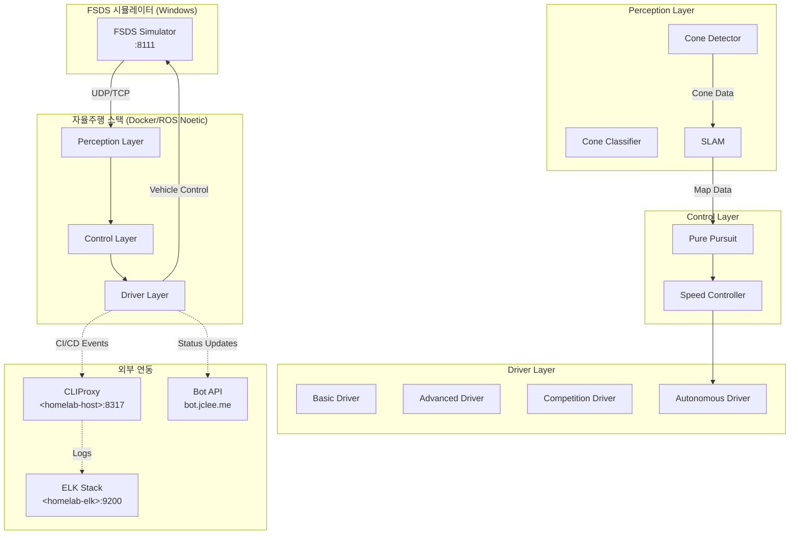

# HYCU FSDS Autonomous Driving / HYCU FSDS 자율주행

> Formula Student Driverless Simulator 기반 자율주행 시스템  
> Formula Student Driverless Simulator (FSDS) Based Autonomous Driving System

[](LICENSE)
[](http://wiki.ros.org/noetic)
[](https://www.python.org/)
[](https://www.docker.com/)
[](https://github.com/qws941/HYCU-FSDS/actions)
[](https://github.com/qodo-ai/pr-agent)

---

## 목차 (Table of Contents)

- [개요 (Overview)](#개요-overview)
- [주요 기능 (Key Features)](#주요-기능-key-features)
- [시스템 아키텍처 (System Architecture)](#시스템-아키텍처-system-architecture)
- [자동화 인벤토리 (Automation Inventory)](#자동화-인벤토리-automation-inventory)
- [빠른 시작 (Quick Start)](#빠른-시작-quick-start)
- [로컬 개발 (Local Development)](#로컬-개발-local-development)
- [명령어 참고서 (Commands Reference)](#명령어-참고서-commands-reference)
- [기여 가이드 (Contribution Guide)](#기여-가이드-contribution-guide)

---

## 개요 (Overview)

본 프로젝트는 **Formula Student Driverless Simulator (FSDS)** 기반으로 개발된 자율주행 시스템입니다. Windows 환경의 시뮬레이터와 Linux (ROS Noetic) Docker 기반 자율주행 스택을 결합한 이중 플랫폼 아키텍처로, 콘 감지 (Cone Detection), SLAM, 경로 계획 및 제어 기능을 통합합니다.

This project is an autonomous driving system based on the **Formula Student Driverless Simulator (FSDS)**. It combines a Windows-based simulator with a Linux (ROS Noetic) Docker-based autonomous driving stack, integrating cone detection, SLAM, path planning, and control functions.

### 프로젝트 배경 (Project Background)

본 프로젝트는 자율주행 알고리즘 연구 및 경진 대회 준비를 위해 구축되었으며, 다음 목표를 달성합니다:

- FSDS 시뮬레이터 환경에서의 실시간 자율주행 구현
- ROS Noetic 기반의 모듈화된 자율주행 스택 제공
- Cone Detection 및 SLAM을 통한 환경 인식 능력 확보
- Pure Pursuit 및 속도 제어를 통한 경로 추종 성능 확보

This project was built for autonomous driving algorithm research and competition preparation, achieving the following goals:

- Real-time autonomous driving in FSDS simulator environment
- Modular autonomous driving stack based on ROS Noetic
- Environmental perception via Cone Detection and SLAM
- Path tracking performance via Pure Pursuit and speed control

---

## 주요 기능 (Key Features)

### 자율주행 모듈 (Autonomous Driving Modules)

| 모듈 (Module) | 설명 (Description) |
|---|---|
| **Cone Detection** | 시뮬레이터에서 콘 위치 감지 및 분류 |
| **SLAM** | 동시Localisation 및 매핑을 통한 환경 인식 |
| **Path Planning** | 감지된 콘 기반 경로 계획 |
| **Pure Pursuit** | 차량의 경로 추종 제어 |
| **Speed Control** | 속도 프로파일 관리 및 제어 |

### 개발 환경 (Development Environment)

- **ROS Noetic**: 로봇 운영 체제
- **Python 3.8+**: 주요 개발 언어
- **Docker**: 컨테이너화된 개발 및 배포
- **FSDS Simulator**: Windows 기반 시뮬레이터 연동

---

## 시스템 아키텍처 (System Architecture)



### 데이터 흐름 (Data Flow)

1. **시뮬레이터 → Perception**: FSDS 시뮬레이터로부터 콘 위치 데이터를 수신
2. **Perception → SLAM**: 감지된 콘 데이터를 기반으로 환경 지도 생성
3. **SLAM → Control**: 지도 기반 경로 계획 및 Pure Pursuit 제어
4. **Control → Driver**: 속도 및 조향 명령을 차량에 전달
5. **Driver → Simulator**: 제어 명령을 시뮬레이터에 반영

---

## 자동화 인벤토리 (Automation Inventory)

### GitHub Actions 워크플로우 (GitHub Actions Workflows)

#### CI/CD 워크플로우

| 워크플로우 파일 | 설명 |
|---|---|
| `01_branch-to-pr.yml` | 브랜치 생성 시 자동으로 PR 연결 |
| `03_pr-checks.yml` | PR 검증 파이프라인 |
| `04_actionlint.yml` | 워크플로우 YAML 정적 분석 |
| `05_gitleaks.yml` | 시크릿 및 하드코딩된 Credentials 스캔 |
| `06_codeql.yml` | CodeQL 정적 분석 |
| `07_dependency-review.yml` | 의존성 보안 검토 |
| `08_scorecard.yml` | 보안 점수 산정 |
| `44_reusable-pr-checks.yml` | 재사용 가능한 PR 검증 워크플로우 |
| `45_reusable-gitleaks.yml` | 재사용 가능한 Gitleaks 워크플로우 |
| `60_ci-auto-heal.yml` | CI 실패 자동 복구 |

#### PR 및 머지 워크플로우

| 워크플로우 파일 | 설명 |
|---|---|
| `09_semantic-pr.yml` | Semantic PR 커밋 규칙 검증 |
| `10_pr-review.yml` | 자동 PR 리뷰 (pr-agent) |
| `13_pr-auto-merge.yml` | 자동 PR 머지 |
| `14_bot-auto-fix.yml` | 봇 의한 자동 수정 |
| `15_merged-pr-cleanup.yml` | 머지 후 브랜치 정리 |
| `12_dependabot-auto-merge.yml` | Dependabot 업데이트 자동 머지 |
| `security/11_pr-review.yml` | 보안 관련 PR 리뷰 |

#### 이슈 및 릴리스 워크플로우

| 워크플로우 파일 | 설명 |
|---|---|
| `02_issue-to-branch.yml` | 이슈 기반 브랜치 생성 |
| `18_issue-management.yml` | 이슈 수명 주기 관리 |
| `19_issue-backfill.yml` | 이슈 데이터 백필 |
| `37_ci-failure-issues.yml` | CI 실패 시 자동 이슈 생성 |
| `91_issue-classification.yml` | 이슈 자동 분류/라벨링 |
| `43_reusable-issue-management.yml` | 재사용 가능한 이슈 관리 |

#### 문서 및 동기화 워크플로우

| 워크플로우 파일 | 설명 |
|---|---|
| `20_readme-gen.yml` | README 자동 생성 |
| `21_docs-sync.yml` | 문서 동기화 |
| `42_reusable-docs-sync.yml` | 재사용 가능한 문서 동기화 |

#### 릴리스 워크플로우

| 워크플로우 파일 | 설명 |
|---|---|
| `24_release-notes.yml` | Release Notes 자동 생성 |
| `25_release-publish.yml` | 릴리스 게시 |

#### 기타 워크플로우

| 워크플로우 파일 | 설명 |
|---|---|
| `29_downstream-health-check.yml` | 하위 프로젝트 상태 확인 |
| `auto-merge.yml` | 자동 머지 설정 |
| `ci.yml` | 주요 CI 파이프라인 |
| `labeler.yml` | PR 라벨 자동 부여 |
| `welcome.yml` | 신규 기여자 환영 |

### 자동화 도구 (Automation Tools)

| 도구 | 용도 |
|---|---|
| **pr-agent** (qodo-ai) | 자동 PR 리뷰 및 분석 |
| **CLIProxy** (cliproxy.jclee.me) | CI/CD 이벤트 수집 및 알림 |
| **Bot API** (bot.jclee.me) | 자동화 봇 엔드포인트 |
| **Gitleaks** | 시크릿 스캐닝 |
| **CodeQL** | 코드 정적 분석 |
| **Actionlint** | 워크플로우 검증 |
| **Dependabot** | 의존성 업데이트 |
| **Scorecard** | 보안 점수 평가 |

---

## 빠른 시작 (Quick Start)

### 전제 조건 (Prerequisites)

- Docker 20.10+
- Docker Compose 1.29+
- Python 3.8+
- ROS Noetic (Linux 환경)
- FSDS 시뮬레이터 (Windows)

### Docker 기반 실행

```bash
# 저장소 복제
git clone https://github.com/qws941/HYCU-FSDS.git
cd HYCU-FSDS

# Docker 이미지 빌드
docker-compose -f submission/docker-compose.yml build

# 자율주행 스택 실행
docker-compose -f submission/docker-compose.yml up
```

### 시뮬레이터 연동

1. Windows 환경에서 FSDS 시뮬레이터 실행
2. 시뮬레이터 IP 및 포트 구성 확인 (기본: `localhost:8111`)
3. Docker 컨테이너와 시뮬레이터 간 통신 설정

---

## 로컬 개발 (Local Development)

### 개발 환경 설정

```bash
# Python 의존성 설치
pip install -r requirements.txt

# ROS 환경 설정 (Linux)
source /opt/ros/noetic/setup.bash

# 개발 테스트 실행
pytest tests/
```

### 모듈별 개발

```bash
# Cone Detector 개발
python -m perception.cone_detector

# SLAM 모듈 개발
python scripts/simple_slam.py

# Driver 테스트
python scripts/fsds_driver.py
```

### Docker 환경에서 개발

```bash
# 개발용 Docker 컨테이너 실행
docker-compose -f submission/docker-compose.yml run --rm dev

# 컨테이너 내부에서 테스트
pytest tests/test_algorithms.py
```

---

## 명령어 참고서 (Commands Reference)

### Docker 명령어

```bash
# 전체 스택 실행
docker-compose -f submission/docker-compose.yml up

# 특정 서비스만 실행
docker-compose -f submission/docker-compose.yml up perception

# 로그 확인
docker-compose -f submission/docker-compose.yml logs -f

# 컨테이너 중지
docker-compose -f submission/docker-compose.yml down

# 이미지 빌드 (캐시 없이)
docker-compose -f submission/docker-compose.yml build --no-cache
```

### Python 명령어

```bash
# 모듈 테스트
python -m pytest tests/test_algorithms.py -v

# Cone Classifier 테스트
python -m perception.cone_classifier --test

# SLAM 실행
python scripts/simple_slam.py --config config/driver_params.yaml

# Competition Driver 실행
python scripts/competition_driver.py --mode race
```

### CI/CD 명령어

```bash
# 로컬에서 workflow 테스트 (act 사용)
act -W .github/workflows/03_pr-checks.yml

# 특정 워크플로우 수동 실행
gh workflow run 03_pr-checks.yml --ref feature/my-branch
```

---

## 프로젝트 구조 (Project Structure)

```text
HYCU-FSDS/
├── README.md                    # 본 문서
├── LICENSE                      # MIT 라이선스
├── AGENTS.md                    # 자동화 인벤토리 문서
├── CONTRIBUTING.md              # 기여 가이드
├── OWNERS                       # 프로젝트 소유자
├── in-memoria.db                # 로컬 데이터베이스 (gitignore)
│
├── submission/                  # 제출용 자율주행 스택
│   ├── README.md
│   ├── Dockerfile
│   ├── docker-compose.yml
│   ├── dev.sh                  # 개발 스크립트
│   ├── run.sh                  # 실행 스크립트
│   │
│   ├── docs/
│   │   └── ARCHITECTURE.md     # 아키텍처 문서
│   │
│   ├── src/                    # 소스 코드
│   │   ├── __init__.py
│   │   ├── utils/
│   │   │   ├── __init__.py
│   │   │   ├── lap_timer.py
│   │   │   └── watchdog.py
│   │   ├── drivers/
│   │   │   ├── __init__.py
│   │   │   ├── advanced.py
│   │   │   ├── autonomous.py
│   │   │   ├── basic.py
│   │   │   └── competition.py
│   │   ├── control/
│   │   │   ├── __init__.py
│   │   │   ├── pure_pursuit.py
│   │   │   └── speed.py
│   │   ├── perception/
│   │   │   ├── __init__.py
│   │   │   ├── cone_classifier.py
│   │   │   ├── cone_detector.py
│   │   │   └── slam.py
│   │   └── v2x/
│   │       ├── __init__.py
│   │       └── rsu.py
│   │
│   ├── config/
│   │   └── driver_params.yaml  # 드라이버 파라미터
│   │
│   ├── tests/
│   │   └── test_algorithms.py   # 단위 테스트
│   │
│   ├── launch/
│   │   └── competition.launch  # ROS 런치 파일
│   │
│   └── scripts/
│       ├── advanced_driver.py
│       ├── competition_driver.py
│       ├── fsds_driver.py
│       └── simple_slam.py
│
├── autonomous/                  # 완전 자율주행 Docker 스택
│   ├── README.md
│   ├── Dockerfile
│   ├── docker-compose.yml
│   ├── entrypoint.sh
│   ├── run_all.sh
│   ├── start.sh
│   │
│   ├── modules/
│   │   ├── __init__.py
│   │   ├── utils/
│   │   │   ├── __init__.py
│   │   │   ├── lap_timer.py
│   │   │   └── watchdog.py
│   │   ├── control/
│   │   │   ├── __init__.py
│   │   │   ├── pure_pursuit.py
│   │   │   └── speed.py
│   │   └── perception/
│   │       ├── __init__.py
│   │       ├── cone_classifier.py
│   │       ├── cone_detector.py
│   │       └── slam.py
│   │
│   ├── config/
│   │   └── params.yaml
│   │
│   ├── tests/
│   │   └── test_algorithms.py
│   │
│   └── driver/
│       └── competition_driver.py
│
└── .github/
    ├── workflows/              # GitHub Actions 워크플로우
    │   ├── 01_branch-to-pr.yml
    │   ├── 02_issue-to-branch.yml
    │   ├── 03_pr-checks.yml
    │   ├── 04_actionlint.yml
    │   ├── 05_gitleaks.yml
    │   ├── 06_codeql.yml
    │   ├── 07_dependency-review.yml
    │   ├── 08_scorecard.yml
    │   ├── 09_semantic-pr.yml
    │   ├── 10_pr-review.yml
    │   ├── 12_dependabot-auto-merge.yml
    │   ├── 13_pr-auto-merge.yml
    │   ├── 14_bot-auto-fix.yml
    │   ├── 15_merged-pr-cleanup.yml
    │   ├── 18_issue-management.yml
    │   ├── 19_issue-backfill.yml
    │   ├── 20_readme-gen.yml
    │   ├── 21_docs-sync.yml
    │   ├── 24_release-notes.yml
    │   ├── 25_release-publish.yml
    │   ├── 29_downstream-health-check.yml
    │   ├── 37_ci-failure-issues.yml
    │   ├── 42_reusable-docs-sync.yml
    │   ├── 43_reusable-issue-management.yml
    │   ├── 44_reusable-pr-checks.yml
    │   ├── 45_reusable-gitleaks.yml
    │   ├── 60_ci-auto-heal.yml
    │   ├── 91_issue-classification.yml
    │   ├── auto-merge.yml
    │   ├── ci.yml
    │   ├── labeler.yml
    │   ├── welcome.yml
    │   └── security/
    │       └── 11_pr-review.yml
    │
    ├── ISSUE_TEMPLATE/
    ├── PULL_REQUEST_TEMPLATE/
    └── labels.yml
```

---

## 기여 가이드 (Contribution Guide)

### 버그 보고 및 기능 요청

버그를 발견하거나 기능 요청이 있으시면 GitHub Issues를 이용해주세요. 버그 보고 시 다음 정보를 포함해주시면 감사하겠습니다:

- 재현 단계 (Steps to Reproduce)
- 예상 결과 (Expected Result)
- 실제 결과 (Actual Result)
- 환경 정보 (Environment Information)

### 코드 기여

1. **Fork** 저장소를 생성합니다
2. **Feature Branch**를 생성합니다 (`git checkout -b feature/amazing-feature`)
3. 변경 사항을 **Commit**합니다 (`git commit -m 'Add amazing feature'`)
4. **Push**합니다 (`git push origin feature/amazing-feature`)
5. **Pull Request**를 생성합니다

### 커밋 메시지 규칙

본 프로젝트는 **Semantic PR** 규칙을 따릅니다:

```
<type>(<scope>): <subject>

<body>

<footer>
```

**Allowed Types:**

| Type | 설명 |
|---|---|
| `feat` | 새로운 기능 |
| `fix` | 버그 수정 |
| `docs` | 문서 변경 |
| `style` | 코드 스타일 변경 (기능 영향 없음) |
| `refactor` | 리팩토링 |
| `test` | 테스트 추가/수정 |
| `chore` | 빌드, 도구, 라이브러리 변경 |

### 코드 스타일

- **Python**: PEP 8 규칙 준수
- **Type Hints**: 모든 함수에 타입 힌트 권장
- **Docstrings**: 공용 함수/클래스에 Docstring 필수
- **Tests**: 새로운 기능에는 단위 테스트 작성 권장

### Pull Request 검토

모든 PR은 다음 과정을 거칩니다:

1. **CI Checks** - 모든 자동화 검증 통과
2. **Code Review** - 최소 1명 이상의 리뷰어 승인
3. **Semantic Validation** - 커밋 메시지 규칙 준수 확인
4. **Auto-Merge** - 조건 충족 시 자동 머지

---

## 라이선스 (License)

이 프로젝트는 MIT 라이선스 하에 배포됩니다. 자세한 내용은 [LICENSE](LICENSE) 파일을 참조하세요.

---

## 연락처 (Contact)

- **프로젝트 URL**: <https://github.com/qws941/HYCU-FSDS>
- **자동화 봇**: <https://bot.jclee.me>
- **CI/CD 프록시**: <https://cliproxy.jclee.me>

---

*이 문서는 자동으로 생성되었습니다. 마지막 업데이트: README-gen model (minimax-m2.7 via CLIProxyAPI)*
