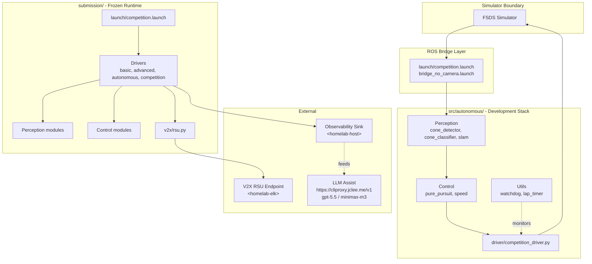

# HYCU FSDS Autonomous Driving / HYCU FSDS 자율주행

> Formula Student Driverless Simulator 기반 자율주행 시스템
> Autonomous driving stack for the Formula Student Driverless Simulator (FSDS)


---

## Overview / 개요

**EN**
HYCU FSDS Autonomous Driving is an autonomous driving project targeting the Formula Student Driverless Simulator (FSDS). It ships Dockerized ROS Noetic components covering the full perception → planning → control → safety loop, plus simulator integration, V2X roadside unit support, lap timing, race recording, and a competition-grade packaging pipeline. The repository is split into two parallel execution paths so the same algorithms can be iterated locally and re-built as a frozen runtime for evaluation.

**KR**
HYCU FSDS Autonomous Driving은 Formula Student Driverless Simulator(FSDS) 환경을 위한 자율주행 프로젝트입니다. 인지(perception) → 계획(planning) → 제어(control) → 안전(safety) 루프를 ROS Noetic 기반 Docker 컴포넌트로 제공하며, 시뮬레이터 연동, V2X RSU 지원, 랩 타이밍, 레이스 레코딩, 대회 제출용 패키징 파이프라인을 함께 제공합니다. 저장소는 동일한 알고리즘을 로컬에서 반복 개발하고, 평가용 동결 런타임(frozen runtime)으로 재빌드할 수 있도록 두 개의 병렬 실행 경로로 구성됩니다.

### Two execution paths / 두 가지 실행 경로

1. **`src/autonomous/`** — Development-oriented stack for algorithm iteration / 알고리즘 반복 개발용 자율주행 스택.
2. **`submission/`** — Frozen runtime stack for competition submission or evaluation / 대회 제출 또는 평가를 위한 동결 실행 스택.

The `submission/` stack re-uses the same perception, control, and utility modules from `src/`, and adds launch orchestration (`launch/competition.launch`), four driver modes (`basic`, `advanced`, `autonomous`, `competition`), V2X roadside unit support (`v2x/rsu.py`), and submission packaging helpers. This guarantees that the algorithm under iteration is byte-identical to the algorithm under evaluation.

---

## Features / 주요 기능

### Perception / 인지
- **Cone detection & classification** — color-aware cone detector plus a neural / classical classifier pipeline (`src/autonomous/modules/perception/`, mirrored in `submission/src/perception/`).
- **SLAM** — simultaneous localization and mapping for track understanding and pose estimation.

### Control & Planning / 제어 및 계획
- **Pure pursuit** — geometric path-following controller.
- **Speed planner** — curvature-aware target speed generator.
- **Lap timer** — split/lap timing module for race recording and analysis.

### Safety / 안전
- **Watchdog** — health and timeout monitor covering the autonomy stack.
- **Driver wrappers** — `basic` / `advanced` / `autonomous` / `competition` modes with progressive risk envelopes.

### Connectivity / 통신
- **V2X / RSU** — roadside unit communication via `submission/src/v2x/rsu.py`, observable to the homelab observability stack at `<homelab-elk>` (placeholder, no hardcoded IPs).

### Tooling / 도구
- **Docker & docker-compose** — reproducible runtime for both stacks.
- **Race harness** — `record_race.sh`, `run_all.sh`, and `scripts/start_race.py` for headless race recording and replay.
- **Package script** — `scripts/package.sh` produces the frozen submission artifact.
- **Tests** — `src/autonomous/tests/test_algorithms.py` covers core algorithms.

### Automation / 자동화
- **14 GitHub Actions workflows** orchestrating CI, PR review, auto-merge, release, and observability.
- **qodo-ai/pr-agent** for non-mutating PR review feedback.
- **jclee-bot** for all mutating repository automation (see [jclee-bot Automation Surfaces](#jclee-bot-automation-surfaces--jclee-bot-자동화-영역)).
- **Self-learning store** — `in-memoria.db` at repository root for race telemetry and post-run learning.

---

## Architecture / 아키텍처

The stack is layered into a simulator boundary, a ROS bridge, two parallel execution paths (development and frozen submission), and an external observability + LLM-assist sink. Perception, control, and utility modules are shared between both paths so dev iteration and frozen evaluation never diverge in algorithm.



### Architecture notes / 아키텍처 노트
- The dev stack lives in `src/autonomous/` and uses `entrypoint.sh` + `start.sh` for iterative bring-up.
- The submission stack lives in `submission/` and exposes a competition-grade `run.sh` + `dev.sh` entry point pair.
- Both stacks persist race telemetry to `in-memoria.db` at repository root for post-race analysis and self-learning.
- No private IPs (RFC1918) or LXC container numbers are hardcoded; resolve them through homelab placeholder variables (`<homelab-host>`, `<homelab-elk>`) at deploy time.
- LLM-assisted authoring flows through the public endpoint `https://cliproxy.jclee.me/v1` with `gpt-5.5` as the primary model and `minimax-m3` as the fallback. The bot control plane is reachable at `https://bot.jclee.me`.

---

## jclee-bot Automation Surfaces / jclee-bot 자동화 영역

**EN**
All mutating repository automation in this project is owned and operated by `jclee-bot`. Workflow files in `.github/workflows/` are the implementation triggers, not the source of truth — the source of truth is jclee-bot's automation contract described below. Non-mutating surfaces (PR review, CI checks) are delegated to specialized tools like `qodo-ai/pr-agent`.

**KR**
이 저장소의 모든 변경(mutating) 자동화는 `jclee-bot`이 소유하고 운영합니다. `.github/workflows/`의 워크플로우 파일은 구현용 트리거이며, 진실의 원천(Source of Truth)은 아래에 설명하는 jclee-bot의 자동화 계약입니다. 비변경(non-mutating) 자동화(PR 리뷰, CI 검사 등)는 `qodo-ai/pr-agent` 등 전문 도구에 위임됩니다.

### Issue automation / 이슈 자동화
- `jclee-bot에의해자동화됨` — When an issue is filed with the appropriate label or template, jclee-bot auto-creates a working branch and opens a draft PR linking back to the issue. This is the canonical **issue-to-branch** surface.
- `jclee-bot에의해자동화됨` — Issue backfill reconciles orphaned issues against branches and PRs.
- `jclee-bot에의해자동화됨` — CI failure issues are filed automatically by jclee-bot when CI fails on a protected branch.

### PR automation / PR 자동화
- jclee-bot auto-merges PRs that pass review and CI.
- jclee-bot applies bot-driven fixes (lint, formatting, dependency bumps).
- jclee-bot auto-merges Dependabot PRs once CI is green.
- jclee-bot deletes merged head branches.
- jclee-bot promotes branches to PRs through the branch-to-PR surface.

### Release automation / 릴리스 자동화
- jclee-bot drafts release notes from the merged change set.
- jclee-bot publishes releases (versioning, artifacts, changelog).

### Cross-repo health / 저장소 간 헬스 체크
- jclee-bot performs a downstream health check against consumer repositories and opens issues when drift is detected.

### Non-jclee-bot surfaces / jclee-bot 외 영역
- **PR review** — feedback is generated by [`qodo-ai/pr-agent`](https://github.com/qodo-ai/pr-agent). This surface is non-mutating; it only posts review comments.
- **Security PR review** — static security review on PRs; non-mutating.
- **CI** — the base CI pipeline is owned by the project team and is not mutating.

---

## Go Automation Tools / Go 자동화 도구

**EN**
This repository currently has **0 Go automation tools** checked in. All automation in this project is delivered through GitHub Actions workflows (jclee-bot as the mutating owner, qodo-ai/pr-agent for non-mutating PR review). If a future Go tool is added, it will be documented in this section with its command surface and ownership boundary.

**KR**
이 저장소에는 현재 체크인된 **Go 자동화 도구가 0개**입니다. 본 프로젝트의 모든 자동화는 GitHub Actions 워크플로우(jclee-bot이 변경 자동화를 소유, qodo-ai/pr-agent가 비변경 PR 리뷰 담당)로 제공됩니다. 향후 Go 도구가 추가될 경우, 본 섹션에 명령어 표면과 소유 경계와 함께 문서화됩니다.

For homelab-side automation, LLM-assisted authoring flows through the public endpoint `https://cliproxy.jclee.me/v1` with `gpt-5.5` as the primary model and `minimax-m3` as the fallback. The jclee-bot control plane is reachable at `https://bot.jclee.me`. README generation is one such assisted flow.

---

## Quick Start / 빠른 시작

### Prerequisites / 사전 요구사항
- Docker 24+ and docker compose v2
- FSDS installation (see `docs/reference_materials/lecture1_fsds_install.txt`)
- 4+ CPU cores, 8 GB+ RAM, NVIDIA GPU recommended
- Linux host (Ubuntu 20.04 LTS validated)

### 1. Clone / 클론
```bash
git clone <your-fork-or-upstream>.git hycu-fsds
cd hycu-fsds
```

### 2. Start the development stack / 개발 스택 시작
```bash
cd src/autonomous
docker compose up -d
./start.sh
```

### 3. Start the submission runtime / 제출 런타임 시작
```bash
cd submission
docker compose up -d
./run.sh
```

### 4. (Optional) Record a race / (선택) 레이스 레코딩
```bash
cd src/autonomous
./run_all.sh
./record_race.sh
```

### 5. Package for submission / 제출용 패키징
```bash
./scripts/package.sh
```

Refer to `docs/SUBMISSION_GUIDE.md` for the full evaluation flow and to `src/simulator/README.md` for simulator-specific configuration (`settings.json`).

---

## Local Development / 로컬 개발

### Repository layout / 저장소 레이아웃
```
.
├── AGENTS.md
├── CONTRIBUTING.md
├── LICENSE
├── OWNERS
├── README.md
├── in-memoria.db            # race telemetry & self-learning store
├── src/
│   ├── autonomous/          # development stack (Docker, ROS, modules, tests)
│   │   ├── Dockerfile
│   │   ├── docker-compose.yml
│   │   ├── entrypoint.sh
│   │   ├── start.sh
│   │   ├── run_all.sh
│   │   ├── record_race.sh
│   │   ├── config/
│   │   ├── driver/competition_driver.py
│   │   ├── modules/
│   │   │   ├── perception/  (cone_detector, cone_classifier, slam)
│   │   │   ├── control/     (pure_pursuit, speed)
│   │   │   └── utils/       (lap_timer, watchdog)
│   │   ├── scripts/start_race.py
│   │   └── tests/test_algorithms.py
│   └── simulator/           # FSDS settings.json
├── scripts/
│   └── package.sh           # submission packager
├── docs/
│   ├── SUBMISSION_GUIDE.md
│   └── reference_materials/ # lecture notes (install, SLAM, V2X)
└── submission/              # frozen runtime stack
    ├── Dockerfile
    ├── docker-compose.yml
    ├── dev.sh
    ├── run.sh
    ├── launch/competition.launch
    ├── src/                 # perception, control, utils, drivers, v2x
    └── autonomous/          # containerized dev variant
```

### Dev loop / 개발 루프
1. Edit modules under `src/autonomous/modules/` (perception, control, utils).
2. Update the matching mirror under `submission/src/` so the frozen stack stays aligned.
3. Iterate via `src/autonomous/start.sh` (with hot reload) or `submission/dev.sh`.
4. Run `python -m pytest src/autonomous/tests/test_algorithms.py` before opening a PR.
5. Open a PR; jclee-bot and qodo-ai/pr-agent will review and route the merge.

### Race harness / 레이스 하네스
- `scripts/start_race.py` — programmatic race start.
- `record_race.sh` — records the run to `in-memoria.db`.
- `run_all.sh` — chains start → run → record for one-shot benchmarking.

### Self-learning / 자기 학습
- All race telemetry is appended to `in-memoria.db` at the repository root.
- Use the homelab observability stack at `<homelab-elk>` to inspect runs and feed the in-memoria learner.

---

## Commands Reference / 명령어 레퍼런스

| Command / 명령어 | Purpose / 용도 | Location / 위치 |
|---|---|---|
| `docker compose up -d` | Bring up dev or submission stack / 스택 기동 | `src/autonomous/`, `submission/` |
| `./start.sh` | Start development runtime / 개발 런타임 시작 | `src/autonomous/` |
| `./entrypoint.sh` | Container entrypoint for the dev stack | `src/autonomous/` |
| `./run.sh` | Start frozen submission runtime / 제출 런타임 시작 | `submission/` |
| `./dev.sh` | Submission dev mode (hot reload) | `submission/` |
| `./run_all.sh` | Full race pipeline | `src/autonomous/` |
| `./record_race.sh` | Record race to `in-memoria.db` | `src/autonomous/` |
| `python scripts/start_race.py` | Programmatic race start | `src/autonomous/scripts/` |
| `./scripts/package.sh` | Build submission artifact | repo root |
| `python -m pytest src/autonomous/tests/test_algorithms.py` | Algorithm unit tests | `src/autonomous/tests/` |
| `roslaunch launch/competition.launch` | Launch ROS competition graph | `submission/launch/` |
| `roslaunch config/bridge_no_camera.launch` | Camera-less bridge for headless runs | `src/autonomous/config/` |

---

## Contribution Guide / 기여 가이드

1. Read [`CONTRIBUTING.md`](./CONTRIBUTING.md) and [`AGENTS.md`](./AGENTS.md) before opening a PR. They define governance, agent contracts, and label semantics.
2. Create a feature branch from `master`. jclee-bot will promote it to a PR through the branch-to-PR surface if you push to a tracked branch pattern.
3. Make focused commits. Run `python -m pytest src/autonomous/tests/test_algorithms.py` locally.
4. Open a PR. PR review feedback is generated by [`qodo-ai/pr-agent`](https://github.com/qodo-ai/pr-agent); jclee-bot will auto-merge once CI is green and review approval conditions are met.
5. For Dependabot bumps, do not merge manually — jclee-bot auto-merges once CI is green.
6. For bugs found in CI, jclee-bot will auto-file an issue; triage by applying the right label so it routes back into the issue-to-branch surface (`jclee-bot에의해자동화됨`).
7. Releases follow the jclee-bot release notes + publish contract; do not push tags manually.
8. Follow the `OWNERS` file for review routing.

### Code style / 코드 스타일
- Python 3.8+, PEP 8 with project-specific lints enforced by the jclee-bot auto-fix surface.
- ROS messages and topics should follow the existing naming conventions in `src/` and `submission/`.
- All new perception / control modules must ship with a corresponding unit test under `src/autonomous/tests/`.
- Keep `src/` and `submission/src/` algorithm paths byte-equivalent to avoid dev/eval drift.

### Issue filing / 이슈 작성
- Use the provided issue templates; the `jclee-bot에의해자동화됨` issue-to-branch surface picks up properly templated issues and produces a working branch + draft PR automatically.

### Security / 보안
- Security-relevant PRs go through the dedicated security review surface in addition to standard review.
- Do not embed private IPs, LXC container numbers, or other infrastructure identifiers in code or docs — use the homelab placeholders `<homelab-host>` and `<homelab-elk>`.

---

## License / 라이선스

This project is released under the MIT License. See [`LICENSE`](./LICENSE) for details.

## Maintainers / 유지보수자

See [`OWNERS`](./OWNERS).