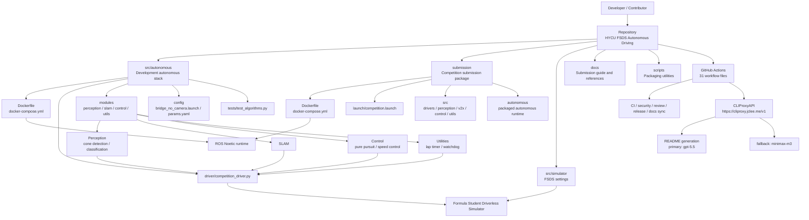

# HYCU FSDS Autonomous Driving / HYCU FSDS 자율주행

> Formula Student Driverless Simulator 기반 자율주행 시스템  
> Autonomous driving stack for the Formula Student Driverless Simulator


[](https://github.com/qodo-ai/pr-agent)

---

## Overview / 개요

HYCU FSDS Autonomous Driving은 Formula Student Driverless Simulator, ROS Noetic, Docker 기반의 자율주행 개발 및 제출용 프로젝트입니다. 시뮬레이터 환경에서 콘 감지, SLAM, 경로 추종, 속도 제어, 랩 타이밍, 워치독을 포함한 자율주행 파이프라인을 실행할 수 있도록 구성되어 있습니다.

HYCU FSDS Autonomous Driving is an autonomous driving project for Formula Student Driverless Simulator workflows. It provides Dockerized ROS-based components for perception, SLAM, control, timing, safety monitoring, simulator integration, and competition-style submission packaging.

이 저장소는 크게 두 가지 실행 경로를 제공합니다.

This repository provides two main execution paths.

1. `src/autonomous/`  
   개발 및 실험용 자율주행 스택입니다.  
   Development-oriented autonomous driving stack.

2. `submission/`  
   대회 제출 또는 평가 환경을 위한 패키징된 실행 스택입니다.  
   Packaged runtime stack intended for competition submission or evaluation.

---

## Features / 주요 기능

### Autonomous Driving / 자율주행 기능

- Cone detection / 콘 감지
  - `cone_detector.py`
  - `cone_classifier.py`
- SLAM / 지도 작성 및 위치 추정
  - `slam.py`
- Control / 제어
  - Pure Pursuit path tracking: `pure_pursuit.py`
  - Speed control: `speed.py`
- Driver orchestration / 주행 드라이버
  - `competition_driver.py`
  - `basic.py`
  - `advanced.py`
  - `autonomous.py`
  - `competition.py`
- Utility modules / 유틸리티
  - Lap timing: `lap_timer.py`
  - Watchdog safety monitoring: `watchdog.py`
- V2X support in submission package / 제출 패키지 내 V2X 지원
  - `rsu.py`

### Runtime and Packaging / 실행 및 패키징

- Docker-based runtime for ROS-based autonomous driving
- `docker-compose.yml` based service orchestration
- Submission-specific Dockerfile and launch configuration
- Shell scripts for start, run-all, development, and packaging workflows
- FSDS simulator settings included under `src/simulator/`

### Repository Automation / 저장소 자동화

- 31 GitHub Actions workflow files
- PR checks, semantic PR validation, review automation, auto-merge, release automation, docs sync, security checks, CodeQL, Gitleaks, Scorecard, labeler, welcome workflow, and CI auto-healing
- README generation workflow using primary model `gpt-5.5`
- Fallback model path through CLIProxyAPI with `minimax-m3`
- Public CLIProxy endpoint: `https://cliproxy.jclee.me/v1`

---

## Architecture / 아키텍처



---

## Repository Layout / 저장소 구조

Actual top-level layout:

```text
/
├── AGENTS.md
├── CONTRIBUTING.md
├── LICENSE
├── OWNERS
├── README.md
├── in-memoria.db
├── src/
├── scripts/
├── docs/
└── submission/
```

Important subtrees:

```text
src/
├── autonomous/
│   ├── Dockerfile
│   ├── docker-compose.yml
│   ├── entrypoint.sh
│   ├── record_race.sh
│   ├── run_all.sh
│   ├── start.sh
│   ├── scripts/
│   │   └── start_race.py
│   ├── config/
│   │   ├── bridge_no_camera.launch
│   │   └── params.yaml
│   ├── driver/
│   │   └── competition_driver.py
│   ├── modules/
│   │   ├── perception/
│   │   ├── slam/
│   │   ├── control/
│   │   └── utils/
│   └── tests/
│       └── test_algorithms.py
└── simulator/
    ├── README.md
    └── settings.json
```

```text
submission/
├── AGENTS.md
├── Dockerfile
├── README.md
├── dev.sh
├── docker-compose.yml
├── run.sh
├── launch/
│   └── competition.launch
├── src/
│   ├── drivers/
│   ├── perception/
│   ├── v2x/
│   ├── utils/
│   └── control/
└── autonomous/
    ├── Dockerfile
    ├── docker-compose.yml
    ├── entrypoint.sh
    ├── run_all.sh
    ├── start.sh
    ├── config/
    ├── driver/
    └── modules/
```

---

## Automation Inventory / 자동화 인벤토리

### GitHub Actions Workflows / GitHub Actions 워크플로

This repository contains 31 workflow files.

이 저장소에는 31개의 워크플로 파일이 있습니다.

| File | Purpose |
|---|---|
| `01_branch-to-pr.yml` | Creates or manages pull requests from branches. |
| `02_issue-to-branch.yml` | Creates working branches from issues. |
| `03_pr-checks.yml` | Runs pull request validation checks. |
| `04_actionlint.yml` | Validates GitHub Actions workflow syntax. |
| `05_gitleaks.yml` | Runs secret scanning with Gitleaks. |
| `06_codeql.yml` | Runs CodeQL security analysis. |
| `07_dependency-review.yml` | Reviews dependency changes in pull requests. |
| `08_scorecard.yml` | Runs supply-chain security score checks. |
| `09_semantic-pr.yml` | Enforces semantic pull request titles. |
| `10_pr-review.yml` | Performs automated PR review. |
| `11_security-pr-review.yml` | Performs security-focused PR review. |
| `12_dependabot-auto-merge.yml` | Auto-merges eligible Dependabot updates. |
| `13_pr-auto-merge.yml` | Auto-merges eligible pull requests. |
| `14_bot-auto-fix.yml` | Applies automated fixes from bot workflows. |
| `15_merged-pr-cleanup.yml` | Cleans up after merged pull requests. |
| `19_issue-backfill.yml` | Backfills or normalizes issue metadata. |
| `20_readme-gen.yml` | Regenerates README documentation. |
| `21_docs-sync.yml` | Synchronizes documentation content. |
| `24_release-notes.yml` | Generates release notes. |
| `25_release-publish.yml` | Publishes releases. |
| `29_downstream-health-check.yml` | Checks downstream repository health. |
| `37_ci-failure-issues.yml` | Opens or updates issues for CI failures. |
| `42_reusable-docs-sync.yml` | Reusable documentation sync workflow. |
| `44_reusable-pr-checks.yml` | Reusable PR checks workflow. |
| `45_reusable-gitleaks.yml` | Reusable Gitleaks workflow. |
| `60_ci-auto-heal.yml` | Attempts automated CI failure recovery. |
| `91_issue-classification.yml` | Classifies issues automatically. |
| `auto-merge.yml` | Auto-merge workflow entry point. |
| `ci.yml` | Main continuous integration workflow. |
| `labeler.yml` | Applies labels based on changed files or metadata. |
| `welcome.yml` | Welcomes first-time contributors. |

### Automation Models and Services / 자동화 모델 및 서비스

| Component | Value |
|---|---|
| README generation primary model | `gpt-5.5` |
| README generation fallback model | `minimax-m3` via CLIProxyAPI |
| CLIProxy public endpoint | `https://cliproxy.jclee.me/v1` |
| PR review integration reference | `qodo-ai/pr-agent` |
| Bot portal reference | `bot.jclee.me` |

### Go Automation Tools / Go 자동화 도구

No Go automation tools are present in this repository.

이 저장소에는 Go 기반 자동화 도구가 없습니다.

| Category | Count |
|---|---:|
| Go automation tools | 0 |

### Repository Scripts / 저장소 스크립트

| Path | Description |
|---|---|
| `scripts/package.sh` | Packages project files for distribution or submission. |
| `src/autonomous/start.sh` | Starts the autonomous development runtime. |
| `src/autonomous/run_all.sh` | Runs the full autonomous stack. |
| `src/autonomous/record_race.sh` | Records race/session data. |
| `src/autonomous/entrypoint.sh` | Docker container entrypoint. |
| `src/autonomous/scripts/start_race.py` | Python helper for race startup. |
| `submission/run.sh` | Runs the submission package. |
| `submission/dev.sh` | Starts a submission development environment. |
| `submission/autonomous/start.sh` | Starts the packaged autonomous runtime. |
| `submission/autonomous/run_all.sh` | Runs the packaged autonomous stack. |
| `submission/autonomous/entrypoint.sh` | Submission autonomous container entrypoint. |

---

## Quick Start / 빠른 시작

### 1. Clone the Repository / 저장소 클론

```bash
git clone <repository-url>
cd <repository-directory>
```

### 2. Review Simulator Settings / 시뮬레이터 설정 확인

FSDS simulator configuration is stored in:

```text
src/simulator/settings.json
```

Simulator usage notes are available in:

```text
src/simulator/README.md
```

### 3. Run Development Autonomous Stack / 개발용 자율주행 스택 실행

```bash
cd src/autonomous
docker compose up --build
```

Or use the provided script:

```bash
cd src/autonomous
chmod +x start.sh run_all.sh entrypoint.sh
./start.sh
```

### 4. Run Submission Package / 제출 패키지 실행

```bash
cd submission
chmod +x run.sh
./run.sh
```

For development mode:

```bash
cd submission
chmod +x dev.sh
./dev.sh
```

### 5. Run Tests / 테스트 실행

```bash
cd src/autonomous
python -m pytest tests
```

If `pytest` is not installed in your environment, install project test dependencies in your preferred Python environment before running the command.

---

## Local Development / 로컬 개발

### Recommended Environment / 권장 환경

| Component | Recommended Version |
|---|---|
| OS | Linux environment for ROS runtime |
| ROS | Noetic |
| Python | 3.8+ |
| Container runtime | Docker with Compose support |
| Simulator | Formula Student Driverless Simulator |

### Development Workflow / 개발 흐름

1. Modify modules under `src/autonomous/modules/`.
2. Update driver logic under `src/autonomous/driver/competition_driver.py`.
3. Adjust runtime parameters in `src/autonomous/config/params.yaml`.
4. Run the autonomous stack with Docker Compose.
5. Validate algorithm changes with `src/autonomous/tests/test_algorithms.py`.
6. If preparing a submission, port or verify equivalent changes under `submission/`.

### Key Development Files / 주요 개발 파일

| File | Role |
|---|---|
| `src/autonomous/config/params.yaml` | Runtime parameters for the development autonomous stack. |
| `src/autonomous/config/bridge_no_camera.launch` | ROS launch configuration for bridge mode without camera. |
| `src/autonomous/driver/competition_driver.py` | Main competition driver implementation. |
| `src/autonomous/modules/perception/cone_detector.py` | Cone detection logic. |
| `src/autonomous/modules/perception/cone_classifier.py` | Cone classification logic. |
| `src/autonomous/modules/perception/slam.py` | SLAM implementation. |
| `src/autonomous/modules/control/pure_pursuit.py` | Pure Pursuit path tracking. |
| `src/autonomous/modules/control/speed.py` | Speed control logic. |
| `src/autonomous/modules/utils/lap_timer.py` | Lap timing utility. |
| `src/autonomous/modules/utils/watchdog.py` | Runtime safety watchdog. |
| `submission/launch/competition.launch` | Submission launch file. |

### Submission Development / 제출 패키지 개발

The `submission/` directory is a self-contained package for evaluation or competition-style execution.

`submission/` 디렉터리는 평가 및 대회 제출을 위한 독립 실행형 패키지입니다.

Important files:

```text
submission/
├── Dockerfile
├── docker-compose.yml
├── run.sh
├── dev.sh
├── launch/competition.launch
└── src/
```

Use `submission/dev.sh` for iterative development and `submission/run.sh` for runtime-style execution.

---

## Commands Reference / 명령어 참고서

### Docker Commands / Docker 명령어

Build and run the development stack:

```bash
cd src/autonomous
docker compose up --build
```

Stop the development stack:

```bash
cd src/autonomous
docker compose down
```

Build and run the submission stack:

```bash
cd submission
docker compose up --build
```

Stop the submission stack:

```bash
cd submission
docker compose down
```

### Script Commands / 스크립트 명령어

Run autonomous development stack:

```bash
cd src/autonomous
./start.sh
```

Run all autonomous components:

```bash
cd src/autonomous
./run_all.sh
```

Record a race/session:

```bash
cd src/autonomous
./record_race.sh
```

Start race helper:

```bash
cd src/autonomous
python scripts/start_race.py
```

Package repository artifacts:

```bash
./scripts/package.sh
```

Run submission package:

```bash
cd submission
./run.sh
```

Start submission development mode:

```bash
cd submission
./dev.sh
```

Run packaged autonomous stack:

```bash
cd submission/autonomous
./start.sh
```

Run all packaged autonomous components:

```bash
cd submission/autonomous
./run_all.sh
```

### Test Commands / 테스트 명령어

Run all autonomous tests:

```bash
cd src/autonomous
python -m pytest tests
```

Run a specific test file:

```bash
cd src/autonomous
python -m pytest tests/test_algorithms.py
```

### Documentation Commands / 문서 관련 명령어

Review submission documentation:

```bash
cat docs/SUBMISSION_GUIDE.md
```

Review simulator notes:

```bash
cat src/simulator/README.md
```

---

## Contribution Guide / 기여 가이드

### Before Contributing / 기여 전 확인 사항

Please review these repository files before opening a pull request:

- `CONTRIBUTING.md`
- `AGENTS.md`
- `OWNERS`
- `LICENSE`
- Relevant `AGENTS.md` files under subdirectories:
  - `src/autonomous/AGENTS.md`
  - `submission/AGENTS.md`

### Branch and Pull Request Workflow / 브랜치 및 PR 흐름

1. Create a focused branch for your change.
2. Keep changes small and reviewable.
3. Update tests when changing algorithms.
4. Update documentation when changing runtime behavior or commands.
5. Open a pull request with a semantic title.
6. Ensure automated checks pass.

### Pull Request Expectations / PR 요구 사항

A good pull request should include:

- Clear description of the problem and solution
- Test results or validation notes
- Screenshots or logs when relevant
- Documentation updates for behavior changes
- No committed secrets, credentials, private addresses, or local-only paths

### Coding Guidelines / 코딩 가이드라인

- Keep perception, SLAM, control, and utility modules separated by responsibility.
- Prefer configuration changes in `params.yaml` over hardcoded tuning values.
- Keep submission code synchronized with development code when needed.
- Avoid environment-specific constants in source code.
- Do not commit generated caches, local logs, or machine-specific settings.

### Automation Notes / 자동화 참고

Pull requests may be processed by workflows such as:

- `03_pr-checks.yml`
- `04_actionlint.yml`
- `05_gitleaks.yml`
- `06_codeql.yml`
- `07_dependency-review.yml`
- `09_semantic-pr.yml`
- `10_pr-review.yml`
- `11_security-pr-review.yml`
- `13_pr-auto-merge.yml`
- `14_bot-auto-fix.yml`

Documentation and release-related changes may also trigger:

- `20_readme-gen.yml`
- `21_docs-sync.yml`
- `24_release-notes.yml`
- `25_release-publish.yml`

### Security / 보안

Do not commit:

- API keys
- Tokens
- Passwords
- Private host addresses
- Local simulator credentials
- Machine-specific runtime identifiers

Security-related checks are automated through workflows including `05_gitleaks.yml`, `06_codeql.yml`, `07_dependency-review.yml`, `08_scorecard.yml`, and `11_security-pr-review.yml`.

---

## License / 라이선스

This project is licensed under the MIT License. See `LICENSE` for details.

이 프로젝트는 MIT 라이선스를 따릅니다. 자세한 내용은 `LICENSE` 파일을 확인하세요.