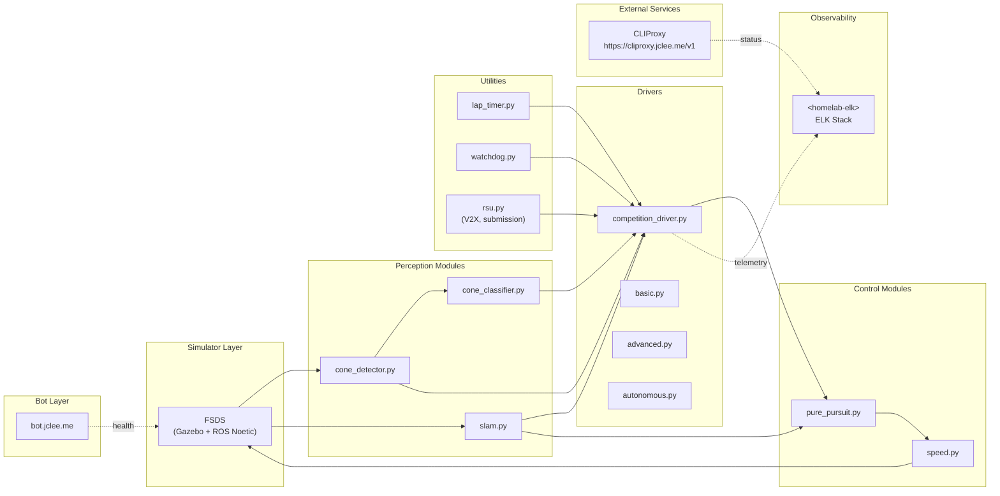

# HYCU FSDS Autonomous Driving / HYCU FSDS 자율주행

> Formula Student Driverless Simulator 기반 자율주행 시스템  
> Autonomous driving stack for the Formula Student Driverless Simulator (FSDS)


[](https://github.com/qodo-ai/pr-agent)


---

## Overview / 개요

**EN**  
HYCU FSDS Autonomous Driving is an autonomous driving project for Formula Student Driverless Simulator (FSDS) workflows. It provides Dockerized ROS Noetic components for perception (cone detection, SLAM), control (pure pursuit, speed), safety monitoring (watchdog), lap timing, simulator integration, V2X support, and competition-style submission packaging. The repository is split into a development-oriented stack and a packaged submission stack so that the same algorithms can be iterated locally and re-built as a frozen runtime for evaluation.

**KR**  
HYCU FSDS Autonomous Driving은 Formula Student Driverless Simulator(FSDS) 워크플로우를 위한 자율주행 프로젝트입니다. ROS Noetic 기반의 Docker 컨테이너 구성으로 콘 감지·SLAM 인지 모듈, Pure Pursuit·속도 제어 모듈, 워치독 안전 감시, 랩 타이머, 시뮬레이터 연동, V2X 지원, 대회 제출 패키징을 제공합니다. 저장소는 개발용 스택과 제출용 패키지 스택으로 분리되어 있어, 동일한 알고리즘을 로컬에서 반복 개발하고 평가용 동결 런타임으로 다시 빌드할 수 있습니다.

본 저장소는 두 가지 실행 경로를 제공합니다. The repository provides two execution paths:

1. `src/autonomous/` — 개발 및 실험용 자율주행 스택 / Development-oriented stack.
2. `submission/` — 대회 제출 또는 평가를 위한 동결 실행 스택 / Frozen runtime stack for competition submission or evaluation.

---

## Features / 주요 기능

### Perception / 인지
- `cone_detector.py` — 콘(cone) 감지 / Cone detection from LiDAR / camera streams.
- `cone_classifier.py` — 콘 색상/종류 분류 / Color and class classification.
- `slam.py` — 동시 위치 추정 및 지도 작성 / SLAM.

### Control / 제어
- `pure_pursuit.py` — Pure Pursuit 경로 추종 / Geometric path tracking.
- `speed.py` — 종방향 속도 제어 / Longitudinal speed control.

### Drivers / 드라이버 오케스트레이션
- `competition_driver.py` — 대회용 통합 드라이버 / Competition driver.
- `basic.py` — 최소 기능 드라이버 / Baseline driver.
- `advanced.py` — 확장 드라이버 / Advanced driver.
- `autonomous.py` — 자율주행 드라이버 / Autonomous-mode driver.
- `competition.py` — 대회 제출 호환 드라이버 / Submission-compatible driver.

### Utilities / 유틸리티
- `lap_timer.py` — 랩 타임 측정 / Lap timing.
- `watchdog.py` — 안전 워치독 / Safety watchdog.
- `rsu.py` (submission only) — V2X RSU 연동 / V2X Road-Side Unit bridge.

### Tooling & Packaging / 도구 및 패키징
- Docker / Docker Compose 기반 컨테이너 실행 / Containerized runtime.
- `scripts/package.sh` — 제출 산출물 패키징 / Submission packaging script.
- `entrypoint.sh`, `start.sh`, `run_all.sh`, `record_race.sh` — 시뮬레이터 실행 / 부팅 스크립트.
- ROS launch 통합 / ROS launch integration (`bridge_no_camera.launch`, `competition.launch`).

---

## Architecture / 아키텍처



> **Note / 참고** — `<homelab-elk>` 는 사설 IP를 노출하지 않는 플레이스홀더입니다. 실제 엔드포인트는 운영 환경 시크릿으로 주입됩니다.  
> `<homelab-elk>` is a placeholder; concrete endpoints are injected via runtime secrets.

---

## Repository Layout / 저장소 구조

```text
.
├── AGENTS.md                    # Agent / automation context
├── CONTRIBUTING.md              # Contribution guidelines
├── LICENSE                      # MIT license
├── OWNERS                       # Code owners
├── README.md                    # This file
├── in-memoria.db                # In-memoria cache (gitignored typical)
├── docs/
│   ├── SUBMISSION_GUIDE.md
│   └── reference_materials/      # Lecture notes, notebooks
├── scripts/
│   └── package.sh               # Submission packaging
├── src/
│   ├── autonomous/              # Development stack
│   │   ├── Dockerfile
│   │   ├── docker-compose.yml
│   │   ├── entrypoint.sh
│   │   ├── run_all.sh
│   │   ├── start.sh
│   │   ├── record_race.sh
│   │   ├── AGENTS.md
│   │   ├── config/
│   │   │   ├── bridge_no_camera.launch
│   │   │   └── params.yaml
│   │   ├── driver/
│   │   │   └── competition_driver.py
│   │   ├── modules/
│   │   │   ├── perception/      # cone_detector, cone_classifier, slam
│   │   │   ├── control/         # pure_pursuit, speed
│   │   │   └── utils/           # lap_timer, watchdog
│   │   ├── scripts/
│   │   │   └── start_race.py
│   │   └── tests/
│   │       └── test_algorithms.py
│   └── simulator/
│       ├── README.md
│       └── settings.json
└── submission/                  # Frozen competition stack
    ├── AGENTS.md
    ├── Dockerfile
    ├── README.md
    ├── dev.sh
    ├── run.sh
    ├── docker-compose.yml
    ├── launch/
    │   └── competition.launch
    ├── src/
    │   ├── drivers/             # basic, advanced, autonomous, competition
    │   ├── perception/          # cone_detector, cone_classifier, slam
    │   ├── v2x/                 # rsu.py
    │   ├── control/             # pure_pursuit, speed
    │   └── utils/               # lap_timer, watchdog
    └── autonomous/              # Submission-scoped autonomous runtime
        ├── Dockerfile
        ├── docker-compose.yml
        ├── entrypoint.sh
        ├── run_all.sh
        ├── start.sh
        ├── config/params.yaml
        ├── driver/competition_driver.py
        └── modules/perception/  # cone_classifier, cone_detector
```

---

## Automation Inventory / 자동화 인벤토리

본 저장소는 16개의 GitHub Actions 워크플로우로 자동화되어 있습니다. 워크플로우 파일명은 실제 디스크 상의 숫자 접두사를 그대로 표기합니다.

This repository is automated by **16 GitHub Actions workflows**. File names reflect the real on-disk numeric prefixes.

### Branch & PR lifecycle / 브랜치 및 PR 라이프사이클
- `01_branch-to-pr.yml` — 브랜치를 PR로 승격 / Promote a branch into a PR.
- `02_issue-to-branch.yml` — 이슈에서 브랜치 자동 생성 / Auto-create a branch from an issue.
- `10_pr-review.yml` — PR 자동 리뷰 (qodo-ai/pr-agent) / Automated PR review via pr-agent.
- `11_security-pr-review.yml` — 보안 관점 PR 리뷰 / Security-focused PR review.
- `12_dependabot-auto-merge.yml` — Dependabot PR 자동 머지 / Dependabot auto-merge.
- `13_pr-auto-merge.yml` — 조건부 PR 자동 머지 / Conditional PR auto-merge.
- `14_bot-auto-fix.yml` — 봇 자동 수정 / Bot-driven auto-fix on PRs.
- `15_merged-pr-cleanup.yml` — 머지된 PR의 브랜치 정리 / Cleanup branches after merge.

### Issues & triage / 이슈 및 분류
- `19_issue-backfill.yml` — 이슈 백필 / Issue backfill orchestration.
- `91_issue-classification.yml` — 이슈 자동 분류 및 라벨링 / Issue auto-classification.
- `37_ci-failure-issues.yml` — CI 실패 → 이슈 생성 / Open issue on CI failure.

### CI & self-heal / CI 및 자가 치유
- `ci.yml` — 기본 CI 파이프라인 / Base CI pipeline.
- `60_ci-auto-heal.yml` — CI 자동 복구 / CI auto-heal.
- `29_downstream-health-check.yml` — 다운스트림 저장소 헬스 체크 / Downstream repo health check.

### Release & publishing / 릴리스 및 게시
- `24_release-notes.yml` — 릴리스 노트 자동 생성 / Release notes drafting.
- `25_release-publish.yml` — 릴리스 게시 / Release publishing.

### Go automation tools / Go 자동화 도구
본 저장소에는 Go 기반 자동화 도구가 포함되어 있지 않습니다.  
No Go-based automation tools are shipped in this repository (count: 0).

### External integrations / 외부 연동
- **PR 자동 리뷰 / Automated PR review** — [`qodo-ai/pr-agent`](https://github.com/qodo-ai/pr-agent).
- **공용 API 프록시 / Public API proxy** — `https://cliproxy.jclee.me/v1` (read-only status / 상태 조회).
- **봇 서비스 / Bot service** — `https://bot.jclee.me` (헬스 체크 / health-check target).

---

## Quick Start / 빠른 시작

### Prerequisites / 사전 요구사항
- Docker ≥ 20.10
- Docker Compose v2
- Python 3.8+ (로컬 개발 시 / for local development)
- ROS Noetic 호스트 (네이티브 실행 시 / for native execution)
- FSDS 시뮬레이터 (호스트) / FSDS simulator (host)

### Clone / 클론
```bash
git clone <repo-url> hycu-fsds
cd hycu-fsds
```

### Run the development stack / 개발 스택 실행
```bash
# Build & start the autonomous container
docker compose -f src/autonomous/docker-compose.yml up --build

# Inside the container (or host if native):
./src/autonomous/start.sh
./src/autonomous/run_all.sh
```

### Run the submission stack / 제출 스택 실행
```bash
# Build the frozen submission image
bash scripts/package.sh

# Launch the submission runtime
cd submission
./dev.sh        # dev mode
./run.sh        # competition mode
```

---

## Local Development / 로컬 개발

### Python virtualenv / 파이썬 가상환경
```bash
python3 -m venv .venv
source .venv/bin/activate
pip install -U pip
# Install module requirements per stack (see src/autonomous and submission READMEs)
```

### Run unit tests / 단위 테스트 실행
```bash
cd src/autonomous
python -m pytest tests/
```

### Native ROS launch (host) / 네이티브 ROS 실행
```bash
# Source your ROS Noetic environment first
source /opt/ros/noetic/setup.bash
roslaunch src/autonomous/config/bridge_no_camera.launch
```

### Simulator settings / 시뮬레이터 설정
- `src/simulator/settings.json` — FSDS 런타임 파라미터 / FSDS runtime parameters.
- `src/autonomous/config/params.yaml` — 자율주행 노드 파라미터 / Autonomous node parameters.
- `submission/config/params.yaml` — 제출 빌드 파라미터 / Submission build parameters.

---

## Commands Reference / 명령어 레퍼런스

| Script / 스크립트 | Purpose / 용도 |
| --- | --- |
| `scripts/package.sh` | 제출 산출물 빌드 / Build submission artifact. |
| `src/autonomous/entrypoint.sh` | 개발 컨테이너 진입점 / Dev container entrypoint. |
| `src/autonomous/start.sh` | 자율주행 노드 기동 / Start autonomous nodes. |
| `src/autonomous/run_all.sh` | 전체 파이프라인 실행 / Run full pipeline. |
| `src/autonomous/record_race.sh` | 시뮬레이션 레코딩 / Record simulation race. |
| `src/autonomous/scripts/start_race.py` | 레이스 시작 스크립트 / Programmatic race starter. |
| `submission/run.sh` | 제출 런타임 기동 / Launch submission runtime. |
| `submission/dev.sh` | 제출 스택 개발 모드 / Submission dev mode. |
| `docker compose -f src/autonomous/docker-compose.yml up` | 개발 컨테이너 업 / Up dev container. |
| `docker compose -f submission/docker-compose.yml up` | 제출 컨테이너 업 / Up submission container. |
| `docker compose -f submission/autonomous/docker-compose.yml up` | 제출-자율 컨테이너 업 / Up submission-autonomous container. |

---

## Configuration / 설정

- **Simulator**: `src/simulator/settings.json`  
- **Autonomous params**: `src/autonomous/config/params.yaml`, `submission/autonomous/config/params.yaml`  
- **Launch files**: `src/autonomous/config/bridge_no_camera.launch`, `submission/launch/competition.launch`  
- **Secrets / Endpoint placeholders**: `<homelab-host>`, `<homelab-elk>` (실제 값은 GitHub Secrets / 런타임 환경변수로 주입)  
  (Real values injected via GitHub Secrets / runtime env vars.)

---

## Observability / 관측성

- 시뮬레이션 텔레메트리 / Simulation telemetry → ELK 스택 (placeholder: `<homelab-elk>`).
- `29_downstream-health-check.yml` 가 다운스트림 헬스를 주기적으로 확인합니다.  
  `29_downstream-health-check.yml` periodically checks downstream repository health.
- `37_ci-failure-issues.yml` 가 CI 실패를 이슈로 자동 라우팅합니다.  
  `37_ci-failure-issues.yml` auto-routes CI failures to issues.

---

## Contribution Guide / 기여 가이드

기여 절차는 [`CONTRIBUTING.md`](./CONTRIBUTING.md) 를 따릅니다.  
Please follow [`CONTRIBUTING.md`](./CONTRIBUTING.md) for contribution rules.

### Branch & PR flow / 브랜치 & PR 흐름
1. 이슈 생성 또는 픽업 / Open or pick an issue.
2. `02_issue-to-branch.yml` 가 브랜치를 자동 생성합니다 (선택).  
   `02_issue-to-branch.yml` can auto-create a branch (optional).
3. PR 오픈 시 `10_pr-review.yml` / `11_security-pr-review.yml` 가 자동 리뷰를 수행합니다.  
   `10_pr-review.yml` / `11_security-pr-review.yml` perform automated reviews on PR open.
4. `13_pr-auto-merge.yml` / `12_dependabot-auto-merge.yml` 조건 충족 시 자동 머지합니다.  
   Auto-merge is handled by `13_pr-auto-merge.yml` and `12_dependabot-auto-merge.yml`.
5. 머지 후 `15_merged-pr-cleanup.yml` 가 브랜치를 정리합니다.  
   `15_merged-pr-cleanup.yml` cleans up branches after merge.

### Coding style / 코드 스타일
- Python: PEP 8 + `black` / `ruff` 권장 / PEP 8 with `black` / `ruff`.
- ROS 노드는 `src/autonomous/modules/` 와 `submission/src/` 하위에 모듈화하여 유지합니다.  
  Keep ROS nodes modular under `src/autonomous/modules/` and `submission/src/`.

### Tests / 테스트
- 단위 테스트는 `src/autonomous/tests/` 에 추가합니다.  
  Add unit tests under `src/autonomous/tests/`.
- CI (`ci.yml`) 통과가 필수입니다. / Passing `ci.yml` is required.

### Commit messages / 커밋 메시지
- 컨벤션은 Conventional Commits 를 권장합니다.  
  Conventional Commits are recommended.
- `commitlint` 가 커밋 메시지 형식을 검증할 수 있습니다.  
  `commitlint` may validate commit message format.

---

## License / 라이선스

본 프로젝트는 MIT 라이선스 하에 배포됩니다. 자세한 내용은 [`LICENSE`](./LICENSE) 파일을 참조하세요.  
Distributed under the MIT License. See [`LICENSE`](./LICENSE) for details.

---

## Maintainers / 관리자

- 코드 오너십은 [`OWNERS`](./OWNERS) 파일을 참조하세요.  
  See [`OWNERS`](./OWNERS) for code ownership.
- 자동화 컨텍스트는 [`AGENTS.md`](./AGENTS.md) 를 참조하세요.  
  See [`AGENTS.md`](./AGENTS.md) for automation context.

---

## Related Links / 관련 링크

- Formula Student Driverless — https://www.formulastudent.de/
- qodo-ai/pr-agent — https://github.com/qodo-ai/pr-agent
- Public proxy endpoint — https://cliproxy.jclee.me/v1
- Bot service — https://bot.jclee.me