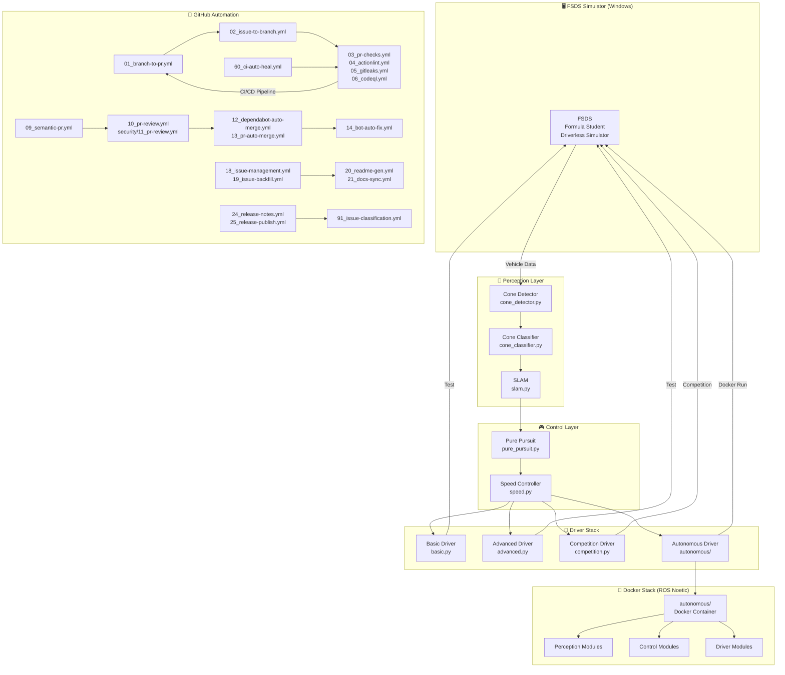

# HYCU FSDS Autonomous Driving / HYCU FSDS 자율주행

> Formula Student Driverless Simulator 기반 자율주행 시스템  
> Formula Student Driverless Simulator (FSDS) Based Autonomous Driving System

[](LICENSE)
[](http://wiki.ros.org/noetic)
[](https://www.python.org/)
[](https://www.docker.com/)
[](https://github.com/qws941/HYCU-FSDS/actions)

---

## 목차 (Table of Contents)

- [개요 (Overview)](#개요-overview)
- [주요 기능 (Key Features)](#주요-기능-key-features)
- [시스템 아키텍처 (System Architecture)](#시스템-아키텍처-system-architecture)
- [자동화 인벤토리 (Automation Inventory)](#자동화-인벤토리-automation-inventory)
- [빠른 시작 (Quick Start)](#빠른-시작-quick-start)
- [로컬 개발 (Local Development)](#로컬-개발-local-development)
- [명령어 참고서 (Commands Reference)](#명령어-참고서-commands-reference)
- [기여 가이드 (Contribution Guide)](#기여-가이드-contribution-guide)

---

## 개요 (Overview)

본 프로젝트는 **Formula Student Driverless Simulator (FSDS)** 기반으로 개발된 자율주행 시스템입니다. Windows 환경의 시뮬레이터와 Linux (ROS Noetic) Docker 기반 자율주행 스택을 결합한 이중 플랫폼 아키텍처로, 콘 감지 (Cone Detection), SLAM, 경로 계획 및 제어 기능을 통합합니다.

This project is an autonomous driving system based on the **Formula Student Driverless Simulator (FSDS)**. It combines a Windows-based simulator with a Linux (ROS Noetic) Docker-based autonomous driving stack, integrating cone detection, SLAM, path planning, and control functions.

### 프로젝트 배경 (Project Background)

본 프로젝트는 자율주행 알고리즘 연구 및 경진 대회 준비를 위해 구축되었으며, 다음 목표를 달성합니다:

- FSDS 시뮬레이터 환경에서의 실시간 자율주행 구현
- ROS Noetic 기반의 모듈화된 자율주행 스택 제공
- Cone Detection 및 SLAM을 통한 환경 인식 능력 확보
- Pure Pursuit 및 속도 제어를 통한 경로 추종 성능 확보

This project was established for autonomous driving algorithm research and competition preparation, achieving the following objectives:

- Real-time autonomous driving in FSDS simulator environment
- Modular autonomous driving stack based on ROS Noetic
- Environment perception via Cone Detection and SLAM
- Path tracking via Pure Pursuit and speed control

---

## 주요 기능 (Key Features)

### 자율주행 핵심 모듈 (Autonomous Driving Core Modules)

| 모듈 | 설명 |
|------|------|
| **Cone Detection** | 시뮬레이터에서 콘 탐지 및 분류 (submission/src/perception/cone_detector.py, cone_classifier.py) |
| **SLAM** | 자기 위치 추정 및 지도 작성 (submission/src/perception/slam.py, autonomous/modules/perception/slam.py) |
| **Pure Pursuit** | 경로 추종 알고리즘 (submission/src/control/pure_pursuit.py, autonomous/modules/control/pure_pursuit.py) |
| **Speed Control** | 속도 프로파일 및 제어 (submission/src/control/speed.py, autonomous/modules/control/speed.py) |

### 드라이버 모드 (Driver Modes)

| 드라이버 | 용도 |
|---------|------|
| **Basic Driver** | 기본 운행 (submission/src/drivers/basic.py) |
| **Advanced Driver** | 고급 기능 (submission/src/drivers/advanced.py) |
| **Competition Driver** | 대회용 완전 자율주행 (submission/src/drivers/competition.py, autonomous/driver/competition_driver.py) |
| **Autonomous Driver** | Docker 기반 완전 자율주행 (autonomous/) |

### 개발 환경 (Development Environment)

- **ROS Noetic**: 로봇 운영 체제
- **Python 3.8+**: 주요 개발 언어
- **Docker**: 컨테이너화된 자율주행 스택
- **FSDS Simulator**: Windows 기반 시뮬레이션

---

## 시스템 아키텍처 (System Architecture)



### 데이터 흐름 (Data Flow)

1. **시뮬레이터 → 드라이버**: FSDS 시뮬레이터가 차량 데이터 (위치, 속도, 이미지) 전송
2. **인식 → 제어**: Cone Detector → Cone Classifier → SLAM → Pure Pursuit → Speed Control
3. **제어 → 시뮬레이터**: 조정된 조향/스로틀 명령 시뮬레이터로 전송
4. **GitHub Automation**: PR, 이슈, 릴리스 자동化管理

---

## 자동화 인벤토리 (Automation Inventory)

### GitHub Workflows (33개 워크플로우)

#### Branch & PR Management

| 워크플로우 파일 | 설명 |
|----------------|------|
| `01_branch-to-pr.yml` | 브랜치 생성 시 자동으로 PR 연결 |
| `02_issue-to-branch.yml` | 이슈 할당 시 대응 브랜치 자동 생성 |
| `13_pr-auto-merge.yml` | 조건 충족 시 PR 자동 머지 |
| `15_merged-pr-cleanup.yml` | 머지 완료 후 브랜치 정리 |

#### PR Checks & Reviews

| 워크플로우 파일 | 설명 |
|----------------|------|
| `03_pr-checks.yml` | PR 기본 체크 (린트, 테스트) |
| `04_actionlint.yml` | GitHub Actions YAML 문법 검사 |
| `05_gitleaks.yml` | секрет 키 누출 스캔 |
| `06_codeql.yml` | CodeQL 정적 분석 |
| `07_dependency-review.yml` | 의존성 보안 리뷰 |
| `09_semantic-pr.yml` | 시맨틱 커밋 메시지 검증 |
| `10_pr-review.yml` | 자동 PR 리뷰 (qodo-ai/pr-agent 사용) |
| `security/11_pr-review.yml` | 보안 집중 PR 리뷰 |

#### Issue Management

| 워크플로우 파일 | 설명 |
|----------------|------|
| `18_issue-management.yml` | 이슈 자동 라벨링 및 관리 |
| `19_issue-backfill.yml` | 이슈 백필 (내용 보강) |
| `91_issue-classification.yml` | 이슈 자동 분류 |
| `37_ci-failure-issues.yml` | CI 실패 시 이슈 자동 생성 |
| `42_reusable-issue-management.yml` | 재사용 가능한 이슈 관리 |

#### Documentation & Release

| 워크플로우 파일 | 설명 |
|----------------|------|
| `20_readme-gen.yml` | README 자동 생성 (본 문서) |
| `21_docs-sync.yml` | 문서 동기화 |
| `24_release-notes.yml` | 릴리스 노트 자동 작성 |
| `25_release-publish.yml` | 릴리스 게시 자동화 |
| `42_reusable-docs-sync.yml` | 재사용 가능한 문서 동기화 |

#### Dependency & CI/CD

| 워크플로우 파일 | 설명 |
|----------------|------|
| `08_scorecard.yml` | OpenSSF 보안 점수 카드 |
| `12_dependabot-auto-merge.yml` | Dependabot 자동 머지 |
| `14_bot-auto-fix.yml` | 봇 자동 수정 |
| `29_downstream-health-check.yml` | 다운스트림 헬스 체크 |
| `43_reusable-pr-checks.yml` | 재사용 가능한 PR 체크 |
| `44_reusable-gitleaks.yml` | 재사용 가능한 Gitleaks |
| `60_ci-auto-heal.yml` | CI 자동 복구 |

#### Reusable Workflows (재사용 워크플로우)

| 워크플로우 파일 | 설명 |
|----------------|------|
| `auto-merge.yml` | 자동 머지 재사용 워크플로우 |
| `ci.yml` | 기본 CI 재사용 워크플로우 |
| `labeler.yml` | 라벨러 재사용 워크플로우 |
| `welcome.yml` | 신규 기여자 환영 메시지 |

### 자동화 도구 (Automation Tools)

| 도구 | 용도 | 참조 |
|------|------|------|
| **qodo-ai/pr-agent** | 자동 PR 리뷰 및 분석 | external link |
| **actionlint** | GitHub Actions YAML 검증 | 04_actionlint.yml |
| **gitleaks** | 시크릿 스캐닝 | 05_gitleaks.yml |
| **CodeQL** | 정적 코드 분석 | 06_codeql.yml |
| **Dependabot** | 의존성 업데이트 | 12_dependabot-auto-merge.yml |
| **CL IProxy API** | 자동화 스크립트 실행 | <https://cliproxy.jclee.me/v1> |

---

## 빠른 시작 (Quick Start)

### 사전 요구사항 (Prerequisites)

- Docker 20.10+
- Python 3.8+
- ROS Noetic (Linux 환경)
- FSDS 시뮬레이터 (Windows)

### 1. 저장소 복제 (Clone Repository)

```bash
git clone https://github.com/qws941/HYCU-FSDS.git
cd HYCU-FSDS
```

### 2. Docker 기반 자율주행 실행 (Run Autonomous Stack)

```bash
cd autonomous
docker-compose up -d
./start.sh
```

### 3. 시뮬레이터 연결 (Connect Simulator)

1. FSDS 시뮬레이터 실행 (Windows)
2. 자율주행 스택이 수신 대기 상태인지 확인
3. competition_driver.py 실행:

```bash
cd submission
python scripts/competition_driver.py
```

### 4. 경쟁 모드 실행 (Run Competition Mode)

```bash
cd submission
./run.sh
```

또는 Docker 독립 실행:

```bash
cd submission
docker-compose up
```

---

## 로컬 개발 (Local Development)

### 개발 환경 설정 (Development Environment Setup)

```bash
# 의존성 설치
pip install -r requirements.txt

# ROS 환경 설정 (Linux)
source /opt/ros/noetic/setup.bash

# 개발용 Docker 빌드
cd autonomous
docker build -t hycu-fsds:dev .
```

### 디렉토리 구조 (Directory Structure)

```
HYCU-FSDS/
├── submission/              # 제출용 소스 코드
│   ├── src/
│   │   ├── perception/      # Cone Detection, SLAM
│   │   ├── control/         # Pure Pursuit, Speed Control
│   │   ├── drivers/         # Basic, Advanced, Competition Driver
│   │   └── v2x/             # V2X 통신 (RSU)
│   ├── config/              # 드라이버 파라미터
│   ├── tests/               # 단위 테스트
│   ├── scripts/             # 실행 스크립트
│   ├── docs/                # 아키텍처 문서
│   ├── docker-compose.yml   # Docker 구성
│   └── Dockerfile
├── autonomous/             # Docker 기반 자율주행 스택
│   ├── modules/             # 모듈화된 자율주행 컴포넌트
│   ├── config/              # 파라미터 구성
│   ├── tests/              # 테스트
│   ├── driver/              # 경쟁용 드라이버
│   ├── docker-compose.yml   # Docker 구성
│   └── Dockerfile
├── .github/                 # GitHub Automation
│   └── workflows/           # 33개 워크플로우 정의
├── LICENSE
├── README.md
├── AGENTS.md               # 프로젝트 지식 베이스
├── CONTRIBUTING.md         # 기여 가이드
└── OWNERS                  # 프로젝트 소유자
```

### 테스트 실행 (Run Tests)

```bash
# 단위 테스트
cd submission
python -m pytest tests/

# 알고리즘 테스트
python tests/test_algorithms.py

# Docker 환경 테스트
cd autonomous
docker-compose -f docker-compose.yml run --rm test
```

---

## 명령어 참고서 (Commands Reference)

### 시뮬레이션 명령어

```bash
# 기본 드라이버 실행
cd submission
python scripts/fsds_driver.py

# 고급 드라이버 실행
python scripts/advanced_driver.py

# 경쟁 드라이버 실행
python scripts/competition_driver.py

# SLAM 실행
python scripts/simple_slam.py
```

### Docker 명령어

```bash
# 자율주행 스택 빌드
cd autonomous
docker build -t hycu-fsds:autonomous .

# 컨테이너 실행
docker-compose up -d

# 로그 확인
docker-compose logs -f

# 컨테이너 중지
docker-compose down

# 전체 스택 실행
./run_all.sh
```

### GitHub Automation 명령어

```bash
# 수동 워크플로우 트리거
gh workflow run 20_readme-gen.yml
gh workflow run 21_docs-sync.yml
gh workflow run 60_ci-auto-heal.yml

# 모든 워크플로우 목록
gh workflow list
```

---

## 기여 가이드 (Contribution Guide)

### 브랜치 전략 (Branch Strategy)

| 브랜치类型 | 접두사 | 설명 |
|-----------|--------|------|
| 기능 브랜치 | `feature/` | 새 기능 개발 |
| 수정 브랜치 | `fix/` | 버그 수정 |
| 문서 브랜치 | `docs/` | 문서 업데이트 |
| 리팩토링 | `refactor/` | 코드重构 |
| 자동화 | `automation/` | CI/CD 개선 |

### 커밋 메시지 규칙 (Commit Message Rules)

워크플로우 `09_semantic-pr.yml`이 시맨틱 커밋을 강제합니다:

```
<type>(<scope>): <description>

 Types: feat, fix, docs, style, refactor, test, chore
 Examples:
   feat(perception): add cone detection improvement
   fix(control): correct speed calculation error
   docs: update README
```

### Pull Request 과정 (Pull Request Process)

1. **브랜치 생성**: `02_issue-to-branch.yml`이 이슈 연결 자동화
2. **개발**: 코드 작성 및 테스트
3. **PR 생성**: 자동으로 라벨 및 리뷰어 할당
4. **체크 실행**: `03_pr-checks.yml`, `04_actionlint.yml`, `05_gitleaks.yml`, `06_codeql.yml`
5. **자동 리뷰**: `10_pr-review.yml` (qodo-ai/pr-agent)
6. **머지**: `13_pr-auto-merge.yml` 또는 수동 머지

### 테스트 기준 (Testing Standards)

- 모든 새 기능에는 단위 테스트 필수
- `tests/test_algorithms.py` 테스트 커버리지 유지
- Docker 환경에서 통합 테스트 실행

### 보안 취약점 보고 (Security Vulnerability Reporting)

보안 이슈는 **PRIVATE** 취약점 보고 채널을 통해 제출하세요:

- SECURITY.md 참고
- `05_gitleaks.yml`가 커밋 시 시크릿 검사 수행
- `08_scorecard.yml`가 OpenSSF 보안 점수 모니터링

---

## 라이선스 (License)

이 프로젝트는 MIT 라이선스 하에 배포됩니다. 자세한 내용은 [LICENSE](LICENSE) 파일을 참조하세요.

This project is distributed under the MIT License. See [LICENSE](LICENSE) for more information.

---

## 유지보수 (Maintenance)

### 자동화 상태 모니터링 (Automation Status Monitoring)

| 워크플로우 | 목적 | 모니터링 |
|-----------|------|----------|
| `08_scorecard.yml` | OpenSSF 점수 | Security 탭 |
| `29_downstream-health-check.yml` | 다운스트림 상태 | Actions 탭 |
| `37_ci-failure-issues.yml` | CI 실패 추적 | Issues 탭 |
| `60_ci-auto-heal.yml` | CI 자동 복구 | Actions 탭 |

### 의존성 업데이트 (Dependency Updates)

`12_dependabot-auto-merge.yml`이 Dependabot PR을 자동으로 모니터링합니다. 보안 취약점이 발견되면 즉시 업데이트됩니다.

---

## 지원 (Support)

- **문서**: [submission/docs/ARCHITECTURE.md](submission/docs/ARCHITECTURE.md)
- **이슈**: [GitHub Issues](https://github.com/qws941/HYCU-FSDS/issues)
- **토론**: [GitHub Discussions](https://github.com/qws941/HYCU-FSDS/discussions)

---

*본 README는 `20_readme-gen.yml` 워크플로우에 의해 자동으로 생성 및 업데이트됩니다.*
