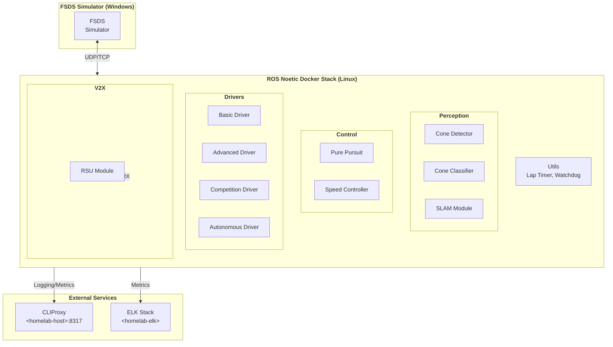

# HYCU FSDS Autonomous Driving / HYCU FSDS 자율주행

> Formula Student Driverless Simulator 기반 자율주행 시스템  
> Formula Student Driverless Simulator (FSDS) Based Autonomous Driving System

[](LICENSE)
[](http://wiki.ros.org/noetic)
[](https://www.python.org/)
[](https://www.docker.com/)
[](https://github.com/qws941/HYCU-FSDS/actions)

---

## 목차 (Table of Contents)

- [개요 (Overview)](#개요-overview)
- [주요 기능 (Key Features)](#주요-기능-key-features)
- [시스템 아키텍처 (System Architecture)](#시스템-아키텍처-system-architecture)
- [자동화 인벤토리 (Automation Inventory)](#자동화-인벤토리-automation-inventory)
- [빠른 시작 (Quick Start)](#빠른-시작-quick-start)
- [로컬 개발 (Local Development)](#로컬-개발-local-development)
- [명령어 참고서 (Commands Reference)](#명령어-참고서-commands-reference)
- [기여 가이드 (Contribution Guide)](#기여-가이드-contribution-guide)

---

## 개요 (Overview)

본 프로젝트는 **Formula Student Driverless Simulator (FSDS)** 기반으로 개발된 자율주행 시스템입니다. Windows 환경의 시뮬레이터와 Linux (ROS Noetic) Docker 기반 자율주행 스택을 결합한 이중 플랫폼 아키텍처로, 콘 감지 (Cone Detection), SLAM, 경로 계획 및 제어 기능을 통합합니다.

This project is an autonomous driving system based on the **Formula Student Driverless Simulator (FSDS)**. It combines a Windows-based simulator with a Linux (ROS Noetic) Docker-based autonomous driving stack, integrating cone detection, SLAM, path planning, and control functions.

### 프로젝트 배경 (Project Background)

본 프로젝트는 자율주행 알고리즘 연구 및 경진 대회 준비를 위해 구축되었으며, 다음 목표를 달성합니다:

- FSDS 시뮬레이터 환경에서의 실시간 자율주행 구현
- ROS Noetic 기반의 모듈화된 자율주행 스택 제공
- Cone Detection 및 SLAM을 통한 환경 인식 능력 확보
- Pure Pursuit 및 속도 제어를 통한 경로 추종 성능 확보

This project was established for autonomous driving algorithm research and competition preparation, achieving the following objectives:

- Real-time autonomous driving implementation within the FSDS simulator
- Modular autonomous driving stack based on ROS Noetic
- Environmental perception capabilities through Cone Detection and SLAM
- Path-following performance through Pure Pursuit and speed control

---

## 주요 기능 (Key Features)

### 자율주행 스택 (Autonomous Driving Stack)

| 모듈 (Module) | 설명 (Description) |
|--------------|-------------------|
| **Perception** | Cone Detection (YOLOv5 기반), SLAM (GMapping/EKFSLAM) |
| **Control** | Pure Pursuit 경로 추종, 속도 프로파일링 및 제어 |
| **Drivers** | Basic, Advanced, Autonomous, Competition 드라이버 모드 |
| **V2X** | RSU (Roadside Unit) 통신 모듈 |

### 개발 환경 (Development Environment)

- **ROS Noetic** on Ubuntu 20.04
- **Docker** 컨테이너化为提供 일관된 개발 및 배포 환경
- **Python 3.8+** 주요 알고리즘 개발
- **FSDS 시뮬레이터** (Windows 기반) 연동

---

## 시스템 아키텍처 (System Architecture)



### 데이터 흐름 (Data Flow)

```
FSDS Simulator → Cone Detection → SLAM → Path Planning → Pure Pursuit → Vehicle Control
                                    ↓
                              Speed Controller → Acceleration/Brake Commands
```

---

## 자동화 인벤토리 (Automation Inventory)

### GitHub Actions 워크플로우 (GitHub Actions Workflows)

본 프로젝트는 **33개**의 GitHub Actions 워크플로우를 통해 종합적인 CI/CD 및 자동화 시스템을 운영합니다.

#### Pull Request 워크플로우

| 워크플로우 파일 | 설명 |
|---------------|------|
| `01_branch-to-pr.yml` | 브랜치에서 PR로 자동 전환 |
| `03_pr-checks.yml` | PR 필수 검사 (테스트, 빌드,린트) |
| `04_actionlint.yml` | GitHub Actions 워크플로우 린트 |
| `05_gitleaks.yml` |Secrets/Leaked 키 스캔 |
| `06_codeql.yml` | CodeQL 정적 분석 |
| `07_dependency-review.yml` | 의존성 보안 검토 |
| `08_scorecard.yml` | OpenSSF Scorecard 평가 |
| `09_semantic-pr.yml` | Semantic PR 커밋 검증 |
| `10_pr-review.yml` | 자동 PR 리뷰 (qodo-ai/pr-agent) |
| `13_pr-auto-merge.yml` | 자동 PR 머지 |
| `14_bot-auto-fix.yml` | 자동 버그 수정/개선 제안 |
| `15_merged-pr-cleanup.yml` | 머지 후 브랜치 정리 |
| `security/11_pr-review.yml` | 보안 특화 PR 리뷰 |

#### 이슈 관리 워크플로우

| 워크플로우 파일 | 설명 |
|---------------|------|
| `02_issue-to-branch.yml` | 이슈 기반 브랜치 자동 생성 |
| `18_issue-management.yml` | 이슈 라이프사이클 관리 |
| `19_issue-backfill.yml` | 이슈 백필/상세화 |
| `37_ci-failure-issues.yml` | CI 실패 시 자동 이슈 생성 |
| `43_reusable-issue-management.yml` | 재사용 가능 이슈 관리 |
| `91_issue-classification.yml` | 이슈 자동 분류/라벨링 |

#### 문서 및 릴리스 워크플로우

| 워크플로우 파일 | 설명 |
|---------------|------|
| `20_readme-gen.yml` | README.md 자동 생성 |
| `21_docs-sync.yml` | 문서 동기화 |
| `24_release-notes.yml` | 릴리스 노트 작성 |
| `25_release-publish.yml` | 릴리스 게시 |
| `42_reusable-docs-sync.yml` | 재사용 가능 문서 동기화 |

#### 의존성 관리 워크플로우

| 워크플로우 파일 | 설명 |
|---------------|------|
| `12_dependabot-auto-merge.yml` | Dependabot PR 자동 머지 |

#### 건강도检查 워크플로우

| 워크플로우 파일 | 설명 |
|---------------|------|
| `29_downstream-health-check.yml` | 다운스트림 리포지토리 건강도检查 |
| `60_ci-auto-heal.yml` | CI 실패 자동 복구 |

#### 기타 워크플로우

| 워크플로우 파일 | 설명 |
|---------------|------|
| `auto-merge.yml` | 범용 자동 머지 |
| `ci.yml` | 메인 CI 파이프라인 |
| `labeler.yml` | PR/이슈 라벨 자동 적용 |
| `welcome.yml` | 신규 기여자 환영 메시지 |
| `44_reusable-pr-checks.yml` | 재사용 가능 PR 검사 |
| `45_reusable-gitleaks.yml` | 재사용 가능 Gitleaks 스캔 |

### 재사용 가능한 워크플로우 (Reusable Workflows)

`_bot-scripts/`에 위치한 재사용 가능한 워크플로우 모듈:

| 모듈 | 설명 |
|------|------|
| `_auto-approve-runs.yml` | 워크플로우 실행 자동 승인 |
| `_auto-merge.yml` | 자동 머지 로직 |
| `_branch-cleanup.yml` | 브랜치 정리 |
| `_ci-python.yml` | Python CI 템플릿 |
| `_codex-pr-review.yml` | AI PR 리뷰 |
| `_codex-auto-issue.yml` | AI 이슈 자동 생성 |
| `_commitlint.yml` | 커밋 메시지 린트 |
| `_dependabot-auto-fix.yml` | Dependabot 자동 수정 |
| `_elk-ingest.yml` | ELK 로그 수집 |
| `_issue-label.yml` | 이슈 자동 라벨링 |
| `_issue-lifecycle.yml` | 이슈 수명주기 관리 |
| `_labeler.yml` | PR 라벨러 |
| `_lock-threads.yml` | 스레드 잠금 |
| `_pr-size.yml` | PR 크기 측정/라벨링 |
| `_release-drafter.yml` | 릴리스 노트 초안 |
| `_stale.yml` | 오래된 이슈/PR 정리 |
| `_welcome.yml` | 기여자 환영 |

### 사용 도구 (Tools)

| 도구 | 용도 |
|------|------|
| **qodo-ai/pr-agent** | AI 기반 PR 리뷰 및 자동화 |
| **Gitleaks** | Secrets 스캐닝 |
| **Actionlint** | GitHub Actions YAML 린트 |
| **CodeQL** | 정적 코드 분석 |
| **OpenSSF Scorecard** | 보안 건강도 평가 |
| **Dependabot** | 의존성 자동 업데이트 |
| **CLIProxy** (`<homelab-host>:8317`) | CI 메트릭 수집 |
| **ELK Stack** (`<homelab-elk>`) | 로그 수집 및 분석 |

---

## 빠른 시작 (Quick Start)

### 전제 조건 (Prerequisites)

- Docker 20.04+
- ROS Noetic (Linux 환경)
- Python 3.8+
- FSDS 시뮬레이터 (Windows, 네트워크 연결 가능)

### Docker 기반 실행

```bash
# 빌드
cd submission
docker-compose build

# 실행
docker-compose up
```

### 개발 모드 실행

```bash
cd submission
./dev.sh
```

### 시뮬레이터 연동

1. Windows 환경에서 FSDS 시뮬레이터 실행
2. Docker 컨테이너가 시뮬레이터의 네트워크 연결 허용
3. `competition_driver.py` 또는 선택된 드라이버 모듈 실행

---

## 로컬 개발 (Local Development)

### 프로젝트 구조 (Project Structure)

```
HYCU-FSDS/
├── README.md
├── LICENSE
├── AGENTS.md
├── CONTRIBUTING.md
├── OWNERS
├── in-memoria.db
├── submission/
│   ├── README.md
│   ├── Dockerfile
│   ├── docker-compose.yml
│   ├── dev.sh
│   ├── run.sh
│   ├── src/
│   │   ├── utils/
│   │   │   ├── lap_timer.py
│   │   │   └── watchdog.py
│   │   ├── drivers/
│   │   │   ├── basic.py
│   │   │   ├── advanced.py
│   │   │   ├── autonomous.py
│   │   │   └── competition.py
│   │   ├── control/
│   │   │   ├── pure_pursuit.py
│   │   │   └── speed.py
│   │   ├── perception/
│   │   │   ├── cone_detector.py
│   │   │   ├── cone_classifier.py
│   │   │   └── slam.py
│   │   └── v2x/
│   │       └── rsu.py
│   ├── config/
│   │   └── driver_params.yaml
│   ├── tests/
│   │   └── test_algorithms.py
│   ├── launch/
│   │   └── competition.launch
│   └── scripts/
│       ├── advanced_driver.py
│       ├── competition_driver.py
│       ├── fsds_driver.py
│       └── simple_slam.py
├── autonomous/
│   ├── Dockerfile
│   ├── docker-compose.yml
│   ├── entrypoint.sh
│   ├── run_all.sh
│   ├── start.sh
│   ├── modules/
│   │   ├── utils/
│   │   │   ├── lap_timer.py
│   │   │   └── watchdog.py
│   │   ├── control/
│   │   │   ├── pure_pursuit.py
│   │   │   └── speed.py
│   │   └── perception/
│   │       ├── cone_detector.py
│   │       ├── cone_classifier.py
│   │       └── slam.py
│   ├── config/
│   │   └── params.yaml
│   ├── tests/
│   │   └── test_algorithms.py
│   └── driver/
│       └── competition_driver.py
└── _bot-scripts/
    ├── AGENTS.md
    ├── CODE_OF_CONDUCT.md
    ├── CONTRIBUTING.md
    ├── Dockerfile.github_action
    ├── Dockerfile.github_app
    ├── LICENSE
    ├── MANIFEST.in
    ├── Makefile
    ├── NOTICE
    ├── README.md
    ├── SECURITY.md
    ├── docker-compose.github_app.yml
    ├── docker-compose.github_app.yml.lxc
    ├── filebeat.yml
    ├── pyproject.toml
    ├── requirements-dev.txt
    ├── requirements.txt
    ├── setup.py
    └── scripts/
        ├── AGENTS.md
        └── check_hardcode_scan_patterns_test.py
```

### 모듈 설명 (Module Descriptions)

#### Drivers (`submission/src/drivers/`)

| 드라이버 | 설명 |
|---------|------|
| `basic.py` | 기본 드라이버 - 시뮬레이션 기본 동작 |
| `advanced.py` | 고급 드라이버 - 고급 알고리즘 적용 |
| `autonomous.py` | 완전 자율주행 드라이버 |
| `competition.py` | 경진 대회용 드라이버 |

#### Control (`submission/src/control/`)

| 모듈 | 설명 |
|------|------|
| `pure_pursuit.py` | Pure Pursuit 경로 추종 알고리즘 |
| `speed.py` | 속도 프로파일링 및 제어 |

#### Perception (`submission/src/perception/`)

| 모듈 | 설명 |
|------|------|
| `cone_detector.py` | 콘 감지 (Detection) |
| `cone_classifier.py` | 콘 분류 (Classification) |
| `slam.py` | SLAM (Simultaneous Localization and Mapping) |

#### Utils (`submission/src/utils/`)

| 유틸리티 | 설명 |
|---------|------|
| `lap_timer.py` | 랩 타임 측정 |
| `watchdog.py` | 프로세스 감시/복구 |

#### V2X (`submission/src/v2x/`)

| 모듈 | 설명 |
|------|------|
| `rsu.py` | Roadside Unit 통신 모듈 |

---

## 명령어 참고서 (Commands Reference)

### Docker 명령어

```bash
# 빌드
cd submission
docker-compose build

# 컨테이너 시작
docker-compose up -d

# 컨테이너 중지
docker-compose down

# 로그 확인
docker-compose logs -f

# 전체 제거
docker-compose down -v
```

### 개발 스크립트

```bash
# 개발 모드 실행
cd submission
./dev.sh

# 프로덕션 실행
cd submission
./run.sh
```

### ROS 실행

```bash
# Competition 런치 파일 실행
roslaunch submission competition.launch

# 개별 노드 실행
rosrun submission competition_driver.py
rosrun submission cone_detector.py
rosrun submission pure_pursuit.py
```

### 테스트

```bash
# 알고리즘 테스트
cd submission
python -m pytest tests/test_algorithms.py -v

# Python 테스트
python -m pytest tests/ -v
```

### 자율주행 스택 실행 (`autonomous/`)

```bash
cd autonomous

# Entrypoint 실행
./entrypoint.sh

# 전체 스택 실행
./run_all.sh

# 시작 스크립트
./start.sh
```

---

## 기여 가이드 (Contribution Guide)

### 기여 방법 (How to Contribute)

1. **이슈 생성 (Create Issue)**
   - 버그 발견, 기능 요청, 문서 개선 등 모든 제안을 이슈로 등록
   - 해당되는 경우 템플릿 사용

2. **브랜치 생성 (Create Branch)**
   - `02_issue-to-branch.yml` 워크플로우가 자동으로 브랜치 생성
   - 수동 생성: `git checkout -b feature/issue-<number>-description`

3. **코드 작성 (Write Code)**
   - Python 스타일 가이드 준수 (`black`, `flake8`)
   - 테스트 작성 및 통과 확인

4. **PR 제출 (Submit PR)**
   - `09_semantic-pr.yml` 커밋 메시지 규칙 준수
   - `03_pr-checks.yml` 모든 검사 통과 필요
   - AI 리뷰 (`10_pr-review.yml`) 활용

5. **리뷰 및 머지 (Review & Merge)**
   - 코드 소유자(OWNERS) 승인 필요
   - `13_pr-auto-merge.yml` 또는 수동 머지

### 코딩 규칙 (Coding Standards)

- **Python**: PEP 8 준수, type hints 권장
- **ROS**: 노드당 단일 책임 원칙
- **커밋 메시지**: Conventional Commits 형식

  ```
  feat: add new cone detection algorithm
  fix: resolve pure pursuit corner case
  docs: update README
  ```

### 테스트 요구사항 (Testing Requirements)

- 새로운 기능에는 단위 테스트 필수
- `tests/test_algorithms.py`에 테스트 추가
- CI 파이프라인 (`ci.yml`)에서 자동 실행

### 문서화 (Documentation)

- 공개 API는 docstring 작성
- README.md 또는 docs/ 디렉토리에 문서 업데이트
- `20_readme-gen.yml`이 자동으로 문서 동기화

### 보안 (Security)

- Secrets은 절대 코드에 포함 금지
- `05_gitleaks.yml`으로 스캔
- 취약점 발견 시 SECURITY.md 참고 또는 비공개 보고

### 라이선스 (License)

이 프로젝트는 MIT 라이선스 하에 제공됩니다.  
기여하는 모든 코드는 동일한 라이선스를继承합니다.

---

## 커뮤니티 (Community)

- **이슈 (Issues)**: <https://github.com/qws941/HYCU-FSDS/issues>
- **논의 (Discussions)**: <https://github.com/qws941/HYCU-FSDS/discussions>
- **SECURITY.md**: 취약점 보고는 비공개로 진행됩니다.

---

## 감사의 말 (Acknowledgments)

- Formula Student Driverless (FSD) 대회
- ROS Noetic 커뮤니티
- 모든 기여자분들

---

**Made with ❤️ by HYCU FSDS Team**
