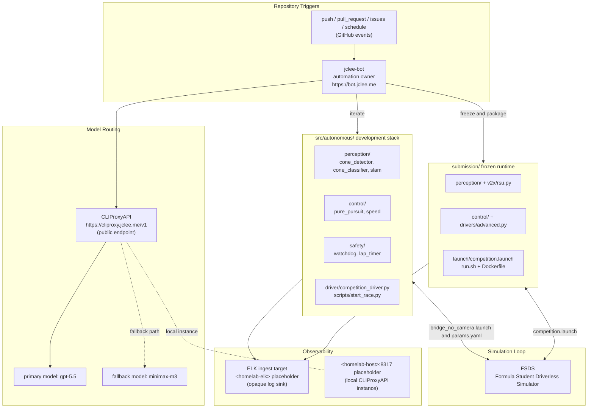

# HYCU FSDS Autonomous Driving / HYCU FSDS 자율주행

> Formula Student Driverless Simulator(FSDS) 기반 자율주행 시스템
> Autonomous driving stack targeting the Formula Student Driverless Simulator (FSDS)


---

## Overview / 개요

**EN**
HYCU FSDS Autonomous Driving is a Dockerized ROS Noetic stack for the Formula Student Driverless Simulator (FSDS). It closes the full perception → planning → control → safety loop, ships V2X roadside-unit support, lap timing, race recording, and a competition-grade packaging pipeline. The repository is intentionally split into two parallel execution paths so the same algorithms can be iterated locally and re-built as a frozen runtime for evaluation without code drift.

**KR**
HYCU FSDS Autonomous Driving은 Formula Student Driverless Simulator(FSDS) 환경을 위한 Docker 기반 ROS Noetic 자율주행 스택입니다. 인지(perception) → 계획(planning) → 제어(control) → 안전(safety) 루프를 완결하며, V2X RSU 지원, 랩 타이밍, 레이스 레코딩, 대회 제출용 패키징 파이프라인을 함께 제공합니다. 저장소는 동일한 알고리즘을 로컬에서 반복 개발하고 평가용 동결 런타임(frozen runtime)으로 재빌드할 수 있도록 두 개의 병렬 실행 경로로 의도적으로 분리되어 있습니다.

### Two Execution Paths / 두 가지 실행 경로

1. **`src/autonomous/`** — Development-oriented stack for algorithm iteration on `bridge_no_camera.launch` and `params.yaml`. / 알고리즘 반복 개발용 자율주행 스택 (`bridge_no_camera.launch`, `params.yaml` 기반).
2. **`submission/`** — Frozen runtime stack for competition submission, re-uses identical module names under `src/` but is rebuilt via `run.sh` / `dev.sh` and shipped as a Docker image. / 대회 제출 또는 평가를 위한 동결 실행 스택(`run.sh` / `dev.sh`로 재빌드되어 Docker 이미지로 출하).

The two paths share the same conceptual module layout (`perception/`, `control/`, `utils/`, `v2x/`, `driver/`) but are versioned independently so the frozen runtime cannot accidentally inherit in-progress development modules.

---

## Features / 주요 기능

### Perception / 인지
- Convolutional cone detection (`perception/cone_detector.py`) — color + shape candidates from FSDS camera frames.
- Cone classifier (`perception/cone_classifier.py`) — refines detector output into blue / yellow / orange / large classes.
- Visual SLAM (`perception/slam.py`) — feature-based localization against the FSDS track map.

### Control / 제어
- Pure pursuit path tracker (`control/pure_pursuit.py`) — geometric steering against a smoothed centerline.
- Speed governor (`control/speed.py`) — curvature-aware target velocity with accel / decel clamps.

### Safety & Timing / 안전 및 타이밍
- Watchdog (`utils/watchdog.py`) — heartbeat supervision of every perception and control node; emergency stop on missed beats.
- Lap timer (`utils/lap_timer.py`) — sector splits and best-lap tracking, exposed as a ROS topic.

### V2X / 차량-인프라 통신
- Roadside unit client (`v2x/rsu.py`) — receives SPaT / MAP messages from a simulated RSU for intersection logic.

### Driver Loop / 드라이버 루프
- `driver/competition_driver.py` — top-level state machine: `WAIT → PREARM → DRIVE → FINISH`.
- `scripts/start_race.py` — race launcher that arms the stack, runs the start light, and switches to `DRIVE`.

### Race Recording / 레이스 레코딩
- `record_race.sh` captures rostopic + rosbag output for offline replay and judging.
- `run_all.sh` chains build → launch → record → package into a single command.

### Packaging / 패키징
- `./scripts/package.sh` produces a self-contained submission tarball with the frozen `submission/` runtime.

---

## Architecture / 아키텍처

### High-level Data Flow / 상위 데이터 흐름



### Stack Layout / 스택 레이아웃

```
.
├── AGENTS.md                 # Project knowledge base (this repo's home)
├── CONTRIBUTING.md           # Contribution policy
├── LICENSE                   # MIT
├── OWNERS                    # Code owners for CODEOWNERS-driven review routing
├── README.md                 # This document
├── in-memoria.db             # Local SQLite cache for long-running run metadata
├── src/
│   ├── autonomous/           # Development iteration stack
│   │   ├── AGENTS.md
│   │   ├── Dockerfile
│   │   ├── docker-compose.yml
│   │   ├── entrypoint.sh
│   │   ├── record_race.sh
│   │   ├── run_all.sh
│   │   ├── start.sh
│   │   ├── config/
│   │   │   ├── bridge_no_camera.launch
│   │   │   └── params.yaml
│   │   ├── driver/
│   │   │   └── competition_driver.py
│   │   ├── modules/
│   │   │   ├── perception/   # cone_detector, cone_classifier, slam
│   │   │   ├── control/      # pure_pursuit, speed
│   │   │   └── utils/        # lap_timer, watchdog
│   │   ├── scripts/
│   │   │   └── start_race.py
│   │   └── tests/
│   │       └── test_algorithms.py
│   └── simulator/
│       ├── README.md
│       └── settings.json
├── scripts/
│   └── package.sh            # Submission tarball builder
├── docs/
│   ├── SUBMISSION_GUIDE.md
│   └── reference_materials/  # FSDS install notes, SLAM and V2X lecture notebooks
└── submission/               # Frozen runtime stack
    ├── AGENTS.md
    ├── Dockerfile
    ├── README.md
    ├── dev.sh
    ├── docker-compose.yml
    ├── run.sh
    ├── launch/
    │   └── competition.launch
    ├── src/
    │   ├── drivers/          # basic, autonomous, advanced, competition
    │   ├── perception/       # cone_detector, cone_classifier, slam
    │   ├── v2x/              # rsu.py
    │   ├── utils/            # lap_timer, watchdog
    │   └── control/          # pure_pursuit, speed
    └── autonomous/           # Submission-side autonomous mirror
        ├── Dockerfile
        ├── docker-compose.yml
        ├── entrypoint.sh
        ├── run_all.sh
        ├── start.sh
        ├── config/params.yaml
        ├── driver/competition_driver.py
        └── modules/perception/
```

> The two top-level `autonomous/` trees (`src/autonomous/` and `submission/autonomous/`) are intentionally separate so the frozen runtime stays reproducible while the development tree keeps moving.

---

## jclee-bot Automation Surfaces / jclee-bot 자동화 영역

**EN**
All mutating repository automation is owned by `jclee-bot` (reachable at `https://bot.jclee.me`). The bot is the source of truth; the GitHub workflow files under `.github/workflows/` are merely implementation triggers that fire the bot's automation. The automation surfaces are:

- **Issue intake & branching** — new issues are triaged, labeled, and converted into working branches. Issue automation behavior is tagged `jclee-bot에의해자동화됨` so human reviewers can see at a glance which issues are bot-driven.
- **Branch → PR** — working branches are automatically opened as pull requests with the correct base and reviewers resolved from `OWNERS`.
- **PR review (general + security)** — general code review uses [qodo-ai/pr-agent](https://github.com/qodo-ai/pr-agent) as the suggestion engine; a separate security-focused review pass checks dependencies, secrets, and unsafe ROS message types.
- **Dependabot auto-merge** — patch and minor Dependabot PRs that pass CI and review are auto-merged by jclee-bot.
- **PR auto-merge** — PRs that pass the full gate (CI green, `qodo-ai/pr-agent` review non-blocking, approvals per `OWNERS`) are squash-merged.
- **Bot auto-fix** — when review or CI surfaces a fixable issue, jclee-bot opens a follow-up PR against the same branch.
- **Merged PR cleanup** — branches whose PRs are merged are deleted; stale remote refs are pruned.
- **Issue backfill** — periodic scan of the repo for TODOs, `FIXME` comments, and crash logs that were never filed as issues, and opens them with a backfill label.
- **Release notes & publish** — release notes are drafted from merged PRs and a release is published and tagged.
- **Downstream health check** — pings downstream consumers (sim images, ELK ingest, etc.) and opens an issue if any consumer reports an error.
- **CI failure issues** — when a CI run fails on `master` and is not retried successfully within a window, jclee-bot opens a labeled failure issue with the failing log attached.

**KR**
저장소의 모든 변형(mutating) 자동화는 `jclee-bot`이 소유합니다(엔드포인트: `https://bot.jclee.me`). 봇 자체가 단일 진실 공급원(Source of Truth)이며, `.github/workflows/` 안의 GitHub 워크플로우 파일들은 봇 자동화를 *발화시키는* 구현 트리거일 뿐입니다. 자동화 영역은 다음과 같이 구분됩니다.

- **이슈 접수 및 브랜치 생성** — 신규 이슈를 분류·라벨링한 뒤 작업 브랜치로 변환합니다. 이슈 자동화 동작에는 `jclee-bot에의해자동화됨` 마커가 붙어, 어느 이슈가 봇에 의해 처리되고 있는지를 한눈에 식별할 수 있습니다.
- **브랜치 → PR** — 작업 브랜치는 올바른 base 및 리뷰어(`OWNERS` 기준)와 함께 자동으로 PR로 열립니다.
- **PR 리뷰(일반 + 보안)** — 일반 코드 리뷰는 [qodo-ai/pr-agent](https://github.com/qodo-ai/pr-agent)를 제안 엔진으로 사용하며, 별도의 보안 리뷰 패스가 의존성, 시크릿, 안전하지 않은 ROS 메시지 타입을 점검합니다.
- **Dependabot 자동 머지** — CI와 리뷰를 통과한 Dependabot PR의 patch/minor 업데이트는 jclee-bot이 자동 머지합니다.
- **PR 자동 머지** — 전체 게이트(CI 통과, `qodo-ai/pr-agent` 리뷰 비차단, `OWNERS` 승인)를 통과한 PR은 squash 머지됩니다.
- **봇 자동 수정** — 리뷰나 CI가 수정 가능한 사안을 발견하면, jclee-bot이 동일 브랜치에 후속 PR을 엽니다.
- **머지된 PR 정리** — PR이 머지된 브랜치는 삭제되고 원격 ref가 가지치기됩니다.
- **이슈 백필** — 주기적으로 저장소를 스캔하여 이슈로 등록되지 않은 `TODO`/`FIXME` 주석과 크래시 로그를 발견하면 백필 라벨과 함께 이슈를 엽니다.
- **릴리스 노트 및 퍼블리시** — 머지된 PR로부터 릴리스 노트가 초안 작성되며, 릴리스가 퍼블리시·태깅됩니다.
- **다운스트림 헬스 체크** — 다운스트림 컨슈머(시뮬레이터 이미지, ELK 인제스트 등)에 헬스 체크를 보내고 오류가 보고되면 이슈를 엽니다.
- **CI 실패 이슈** — `master`에서 CI가 실패한 후 일정 시간 내 재시도 성공이 없으면, jclee-bot이 실패 로그를 첨부한 라벨된 이슈를 엽니다.

> Workflow files exist only to dispatch the bot's automation; they are not the automation source of truth. Add or change surfaces by editing the bot configuration, not by adding new workflow files. / 워크플로우 파일은 봇 자동화를 *디스패치*하기 위해서만 존재하며 자동화의 진실 공급원이 아닙니다. 자동화 영역을 추가/변경할 때는 새 워크플로우를 추가하지 말고 봇 구성을 변경하세요.

---

## Go Tools / Go 도구

**EN**
This repository contains no Go-based automation tools. All automation logic is centralized in the `jclee-bot` service (Python) reached at `https://bot.jclee.me`, and the LLM routing layer is provided by CLIProxyAPI at `https://cliproxy.jclee.me/v1` (primary `gpt-5.5`, fallback `minimax-m3`). All internal homelab addresses are represented as opaque placeholders such as `<homelab-host>` and `<homelab-elk>` rather than concrete RFC1918 IPs or container numbers.

**KR**
이 저장소에는 Go 기반 자동화 도구가 포함되어 있지 않습니다. 모든 자동화 로직은 `https://bot.jclee.me`에 위치한 `jclee-bot` 서비스(Python)에 중앙 집중되어 있으며, LLM 라우팅 계층은 `https://cliproxy.jclee.me/v1`의 CLIProxyAPI(기본 `gpt-5.5`, 대체 `minimax-m3`)가 제공합니다. 사설(homelab) 내부 주소는 모두 `<homelab-host>`, `<homelab-elk>` 같은 불투명 플레이스홀더로 표현하며, RFC1918 사설 IP나 컨테이너 번호를 직접 기재하지 않습니다.

---

## Quick Start / 빠른 시작

### Prerequisites / 사전 요구사항

- Docker Engine 20.10+ and `docker compose` v2
- Python 3.8+ (for running scripts outside the container)
- ROS Noetic (only required if you want to run nodes directly on the host, not in Docker)
- Formula Student Driverless Simulator (FSDS) installed and importable

### Clone / 클론

```bash
git clone https://github.com/qws941/hycu-fsds-autonomous.git
cd hycu-fsds-autonomous
```

### Build the Development Stack / 개발 스택 빌드

```bash
cd src/autonomous
docker compose build
./start.sh                 # bring up the dev stack
./record_race.sh           # record rostopic + rosbag output
```

### Build the Frozen Submission Stack / 동결 제출 스택 빌드

```bash
cd submission
./dev.sh                   # iterates on the frozen stack locally
./run.sh                   # runs the frozen image against FSDS
cd ..
./scripts/package.sh       # produces the submission tarball
```

---

## Local Development / 로컬 개발

### Iteration Loop on `src/autonomous/` / 개발 스택 반복

1. Edit perception / control / safety modules under `src/autonomous/modules/`.
2. Re-launch with `./start.sh` (it sources `config/params.yaml` and `config/bridge_no_camera.launch`).
3. Drive the FSDS simulator and watch the watchdog topic.
4. Run unit tests:
   ```bash
   pytest src/autonomous/tests/test_algorithms.py
   ```

### Iteration Loop on `submission/` / 제출 스택 반복

1. Edit the matching files under `submission/src/`.
2. Rebuild the image:
   ```bash
   cd submission && docker compose build
   ```
3. Run `./run.sh` against a live FSDS instance, or `./dev.sh` for a host-mount development loop.

### Recording a Race / 레이스 레코딩

```bash
cd src/autonomous
./run_all.sh               # build → launch → record → package
```

The `record_race.sh` script produces a rostopic echo log plus a `rosbag` recording; both are written to the run directory captured by the script.

---

## Commands Reference / 명령어 레퍼런스

| Command / 명령어 | Purpose / 용도 |
| --- | --- |
| `./scripts/package.sh` | Build the submission tarball from the frozen `submission/` runtime. / 동결 런타임으로 제출 tarball을 생성합니다. |
| `cd src/autonomous && docker compose build` | Build the development Docker image. / 개발용 Docker 이미지를 빌드합니다. |
| `cd src/autonomous && ./start.sh` | Launch the dev stack with `bridge_no_camera.launch`. / `bridge_no_camera.launch`로 개발 스택을 기동합니다. |
| `cd src/autonomous && ./run_all.sh` | Build, launch, record, and package in one shot. / 빌드, 기동, 레코딩, 패키징을 한 번에 수행합니다. |
| `cd src/autonomous && ./record_race.sh` | Record rostopic and rosbag output for the current run. / 현재 실행의 rostopic/rosbag 출력을 기록합니다. |
| `python3 src/autonomous/scripts/start_race.py` | Run the race launcher state machine on the host. / 호스트에서 레이스 시작 상태기계를 실행합니다. |
| `python3 src/autonomous/driver/competition_driver.py` | Run the top-level driver state machine directly. / 최상위 드라이버 상태기계를 직접 실행합니다. |
| `pytest src/autonomous/tests/test_algorithms.py` | Run the algorithm unit tests. / 알고리즘 단위 테스트를 실행합니다. |
| `cd submission && docker compose build` | Build the frozen runtime image. / 동결 런타임 이미지를 빌드합니다. |
| `cd submission && ./dev.sh` | Develop against the frozen stack with a host mount. / 호스트 마운트로 동결 스택 위에서 개발합니다. |
| `cd submission && ./run.sh` | Run the frozen runtime against a live FSDS instance. / 라이브 FSDS 인스턴스에서 동결 런타임을 실행합니다. |
| `cd src/simulator && cat settings.json` | Inspect the simulator bridge settings. / 시뮬레이터 브리지 설정을 확인합니다. |

---

## Contribution Guide / 기여 가이드

### Branching / 브랜치 전략

- Branch from `master`.
- Use a topic prefix that matches one of the surfaces the bot tracks, e.g. `feat/`, `fix/`, `perf/`, `docs/`, `test/`, `chore/`.
- Keep the dev stack (`src/autonomous/`) and the frozen runtime (`submission/`) in separate commits when they are intentionally diverging; the bot's auto-fix and auto-merge pipelines rely on clean per-surface commits.

### Commit Messages / 커밋 메시지

- Use Conventional Commits (`feat:`, `fix:`, `refactor:`, `docs:`, `test:`, `chore:`).
- Reference the issue number with `Refs #NNN` so the bot's release-notes drafter can pick up the PR.

### Code Style / 코드 스타일

- Python 3.8+ baseline; PEP 8 with `black` (line length 100) and `isort`.
- ROS Noetic: every node must publish a heartbeat that `utils/watchdog.py` can subscribe to; nodes that miss three beats in a row are stopped.
- New perception / control modules must ship with a unit test under `src/autonomous/tests/`.

### Pull Request Flow / 풀 리퀘스트 흐름

1. Push the branch; the bot opens the PR automatically (branch-to-PR surface).
2. `qodo-ai/pr-agent` posts a review with suggestions; treat them as advisory and respond or push fixes.
3. A security-focused review pass runs in parallel.
4. Approvals are routed by `OWNERS`.
5. Once CI is green, reviews are non-blocking, and approvals are present, the bot auto-merges with a squash commit.

### Issue Flow / 이슈 흐름

- Use the provided issue templates; the bot applies labels, milestones, and the `jclee-bot에의해자동화됨` marker for any further automation on the issue.
- Stale issues are closed by the bot's lifecycle automation; reopen with new context if still relevant.

### Safety / 안전 정책

- Anything that touches the throttle, brake, or steering topics must go through `control/speed.py` and `control/pure_pursuit.py`; direct writes to `/vesc/...` are blocked at the driver level.
- The watchdog is a hard dependency — a node that cannot heartbeat is auto-stopped; do not disable it.

---

## License / 라이선스

Released under the [MIT License](./LICENSE).

## Maintainers / 메인테이너

See [`OWNERS`](./OWNERS).