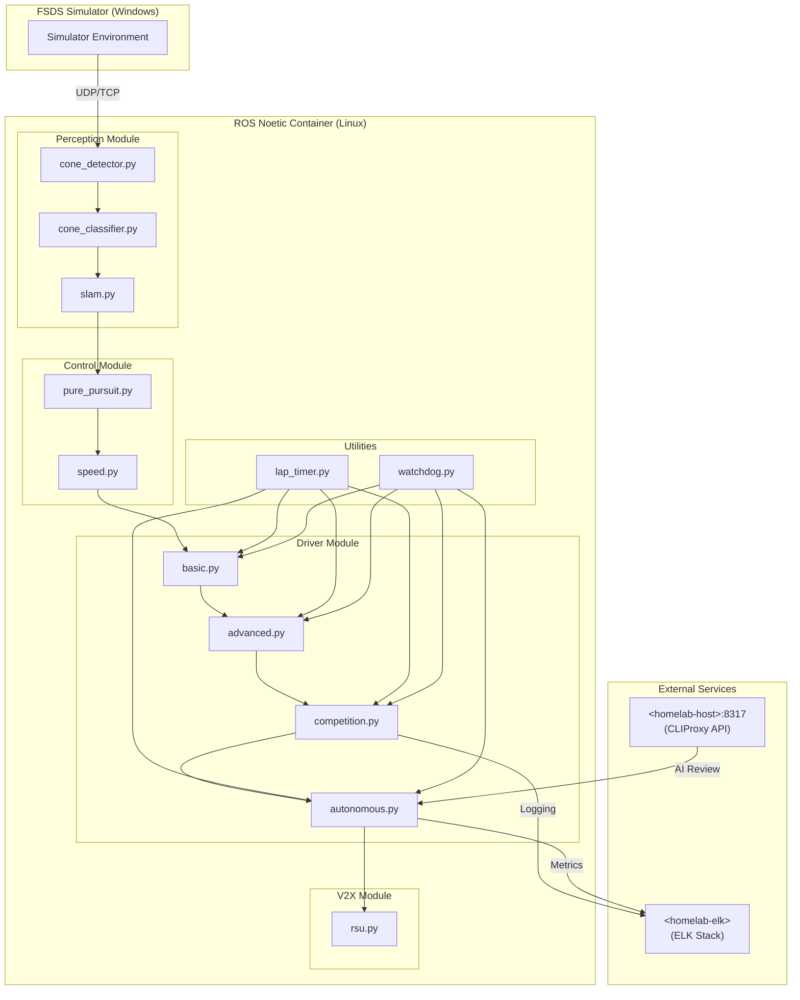

# HYCU FSDS Autonomous Driving / HYCU FSDS 자율주행

> Formula Student Driverless Simulator 기반 자율주행 시스템  
> Formula Student Driverless Simulator (FSDS) Based Autonomous Driving System

[](LICENSE)
[](http://wiki.ros.org/noetic)
[](https://www.python.org/)
[](https://www.docker.com/)
[](https://github.com/qws941/HYCU-FSDS/actions)

---

## 목차 (Table of Contents)

- [개요 (Overview)](#개요-overview)
- [주요 기능 (Key Features)](#주요-기능-key-features)
- [시스템 아키텍처 (System Architecture)](#시스템-아키텍처-system-architecture)
- [자동화 인벤토리 (Automation Inventory)](#자동화-인벤토리-automation-inventory)
- [빠른 시작 (Quick Start)](#빠른-시작-quick-start)
- [로컬 개발 (Local Development)](#로컬-개발-local-development)
- [명령어 참고서 (Commands Reference)](#명령어-참고서-commands-reference)
- [기여 가이드 (Contribution Guide)](#기여-가이드-contribution-guide)

---

## 개요 (Overview)

본 프로젝트는 **Formula Student Driverless Simulator (FSDS)** 기반으로 개발된 자율주행 시스템입니다. Windows 환경의 시뮬레이터와 Linux (ROS Noetic) Docker 기반 자율주행 스택을 결합한 이중 플랫폼 아키텍처로, 콘 감지 (Cone Detection), SLAM, 경로 계획 및 제어 기능을 통합합니다.

This project is an autonomous driving system based on the **Formula Student Driverless Simulator (FSDS)**. It combines a Windows-based simulator with a Linux (ROS Noetic) Docker-based autonomous driving stack, integrating cone detection, SLAM, path planning, and control functions.

### 프로젝트 배경 (Project Background)

본 프로젝트는 자율주행 알고리즘 연구 및 경진 대회 준비를 위해 구축되었으며, 다음 목표를 달성합니다:

- FSDS 시뮬레이터 환경에서의 실시간 자율주행을 구현
- ROS Noetic 기반의 모듈화된 자율주행 스택 제공
- Cone Detection 및 SLAM을 통한 환경 인식 능력 확보
- Pure Pursuit 및 속도 제어를 통한 경로 추종 성능 확보

This project was established for autonomous driving algorithm research and competition preparation, achieving the following objectives:

- Implement real-time autonomous driving in the FSDS simulator environment
- Provide a modular autonomous driving stack based on ROS Noetic
- Secure environmental perception through cone detection and SLAM
- Ensure path-following performance through pure pursuit and speed control

---

## 주요 기능 (Key Features)

### 자율주행 모듈 (Autonomous Driving Modules)

| 모듈 (Module) | 설명 (Description) |
|---------------|-------------------|
| **Perception** | Cone detection, classification, SLAM |
| **Control** | Pure pursuit, speed control |
| **Drivers** | Basic, Advanced, Competition, Autonomous modes |
| **V2X** | RSU (Roadside Unit) communication |

### 개발 인프라 (Development Infrastructure)

| 기능 (Feature) | 설명 (Description) |
|---------------|-------------------|
| **이중 플랫폼** | Windows FSDS + Linux Docker (ROS Noetic) |
| **컨테이너화** | Docker 기반 일관된 개발 환경 |
| **모듈화 설계** | 독립적인 모듈 분리 (perception, control, drivers, v2x) |
| **테스트 프레임워크** | pytest 기반 단위 테스트 |
| **자동화 CI/CD** | GitHub Actions 기반 완전 자동화 |

---

## 시스템 아키텍처 (System Architecture)

### 전체架构 (Overall Architecture)



### 모듈 의존성 (Module Dependencies)

```mermaid
flowchart LR
    subgraph Input["Input Layer"]
        sensor[Sensor Data]
    end

    subgraph感知层["Perception Layer"]
        detection[Cone Detection]
        classification[Cone Classification]
        mapping[SLAM Mapping]
    end

    subgraph规划层["Planning Layer"]
        planning[Path Planning]
    end

    subgraph控制层["Control Layer"]
        pursuit[Pure Pursuit]
        speed_ctrl[Speed Control]
    end

    subgraph执行层["Execution Layer"]
        basic_driver[Basic Driver]
        adv_driver[Advanced Driver]
        comp_driver[Competition Driver]
        auto_driver[Autonomous Driver]
    end

    sensor --> detection
    detection --> classification
    classification --> mapping
    mapping --> planning
    planning --> pursuit
    pursuit --> speed_ctrl
    speed_ctrl --> basic_driver
    speed_ctrl --> adv_driver
    speed_ctrl --> comp_driver
    speed_ctrl --> auto_driver
```

### 디렉터리 구조 (Directory Structure)

```text
HYCU-FSDS/
├── AGENTS.md                    # AI 에이전트 지침서
├── CONTRIBUTING.md              # 기여 가이드
├── LICENSE                      # MIT 라이선스
├── OWNERS                       # 코드 소유자
├── README.md                    # 본 문서
├── in-memoria.db                # SQLite 데이터베이스
│
├── submission/                  # 제출용 완전한 자율주행 시스템
│   ├── AGENTS.md
│   ├── Dockerfile
│   ├── README.md
│   ├── dev.sh
│   ├── docker-compose.yml
│   ├── run.sh
│   ├── docs/
│   │   └── ARCHITECTURE.md
│   ├── src/
│   │   ├── __init__.py
│   │   ├── utils/
│   │   │   ├── __init__.py
│   │   │   ├── lap_timer.py
│   │   │   └── watchdog.py
│   │   ├── drivers/
│   │   │   ├── __init__.py
│   │   │   ├── advanced.py
│   │   │   ├── autonomous.py
│   │   │   ├── basic.py
│   │   │   └── competition.py
│   │   ├── control/
│   │   │   ├── __init__.py
│   │   │   ├── pure_pursuit.py
│   │   │   └── speed.py
│   │   ├── perception/
│   │   │   ├── __init__.py
│   │   │   ├── cone_classifier.py
│   │   │   ├── cone_detector.py
│   │   │   └── slam.py
│   │   └── v2x/
│   │       ├── __init__.py
│   │       └── rsu.py
│   ├── config/
│   │   └── driver_params.yaml
│   ├── tests/
│   │   └── test_algorithms.py
│   ├── launch/
│   │   └── competition.launch
│   └── scripts/
│       ├── advanced_driver.py
│       ├── competition_driver.py
│       ├── fsds_driver.py
│       └── simple_slam.py
│
├── autonomous/                  # 자율주행 독립 실행 모듈
│   ├── Dockerfile
│   ├── docker-compose.yml
│   ├── entrypoint.sh
│   ├── run_all.sh
│   ├── start.sh
│   ├── modules/
│   │   ├── __init__.py
│   │   ├── utils/
│   │   │   ├── __init__.py
│   │   │   ├── lap_timer.py
│   │   │   └── watchdog.py
│   │   ├── control/
│   │   │   ├── __init__.py
│   │   │   ├── pure_pursuit.py
│   │   │   └── speed.py
│   │   ├── perception/
│   │   │   ├── __init__.py
│   │   │   ├── cone_classifier.py
│   │   │   ├── cone_detector.py
│   │   │   └── slam.py
│   │   └── driver/
│   │       └── competition_driver.py
│   ├── config/
│   │   └── params.yaml
│   └── tests/
│       └── test_algorithms.py
│
└── .github/                     # GitHub 설정 (workflows는 _bot-scripts/에서 관리)
```

---

## 자동화 인벤토리 (Automation Inventory)

본 프로젝트는 GitHub Actions 기반의 comprehensive한 CI/CD 자동화를 포함합니다. 모든 workflow 파일은 `_bot-scripts/` 디렉터리에서 관리되며, `20_readme-gen.yml` workflow에 의해 자동으로 동기화됩니다.

All workflow files are managed in the `_bot-scripts/` directory and automatically synced to this repository by the `20_readme-gen.yml` workflow.

### Workflow 파일 인벤토리 (Workflow File Inventory)

#### 1. Pull Request 및 Merge 자동화

| Workflow 파일 | 설명 |
|--------------|------|
| `01_branch-to-pr.yml` | 브랜치에서 PR로 자동 변환 |
| `03_pr-checks.yml` | PR 필수 체크 (lint, test, build) |
| `09_semantic-pr.yml` | Semantic PR 제목 검증 |
| `10_pr-review.yml` | AI 기반 PR 리뷰 (qodo-ai/pr-agent) |
| `13_pr-auto-merge.yml` | 자동 머지 트리거 |
| `14_bot-auto-fix.yml` | Bot에 의한 자동 수정 |
| `15_merged-pr-cleanup.yml` | 머지 후 브랜치 정리 |
| `44_reusable-pr-checks.yml` | 재사용 가능한 PR 체크 |
| `security/11_pr-review.yml` | 보안 리뷰 워크플로우 |

#### 2. Issue 및 태스크 관리

| Workflow 파일 | 설명 |
|--------------|------|
| `02_issue-to-branch.yml` | Issue에서 브랜치 자동 생성 |
| `18_issue-management.yml` | Issue 수명 주기 관리 |
| `19_issue-backfill.yml` | Issue 백필 자동화 |
| `37_ci-failure-issues.yml` | CI 실패 시 Issue 자동 생성 |
| `42_reusable-docs-sync.yml` | 문서 동기화 |
| `43_reusable-issue-management.yml` | 재사용 가능한 Issue 관리 |
| `91_issue-classification.yml` | Issue 분류 및 라벨링 |

#### 3. 보안 및 품질

| Workflow 파일 | 설명 |
|--------------|------|
| `04_actionlint.yml` | GitHub Actions lint 검증 |
| `05_gitleaks.yml` | secrets 및 credentials 스캔 |
| `06_codeql.yml` | CodeQL 정적 분석 |
| `07_dependency-review.yml` | 의존성 보안 리뷰 |
| `08_scorecard.yml` | OpenSSF Scorecard 평가 |
| `45_reusable-gitleaks.yml` | 재사용 가능한 gitleaks |
| `60_ci-auto-heal.yml` | CI 자동 복구 |

#### 4. Release 및 배포

| Workflow 파일 | 설명 |
|--------------|------|
| `24_release-notes.yml` | 자동 Release 노트 생성 |
| `25_release-publish.yml` | Release 게시 및 배포 |
| `29_downstream-health-check.yml` | 다운스트림 리포지토리 상태 확인 |

#### 5. 유지보수 자동화

| Workflow 파일 | 설명 |
|--------------|------|
| `12_dependabot-auto-merge.yml` | Dependabot 자동 머지 |
| `20_readme-gen.yml` | README 자동 생성 |
| `21_docs-sync.yml` | 문서 동기화 |
| `auto-merge.yml` | 일반 자동 머지 |
| `ci.yml` | 주 CI 파이프라인 |
| `labeler.yml` | PR 라벨 자동 분류 |
| `welcome.yml` | 새로운 기여자 환영 |

### 외부 연동 서비스 (External Integration Services)

| 서비스 | 엔드포인트 | 용도 |
|--------|----------|------|
| **CLIProxy API** | `https://cliproxy.jclee.me/v1` | AI 리뷰 및 코드 분석 |
| **PR Agent** | `https://github.com/qodo-ai/pr-agent` | 자동 PR 리뷰 |
| **ELK Stack** | `<homelab-elk>` | 로깅 및 메트릭 수집 |
| **GitHub Bot** | `bot.jclee.me` | CI/CD webhook 처리 |

---

## 빠른 시작 (Quick Start)

### 전제 조건 (Prerequisites)

- Docker 20.10+
- Docker Compose 1.29+
- Python 3.8+
- ROS Noetic (Linux 환경)
- Git

### 1. 저장소 복제 (Clone Repository)

```bash
git clone https://github.com/qws941/HYCU-FSDS.git
cd HYCU-FSDS
```

### 2. Docker 기반 실행 (Run with Docker)

#### 전체 자율주행 스택 실행

```bash
cd submission
docker-compose up --build
```

#### 독립형 자율주행 모듈 실행

```bash
cd autonomous
docker-compose up --build
```

### 3. 직접 실행 (Direct Run)

#### Bash 스크립트 사용

```bash
# 제출용 시스템 실행
./submission/run.sh

# 개발 모드 실행
./submission/dev.sh
```

#### Python 스크립트 직접 실행

```bash
# Competition Driver 실행
python3 submission/scripts/competition_driver.py

# Advanced Driver 실행
python3 submission/scripts/advanced_driver.py

# FSDS Driver 실행
python3 submission/scripts/fsds_driver.py

# Simple SLAM 실행
python3 submission/scripts/simple_slam.py
```

### 4. 로컬 ROS 환경 설정 (Local ROS Setup)

```bash
# ROS Noetic 설치 (Ubuntu 20.04)
sudo sh -c 'echo "deb http://packages.ros.org/ros/ubuntu focal main" > /etc/apt/sources.list.d/ros-latest.list'
sudo apt-key adv --keyserver 'hkp://keyserver.ubuntu.com:80' --recv-key C1CF6E31E6BADE8868B172C4D1D87BFCD1C8FD6C
sudo apt update
sudo apt install ros-noetic-ros-base

# 소스 디렉토리에 모듈 경로 추가
export PYTHONPATH=$PYTHONPATH:/path/to/HYCU-FSDS/submission/src
```

---

## 로컬 개발 (Local Development)

### 개발 환경 설정 (Development Environment Setup)

#### 1. 의존성 설치 (Install Dependencies)

```bash
# Python 의존성 설치
pip install -r requirements.txt

# 개발용 의존성 설치
pip install -r requirements-dev.txt
```

#### 2. 환경 변수 설정 (Environment Variables)

```bash
# .env 파일 생성
cat > .env << 'EOF'
ROS_MASTER_URI=http://localhost:11311
FSDS_HOST=localhost
FSDS_PORT=5555
CLIPROXY_API=https://cliproxy.jclee.me/v1
EOF

# 환경 변수 로드
source .env
```

#### 3. 테스트 실행 (Run Tests)

```bash
# 모든 테스트 실행
pytest submission/tests/test_algorithms.py -v

# 특정 테스트 실행
pytest submission/tests/test_algorithms.py -v -k test_pure_pursuit

# 커버리지 포함 테스트
pytest submission/tests/test_algorithms.py --cov=src --cov-report=html
```

### 코드 스타일 가이드 (Code Style Guide)

```bash
# Python lint 체크
python3 -m pylint submission/src/

# 포맷팅
python3 -m black submission/src/

# 타입 체크
python3 -m mypy submission/src/
```

### 디버깅 (Debugging)

#### Docker 컨테이너 내부에서 디버깅

```bash
# 컨테이너 접속
docker exec -it hycu-fsds-submission bash

# 프로세스 확인
ps aux | grep python

# 로그 확인
tail -f /var/log/supervisor/*.log
```

---

## 명령어 참고서 (Commands Reference)

### Docker 명령어 (Docker Commands)

| 명령어 | 설명 |
|--------|------|
| `docker-compose -f submission/docker-compose.yml up --build` | 제출 시스템 빌드 및 실행 |
| `docker-compose -f autonomous/docker-compose.yml up --build` | 자율주행 모듈 빌드 및 실행 |
| `docker-compose -f submission/docker-compose.yml down` | 제출 시스템 중지 |
| `docker-compose -f autonomous/docker-compose.yml down` | 자율주행 모듈 중지 |
| `docker logs -f <container_name>` | 컨테이너 로그 확인 |

### Python 스크립트 명령어 (Python Script Commands)

| 명령어 | 설명 |
|--------|------|
| `python3 submission/scripts/competition_driver.py` | 경진 대회용 Driver 실행 |
| `python3 submission/scripts/advanced_driver.py` | 고급 Driver 실행 |
| `python3 submission/scripts/fsds_driver.py` | FSDS 연결 Driver 실행 |
| `python3 submission/scripts/simple_slam.py` | Simple SLAM 실행 |

### GitHub Actions 워크플로우 트리거 (GitHub Actions Workflow Triggers)

| Event | Workflow 파일 | 설명 |
|-------|---------------|------|
| `push` | `03_pr-checks.yml`, `05_gitleaks.yml`, `20_readme-gen.yml` | Push 시 체크 |
| `pull_request` | `03_pr-checks.yml`, `10_pr-review.yml`, `13_pr-auto-merge.yml` | PR 시 체크 및 리뷰 |
| `issueopened` | `02_issue-to-branch.yml`, `18_issue-management.yml` | Issue 자동处理 |
| `schedule` | `08_scorecard.yml`, `12_dependabot-auto-merge.yml` | 주기적 실행 |
| `workflow_dispatch` | `21_docs-sync.yml`, `42_reusable-docs-sync.yml` |手動 실행 |

### 일반적인 개발 명령어 (Common Development Commands)

```bash
# Git 브랜치 생성
git checkout -b feature/my-feature

# 변경 사항 커밋
git add .
git commit -m "feat: add new feature"

# 원격에 푸시
git push origin feature/my-feature

# PR 생성
gh pr create --title "feat: add new feature" --body "Description"
```

---

## 기여 가이드 (Contribution Guide)

### 기여 방법 (How to Contribute)

1. **Fork** 저장소를 생성합니다
2. **Feature 브랜치**를 생성합니다: `git checkout -b feature/amazing-feature`
3. 변경 사항을 **Commit**합니다: `git commit -m 'feat: add amazing feature'`
4. **Push**합니다: `git push origin feature/amazing-feature`
5. **Pull Request**를 생성합니다

### 커밋 메시지 규칙 (Commit Message Convention)

```
feat: 새로운 기능 추가
fix: 버그 수정
docs: 문서 변경
style: 코드 스타일 변경 (기능 변경 없음)
refactor: 코드 리팩토링
test: 테스트 관련 변경
chore: 빌드 프로세스 또는 보조 도구 변경
```

### 코드 리뷰 프로세스 (Code Review Process)

1. PR 생성 후 자동화된 체크가 실행됩니다 (`03_pr-checks.yml`)
2. AI 기반 코드 리뷰가 수행됩니다 (`10_pr-review.yml` - qodo-ai/pr-agent)
3. 리뷰어가 코드를 검토합니다
4. 모든 체크가 통과하면 자동 머지됩니다 (`13_pr-auto-merge.yml`)

### 버그 리포트 및 기능 요청 (Bug Reports and Feature Requests)

버그 리포트나 기능 요청은 [GitHub Issues](https://github.com/qws941/HYCU-FSDS/issues)를 통해 제출해주세요. 다음과 같은 정보를 포함하면 좋습니다:

- 명확한 설명
- 재현 단계
- 예상 결과와 실제 결과
- 환경 정보 (OS, Python 버전, Docker 버전 등)

### 문서화 (Documentation)

문서 업데이트는 다음 우선순위로 진행됩니다:

1. 코드 내 주석 (Inline comments)
2. `submission/docs/ARCHITECTURE.md` 업데이트
3. `README.md` 업데이트
4. `AGENTS.md` 업데이트 (AI 에이전트용)

---

## 라이선스 (License)

이 프로젝트는 MIT 라이선스 하에 공개됩니다. 자세한 내용은 [LICENSE](LICENSE) 파일을 참조하세요.

This project is licensed under the MIT License. See [LICENSE](LICENSE) for details.

---

## 연락처 (Contact)

- **Repository**: [https://github.com/qws941/HYCU-FSDS](https://github.com/qws941/HYCU-FSDS)
- **Issues**: [https://github.com/qws941/HYCU-FSDS/issues](https://github.com/qws941/HYCU-FSDS/issues)
- **CI/CD Automation**: `_bot-scripts/` 디렉터리参照

---

*본 README는 `20_readme-gen.yml` workflow에 의해 자동으로 생성 및 업데이트됩니다.*

*This README is automatically generated and updated by the `20_readme-gen.yml` workflow.*
