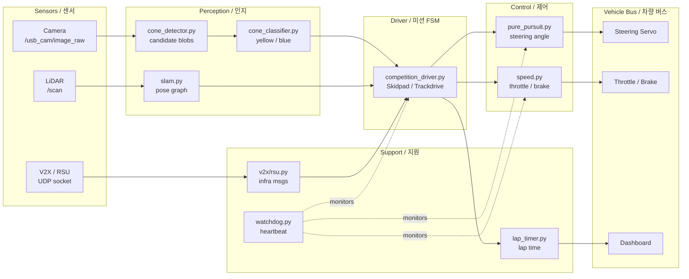

# Formula Student Driverless — Autonomous Racing Stack

> **FSD (Formula Student Driverless) 자율주행 레이싱 소프트웨어 스택**
> Autonomous racing software stack for the Formula Student Driverless competition

이 저장소는 FSD 대회를 위한 완전 자율주행 레이싱 차량 소프트웨어를 제공합니다. SLAM, 콘 감지/분류, Pure Pursuit 추종 제어, 랩 타이머, V2X(차량-사물 통신) 어댑터, 그리고 대회용 Docker 제출 패키지를 포함합니다.

This repository provides a full-stack autonomous driving system for the Formula Student Driverless competition. It bundles SLAM, cone detection/classification, pure-pursuit lane following, lap timing, a V2X adapter, and a competition-ready Docker submission package.

---

## Table of Contents / 목차

1. [Overview / 개요](#overview--개요)
2. [Features / 주요 기능](#features--주요-기능)
3. [Architecture / 아키텍처](#architecture--아키텍처)
4. [Repository Layout / 저장소 구조](#repository-layout--저고-구조)
5. [Quick Start / 빠른 시작](#quick-start--빠른-시작)
6. [Configuration / 설정](#configuration--설정)
7. [Commands Reference / 명령어 레퍼런스](#commands-reference--명령어-레퍼런스)
8. [Local Development / 로컬 개발](#local-development--로컬-개발)
9. [Testing / 테스트](#testing--테스트)
10. [Simulation / 시뮬레이션](#simulation--시뮬레이션)
11. [Submission Package / 제출 패키지](#submission-package--제출-패키지)
12. [Reference Materials / 참고 자료](#reference-materials--참고-자료)
13. [Contributing / 기여](#contributing--기여)
14. [License / 라이선스](#license--라이선스)

---

## Overview / 개요

FSD 대회는 카메라와 LiDAR로 트랙을 인식하고, 노란색/파란색 콘으로 정의된 미니멀 패스 레인을 따라 자율 주행을 수행하며, V2X 인프라(RSU)와 통신해 추가 정보를 받는 종목입니다. 본 스택은 그 파이프라인을 ROS 1 기반 노드들로 구현합니다.

The Formula Student Driverless competition asks teams to detect the track, follow a cone-defined lane (yellow/blue), and exchange data with a Roadside Unit (RSU) over V2X — all without a human driver. This stack implements that pipeline as a set of ROS 1 nodes.

### 대상 사용자 / Target Users

- FSD 대회에 참가하는 팀의 자율주행 SW 엔지니어
  Autonomous-driving SW engineers on FSD teams
- SLAM / computer vision / control 알고리즘을 실제 차량에 배포하려는 연구자
  Researchers who want to deploy SLAM / CV / control algorithms on a real race car
- 본 코드를 베이스라인으로 포크해 팀 고유 알고리즘을 시험하려는 학생 팀
  Student teams forking this stack as a baseline to test team-specific algorithms

### 경쟁 규칙 요약 / Competition Discipline Summary

| Discipline / 종목 | Description / 설명 |
|---|---|
| **Skidpad** | 원형 8자 트랙을 최고 속도로 회전 / Circle on a figure-8 track |
| **Trackdrive** | 알 수 없는 트랙을 여러 랩 완주 / Unknown track, multi-lap run |
| **Acceleration** | 직선 75 m 가속 / Straight-line 75 m acceleration |
| **Autocross** | 단일 랩 스프린트 / Single-lap sprint |
| **EBS (Emergency Brake System)** | 비상 제동 검증 / Emergency brake verification |

콘 색상 규칙: 좌측 = 노란색, 우측 = 파란색. 본 스택은 `cone_classifier.py`에서 HSV 색공간 기반으로 분류합니다.
Cone rule: left = yellow, right = blue. The stack classifies them in HSV color space inside `cone_classifier.py`.

---

## Features / 주요 기능

- **Cone Detection / 콘 감지** — 카메라 이미지에서 콘 후보를 추출 (`cone_detector.py`)
- **Cone Classification / 콘 분류** — 노란/파란 콘 색상 분류 (`cone_classifier.py`)
- **Visual SLAM / 비주얼 SLAM** — 단안 카메라 기반 위치 추정 (`slam.py`)
- **Pure Pursuit / 경로 추종** — 기하학적 곡선 추종 제어 (`pure_pursuit.py`)
- **Speed Control / 속도 제어** — 곡률 기반 속도 프로파일 (`speed.py`)
- **Lap Timer / 랩 타이머** — 시작선 통과 시 랩 시간 기록 (`lap_timer.py`)
- **Watchdog / 워치독** — 노드 헬스 체크 및 안전 정지 (`watchdog.py`)
- **V2X / RSU Adapter / V2X 어댑터** — 인프라(RSU)와 메시지 송수신 (`v2x/rsu.py`)
- **Competition Driver / 대회 드라이버** — 미션 FSM (Skidpad/Trackdrive/Autocross) (`competition_driver.py`)
- **Dockerized Deployment / Docker 배포** — 대회용 이미지로 패키징 (Dockerfile, docker-compose.yml)
- **ROS 1 Launch Integration / ROS 1 런치** — `competition.launch`로 한 번에 모든 노드 기동

---

## Architecture / 아키텍처

전체 시스템은 ROS 1 마스터 위에서 동작하는 노드 그래프이며, Docker 컨테이너 하나로 패키징됩니다.

The full system is a graph of ROS 1 nodes running on a single ROS master, packaged inside one Docker container.



핵심 흐름 / Core flow:

1. **Perception / 인지** — 카메라 → 콘 후보 → 콘 색상 분류, LiDAR → SLAM 포즈
2. **Decision / 결정** — `competition_driver.py`가 콘 미드라인 + SLAM 포즈로 목표 웨이포인트 산출
3. **Control / 제어** — Pure Pursuit이 스티어링, `speed.py`가 곡률 기반 스로틀/브레이크 산출
4. **Safety / 안전** — `watchdog.py`가 모든 노드의 heartbeat을 감시, 응답 없으면 즉시 정지
5. **V2X / 인프라 통신** — `v2x/rsu.py`가 RSU로부터 신호 위상, 트랙 차단 정보 등을 수신

---

## Repository Layout / 저장소 구조

```
.
├── AGENTS.md                    # 에이전트/팀 운영 규칙
├── CONTRIBUTING.md              # 기여 가이드
├── LICENSE                      # 라이선스
├── OWNERS                       # 코드 오너십
├── README.md                    # 본 문서
├── in-memoria.db                # 메모리 캐시 DB (런타임 산출물)
│
├── src/
│   ├── autonomous/              # 자율주행 노드 (개발/디버그용)
│   │   ├── Dockerfile
│   │   ├── docker-compose.yml
│   │   ├── entrypoint.sh
│   │   ├── record_race.sh       # 카메라/주행 로그 녹화
│   │   ├── run_all.sh           # 전체 노드 실행
│   │   ├── start.sh             # 단일 노드 실행
│   │   ├── scripts/start_race.py
│   │   ├── config/
│   │   │   ├── bridge_no_camera.launch
│   │   │   └── params.yaml
│   │   ├── driver/competition_driver.py
│   │   ├── modules/
│   │   │   ├── perception/{cone_classifier,cone_detector,slam}.py
│   │   │   ├── utils/{lap_timer,watchdog}.py
│   │   │   └── control/{pure_pursuit,speed}.py
│   │   └── tests/test_algorithms.py
│   └── simulator/               # 시뮬레이터 (FSDS 등)
│       ├── README.md
│       └── settings.json
│
├── scripts/
│   └── package.sh               # 제출용 tar.gz 빌드
│
├── docs/
│   ├── SUBMISSION_GUIDE.md
│   └── reference_materials/
│       ├── lecture1_fsds_install.txt
│       ├── lecture4_slam.ipynb
│       └── lecture6_v2x.ipynb
│
└── submission/                  # 대회 제출 패키지 (Docker)
    ├── AGENTS.md
    ├── Dockerfile
    ├── README.md
    ├── dev.sh                   # 컨테이너 내부 진입
    ├── docker-compose.yml
    ├── run.sh                   # 제출 모드 실행
    ├── launch/competition.launch
    ├── src/
    │   ├── drivers/{advanced,autonomous,basic,competition}.py
    │   ├── perception/{cone_classifier,cone_detector,slam}.py
    │   ├── v2x/rsu.py
    │   ├── utils/{lap_timer,watchdog}.py
    │   └── control/{pure_pursuit,speed}.py
    └── autonomous/              # submission 내부 보조 스택
        ├── Dockerfile
        ├── docker-compose.yml
        ├── entrypoint.sh
        ├── run_all.sh
        ├── start.sh
        ├── config/params.yaml
        ├── driver/competition_driver.py
        └── modules/perception/{cone_classifier,cone_detector}.py
```

`src/autonomous/`는 개발/디버깅 빌드, `submission/`은 대회 규격 제출 빌드입니다. 두 디렉토리의 노드 코드는 거의 동일하지만, 제출 빌드는 `competition.launch`로 단일 진입점이 통합되어 있습니다.

`src/autonomous/` is the development/debug build; `submission/` is the competition-spec build. Node code is nearly identical, but the submission build is unified through a single `competition.launch` entry point.

---

## Quick Start / 빠른 시작

### Prerequisites / 사전 준비

| Item / 항목 | Version / 버전 | Note / 비고 |
|---|---|---|
| Docker | 20.10+ | `docker --version` |
| docker compose | v2 (`docker compose`) | plugin 권장 / plugin recommended |
| NVIDIA Container Toolkit | latest | GPU 미사용 시 선택 / optional if no GPU |
| 호스트 OS | Ubuntu 20.04 / 22.04 | ROS 1 Noetic 호환 |

### 1) 저장소 클론 / Clone

```bash
git clone https://github.com/<your-org>/fsd-autonomous-stack.git
cd fsd-autonomous-stack
```

### 2) 개발 빌드 실행 / Run Development Build

```bash
cd src/autonomous
docker compose up --build
```

컨테이너가 기동되면 `entrypoint.sh`가 ROS 마스터를 띄우고 `run_all.sh`로 모든 노드를 실행합니다. 차량/시레이터가 연결되어 있지 않으면 `watchdog.py`가 안전 정지 신호를 발행합니다.

When the container boots, `entrypoint.sh` starts the ROS master and `run_all.sh` launches all nodes. Without a vehicle/simulator attached, `watchdog.py` publishes a safe-stop signal.

### 3) 시뮬레이터와 함께 / With Simulator

```bash
# 터미널 1 — 시뮬레이터 (FSDS)
cd src/simulator
# README.md 참조하여 gazebo/ROS 브리지 실행
# follow src/simulator/README.md for the gazebo/ROS bridge

# 터미널 2 — 자율 스택
cd src/autonomous && docker compose up
```

---

## Configuration / 설정

### `src/autonomous/config/params.yaml`

주요 파라미터 / Key parameters:

```yaml
vehicle:
  wheelbase_m: 1.6          # 축거 / wheelbase (meters)
  max_steer_rad: 0.40       # 최대 조향각 / max steering angle (rad)
  max_speed_mps: 12.0       # 최대 속도 / max speed (m/s)

perception:
  cone_min_area_px: 80      # 콘 후보 최소 면적
  hsv_yellow_lo: [20, 100, 100]
  hsv_yellow_hi: [35, 255, 255]
  hsv_blue_lo:   [100, 120,  60]
  hsv_blue_hi:   [130, 255, 255]

control:
  lookahead_m: 3.0          # Pure Pursuit lookahead 거리
  speed_kp: 1.2
  speed_ki: 0.05
  speed_curvature_gain: 4.0

slam:
  feature_count: 200        # ORB feature 수
  loop_closure: true

v2x:
  rsu_host: 0.0.0.0         # RSU가 멀티캐스트/브로드캐스트일 때만
  rsu_port: 5005
  heartbeat_hz: 5

watchdog:
  timeout_ms: 300
  safe_stop_topic: /safe_stop
```

### `submission/src/drivers/competition.py`

`MISSION` 상수로 대회 종목 전환:

```python
MISSION = "TRACKDRIVE"   # "SKIDPAD" | "TRACKDRIVE" | "AUTOCROSS" | "ACCEL"
```

### `src/simulator/settings.json`

FSDS 시뮬레이터의 트랙/차량/센서 설정. 자세한 필드 의미는 `src/simulator/README.md` 참조.

---

## Commands Reference / 명령어 레퍼런스

### Docker 진입 / Container entry

```bash
# 개발 빌드 컨테이너에 진입
cd src/autonomous && ./start.sh
# (start.sh가 docker compose exec로 bash 세션을 열어줌)

# 제출 빌드 컨테이너에 진입
cd submission && ./dev.sh
```

### 노드 단독 실행 / Run a single node

`src/autonomous/start.sh <node>` 형태로 호출:

```bash
./start.sh perception/cone_detector
./start.sh control/pure_pursuit
./start.sh driver/competition_driver
```

### 전체 실행 / Run all nodes

```bash
./run_all.sh
```

### 로그 녹화 / Record a race

```bash
./record_race.sh
# → /tmp/race_<timestamp>/ 아래 rosbag 저장
```

### 제출 패키지 빌드 / Build submission package

```bash
# 프로젝트 루트에서
bash scripts/package.sh
# → dist/fsd_submission_<timestamp>.tar.gz 생성
```

`scripts/package.sh`는 `submission/` 디렉토리를 빌드 컨텍스트로 묶어 대회 심사 환경에서 그대로 풀어 실행할 수 있는 tar.gz를 만듭니다.

### 유용한 ROS 명령 / Useful ROS commands

```bash
# 노드 목록
rosnode list

# 토픽 목록
rostopic list

# 콘 미드라인 모니터
rostopic echo /perception/cones_midline

# 워치독 상태
rostopic echo /safe_stop

# 전체 그래프 (rqt_graph)
rqt_graph
```

---

## Local Development / 로컬 개발

### 1. 호스트에서 ROS Noetic 설치 (선택) / Install ROS Noetic on host (optional)

Docker 외부에서 직접 개발하려면 ROS 1 Noetic이 필요합니다.

```bash
sudo apt update
sudo apt install ros-noetic-desktop-full python3-rosdep python3-rosinstall
sudo rosdep init && rosdep update
echo "source /opt/ros/noetic/setup.bash" >> ~/.bashrc
source ~/.bashrc
```

### 2. 의존성 설치 / Install Python deps

```bash
sudo apt install python3-opencv python3-numpy python3-scipy \
                 python3-yaml python3-rospkg
pip install --user pyyaml numpy opencv-python-headless
```

### 3. 워크스페이스 빌드 / Build workspace

```bash
cd src/autonomous
catkin_make
source devel/setup.bash
roslaunch config/bridge_no_camera.launch   # 카메라 없이 SLAM 테스트
```

### 4. 알고리즘 핫리로드 / Hot-reload algorithms

Python 노드는 `catkin_make` 없이 `importlib.reload()`로 리로드 가능:

```python
# 디버그 콘솔에서
import importlib, modules.perception.cone_detector as cd
importlib.reload(cd)
```

### 5. 카메라 연결 / Connect a camera

`/dev/video0`를 컨테이너로 전달하려면 `src/autonomous/docker-compose.yml`의 `devices` 항목에 추가:

```yaml
devices:
  - /dev/video0:/dev/video0
```

### 6. V2X RSU 연결 / Connect to RSU

`params.yaml`의 `v2x.rsu_host`를 RSU가 실제로 reachable한 IP로 변경:

```yaml
v2x:
  rsu_host: <RSU_IP_ADDRESS>
  rsu_port: 5005
```

> ⚠️ 본 README는 실제 RSU 주소를 하드코딩하지 않습니다. 대회 현장에서 RSU IP를 확인 후 설정하세요.
> ⚠️ This README does not hardcode any RSU IP. Configure the actual address on-site.

---

## Testing / 테스트

### 단위 테스트 / Unit tests

```bash
cd src/autonomous
python3 -m pytest tests/ -v
```

테스트는 `tests/test_algorithms.py`에 있으며 다음을 검증합니다:

- Pure Pursuit lookahead 거리에 따른 조향각 단조성
- 콘 분류기 HSV 경계값 정확도
- SLAM 포즈 업데이트 항등성 (정지 입력 시 변화 없음)
- 워치독 타임아웃 후 `/safe_stop` 발행

### 시뮬레이터 통합 테스트 / Simulator integration tests

```bash
# 시뮬레이터 + 스택 동시에 기동 후 rosbag 재생
cd src/autonomous
./run_all.sh
# 별도 터미널
rosbag play tests/fixtures/sample_track.bag
```

### 회귀 테스트 팁 / Regression test tips

- `record_race.sh`로 트랙 한 바퀴를 녹화 → 알고리즘 변경 후 동일 bag 재생 → 랩 시간 비교
- `lap_timer.py`의 출력 topic을 CSV로 dump하여 시각화

---

## Simulation / 시뮬레이션

`src/simulator/`는 FSDS(Full Self-Driving Sim) 호환 gazebo 월드 + 차량 모델을 사용합니다. 자세한 내용은 `src/simulator/README.md`를 참조하세요.

`src/simulator/` uses an FSDS-compatible gazebo world + vehicle model. See `src/simulator/README.md` for details.

핵심 진입점 / Key entry points:

- `settings.json` — 트랙, 차량, LiDAR FoV, 카메라 해상도
- `bridge_no_camera.launch` — 카메라 없이 LiDAR/SLAM만 검증할 때 사용
- `lecture1_fsds_install.txt` — FSDS 설치 단계 노트

### 권장 시뮬레이션 워크플로우 / Recommended sim workflow

1. `lecture1_fsds_install.txt`로 FSDS 설치
2. `settings.json`에서 트랙 선택
3. `bridge_no_camera.launch`로 SLAM 단독 검증
4. 카메라도 활성화 후 `run_all.sh`로 전체 스택 검증
5. `record_race.sh`로 시뮬레이션 랩 녹화 → 알고리즘 비교

---

## Submission Package / 제출 패키지

`submission/`은 대회 심사 환경에 그대로 전달되는 빌드입니다.

`submission/` is the build delivered verbatim to the competition judging environment.

### 빌드 / Build

```bash
cd submission
docker compose build
```

### 실행 / Run

```bash
./run.sh              # 대회 모드 (competition.launch 사용)
./dev.sh              # 개발 모드 (bash 진입)
```

### 패키징 / Package

```bash
# 프로젝트 루트에서
bash scripts/package.sh
# → dist/fsd_submission_<timestamp>.tar.gz
```

`run.sh`는 다음을 보장합니다:

- `competition.launch` 단일 진입점으로 전체 노드 기동
- `MISSION` 환경변수에 따라 `competition.py`가 미션 선택
- 워치독이 활성 상태에서만 주행 명령 발행
- 종료 시 안전 정지 시퀀스 실행

자세한 절차는 [`docs/SUBMISSION_GUIDE.md`](docs/SUBMISSION_GUIDE.md) 참조.

---

## Reference Materials / 참고 자료

`docs/reference_materials/`에 강좌 노트가 있습니다.

| File / 파일 | Topic / 주제 |
|---|---|
| `lecture1_fsds_install.txt` | FSDS 시뮬레이터 설치 단계 |
| `lecture4_slam.ipynb` | 단안 SLAM 튜토리얼 |
| `lecture6_v2x.ipynb` | V2X / RSU 통신 프로토콜 |

본 노트들은 본 저장소 코드의 이론적 배경이며, 강의 환경에 따라 버전이 다를 수 있습니다.

---

## Contributing / 기여

1. 이슈를 먼저 등록해 변경 범위를 합의합니다.
2. 브랜치 규칙: `feature/<scope>` 또는 `fix/<scope>`
3. 커밋 메시지는 한 줄 요약 + 본문(왜/무엇)
4. PR 전 `pytest src/autonomous/tests` 통과
5. PR 본문에 시뮬레이터 영상 또는 rosbag 재현 절차 첨부
6. `OWNERS` 파일의 리뷰어 중 1명 이상 승인 필요

자세한 내용: [`CONTRIBUTING.md`](CONTRIBUTING.md)

---

## License / 라이선스

본 저장소는 [`LICENSE`](LICENSE) 파일의 조건에 따라 배포됩니다.

This repository is distributed under the terms described in [`LICENSE`](LICENSE).

---

> **안전 경고 / Safety Notice**
> 본 소프트웨어는 실제 차량에 탑재되기 전에 반드시 시뮬레이터 및 폐쇄된 테스트 트랙에서 충분한 검증을 거쳐야 합니다. 워치독(`watchdog.py`)을 절대 비활성화하거나 안전 정지 시퀀스를 우회하지 마십시오.
> Always validate this software in a simulator and on a closed test track before deploying it on a real vehicle. Never disable `watchdog.py` or bypass the safe-stop sequence.