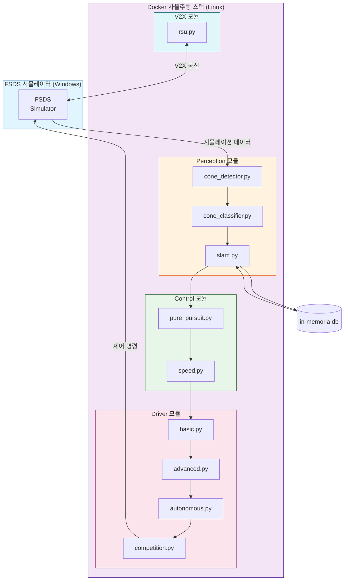

# HYCU FSDS Autonomous Driving / HYCU FSDS 자율주행

> Formula Student Driverless Simulator 기반 자율주행 시스템  
> Formula Student Driverless Simulator (FSDS) Based Autonomous Driving System

[](LICENSE)
[](http://wiki.ros.org/noetic)
[](https://www.python.org/)
[](https://www.docker.com/)
[](https://github.com/qws941/HYCU-FSDS/actions)

---

## 목차 (Table of Contents)

- [개요 (Overview)](#개요-overview)
- [주요 기능 (Key Features)](#주요-기능-key-features)
- [시스템 아키텍처 (System Architecture)](#시스템-아키텍처-system-architecture)
- [자동화 인벤토리 (Automation Inventory)](#자동화-인벤토리-automation-inventory)
- [빠른 시작 (Quick Start)](#빠른-시작-quick-start)
- [로컬 개발 (Local Development)](#로컬-개발-local-development)
- [명령어 참고서 (Commands Reference)](#명령어-참고서-commands-reference)
- [기여 가이드 (Contribution Guide)](#기여-가이드-contribution-guide)

---

## 개요 (Overview)

본 프로젝트는 **Formula Student Driverless Simulator (FSDS)** 기반으로 개발된 자율주행 시스템입니다. Windows 환경의 시뮬레이터와 Linux (ROS Noetic) Docker 기반 자율주행 스택을 결합한 이중 플랫폼 아키텍처로, 콘 감지 (Cone Detection), SLAM, 경로 계획 및 제어 기능을 통합합니다.

This project is an autonomous driving system based on the **Formula Student Driverless Simulator (FSDS)**. It combines a Windows-based simulator with a Linux (ROS Noetic) Docker-based autonomous driving stack, integrating cone detection, SLAM, path planning, and control functions.

### 프로젝트 배경 (Project Background)

본 프로젝트는 자율주행 알고리즘 연구 및 경진 대회 준비를 위해 구축되었으며, 다음 목표를 달성합니다:

- FSDS 시뮬레이터 환경에서의 실시간 자율주행을 구현
- ROS Noetic 기반의 모듈화된 자율주행 스택 제공
- Cone Detection 및 SLAM을 통한 환경 인식 능력 확보
- Pure Pursuit 및 속도 제어를 통한 경로 추종 성능 확보

This project was established for autonomous driving algorithm research and competition preparation, achieving the following objectives:

- Implement real-time autonomous driving within the FSDS simulator environment
- Provide a modular autonomous driving stack based on ROS Noetic
- Enable environmental perception through Cone Detection and SLAM
- Achieve reliable path following performance via Pure Pursuit and speed control

---

## 주요 기능 (Key Features)

### 자율주행 스택 (Autonomous Driving Stack)

| 모듈 (Module) | 설명 (Description) |
|---------------|-------------------|
| **Perception** | Cone Detection, Cone Classification, SLAM (Simultaneous Localization and Mapping) |
| **Control** | Pure Pursuit 경로 추종, 속도 제어 (Speed Control) |
| **Drivers** | Basic, Advanced, Autonomous, Competition 드라이버 모드 |
| **V2X** | RSU (Roadside Unit) 통신 모듈 |

### 기술 스택 (Technology Stack)

- **ROS Noetic** — 로봇 운영 체제
- **Python 3.8+** — 주요 개발 언어
- **Docker** — 컨테이너화된 실행 환경
- **FSDS** — Formula Student Driverless Simulator

---

## 시스템 아키텍처 (System Architecture)



### 데이터 흐름 (Data Flow)

1. **입력**: FSDS 시뮬레이터로부터 카메라/센서 데이터 수신
2. **인식**: Cone Detector → Cone Classifier → SLAM 파이프라인
3. **계획**: 감지된 콘 기반 경로 생성
4. **제어**: Pure Pursuit 알고리즘으로 조향각 계산, 속도 제어
5. **출력**: 조향 및 가속/브레이크 명령 시뮬레이터로 전송
6. **V2X**: RSU 모듈을 통한 외부 통신 (선택적)

---

## 자동화 인벤토리 (Automation Inventory)

### GitHub Actions 워크플로우 (Workflows)

본 프로젝트는 **33개**의 GitHub Actions 워크플로우를 통해 자동화된 개발 워크플로우를 구축합니다.

#### 브랜치 및 PR 관리 (Branch & PR Management)

| 워크플로우 파일 | 설명 (Description) |
|----------------|-------------------|
| `01_branch-to-pr.yml` | 브랜치에서 PR로 자동 전환 |
| `02_issue-to-branch.yml` | 이슈 기반 브랜치 자동 생성 |
| `03_pr-checks.yml` | PR 상태 확인 및 검증 |
| `13_pr-auto-merge.yml` | PR 자동 병합 |
| `15_merged-pr-cleanup.yml` | 병합 후 브랜치 정리 |

#### 코드 품질 (Code Quality)

| 워크플로우 파일 | 설명 (Description) |
|----------------|-------------------|
| `04_actionlint.yml` | GitHub Actions 워크플로우 린트 |
| `05_gitleaks.yml` | 하드코딩된 시크릿 스캔 |
| `06_codeql.yml` | CodeQL 정적 분석 |
| `07_dependency-review.yml` | 의존성 보안 검토 |
| `08_scorecard.yml` | OpenSSF 보안 점수 카드 |
| `09_semantic-pr.yml` | Semantic PR 커밋 검증 |
| `44_reusable-pr-checks.yml` | 재사용 가능한 PR 검사 |

#### 코드 리뷰 자동화 (Code Review Automation)

| 워크플로우 파일 | 설명 (Description) |
|----------------|-------------------|
| `10_pr-review.yml` | AI 기반 PR 리뷰 (qodo-ai/pr-agent) |
| `14_bot-auto-fix.yml` | 봇 자동 수정 |
| `security/11_pr-review.yml` | 보안 관련 PR 리뷰 |

#### 이슈 관리 (Issue Management)

| 워크플로우 파일 | 설명 (Description) |
|----------------|-------------------|
| `18_issue-management.yml` | 이슈 관리 자동화 |
| `19_issue-backfill.yml` | 이슈 백필 자동화 |
| `37_ci-failure-issues.yml` | CI 실패 시 이슈 자동 생성 |
| `43_reusable-issue-management.yml` | 재사용 가능한 이슈 관리 |
| `91_issue-classification.yml` | 이슈 자동 분류 |

#### 문서화 (Documentation)

| 워크플로우 파일 | 설명 (Description) |
|----------------|-------------------|
| `20_readme-gen.yml` | README 자동 생성 |
| `21_docs-sync.yml` | 문서 동기화 |
| `42_reusable-docs-sync.yml` | 재사용 가능한 문서 동기화 |

#### 릴리스 및 배포 (Release & Deployment)

| 워크플로우 파일 | 설명 (Description) |
|----------------|-------------------|
| `24_release-notes.yml` | 릴리스 노트 자동 생성 |
| `25_release-publish.yml` | 릴리스 게시 자동화 |
| `29_downstream-health-check.yml` | 하위 프로젝트 상태 확인 |

#### 유지보수 (Maintenance)

| 워크플로우 파일 | 설명 (Description) |
|----------------|-------------------|
| `12_dependabot-auto-merge.yml` | Dependabot 자동 병합 |
| `60_ci-auto-heal.yml` | CI 자동 복구 |

#### 커뮤니티 (Community)

| 워크플로우 파일 | 설명 (Description) |
|----------------|-------------------|
| `auto-merge.yml` | 자동 병합 설정 |
| `ci.yml` | 기본 CI 파이프라인 |
| `labeler.yml` | PR 라벨러 |
| `welcome.yml` | 신규 기여자 환영 메시지 |

### 재사용 가능한 워크플로우 (Reusable Workflows)

`_bot-scripts/` 디렉터리에 위치한 재사용 가능한 워크플로우 모듈:

| 워크플로우 | 설명 (Description) |
|-----------|-------------------|
| `_auto-approve-runs.yml` | 실행 자동 승인 |
| `_auto-merge.yml` | 자동 병합 로직 |
| `_branch-cleanup.yml` | 브랜치 정리 |
| `_ci-python.yml` | Python CI 파이프라인 |
| `_codex-pr-review.yml` | Codex PR 리뷰 |
| `_commitlint.yml` | 커밋 메시지 린트 |
| `_dependabot-auto-fix.yml` | Dependabot 자동 수정 |
| `_release-drafter.yml` | 릴리스 드래프터 |
| `_stale.yml` | 오래된 이슈/PR 정리 |
| `_welcome.yml` | 신규 기여자 환영 |

### 외부 도구 (External Tools)

| 도구 | 용도 (Purpose) |
|------|---------------|
| **qodo-ai/pr-agent** | AI 기반 코드 리뷰 및 자동 수정 |
| **gitleaks** | 하드코딩된 시크릿/자격 증명 스캔 |
| **CodeQL** | 정적 코드 분석 |
| **Dependabot** | 의존성 업데이트 자동화 |
| **OpenSSF Scorecard** | 보안 점수 평가 |

---

## 빠른 시작 (Quick Start)

### 전제 조건 (Prerequisites)

- Docker 20.10+
- Docker Compose 1.29+
- Python 3.8+
- ROS Noetic (Linux 환경)
- FSDS 시뮬레이터 (Windows)

### 1. 저장소 복제 (Clone Repository)

```bash
git clone https://github.com/qws941/HYCU-FSDS.git
cd HYCU-FSDS
```

### 2. Docker 기반 실행 (Docker-based Execution)

```bash
# 자율주행 스택 실행
cd submission
docker-compose up --build

# 또는 독립 실행 스크립트 사용
bash submission/run.sh
```

### 3. 시뮬레이터 연결 (Simulator Connection)

1. Windows 환경에서 FSDS 시뮬레이터 실행
2. Docker 컨테이너가 시뮬레이션 데이터 수신 대기
3. 자동 연결 및 자율주행 시작

---

## 로컬 개발 (Local Development)

### 개발 환경 설정 (Development Environment Setup)

```bash
# 의존성 설치
pip install -r _bot-scripts/requirements.txt
pip install -r _bot-scripts/requirements-dev.txt

# 개발용 Docker Compose
cd submission
docker-compose -f docker-compose.yml config  # 설정 검증
```

### 테스트 실행 (Run Tests)

```bash
# Python 테스트
cd submission
python -m pytest tests/ -v

# 또는 테스트 스크립트 직접 실행
python src/tests/test_algorithms.py
```

### ROS 환경 (ROS Environment)

```bash
# ROS 환경 활성화
source /opt/ros/noetic/setup.bash

# 개별 모듈 실행 예시
rosrun autonomous cone_detector.py
rosrun autonomous pure_pursuit.py
```

---

## 명령어 참고서 (Commands Reference)

### Docker 명령어 (Docker Commands)

| 명령어 | 설명 |
|--------|------|
| `docker-compose -f submission/docker-compose.yml up --build` | 자율주행 스택 빌드 및 실행 |
| `docker-compose -f submission/docker-compose.yml down` | 컨테이너 중지 및 정리 |
| `docker-compose -f submission/autonomous/docker-compose.yml up -d` | 자율주행 모듈 독립 실행 |
| `docker exec -it <container> bash` | 실행 중인 컨테이너 접속 |

### Python 스크립트 (Python Scripts)

| 스크립트 | 설명 |
|----------|------|
| `submission/scripts/competition_driver.py` | 경진 대회용 드라이버 |
| `submission/scripts/advanced_driver.py` | 고급 드라이버 모드 |
| `submission/scripts/fsds_driver.py` | FSDS 인터페이스 드라이버 |
| `submission/scripts/simple_slam.py` |简易 SLAM 구현 |

### 셸 스크립트 (Shell Scripts)

| 스크립트 | 설명 |
|----------|------|
| `submission/run.sh` | 자율주행 스택 실행 |
| `submission/dev.sh` | 개발 모드 실행 |
| `submission/autonomous/run_all.sh` | 전체 자율주행 모듈 실행 |
| `submission/autonomous/start.sh` | 자율주행 시작 |
| `submission/autonomous/entrypoint.sh` | 컨테이너 엔트리포인트 |

---

## 기여 가이드 (Contribution Guide)

기여를 환영합니다! 자세한 내용은 [CONTRIBUTING.md](CONTRIBUTING.md)를 참조하세요.

Welcome contributions! See [CONTRIBUTING.md](CONTRIBUTING.md) for details.

### 커밋 메시지 규칙 (Commit Message Convention)

본 프로젝트는 **Semantic Commit Messages**를 사용합니다:

```
<type>(<scope>): <subject>

feat(perception): add cone detection module
fix(control): resolve pure pursuit oscillation
docs: update README architecture diagram
refactor(drivers): simplify autonomous mode
```

### 타입 (Types)

| 타입 | 설명 |
|------|------|
| `feat` | 새 기능 |
| `fix` | 버그 수정 |
| `docs` | 문서 변경 |
| `style` | 코드 포맷팅 |
| `refactor` | 코드 리팩토링 |
| `test` | 테스트 추가/수정 |
| `chore` | 빌드/보조 도구 변경 |

### Pull Request 프로세스 (Pull Request Process)

1. **브랜치 생성**: `git checkout -b feature/my-feature`
2. **개발**: 코드 작성 및 테스트
3. **커밋**: Semantic 커밋 메시지 사용
4. **푸시**: `git push origin feature/my-feature`
5. **PR 생성**: GitHub에서 Pull Request 생성
6. **리뷰**: 자동화된 CI/CD 및 코드 리뷰 통과 필요
7. **병합**: 리뷰 완료 후Maintainer가 병합

### 코드 품질 기준 (Code Quality Standards)

- 모든 Python 코드는 `pyproject.toml` 또는 `setup.py` 기준 준수
- `requirements.txt` / `requirements-dev.txt` 통한 의존성 관리
- Docker 이미지 최적화 (다단계 빌드 권장)
- 하드코딩된 IP 주소 및 시크릿 금지

---

## 라이선스 (License)

본 프로젝트는 MIT 라이선스 하에 제공됩니다. 자세한 내용은 [LICENSE](LICENSE) 파일을 참조하세요.

This project is licensed under the MIT License. See the [LICENSE](LICENSE) file for details.

---

## 연락처 (Contact)

- **프로젝트 저장소**: <https://github.com/qws941/HYCU-FSDS>
- **이슈 트래커**: <https://github.com/qws941/HYCU-FSDS/issues>

---

*이 문서는 자동화 도구를 통해 생성 및 유지보수됩니다.*
*This document is automatically generated and maintained.*
