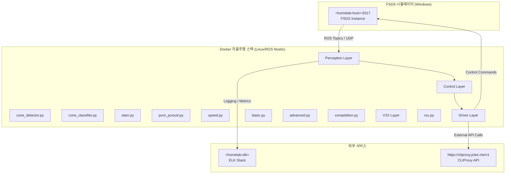

# HYCU FSDS Autonomous Driving / HYCU FSDS 자율주행

> Formula Student Driverless Simulator 기반 자율주행 시스템  
> Formula Student Driverless Simulator (FSDS) Based Autonomous Driving System

[](LICENSE)
[](http://wiki.ros.org/noetic)
[](https://www.python.org/)
[](https://www.docker.com/)
[](https://github.com/qws941/HYCU-FSDS/actions)

---

## 목차 (Table of Contents)

- [개요 (Overview)](#개요-overview)
- [주요 기능 (Key Features)](#주요-기능-key-features)
- [시스템 아키텍처 (System Architecture)](#시스템-아키텍처-system-architecture)
- [자동화 인벤토리 (Automation Inventory)](#자동화-인벤토리-automation-inventory)
- [빠른 시작 (Quick Start)](#빠른-시작-quick-start)
- [로컬 개발 (Local Development)](#로컬-개발-local-development)
- [명령어 참고서 (Commands Reference)](#명령어-참고서-commands-reference)
- [기여 가이드 (Contribution Guide)](#기여-가이드-contribution-guide)

---

## 개요 (Overview)

본 프로젝트는 **Formula Student Driverless Simulator (FSDS)** 기반으로 개발된 자율주행 시스템입니다. Windows 환경의 시뮬레이터와 Linux (ROS Noetic) Docker 기반 자율주행 스택을 결합한 이중 플랫폼 아키텍처로, 콘 감지 (Cone Detection), SLAM, 경로 계획 및 제어 기능을 통합합니다.

This project is an autonomous driving system based on the **Formula Student Driverless Simulator (FSDS)**. It combines a Windows-based simulator with a Linux (ROS Noetic) Docker-based autonomous driving stack, integrating cone detection, SLAM, path planning, and control functions.

### 프로젝트 배경 (Project Background)

본 프로젝트는 자율주행 알고리즘 연구 및 경진 대회 준비를 위해 구축되었으며, 다음 목표를 달성합니다:

- FSDS 시뮬레이터 환경에서의 실시간 자율주행을 구현
- ROS Noetic 기반의 모듈화된 자율주행 스택 제공
- Cone Detection 및 SLAM을 통한 환경 인식 능력 확보
- Pure Pursuit 및 속도 제어를 통한 경로 추종 성능 확보

This project was established for autonomous driving algorithm research and competition preparation, achieving the following objectives:

- Implement real-time autonomous driving in the FSDS simulator environment
- Provide a modular autonomous driving stack based on ROS Noetic
- Acquire environmental perception capability through cone detection and SLAM
- Ensure path tracking performance through Pure Pursuit and speed control

---

## 주요 기능 (Key Features)

### 자율주행 모듈 (Autonomous Driving Modules)

| 모듈 (Module) | 설명 (Description) |
|---------------|---------------------|
| **Perception** | Cone Detection, SLAM을 통한 환경 인식 |
| **Control** | Pure Pursuit 경로 추종, 속도 제어 |
| **Drivers** | Basic, Advanced, Competition 드라이버 모드 |
| **V2X** | RSU (Roadside Unit) 통신 지원 |

### 개발 환경 (Development Environment)

- **ROS Noetic**: 로보틱스 프레임워크
- **Python 3.8+**: 주요 개발 언어
- **Docker**: 컨테이너 기반 개발 및 배포
- **FSDS**: 시뮬레이션 환경

---

## 시스템 아키텍처 (System Architecture)



### 데이터 흐름 (Data Flow)

1. **시뮬레이터 → Perception**: FSDS에서 카메라/라이더 데이터를 ROS 토픽으로.publish
2. **Perception → Control**: 탐지된 콘 위치 및 SLAM 맵을 기반으로 경로 계획
3. **Control → Driver**: Pure Pursuit으로 계산된 조향각과 속도를 드라이버에 전달
4. **Driver → 시뮬레이터**: 최종 제어 명령을 시뮬레이터에 전송

---

## 자동화 인벤토리 (Automation Inventory)

### GitHub Actions 워크플로우 (Workflows)

| 워크플로우 파일 (Workflow File) | 목적 (Purpose) |
|--------------------------------|----------------|
| `01_branch-to-pr.yml` | 브랜치에서 PR로 자동 변환 |
| `02_issue-to-branch.yml` | 이슈 기반 브랜치 생성 |
| `03_pr-checks.yml` | PR 기본 검사 (린트, 테스트) |
| `04_actionlint.yml` | GitHub Actions YAMLLint |
| `05_gitleaks.yml` | 비밀키/토큰 스캔 |
| `06_codeql.yml` | 코드 품질 분석 |
| `07_dependency-review.yml` | 의존성 보안 검토 |
| `08_scorecard.yml` | Security Scorecard |
| `09_semantic-pr.yml` | Semantic PR 검증 |
| `10_pr-review.yml` | 자동 PR 리뷰 (Codex) |
| `12_dependabot-auto-merge.yml` | Dependabot 자동 병합 |
| `13_pr-auto-merge.yml` | PR 자동 병합 규칙 |
| `14_bot-auto-fix.yml` | 봇 수정 자동 적용 |
| `15_merged-pr-cleanup.yml` | 병합 후 브랜치 정리 |
| `18_issue-management.yml` | 이슈 수명 주기 관리 |
| `19_issue-backfill.yml` | 이슈 백필/복원 |
| `20_readme-gen.yml` | README 자동 생성 |
| `21_docs-sync.yml` | 문서 동기화 |
| `24_release-notes.yml` | Release Notes 생성 |
| `25_release-publish.yml` | Release 게시 |
| `29_downstream-health-check.yml` | Downstream 저장소 상태 확인 |
| `37_ci-failure-issues.yml` | CI 실패 시 이슈 생성 |
| `42_reusable-docs-sync.yml` | 재사용 가능한 문서 동기화 |
| `43_reusable-issue-management.yml` | 재사용 가능한 이슈 관리 |
| `44_reusable-pr-checks.yml` | 재사용 가능한 PR 검사 |
| `45_reusable-gitleaks.yml` | 재사용 가능한 Gitleaks |
| `60_ci-auto-heal.yml` | CI 자동 복구 |
| `91_issue-classification.yml` | 이슈 자동 분류 |
| `auto-merge.yml` | 자동 병합 |
| `ci.yml` | 기본 CI 파이프라인 |
| `labeler.yml` | PR 라벨 자동 적용 |
| `welcome.yml` | 신규 기여자 환영 |
| `security/11_pr-review.yml` | 보안 관련 PR 리뷰 |

### 재사용 가능한 워크플로우 (Reusable Workflows)

`_bot-scripts/` 저장소에서 관리되는 공통 워크플로우:

- `_auto-approve-runs.yml` - 자동 승인 실행
- `_auto-merge.yml` - 자동 병합
- `_branch-cleanup.yml` - 브랜치 정리
- `_ci-python.yml` - Python CI
- `_codex-pr-review.yml` - Codex PR 리뷰
- `_dependabot-auto-fix.yml` - Dependabot 자동 수정
- `_release-drafter.yml` - Release Drafter
- `_stale.yml` - 陈旧 이슈 정리

### 자동화 도구 (Automation Tools)

| 도구 (Tool) | 용도 (Usage) |
|-------------|-------------|
| **Codex (qodo-ai/pr-agent)** | AI 기반 PR 리뷰 및 이슈 관리 |
| **Gitleaks** | 비밀키 스캔 |
| **CodeQL** | 정적 코드 분석 |
| **Actionlint** | GitHub Actions YAML 검증 |
| **Dependabot** | 의존성 자동 업데이트 |
| **CLIProxy** | 외부 API 프록시 (`https://cliproxy.jclee.me/v1`) |

---

## 빠른 시작 (Quick Start)

### 전제 조건 (Prerequisites)

- Docker 20.10+
- Docker Compose 1.29+
- Python 3.8+
- ROS Noetic (Linux 환경)
- FSDS 시뮬레이터 (Windows, `:<homelab-host>:8317`에 연결)

### 1. Docker 환경 구성 (Docker Environment Setup)

```bash
# 저장소 클론
git clone https://github.com/qws941/HYCU-FSDS.git
cd HYCU-FSDS

# Docker 이미지 빌드
cd submission
docker-compose build

# 또는 autonomous 스택 빌드
cd ../autonomous
docker-compose build
```

### 2. 시뮬레이터 연결 (Simulator Connection)

FSDS 시뮬레이터 설정에서 다음을 구성합니다:

- **Host**: `<homelab-host>`
- **Port**: `8317`

### 3. 자율주행 실행 (Run Autonomous Driving)

```bash
# submission 스택 실행
cd submission
./run.sh

# 또는 competition 모드
python submission/src/drivers/competition.py

# autonomous 스택 실행
cd autonomous
./start.sh
```

---

## 로컬 개발 (Local Development)

### 개발 환경 설정 (Development Environment Setup)

```bash
# Python 의존성 설치
pip install -r _bot-scripts/requirements.txt
pip install -r _bot-scripts/requirements-dev.txt

# ROS 환경 설정 (Linux)
source /opt/ros/noetic/setup.bash

# 개발용 Docker Compose
cd submission
docker-compose -f docker-compose.yml up -d
```

### 테스트 실행 (Run Tests)

```bash
# Python 단위 테스트
python -m pytest submission/tests/test_algorithms.py

# 또는
cd submission
python -m unittest discover -s tests

# Docker 내 테스트
docker-compose -f submission/docker-compose.yml run --rm hycu-fsd pytest
```

### 모듈별 개발 (Module Development)

각 모듈은 독립적으로 개발 및 테스트 가능합니다:

```bash
# Perception 모듈 테스트
python -m submission.src.perception.cone_detector

# Control 모듈 테스트
python -m submission.src.control.pure_pursuit

# Driver 모듈 테스트
python -m submission.src.drivers.basic
```

---

## 명령어 참고서 (Commands Reference)

### Docker 명령어 (Docker Commands)

| 명령어 (Command) | 설명 (Description) |
|-----------------|-------------------|
| `docker-compose -f submission/docker-compose.yml build` | submission 이미지 빌드 |
| `docker-compose -f submission/docker-compose.yml up -d` | submission 컨테이너 시작 |
| `docker-compose -f submission/docker-compose.yml down` | submission 컨테이너 중지 |
| `docker-compose -f autonomous/docker-compose.yml up -d` | autonomous 스택 시작 |
| `docker logs -f <container_name>` | 컨테이너 로그 확인 |

### Python 명령어 (Python Commands)

| 명령어 (Command) | 설명 (Description) |
|-----------------|-------------------|
| `python submission/scripts/fsds_driver.py` | FSDS 드라이버 실행 |
| `python submission/scripts/competition_driver.py` | Competition 모드 실행 |
| `python submission/scripts/advanced_driver.py` | Advanced 드라이버 실행 |
| `python submission/scripts/simple_slam.py` | SLAM 실행 |
| `python -m pytest submission/tests/` | 테스트 실행 |

### GitHub Actions 워크플로우 트리거 (Workflow Triggers)

| 트리거 (Trigger) | 워크플로우 (Workflow) |
|----------------|----------------------|
| `push` / `pull_request` | `03_pr-checks.yml`, `05_gitleaks.yml`, `06_codeql.yml` |
| `push to master` | `20_readme-gen.yml`, `21_docs-sync.yml` |
| `issue opened` | `18_issue-management.yml`, `91_issue-classification.yml` |
| `merge` | `15_merged-pr-cleanup.yml` |
| `workflow_dispatch` | 수동 실행 (Rebuild, Sync 등) |

---

## 기여 가이드 (Contribution Guide)

### 버그 리포트 및 기능 요청 (Bug Reports & Feature Requests)

1. 이슈 템플릿을 사용하여 작성
2. `bug`, `enhancement`, `question` 라벨 적절히 선택
3. 재현 가능한 단계 포함

### 코드 기여 (Code Contribution)

1. **포크 (Fork)**: 저장소를 포크합니다
2. **브랜치 생성 (Branch)**: `02_issue-to-branch.yml` 활용 또는 수동 생성

   ```bash
   git checkout -b feature/your-feature-name
   ```

3. **개발 (Develop)**: 모듈화된 개발 가이드라인 준수
4. **테스트 (Test)**: 테스트 코드 작성 및 실행

   ```bash
   python -m pytest submission/tests/
   ```

5. **커밋 (Commit)**: `09_semantic-pr.yml` 규칙 준수

   ```bash
   git commit -m "feat: add new cone detection algorithm"
   ```

6. **푸시 및 PR (Push & PR)**: `10_pr-review.yml`에서 자동 리뷰
7. **병합 (Merge)**: 유지보수자의 검토 후 병합

### 코드 스타일 (Code Style)

- **Python**: PEP 8 준수
- **ROS**: ROS 스타일 가이드 준수
- **Git**: Conventional Commits (`feat:`, `fix:`, `docs:`, `refactor:`)

### 문서화 (Documentation)

- 한국어/영어双语 문서화 권장
- API 및 모듈_docstring 필수
- `docs/ARCHITECTURE.md` 참조

---

## 라이선스 (License)

MIT License - 자세한 내용은 [LICENSE](LICENSE) 파일을 참조하세요.

---

## 연락처 (Contact)

- **Repository**: <https://github.com/qws941/HYCU-FSDS>
- **Automation Docs**: `_bot-scripts/AGENTS.md`
- **External API**: `https://cliproxy.jclee.me/v1` (CLIProxy)

---

*이 README는 `20_readme-gen.yml` 워크플로우에 의해 자동으로 생성 및 업데이트됩니다.*
