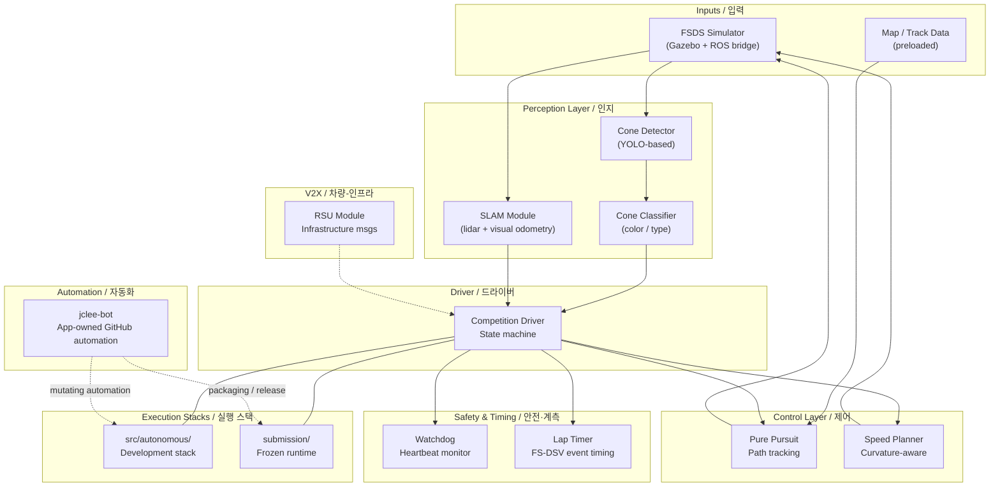

# HYCU FSDS Autonomous Driving / HYCU FSDS 자율주행

> Formula Student Driverless Simulator 기반 자율주행 시스템
> Autonomous driving stack for the Formula Student Driverless Simulator (FSDS)


---

## Overview / 개요

**EN**
HYCU FSDS Autonomous Driving is an autonomous driving project for the Formula Student Driverless Simulator (FSDS). It provides Dockerized ROS Noetic components for perception (cone detection, classification, SLAM), control (pure pursuit, speed planning), safety monitoring (watchdog), lap timing, simulator integration, V2X support, and competition-style submission packaging. The repository is split into a development-oriented stack and a packaged submission stack so that the same algorithms can be iterated locally and re-built as a frozen runtime for evaluation.

**KR**
HYCU FSDS Autonomous Driving은 Formula Student Driverless Simulator(FSDS) 워크플로우를 위한 자율주행 프로젝트입니다. ROS Noetic 기반의 Docker 컨테이너 구성으로 콘 감지·분류·SLAM 인지 모듈, Pure Pursuit·속도 계획 제어 모듈, 워치독 안전 감시, 랩 타이머, 시뮬레이터 연동, V2X 지원, 대회 제출 패키징을 제공합니다. 저장소는 개발용 스택과 제출용 패키지 스택으로 분리되어, 동일한 알고리즘을 로컬에서 반복 개발하고 평가용 동결 런타임(frozen runtime)으로 다시 빌드할 수 있습니다.

### Two execution paths / 두 가지 실행 경로

1. `src/autonomous/` — Development-oriented stack for algorithm iteration / 알고리즘 반복 개발용 자율주행 스택.
2. `submission/` — Frozen runtime stack for competition submission or evaluation / 대회 제출 또는 평가를 위한 동결 실행 스택.

The `submission/` stack re-uses the same perception, control, and utility modules from `src/` and adds a packaging entry point (`run.sh`, `dev.sh`, `Dockerfile`) so the algorithms can be evaluated as a sealed image.

`submission/` 스택은 `src/`의 동일한 인지·제어·유틸리티 모듈을 재사용하면서 패키징 진입점(`run.sh`, `dev.sh`, `Dockerfile`)을 추가하여, 알고리즘을 봉인된 이미지(sealed image)로 평가할 수 있게 합니다.

---

## Features / 기능

**EN**
- **Perception** — Cone detection (YOLO-based), cone classification (color/type), and SLAM (lidar + visual odometry) under `src/autonomous/modules/perception/`.
- **Control** — Pure pursuit path tracking and curvature-aware speed planning under `src/autonomous/modules/control/`.
- **Safety & timing** — Heartbeat-style watchdog and lap timer utilities under `src/autonomous/modules/utils/`.
- **Simulator integration** — FSDS bridge launch file (`bridge_no_camera.launch`) and simulator settings (`src/simulator/settings.json`).
- **V2X** — Roadside unit (RSU) message handling under `submission/src/v2x/`.
- **Driver** — Competition state machine (`competition_driver.py`) coordinating perception, control, and V2X inputs.
- **Packaging** — `scripts/package.sh` builds a submission-ready archive; `submission/Dockerfile` produces a frozen runtime image.
- **Tests** — `src/autonomous/tests/test_algorithms.py` for unit-level regression of perception and control algorithms.
- **Docs** — `docs/SUBMISSION_GUIDE.md` and reference lecture materials under `docs/reference_materials/`.

**KR**
- **인지(Perception)** — `src/autonomous/modules/perception/`에서 콘 감지(YOLO 기반), 콘 분류(색상/유형), SLAM(라이다 + 비주얼 오도메트리)을 제공합니다.
- **제어(Control)** — `src/autonomous/modules/control/`에서 Pure Pursuit 경로 추종과 곡률 인지 속도 계획을 제공합니다.
- **안전·계측(Safety & timing)** — `src/autonomous/modules/utils/`에서 하트비트 방식의 워치독과 랩 타이머를 제공합니다.
- **시뮬레이터 연동** — FSDS 브리지 런치 파일(`bridge_no_camera.launch`)과 시뮬레이터 설정(`src/simulator/settings.json`)을 제공합니다.
- **V2X** — `submission/src/v2x/`에서 RSU(Roadside Unit) 메시지 처리를 제공합니다.
- **드라이버** — `competition_driver.py`가 인지·제어·V2X 입력을 조율하는 대회 상태 머신입니다.
- **패키징** — `scripts/package.sh`는 제출 가능한 아카이브를 생성하며, `submission/Dockerfile`은 동결 런타임 이미지를 빌드합니다.
- **테스트** — `src/autonomous/tests/test_algorithms.py`로 인지·제어 알고리즘의 단위 회귀 테스트를 수행합니다.
- **문서** — `docs/SUBMISSION_GUIDE.md`와 `docs/reference_materials/`의 참고 강의 자료를 제공합니다.

---

## Repository Structure / 저장소 구조

```text
.
├── AGENTS.md
├── CONTRIBUTING.md
├── LICENSE
├── OWNERS
├── README.md
├── in-memoria.db
├── src/
│   ├── autonomous/
│   │   ├── AGENTS.md
│   │   ├── Dockerfile
│   │   ├── docker-compose.yml
│   │   ├── entrypoint.sh
│   │   ├── record_race.sh
│   │   ├── run_all.sh
│   │   ├── start.sh
│   │   ├── scripts/
│   │   │   └── start_race.py
│   │   ├── config/
│   │   │   ├── bridge_no_camera.launch
│   │   │   └── params.yaml
│   │   ├── driver/
│   │   │   └── competition_driver.py
│   │   ├── modules/
│   │   │   ├── __init__.py
│   │   │   ├── perception/
│   │   │   │   ├── __init__.py
│   │   │   │   ├── cone_classifier.py
│   │   │   │   ├── cone_detector.py
│   │   │   │   └── slam.py
│   │   │   ├── utils/
│   │   │   │   ├── __init__.py
│   │   │   │   ├── lap_timer.py
│   │   │   │   └── watchdog.py
│   │   │   └── control/
│   │   │       ├── __init__.py
│   │   │       ├── pure_pursuit.py
│   │   │       └── speed.py
│   │   └── tests/
│   │       └── test_algorithms.py
│   └── simulator/
│       ├── README.md
│       └── settings.json
├── scripts/
│   └── package.sh
├── docs/
│   ├── SUBMISSION_GUIDE.md
│   └── reference_materials/
│       ├── lecture1_fsds_install.txt
│       ├── lecture4_slam.ipynb
│       └── lecture6_v2x.ipynb
└── submission/
    ├── AGENTS.md
    ├── Dockerfile
    ├── README.md
    ├── dev.sh
    ├── docker-compose.yml
    ├── run.sh
    ├── launch/
    │   └── competition.launch
    ├── src/
    │   ├── __init__.py
    │   ├── drivers/
    │   │   ├── __init__.py
    │   │   ├── advanced.py
    │   │   ├── autonomous.py
    │   │   ├── basic.py
    │   │   └── competition.py
    │   ├── perception/
    │   │   ├── __init__.py
    │   │   ├── cone_classifier.py
    │   │   ├── cone_detector.py
    │   │   └── slam.py
    │   ├── v2x/
    │   │   ├── __init__.py
    │   │   └── rsu.py
    │   ├── utils/
    │   │   ├── __init__.py
    │   │   ├── lap_timer.py
    │   │   └── watchdog.py
    │   └── control/
    │       ├── __init__.py
    │       ├── pure_pursuit.py
    │       └── speed.py
    └── autonomous/
        ├── Dockerfile
        ├── docker-compose.yml
        ├── entrypoint.sh
        ├── run_all.sh
        ├── start.sh
        ├── config/
        │   └── params.yaml
        ├── driver/
        │   └── competition_driver.py
        └── modules/
            ├── __init__.py
            └── perception/
                ├── __init__.py
                ├── cone_classifier.py
                └── cone_detector.py
```

---

## Architecture / 아키텍처

**EN**
The runtime is a single ROS Noetic graph running inside a Docker stack. FSDS publishes camera, lidar, and ground-truth topics; the bridge remaps them into the in-container namespace. The cone detector and SLAM module feed the competition driver, which arbitrates between pure pursuit and the speed planner. A watchdog and lap timer run in parallel. The driver state machine, together with the V2X RSU module, produces steering/throttle/brake commands that are sent back to the simulator. The `submission/` stack is a frozen equivalent: same modules, no dev-only scripts, single `run.sh` entry point.

**KR**
런타임은 Docker 스택 안에서 동작하는 단일 ROS Noetic 그래프입니다. FSDS가 카메라·라이다·ground-truth 토픽을 발행하면 브리지가 이를 컨테이너 내부 네임스페이스로 리맵합니다. 콘 감지와 SLAM 모듈이 대회 드라이버로 입력을 전달하고, 드라이버는 Pure Pursuit와 속도 계획기 사이를 중재합니다. 워치독과 랩 타이머는 병렬로 동작합니다. 드라이버 상태 머신과 V2X RSU 모듈이 조향·스로틀·브레이크 명령을 생성하여 시뮬레이터로 다시 전달합니다. `submission/` 스택은 동결 등가물로, 동일한 모듈에 개발 전용 스크립트 없이 단일 `run.sh` 진입점만 갖습니다.



### Legend / 범례

- **Solid arrows** — synchronous ROS topic flow / 동기 ROS 토픽 흐름
- **Dotted arrows** — control and out-of-band events (watchdog ticks, V2X, automation) / 제어 및 비동기 이벤트
- **Subgraphs** — logical layers / 논리 계층
- **`---`** — same module exists in both stacks / 두 스택에 동일 모듈 존재

---

## jclee-bot Automation Surfaces / jclee-bot 자동화 영역

**EN**
All mutating GitHub automation in this repository is owned by **jclee-bot**, the application bot account. The files under `.github/workflows/` are implementation triggers, not the source of truth — the policies and behaviors listed below are the actual automation surfaces. jclee-bot operates under policy control declared at `bot.jclee.me` and uses the public CLIProxy endpoint `https://cliproxy.jclee.me/v1` for model-backed tasks. PR review is delegated to the upstream [`qodo-ai/pr-agent`](https://github.com/qodo-ai/pr-agent) action.

**KR**
이 저장소의 모든 변경(mutating) GitHub 자동화는 애플리케이션 봇 계정인 **jclee-bot**이 소유합니다. `.github/workflows/`의 워크플로우는 구현 트리거일 뿐, 아래에 나열된 정책과 동작이 실제 자동화 영역의 출처입니다. jclee-bot은 `bot.jclee.me`의 정책 제어를 통해 운영되며, 모델 기반 작업에는 공개 CLIProxy 엔드포인트 `https://cliproxy.jclee.me/v1`를 사용합니다. PR 리뷰는 업스트림 [`qodo-ai/pr-agent`](https://github.com/qodo-ai/pr-agent) 액션에 위임됩니다.

### Issue automation / 이슈 자동화

- **Triage & labeling** — issues are auto-labeled by area (`perception`, `control`, `v2x`, `infra`, etc.) and triaged by jclee-bot on open.
- **Lifecycle** — stale issues are detected, commented on, and auto-closed after the configured inactivity window.
- **Issue → branch** — accepted issues are converted to a feature branch by jclee-bot, with a backfill pass for legacy issues.
- **Behavior marker / 동작 마커** — when jclee-bot posts automation comments on issues, they are tagged with the exact marker **jclee-bot에의해자동화됨** so reviewers can distinguish bot-authored housekeeping from human replies.

### Pull request automation / 풀 리퀘스트 자동화

- **Branch → PR** — feature branches are converted into PRs by jclee-bot once checks begin, with auto-approval for low-risk paths.
- **PR review** — [`qodo-ai/pr-agent`](https://github.com/qodo-ai/pr-agent) runs static review and a security-focused pass; jclee-bot consumes the verdict.
- **Auto-merge** — PRs passing required checks and review verdict are auto-merged by jclee-bot. A separate path covers Dependabot PRs.
- **Auto-fix** — jclee-bot pushes follow-up commits (lint, format, trivial dependency bumps) directly to the PR branch.
- **Merged-PR cleanup** — source branches and stale check runs are removed by jclee-bot after merge.

### Release automation / 릴리스 자동화

- **Release notes** — jclee-bot drafts notes from merged PRs and Conventional Commits.
- **Release publish** — jclee-bot tags and publishes the release artifacts (submission Docker image, packaged archive) once the draft is approved.
- **Downstream health check** — read-only verification that dependent consumers can still resolve the published version.

### CI failure automation / CI 실패 자동화

- **Failure → issue** — persistent CI failures are converted into tracked issues by jclee-bot so they are not lost between runs.

### Permissions and provenance / 권한 및 출처

- **Mutating actions only** — all writes (merge, push, comment, label, close, release) are performed by the jclee-bot identity.
- **Read-only actions** — the downstream health check is the only read-only automation surface.
- **PR review provider** — [`qodo-ai/pr-agent`](https://github.com/qodo-ai/pr-agent) is the sole review engine.
- **Model endpoints** — `https://cliproxy.jclee.me/v1` is the public inference endpoint used by jclee-bot.
- **README generation model** — primary: `gpt-5.5`; fallback: `minimax-m3` via CLIProxyAPI.

---

## Go Automation Tools / Go 자동화 도구

**EN**
This repository contains **0 Go-based automation tools**. All automation is implemented as GitHub Actions workflows owned by jclee-bot (see above). When additional automation is required, it is added as a workflow plus a jclee-bot policy entry rather than as a Go binary, so that automation stays reviewable in the same place as the policies that govern it.

**KR**
이 저장소에는 **Go 기반 자동화 도구가 0개** 있습니다. 모든 자동화는 위에서 설명한 대로 jclee-bot이 소유하는 GitHub Actions 워크플로우로 구현됩니다. 추가 자동화가 필요할 때는 Go 바이너리가 아니라 워크플로우와 jclee-bot 정책 항목으로 추가되며, 이는 자동화를 정책을 지배하는 코드와 같은 위치에서 검토할 수 있도록 하기 위함입니다.

---

## Quick Start / 빠른 시작

### Prerequisites / 사전 요구사항

- Linux host (Ubuntu 20.04 recommended for ROS Noetic) / Linux 호스트 (ROS Noetic은 Ubuntu 20.04 권장)
- Docker 24+ and Docker Compose v2 / Docker 24+ 및 Docker Compose v2
- Formula Student Driverless Simulator (FSDS) — see `docs/reference_materials/lecture1_fsds_install.txt`
- X server or noVNC bridge for GUI forwarding / GUI 전달용 X 서버 또는 noVNC 브리지

### 1. Clone the repository / 저장소 복제

```bash
git clone <this-repo-url> hycu-fsds
cd hycu-fsds
```

### 2. Start the development stack / 개발 스택 시작

```bash
cd src/autonomous
docker compose build
docker compose up
# or use the convenience entrypoint
bash start.sh
```

### 3. Launch FSDS separately / FSDS를 별도로 실행

Start the simulator on the host with the bridge settings under `src/simulator/settings.json`. The bridge launch file `src/autonomous/config/bridge_no_camera.launch` remaps topics into the container namespace.

### 4. Run the competition driver / 대회 드라이버 실행

Inside the running container:

```bash
roslaunch competition launch/competition.launch
# or in development
python3 driver/competition_driver.py
```

### 5. Build the submission package / 제출 패키지 빌드

```bash
# from the repository root
bash scripts/package.sh

# or build the frozen runtime image
cd submission
docker build -t hycu-fsds-submission:latest .
```

---

## Local Development / 로컬 개발

**EN**
- Iterate on perception and control in `src/autonomous/modules/`. The `run_all.sh` script brings up the full development stack (perception + control + driver + V2X).
- Use `src/autonomous/record_race.sh` to capture race telemetry, then replay it offline to tune pure pursuit gains and speed planner curvature thresholds.
- Run the unit tests on every change: `python3 -m pytest src/autonomous/tests/test_algorithms.py`.
- Parameter changes belong in `src/autonomous/config/params.yaml`; the same parameter file shape is mirrored in `submission/autonomous/config/params.yaml`.
- When a module graduates, mirror it under `submission/src/` and remove any dev-only entry points (`scripts/start_race.py`, `record_race.sh`).
- Edit `in-memoria.db` is not required for normal development; it is a bot-side knowledge cache and is regenerated by jclee-bot on policy sync.

**KR**
- `src/autonomous/modules/`에서 인지·제어 알고리즘을 반복 개발합니다. `run_all.sh`는 전체 개발 스택(인지+제어+드라이버+V2X)을 기동합니다.
- `src/autonomous/record_race.sh`로 레이스 텔레메트리를 수집한 뒤 오프라인에서 Pure Pursuit 게인과 속도 계획 곡률 임계값을 튜닝할 수 있습니다.
- 모든 변경에 대해 단위 테스트를 실행합니다: `python3 -m pytest src/autonomous/tests/test_algorithms.py`.
- 파라미터 변경은 `src/autonomous/config/params.yaml`에 기록하며, 동일한 파라미터 파일 구조가 `submission/autonomous/config/params.yaml`에도 미러링됩니다.
- 모듈이 안정화되면 `submission/src/`로 미러링하고, 개발 전용 진입점(`scripts/start_race.py`, `record_race.sh`)은 제거합니다.
- `in-memoria.db`는 일반적인 개발에서 수정할 필요가 없으며, 봇 측 지식 캐시로 jclee-bot이 정책 동기화 시 재생성합니다.

---

## Commands Reference / 명령어 레퍼런스

### Top-level / 최상위

| Command | Purpose | 사용처 |
| --- | --- | --- |
| `bash scripts/package.sh` | Build submission archive | 제출 아카이브 빌드 |

### Development stack / 개발 스택 (`src/autonomous/`)

| Command | Purpose | 사용처 |
| --- | --- | --- |
| `docker compose build` | Build dev images | 개발 이미지 빌드 |
| `docker compose up` | Bring up dev stack | 개발 스택 기동 |
| `bash start.sh` | Convenience entrypoint | 편입 진입점 |
| `bash run_all.sh` | Full stack including driver | 드라이버 포함 전체 스택 |
| `bash record_race.sh` | Record race telemetry | 레이스 텔레메트리 기록 |
| `python3 -m pytest tests/` | Run algorithm unit tests | 알고리즘 단위 테스트 |
| `python3 driver/competition_driver.py` | Run driver in isolation | 드라이버