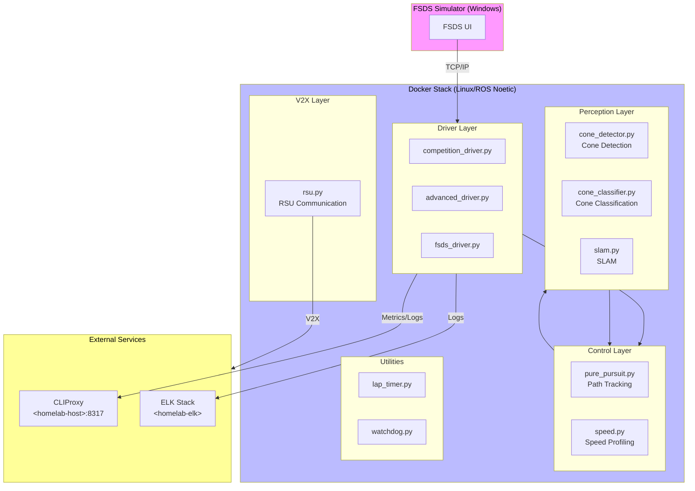

# HYCU FSDS Autonomous Driving / HYCU FSDS 자율주행

<!-- jclee-bot-automation-status:start -->
## GitHub Automation Status / GitHub 자동화 현황

Current as of 2026-06-19.

- Primary PR review/checks and issue maintenance run through the `jclee-bot` GitHub App.
- Issue automation includes opened-issue labels, stale-label removal, stale issue sweep/close, and issue-summary upkeep.
- Existing `.github/workflows` files are compatibility GitOps surfaces managed from `jclee941/.github`; do not treat legacy per-repo workflow counts as the production bot rollout path.
- Source of truth: `jclee941/.github` (`config/repos.yaml`, `jclee_bot/`, and central workflows).

<!-- jclee-bot-automation-status:end -->


> Formula Student Driverless Simulator 기반 자율주행 시스템  
> Formula Student Driverless Simulator (FSDS) Based Autonomous Driving System

[](LICENSE)
[](http://wiki.ros.org/noetic)
[](https://www.python.org/)
[](https://www.docker.com/)
[](https://github.com/qws941/HYCU-FSDS/actions)
[](https://github.com/qodo-ai/pr-agent)

---

## 목차 (Table of Contents)

- [개요 (Overview)](#개요-overview)
- [주요 기능 (Key Features)](#주요-기능-key-features)
- [시스템 아키텍처 (System Architecture)](#시스템-아키텍처-system-architecture)
- [자동화 인벤토리 (Automation Inventory)](#자동화-인벤토리-automation-inventory)
- [빠른 시작 (Quick Start)](#빠른-시작-quick-start)
- [로컬 개발 (Local Development)](#로컬-개발-local-development)
- [명령어 참고서 (Commands Reference)](#명령어-참고서-commands-reference)
- [기여 가이드 (Contribution Guide)](#기여-가이드-contribution-guide)

---

## 개요 (Overview)

본 프로젝트는 **Formula Student Driverless Simulator (FSDS)** 기반으로 개발된 자율주행 시스템입니다. Windows 환경의 시뮬레이터와 Linux (ROS Noetic) Docker 기반 자율주행 스택을 결합한 이중 플랫폼 아키텍처로, 콘 감지 (Cone Detection), SLAM, 경로 계획 및 제어 기능을 통합합니다.

This project is an autonomous driving system based on the **Formula Student Driverless Simulator (FSDS)**. It combines a Windows-based simulator with a Linux (ROS Noetic) Docker-based autonomous driving stack, integrating cone detection, SLAM, path planning, and control functions.

### 프로젝트 배경 (Project Background)

본 프로젝트는 자율주행 알고리즘 연구 및 경진 대회 준비를 위해 구축되었으며, 다음 목표를 달성합니다:

- FSDS 시뮬레이터 환경에서의 실시간 자율주행 구현
- ROS Noetic 기반의 모듈화된 자율주행 스택 제공
- Cone Detection 및 SLAM을 통한 환경 인식 능력 확보
- Pure Pursuit 및 속도 제어를 통한 경로 추종 성능 확보

This project was built for autonomous driving algorithm research and competition preparation, achieving the following goals:

- Real-time autonomous driving implementation in FSDS simulator environment
- Modular autonomous driving stack based on ROS Noetic
- Environment perception capability through Cone Detection and SLAM
- Path tracking performance through Pure Pursuit and speed control

---

## 주요 기능 (Key Features)

### 자율주행 모듈 (Autonomous Driving Modules)

| 모듈 | 설명 |
|------|------|
| **Drivers** | `basic.py`, `advanced.py`, `autonomous.py`, `competition.py` - Various driver modes for different competition scenarios |
| **Control** | `pure_pursuit.py` - Pure Pursuit 경로 추종 알고리즘, `speed.py` - 속도 프로파일링 및 제어 |
| **Perception** | `cone_detector.py`, `cone_classifier.py` - 콘 감지 및 분류, `slam.py` - SLAM 구현 |
| **V2X** | `rsu.py` - Roadside Unit 통신 모듈 |
| **Utils** | `lap_timer.py` - 랩 타임 측정, `watchdog.py` - 프로세스 워치독 |

### 개발 및 CI/CD 기능 (Development and CI/CD Features)

- **Automated PR Review**: pr-agent 기반 자동 PR 리뷰 (`10_pr-review.yml`, `security/11_pr-review.yml`)
- **Semantic PR Enforcement**: Conventional Commits 규칙 적용 (`09_semantic-pr.yml`)
- **Dependency Management**: Dependabot 자동 병합 (`12_dependabot-auto-merge.yml`, `13_pr-auto-merge.yml`)
- **Security Scanning**: Gitleaks, CodeQL, Dependency Review (`05_gitleaks.yml`, `06_codeql.yml`, `07_dependency-review.yml`)
- **CI Auto-Heal**: 실패한 CI 워크플로우 자동 복구 (`60_ci-auto-heal.yml`)
- **Automated Documentation**: README 자동 생성 및 동기화 (`20_readme-gen.yml`, `21_docs-sync.yml`, `42_reusable-docs-sync.yml`)

---

## 시스템 아키텍처 (System Architecture)



### 아키텍처 설계 철학 (Architecture Design Philosophy)

1. **이중 플랫폼**: Windows 시뮬레이터 + Linux Docker 스택으로 개발 유연성 확보
2. **모듈화**: 각 모듈(Pereotype, Control, Drivers)이 독립적으로 동작 가능한 레이어드 아키텍처
3. **확장성**: V2X 통신 지원을 통한 미래 확장 고려

---

## 자동화 인벤토리 (Automation Inventory)

### GitHub Actions 워크플로우 (33 Workflows)

#### Pull Request 워크플로우 (PR Workflows)

| 워크플로우 파일 | 설명 | 트리거 |
|----------------|------|--------|
| `01_branch-to-pr.yml` | 브랜치 생성 시 PR 자동 생성 | push |
| `03_pr-checks.yml` | PR 코드 검사 (린트, 테스트) | pull_request |
| `04_actionlint.yml` | GitHub Actions 워크플로우 린트 | pull_request |
| `09_semantic-pr.yml` | Conventional Commits 검증 | pull_request |
| `10_pr-review.yml` | **pr-agent** 기반 자동 PR 리뷰 | pull_request |
| `security/11_pr-review.yml` | 보안 집중 PR 리뷰 | pull_request |
| `13_pr-auto-merge.yml` | 자동 병합Etiqueta 적용 | pull_request |
| `14_bot-auto-fix.yml` | Bot 제안 자동 수정 | pull_request |

#### 이슈 및 브랜치 관리 (Issue & Branch Management)

| 워크플로우 파일 | 설명 | 트리거 |
|----------------|------|--------|
| `02_issue-to-branch.yml` | 이슈 태그 시 브랜치 자동 생성 | issues |
| `15_merged-pr-cleanup.yml` | 병합 후 브랜치 정리 | pull_request (merge) |
| `jclee-bot App issue-management` | 이슈 자동 라벨링/관리 | 이슈 |

#### 릴리스 및 배포 (Release & Deploy)

| 워크플로우 파일 | 설명 | 트리거 |
|----------------|------|--------|
| `24_release-notes.yml` | 자동 Release Notes 생성 | release |
| `25_release-publish.yml` | Release 배포 자동화 | release |

#### 보안 및 컴플라이언스 (Security & Compliance)

| 워크플로우 파일 | 설명 |
|----------------|------|
| `05_gitleaks.yml` | 하드코딩된 시크릿 스캔 |
| `06_codeql.yml` | CodeQL 정적 분석 |
| `07_dependency-review.yml` | 의존성 보안 리뷰 |
| `08_scorecard.yml` | OpenSSF 스코어카드 |
| `65_dast.yml` | 동적 보안 테스팅 |

#### 재사용 가능한 워크플로우 (Reusable Workflows)

| 워크플로우 파일 | 설명 |
|----------------|------|
| `42_reusable-docs-sync.yml` | 문서 동기화 템플릿 |
| `jclee-bot App issue-management` | 이슈 관리 템플릿 |
| `44_reusable-pr-checks.yml` | PR 검사 템플릿 |
| `45_reusable-gitleaks.yml` | Gitleaks 스캔 템플릿 |

#### 유지보수 워크플로우 (Maintenance Workflows)

| 워크플로우 파일 | 설명 |
|----------------|------|
| `19_issue-backfill.yml` | 이슈 백필 자동화 |
| `20_readme-gen.yml` | README 자동 생성 |
| `21_docs-sync.yml` | 문서 동기화 |
| `29_downstream-health-check.yml` | 다운스트림 상태 확인 |
| `37_ci-failure-issues.yml` | CI 실패 이슈 생성 |
| `60_ci-auto-heal.yml` | CI 복구 자동화 |
| `91_issue-classification.yml` | 이슈 분류 |

#### 기타 워크플로우

| 워크플로우 파일 | 설명 |
|----------------|------|
| `auto-merge.yml` | 자동 병합 |
| `ci.yml` | 메인 CI |
| `labeler.yml` | PR 라벨러 |
| `welcome.yml` | 첫 기여자 환영 |

### 외부 도구 통합 (External Tool Integrations)

| 도구 | 용도 | 엔드포인트 |
|------|------|------------|
| **pr-agent** | AI 기반 PR 리뷰 | <https://qodo-ai/pr-agent> |
| **CLIProxy** | CI 메트릭 수집 | `<homelab-host>:8317` |
| **ELK Stack** | 로그 수집/분석 | `<homelab-elk>` |
| **Dependabot** | 의존성 업데이트 | GitHub 내장 |

---

## 빠른 시작 (Quick Start)

### 전제 조건 (Prerequisites)

- Docker Engine 20.10+
- Docker Compose 1.29+
- Python 3.8+
- ROS Noetic (Linux 환경)
- FSDS 시뮬레이터 (Windows)

### 저장소 복제 (Clone Repository)

```bash
git clone https://github.com/qws941/HYCU-FSDS.git
cd HYCU-FSDS
```

### Docker 기반 실행 (Docker-based Execution)

```bash
# 자율주행 Docker 스택 실행
cd submission/autonomous
docker-compose up -d

# 또는 competition.launch 사용
roslaunch submission/launch/competition.launch
```

### 개발 환경 설정 (Development Environment Setup)

```bash
# 의존성 설치
pip install -r _bot-scripts/requirements.txt
pip install -r _bot-scripts/requirements-dev.txt

# 개발 모드 설치
cd _bot-scripts
pip install -e .
```

---

## 로컬 개발 (Local Development)

### 디렉터리 구조 (Directory Structure)

```text
HYCU-FSDS/
├── submission/                    # 메인 자율주행 코드
│   ├── src/
│   │   ├── drivers/              # 드라이버 모듈
│   │   │   ├── basic.py
│   │   │   ├── advanced.py
│   │   │   ├── autonomous.py
│   │   │   └── competition.py
│   │   ├── control/               # 제어 모듈
│   │   │   ├── pure_pursuit.py
│   │   │   └── speed.py
│   │   ├── perception/            # 인식 모듈
│   │   │   ├── cone_detector.py
│   │   │   ├── cone_classifier.py
│   │   │   └── slam.py
│   │   ├── v2x/                  # V2X 통신
│   │   │   └── rsu.py
│   │   └── utils/                # 유틸리티
│   │       ├── lap_timer.py
│   │       └── watchdog.py
│   ├── config/
│   │   └── driver_params.yaml    # 드라이버 파라미터
│   ├── launch/
│   │   └── competition.launch    # ROS 런치 파일
│   ├── scripts/
│   │   ├── competition_driver.py
│   │   ├── fsds_driver.py
│   │   └── simple_slam.py
│   ├── autonomous/                # Docker 자율주행 스택
│   │   ├── Dockerfile
│   │   ├── docker-compose.yml
│   │   ├── start.sh
│   │   ├── run_all.sh
│   │   ├── entrypoint.sh
│   │   ├── modules/               # ROS 노드 모듈
│   │   └── config/
│   ├── tests/
│   │   └── test_algorithms.py    # 단위 테스트
│   └── docs/
│       └── ARCHITECTURE.md       # 아키텍처 문서
├── _bot-scripts/                  # GitHub 자동화 Bot
│   ├── scripts/
│   ├── requirements.txt
│   ├── requirements-dev.txt
│   └── pyproject.toml
├── in-memoria.db                  # SQLite 데이터베이스
├── AGENTS.md                      # AI 에이전트용 프로젝트 지식 베이스
├── CONTRIBUTING.md                # 기여 가이드라인
└── README.md
```

### 테스트 실행 (Running Tests)

```bash
# 단위 테스트
cd submission
python -m pytest tests/test_algorithms.py -v

# 또는 Docker 환경에서
cd submission/autonomous
docker-compose run --rm test
```

### 코드 검사 (Code Checks)

```bash
# pr-agent 리뷰 (로컬)
docker run --rm \
  -e OPENAI_API_KEY=$OPENAI_API_KEY \
  -e GITHUB_TOKEN=$GITHUB_TOKEN \
  qodo/pr-agent:latest review \
  --pr_url https://github.com/qws941/HYCU-FSDS/pull/1
```

---

## 명령어 참고서 (Commands Reference)

### Docker 명령어 (Docker Commands)

```bash
# 빌드
docker build -t hycu-fsds submission/

# 실행
docker-compose -f submission/autonomous/docker-compose.yml up

# 중지
docker-compose -f submission/autonomous/docker-compose.yml down

# 로그 확인
docker-compose -f submission/autonomous/docker-compose.yml logs -f
```

### ROS 명령어 (ROS Commands)

```bash
# ROScore 실행
roscore

# 특정.launch 파일 실행
roslaunch submission/launch/competition.launch

# 토픽 목록 확인
rostopic list

# 노드 그래프 확인
rqt_graph
```

### Python 스크립트 (Python Scripts)

```bash
# Competition Driver 실행
python submission/scripts/competition_driver.py

# FSDS Driver 실행
python submission/scripts/fsds_driver.py

# Simple SLAM 실행
python submission/scripts/simple_slam.py
```

### GitHub Actions 명령어 (Local Workflow Testing)

```bash
# act 설치 (Linux/macOS)
curl -s https://deb.nodesource.com/setup_16.x | sudo -E bash -
sudo apt-get install -y nodejs
npm install -g act

# workflow 로컬 실행
act -W .github/workflows/03_pr-checks.yml
```

---

## 기여 가이드 (Contribution Guide)

### 브랜치 전략 (Branch Strategy)

| 브랜치 패턴 | 용도 |
|------------|------|
| `feat/*` | 새 기능 개발 |
| `fix/*` | 버그 수정 |
| `docs/*` | 문서 업데이트 |
| `refactor/*` | 코드 리팩토링 |
| `chore/*` | 유지보수 작업 |

### 커밋 규칙 (Commit Rules)

본 프로젝트는 **Conventional Commits** 규칙을 따릅니다:

```
<type>(<scope>): <subject>

Types: feat, fix, docs, style, refactor, test, chore
Examples:
  feat(control): add adaptive pure pursuit algorithm
  fix(perception): correct cone detection threshold
  docs(slam): update SLAM documentation
```

### Pull Request 절차 (PR Procedure)

1. **分支 생성**: `02_issue-to-branch.yml` 또는 수동 생성
2. **코드 작성**:Conventional Commits 규칙 준수
3. **PR 리뷰 요청**: `10_pr-review.yml`가 자동 실행됨
4. **CI 검사 통과**: `03_pr-checks.yml`, `05_gitleaks.yml` 등
5. **머지**: `15_merged-pr-cleanup.yml`가 자동으로 브랜치 정리

### 이슈 opened 방법 (How to Open Issues)

```bash
# Bug Report 템플릿 사용
gh issue create --template bug_report.yml

# Feature Request 템플릿 사용
gh issue create --template feature_request.yml
```

### 자동화 워크플로우 동기화 (Automation Workflow Sync)

이 프로젝트의 GitHub Automation 설정은 `_bot-scripts/`를 통해 중앙 관리됩니다. 외부 리포지토리는 `21_docs-sync.yml` 및 관련 워크플로우를 통해 동기화됩니다.

For detailed contribution guidelines, please refer to [CONTRIBUTING.md](CONTRIBUTING.md).

---

## 라이선스 (License)

이 프로젝트는 MIT 라이선스 하에 배포됩니다. 자세한 내용은 [LICENSE](LICENSE) 파일을 참조하세요.

This project is distributed under the MIT License. See [LICENSE](LICENSE) for details.

---

## 연락처 (Contact)

- **프로젝트 저장소 (Project Repository)**: <https://github.com/qws941/HYCU-FSDS>
- **AI PR 리뷰어 (AI PR Reviewer)**: <https://qodo-ai/pr-agent>

---

_Last generated: 2026-03-05 | Branch: master_
