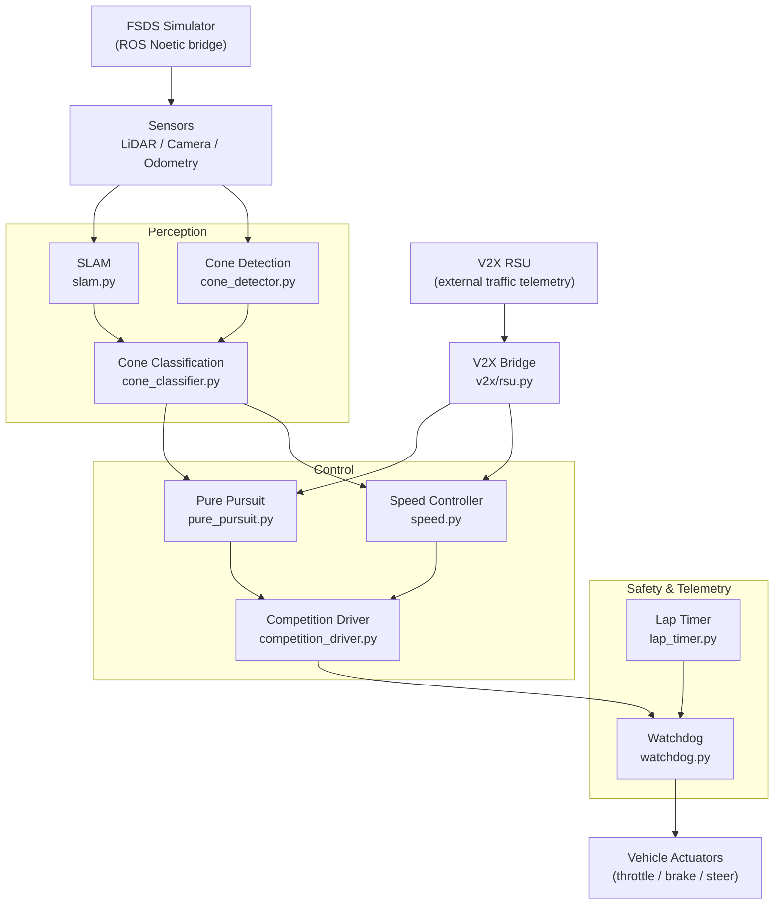

# HYCU FSDS Autonomous Driving / HYCU FSDS 자율주행

> Formula Student Driverless Simulator 기반 자율주행 시스템
> Autonomous driving stack for the Formula Student Driverless Simulator (FSDS)


---

## Overview / 개요

**EN**
HYCU FSDS Autonomous Driving is an autonomous driving project for Formula Student Driverless Simulator (FSDS) workflows. It provides Dockerized ROS Noetic components for perception (cone detection, classification, SLAM), control (pure pursuit, speed), safety monitoring (watchdog), lap timing, simulator integration, V2X support, and competition-style submission packaging. The repository is split into a development-oriented stack and a packaged submission stack so that the same algorithms can be iterated locally and re-built as a frozen runtime for evaluation.

**KR**
HYCU FSDS Autonomous Driving은 Formula Student Driverless Simulator(FSDS) 워크플로우를 위한 자율주행 프로젝트입니다. ROS Noetic 기반의 Docker 컨테이너 구성으로 콘 감지·분류·SLAM 인지 모듈, Pure Pursuit·속도 제어 모듈, 워치독 안전 감시, 랩 타이머, 시뮬레이터 연동, V2X 지원, 대회 제출 패키징을 제공합니다. 저장소는 개발용 스택과 제출용 패키지 스택으로 분리되어 있어, 동일한 알고리즘을 로컬에서 반복 개발하고 평가용 동결 런타임(frozen runtime)으로 다시 빌드할 수 있습니다.

The repository provides two execution paths / 저장소는 두 가지 실행 경로를 제공합니다:

1. `src/autonomous/` — Development-oriented stack / 개발 및 실험용 자율주행 스택.
2. `submission/` — Frozen runtime stack for competition submission or evaluation / 대회 제출 또는 평가를 위한 동결 실행 스택.

---

## Features / 주요 기능

### Perception / 인지
- **Cone Detection** (`cone_detector.py`) — LiDAR-based cone candidate extraction.
- **Cone Classification** (`cone_classifier.py`) — Classifies cones (left/right marker, start/finish) and color.
- **SLAM** (`slam.py`) — Simultaneous localization and mapping for track boundary awareness.
- **V2X RSU bridge** (`submission/src/v2x/rsu.py`) — Receives Roadside Unit telemetry.

### Control / 제어
- **Pure Pursuit** (`pure_pursuit.py`) — Geometric path tracker for waypoint following.
- **Speed Controller** (`speed.py`) — Curvature-aware longitudinal velocity control.
- **Competition Driver** (`competition_driver.py`) — High-level state machine orchestrating perception + control.

### Safety & Telemetry / 안전 및 텔레메트리
- **Watchdog** (`watchdog.py`) — Timeout and fault monitor; can command a safe stop.
- **Lap Timer** (`lap_timer.py`) — Lap counting and timing based on start/finish gate.
- **Drivers** (`basic.py`, `advanced.py`, `autonomous.py`, `competition.py`) — Multiple driving strategies, from manual to fully autonomous.

### Simulator & Tooling / 시뮬레이터 및 도구
- **FSDS integration** via `src/simulator/settings.json` and ROS launch files.
- **Launch files**: `bridge_no_camera.launch`, `competition.launch`.
- **Configuration**: `params.yaml` for tuning perception and control parameters.
- **Recording**: `record_race.sh` captures simulator output for offline analysis.

### Submission Packaging / 제출 패키징
- **Frozen runtime** under `submission/` with a self-contained `Dockerfile` and `docker-compose.yml`.
- **Entry scripts**: `run.sh` (frozen run) and `dev.sh` (interactive dev shell).
- **Packaging helper**: `scripts/package.sh` builds the submission artifact.

---

## Architecture / 아키텍처

The stack is organized as a perception → safety → control pipeline fed by the simulator and an optional V2X RSU. The watchdog sits across the control outputs to enforce a safe stop on fault.



The same module graph exists twice on disk — once in `src/autonomous/` for iteration and once in `submission/src/` as a frozen copy used by the competition runtime.

---

## Repository Structure / 저장소 구조

```text
.
├── AGENTS.md
├── CONTRIBUTING.md
├── LICENSE
├── OWNERS
├── README.md
├── in-memoria.db
├── src/
│   ├── autonomous/                # Development-oriented stack
│   │   ├── AGENTS.md
│   │   ├── Dockerfile
│   │   ├── docker-compose.yml
│   │   ├── entrypoint.sh
│   │   ├── record_race.sh
│   │   ├── run_all.sh
│   │   ├── start.sh
│   │   ├── scripts/
│   │   │   └── start_race.py
│   │   ├── config/
│   │   │   ├── bridge_no_camera.launch
│   │   │   └── params.yaml
│   │   ├── driver/
│   │   │   └── competition_driver.py
│   │   ├── modules/
│   │   │   ├── perception/        # cone_detector, cone_classifier, slam
│   │   │   ├── control/           # pure_pursuit, speed
│   │   │   └── utils/             # lap_timer, watchdog
│   │   └── tests/
│   │       └── test_algorithms.py
│   └── simulator/
│       ├── README.md
│       └── settings.json
├── scripts/
│   └── package.sh                 # Builds the submission artifact
├── docs/
│   ├── SUBMISSION_GUIDE.md
│   └── reference_materials/
│       ├── lecture1_fsds_install.txt
│       ├── lecture4_slam.ipynb
│       └── lecture6_v2x.ipynb
└── submission/                    # Frozen runtime for evaluation
    ├── AGENTS.md
    ├── Dockerfile
    ├── README.md
    ├── dev.sh
    ├── docker-compose.yml
    ├── run.sh
    ├── launch/
    │   └── competition.launch
    ├── src/
    │   ├── drivers/               # basic, advanced, autonomous, competition
    │   ├── perception/            # cone_detector, cone_classifier, slam
    │   ├── control/               # pure_pursuit, speed
    │   ├── utils/                 # lap_timer, watchdog
    │   └── v2x/                   # rsu
    └── autonomous/                # Mirror of dev stack used inside the frozen image
        ├── Dockerfile
        ├── docker-compose.yml
        ├── entrypoint.sh
        ├── run_all.sh
        ├── start.sh
        ├── config/params.yaml
        ├── driver/competition_driver.py
        └── modules/perception/
```

---

## Automation Inventory / 자동화 인벤토리

All CI/CD lives under `.github/workflows/`. The naming convention `NN_descriptive-name.yml` is intentional — the numeric prefix dictates execution order (low first) and prevents accidental ordering collisions during sync.

### Workflows / 워크플로우

| File | Trigger | Purpose |
| --- | --- | --- |
| `ci.yml` | push, pull_request | Lint + unit tests baseline. |
| `01_branch-to-pr.yml` | push on non-master | Converts pushed branches into draft PRs. |
| `02_issue-to-branch.yml` | issue opened/labeled | Creates a working branch from an issue. |
| `10_pr-review.yml` | pull_request | AI PR review via `qodo-ai/pr-agent`. |
| `11_security-pr-review.yml` | pull_request | Security-focused PR review pass. |
| `12_dependabot-auto-merge.yml` | Dependabot PR | Auto-merges patch/minor Dependabot updates. |
| `13_pr-auto-merge.yml` | pull_request labeled | Auto-merge for PRs that pass review and CI. |
| `14_bot-auto-fix.yml` | pull_request | Bot-applied fixes (lint, formatting, trivial). |
| `15_merged-pr-cleanup.yml` | pull_request closed | Deletes the head branch after merge. |
| `19_issue-backfill.yml` | schedule, workflow_dispatch | Backfills missing metadata on stale issues. |
| `24_release-notes.yml` | release | Generates release notes from merged PRs. |
| `25_release-publish.yml` | release published | Publishes artifacts and updates package index. |
| `29_downstream-health-check.yml` | schedule, workflow_dispatch | Health-checks downstream consumers/repos. |
| `37_ci-failure-issues.yml` | workflow_run (failure) | Opens an issue when CI fails repeatedly. |

### Go automation tools / Go 자동화 도구

None currently — automation is implemented entirely in GitHub Actions YAML.

---

## Quick Start / 빠른 시작

### Prerequisites / 사전 요구사항
- Docker 20.10+ and `docker compose` v2.
- A working FSDS install (see `docs/reference_materials/lecture1_fsds_install.txt`).
- (Optional) NVIDIA GPU + `nvidia-container-toolkit` for the camera-enabled bridge.

### Run the development stack / 개발 스택 실행
```bash
# 1. Clone
git clone <your-fork-url> hycu-fsds
cd hycu-fsds

# 2. Build and launch the dev container
cd src/autonomous
docker compose build
./start.sh                 # or: docker compose up
```

### Run the frozen submission stack / 동결 제출 스택 실행
```bash
cd submission
docker compose build
./run.sh                   # frozen evaluation mode
# or
./dev.sh                   # interactive dev shell inside the frozen image
```

### Record a race / 레이스 녹화
```bash
cd src/autonomous
./record_race.sh           # writes bag files into the recordings/ volume
```

### Package for submission / 제출용 패키징
```bash
./scripts/package.sh       # produces a tarball under dist/
```

---

## Local Development / 로컬 개발

### Layout convention / 레이아웃 규칙
- Edit code under `src/autonomous/modules/...`. This is the source of truth.
- Mirror changes into `submission/src/...` when stabilizing for evaluation.
- Tune runtime parameters in `src/autonomous/config/params.yaml`.

### Running tests / 테스트 실행
```bash
cd src/autonomous
python -m pytest tests/test_algorithms.py -v
```

### Tweak perception / 인지 튜닝
- `modules/perception/cone_detector.py` — LiDAR cluster thresholds.
- `modules/perception/cone_classifier.py` — Color/role classification rules.
- `modules/perception/slam.py` — Map resolution, loop-closure params.

### Tweak control / 제어 튜닝
- `modules/control/pure_pursuit.py` — Lookahead distance.
- `modules/control/speed.py` — Curvature → speed mapping.
- `config/params.yaml` — Centralized tuning entry point.

### Bring your own V2X / V2X 연동
- Implement a publisher in `submission/src/v2x/rsu.py` matching the expected topic contract documented in `docs/SUBMISSION_GUIDE.md`.
- The `V2X Bridge` node will fan out incoming RSU messages to both pure pursuit and the speed controller.

---

## Commands Reference / 명령어 레퍼런스

| Command | Where | Description |
| --- | --- | --- |
| `./start.sh` | `src/autonomous/` | Start the dev stack in the foreground. |
| `./run_all.sh` | `src/autonomous/` | Start the dev stack with all auxiliary nodes. |
| `./record_race.sh` | `src/autonomous/` | Record simulator output to a ROS bag. |
| `./entrypoint.sh` | `src/autonomous/` | Container entrypoint (called by Docker). |
| `python scripts/start_race.py` | `src/autonomous/scripts/` | Programmatic race start (used in CI). |
| `pytest tests/test_algorithms.py` | `src/autonomous/` | Run unit tests. |
| `roslaunch config/bridge_no_camera.launch` | `src/autonomous/config/` | Headless bridge without camera node. |
| `roslaunch launch/competition.launch` | `submission/launch/` | Frozen competition launch. |
| `./run.sh` | `submission/` | Run the frozen submission stack. |
| `./dev.sh` | `submission/` | Drop into a dev shell inside the frozen image. |
| `./scripts/package.sh` | repo root | Build a submission tarball under `dist/`. |

---

## Contribution Guide / 기여 가이드

1. **Branch from an issue.** The bot at `02_issue-to-branch.yml` will create one for you if you comment `/branch` on an issue. Conventional prefixes: `feat/`, `fix/`, `docs/`, `refactor/`, `test/`.
2. **Keep the two stacks in sync.** When you change a module under `src/autonomous/modules/`, apply the same change to `submission/src/` before requesting review.
3. **Pass CI.** `ci.yml` must be green. The bot will not auto-merge otherwise (see `13_pr-auto-merge.yml`).
4. **PR review.** `10_pr-review.yml` posts a `qodo-ai/pr-agent` review; address every `🔴` (must-fix) comment. `11_security-pr-review.yml` adds a security pass.
5. **Dependabot updates** are auto-merged by `12_dependabot-auto-merge.yml` for patch/minor bumps. Major bumps require manual review.
6. **Trivial fixes** can be applied by `14_bot-auto-fix.yml`. If the bot commits to your branch, give it a chance to push again before force-pushing.
7. **After merge**, `15_merged-pr-cleanup.yml` deletes the head branch. No manual cleanup needed.
8. **Release.** Tag with `vX.Y.Z`; `24_release-notes.yml` drafts notes, and `25_release-publish.yml` publishes artifacts. See `docs/SUBMISSION_GUIDE.md` for competition-specific release steps.
9. **Downstream consumers** are validated by `29_downstream-health-check.yml`. Do not skip its failures without a tracking issue.
10. **CI broken for >N runs?** `37_ci-failure-issues.yml` will open an issue. Triage it the same day.

### Code style / 코드 스타일
- Python 3.8+, PEP 8, type hints encouraged.
- ROS NodeBase subclasses in `modules/`.
- One responsibility per module file; keep the public API stable (other modules import from it).

### Commit messages / 커밋 메시지
Use [Conventional Commits](https://www.conventionalcommits.org/) so the release drafter can categorize changes:
```
feat(perception): add curvature-aware cone clustering
fix(control): clamp speed to track limits on hairpins
docs(submission): clarify docker-compose env vars
```

---

## References / 참고 자료
- `docs/SUBMISSION_GUIDE.md` — End-to-end submission checklist.
- `docs/reference_materials/lecture1_fsds_install.txt` — FSDS installation notes.
- `docs/reference_materials/lecture4_slam.ipynb` — SLAM lecture companion.
- `docs/reference_materials/lecture6_v2x.ipynb` — V2X lecture companion.
- `OWNERS` — CODEOWNERS for this repository.
- `LICENSE` — MIT License.

---

## License / 라이선스
Released under the MIT License. See `LICENSE` for the full text.