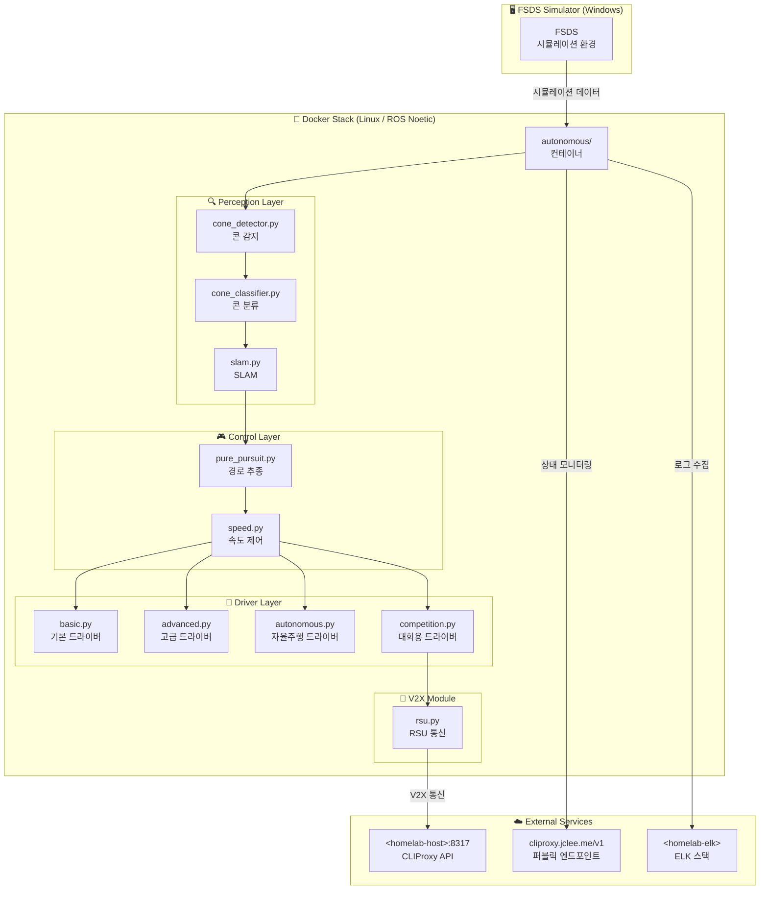

# HYCU FSDS Autonomous Driving / HYCU FSDS 자율주행

> Formula Student Driverless Simulator 기반 자율주행 시스템  
> Formula Student Driverless Simulator (FSDS) Based Autonomous Driving System

[](LICENSE)
[](http://wiki.ros.org/noetic)
[](https://www.python.org/)
[](https://www.docker.com/)
[](https://github.com/qws941/HYCU-FSDS/actions)

---

## 목차 (Table of Contents)

- [개요 (Overview)](#개요-overview)
- [주요 기능 (Key Features)](#주요-기능-key-features)
- [시스템 아키텍처 (System Architecture)](#시스템-아키텍처-system-architecture)
- [자동화 인벤토리 (Automation Inventory)](#자동화-인벤토리-automation-inventory)
- [빠른 시작 (Quick Start)](#빠른-시작-quick-start)
- [로컬 개발 (Local Development)](#로컬-개발-local-development)
- [명령어 참고서 (Commands Reference)](#명령어-참고서-commands-reference)
- [기여 가이드 (Contribution Guide)](#기여-가이드-contribution-guide)

---

## 개요 (Overview)

본 프로젝트는 **Formula Student Driverless Simulator (FSDS)** 기반으로 개발된 자율주행 시스템입니다. Windows 환경의 시뮬레이터와 Linux (ROS Noetic) Docker 기반 자율주행 스택을 결합한 이중 플랫폼 아키텍처로, 콘 감지 (Cone Detection), SLAM, 경로 계획 및 제어 기능을 통합합니다.

This project is an autonomous driving system based on the **Formula Student Driverless Simulator (FSDS)**. It combines a Windows-based simulator with a Linux (ROS Noetic) Docker-based autonomous driving stack, integrating cone detection, SLAM, path planning, and control functions.

### 프로젝트 배경 (Project Background)

본 프로젝트는 자율주행 알고리즘 연구 및 경진 대회 준비를 위해 구축되었으며, 다음 목표를 달성합니다:

- FSDS 시뮬레이터 환경에서의 실시간 자율주행 구현
- ROS Noetic 기반의 모듈화된 자율주행 스택 제공
- Cone Detection 및 SLAM을 통한 환경 인식 능력 확보
- Pure Pursuit 및 속도 제어를 통한 경로 추종 성능 확보

This project was established for autonomous driving algorithm research and competition preparation, achieving the following objectives:

- Real-time autonomous driving in the FSDS simulator environment
- Modular autonomous driving stack based on ROS Noetic
- Environmental perception via Cone Detection and SLAM
- Path-following performance through Pure Pursuit and speed control

---

## 주요 기능 (Key Features)

### 자율주행 스택 (Autonomous Driving Stack)

| 모듈 | 설명 |
|------|------|
| **Perception** | Cone Detection, Cone Classification, SLAM |
| **Control** | Pure Pursuit 경로 추종, 속도 제어 |
| **Drivers** | Basic, Advanced, Autonomous, Competition 모드 |
| **V2X** | RSU (Roadside Unit) 통신 모듈 |

### 개발 환경 (Development Environment)

- **ROS Noetic**: 로봇 미들웨어 플랫폼
- **Python 3.8+**: 주요 개발 언어
- **Docker**: 이식 가능한 컨테이너 기반 개발
- **FSDS 시뮬레이터**: Windows 기반 시뮬레이션 환경

---

## 시스템 아키텍처 (System Architecture)



### 데이터 흐름 (Data Flow)

```
FSDS Simulator (Windows)
    │
    ▼ (시뮬레이션 데이터)
Docker Container (ROS Noetic)
    │
    ├──▶ Perception Pipeline
    │       cone_detector → cone_classifier → slam
    │
    ├──▶ Control Pipeline
    │       pure_pursuit → speed control
    │
    └──▶ Driver Pipeline
            basic / advanced / autonomous / competition
```

---

## 자동화 인벤토리 (Automation Inventory)

### GitHub Actions 워크플로우 (Workflows)

| 파일명 | 카테고리 | 설명 |
|--------|----------|------|
| **01_branch-to-pr.yml** | PR | 브랜치 생성 시 자동으로 PR 생성 |
| **02_issue-to-branch.yml** | Issue | Issue 열림 시 작업 브랜치 자동 생성 |
| **03_pr-checks.yml** | PR | PR 검증 파이프라인 |
| **04_actionlint.yml** | Security | 워크플로우 YAML 문법 검사 |
| **05_gitleaks.yml** | Security | 시크릿/민감 정보 스캔 |
| **06_codeql.yml** | Security | CodeQL 정적 분석 |
| **07_dependency-review.yml** | Security | 의존성 보안 검토 |
| **08_scorecard.yml** | Security | OpenSSF Scorecard 평가 |
| **09_semantic-pr.yml** | PR | Semantic PR 규칙 검증 |
| **10_pr-review.yml** | PR | 자동 PR 리뷰 (PR-Agent) |
| **12_dependabot-auto-merge.yml** | CI/CD | Dependabot PR 자동 병합 |
| **13_pr-auto-merge.yml** | CI/CD | 일반 PR 자동 병합 |
| **14_bot-auto-fix.yml** | CI/CD | 봇 자동 수정 워크플로우 |
| **15_merged-pr-cleanup.yml** | CI/CD | 병합 후 브랜치 정리 |
| **18_issue-management.yml** | Issue | Issue lifecycle 관리 |
| **19_issue-backfill.yml** | Issue | Issue 백필 자동화 |
| **20_readme-gen.yml** | Docs | README 자동 생성 |
| **21_docs-sync.yml** | Docs | 문서 동기화 |
| **24_release-notes.yml** | Release | 릴리스 노트 자동 생성 |
| **25_release-publish.yml** | Release | 릴리스 게시 자동화 |
| **29_downstream-health-check.yml** | CI/CD | 다운스트림 건강 상태 확인 |
| **37_ci-failure-issues.yml** | CI/CD | CI 실패 시 자동 Issue 생성 |
| **42_reusable-docs-sync.yml** | Docs | 재사용 가능한 문서 동기화 |
| **43_reusable-issue-management.yml** | Issue | 재사용 가능한 Issue 관리 |
| **44_reusable-pr-checks.yml** | PR | 재사용 가능한 PR 검증 |
| **45_reusable-gitleaks.yml** | Security | 재사용 가능한 Gitleaks 스캔 |
| **60_ci-auto-heal.yml** | CI/CD | CI 자동 복구 |
| **91_issue-classification.yml** | Issue | Issue 자동 분류 |
| **auto-merge.yml** | CI/CD | 통합 자동 병합 |
| **ci.yml** | CI/CD | 메인 CI 파이프라인 |
| **labeler.yml** | PR | PR 라벨 자동 부여 |
| **welcome.yml** | Community |新人 기여자 환영 메시지 |
| **security/11_pr-review.yml** | Security | 보안 리뷰 워크플로우 |

### 자동화 도구 (Tools)

| 도구 | 용도 |
|------|------|
| **PR-Agent** (qodo-ai/pr-agent) | 자동 PR 리뷰 및 분석 |
| **Gitleaks** | 민감 정보 스캔 |
| **CodeQL** | 정적 코드 분석 |
| **Actionlint** | 워크플로우 검증 |
| **Dependabot** | 의존성 자동 업데이트 |
| **OpenSSF Scorecard** | 보안 점수 평가 |
| **CLIProxy** (cliproxy.jclee.me) | CI/CD 프록시 및 모니터링 |
| **ELK Stack** | 로그 수집 및 분석 |

---

## 빠른 시작 (Quick Start)

### 전제 조건 (Prerequisites)

- Docker 20.10+
- Python 3.8+
- ROS Noetic (Linux 환경)
- FSDS 시뮬레이터 (Windows)

### 1. Docker 컨테이너 빌드 (Build Docker Container)

```bash
# 자율주행 스택 빌드
cd autonomous
docker-compose build
```

### 2. 시뮬레이션 연결 (Connect to Simulator)

```bash
#自主주행 노드 실행
./autonomous/start.sh

#또는 전체 스택 실행
./autonomous/run_all.sh
```

### 3. 제출용 빌드 (Submission Build)

```bash
cd submission
./run.sh
```

---

## 로컬 개발 (Local Development)

### 환경 설정 (Environment Setup)

```bash
# Python 의존성 설치
pip install -r requirements.txt

# ROS 환경 설정
source /opt/ros/noetic/setup.bash

# 개발 모드 실행
python scripts/fsds_driver.py
```

### 디렉토리 구조 (Directory Structure)

```
HYCU-FSDS/
├── submission/                 # 제출용 코드
│   ├── src/
│   │   ├── drivers/           # 드라이버 모듈
│   │   ├── control/           # 제어 모듈
│   │   ├── perception/        # 인식 모듈
│   │   └── v2x/               # V2X 통신
│   ├── config/                # 설정 파일
│   └── tests/                 # 테스트
├── autonomous/                # 자율주행 Docker 스택
│   ├── modules/
│   │   ├── control/
│   │   ├── perception/
│   │   └── utils/
│   ├── config/
│   └── driver/
├── _bot-scripts/              # 자동화 스크립트
│   ├── scripts/
│   └── workflows/             # 재사용 가능한 워크플로우
└── docs/                      # 문서
```

### 테스트 실행 (Run Tests)

```bash
# 알고리즘 테스트
python -m pytest submission/tests/test_algorithms.py

# 또는
cd submission
python -m unittest tests.test_algorithms
```

---

## 명령어 참고서 (Commands Reference)

### Docker 명령어 (Docker Commands)

| 명령어 | 설명 |
|--------|------|
| `docker-compose -f submission/docker-compose.yml build` | 제출용 이미지 빌드 |
| `docker-compose -f submission/docker-compose.yml up` | 제출용 컨테이너 실행 |
| `docker-compose -f autonomous/docker-compose.yml build` | 자율주행 스택 빌드 |
| `./autonomous/start.sh` | 자율주행 노드 시작 |
| `./autonomous/run_all.sh` | 전체 스택 실행 |

### Python 스크립트 (Python Scripts)

| 스크립트 | 설명 |
|----------|------|
| `scripts/fsds_driver.py` | FSDS 드라이버 실행 |
| `scripts/simple_slam.py` | SLAM 모듈 실행 |
| `scripts/competition_driver.py` | 대회용 드라이버 |
| `scripts/advanced_driver.py` | 고급 드라이버 |

### ROS 명령어 (ROS Commands)

| 명령어 | 설명 |
|--------|------|
| `roslaunch submission/launch/competition.launch` | 대회용 런치 파일 |
| `rostopic list` | 토픽 목록 확인 |
| `rostopic echo /cone_detections` | 콘 감지 토픽 구독 |

---

## 기여 가이드 (Contribution Guide)

### 버그 리포트 및 기능 요청 (Bug Reports & Feature Requests)

1. GitHub Issue를 생성하여 버그 또는 기능을 요청하세요.
2. 동일한 이슈가 이미 있는지 확인하세요.
3. 명확한 설명과 재현 절차를 포함하세요.

### 코드 기여 (Code Contribution)

1. 이 저장소를 Fork하세요.
2.-feature 브랜치를 생성하세요 (`git checkout -b feature/AmazingFeature`).
3. 변경 사항을 커밋하세요 (`git commit -m 'Add some AmazingFeature'`).
4. 브랜치에 푸시하세요 (`git push origin feature/AmazingFeature`).
5. Pull Request를 생성하세요.

### 코딩 규칙 (Coding Standards)

- **Python**: PEP 8 스타일 가이드를 따르세요.
- **ROS**: ros-node naming conventions을遵守하세요.
- **커밋 메시지**: conventional commits 규격을使用하세요.
- **테스트**: 모든 새 기능에 대해 단위 테스트를 작성하세요.

### 기여자 목록 (Contributors)

기여자분들께 감사드립니다. 프로젝트에 기여하신 모든 분은 [GitHub Contributors](https://github.com/qws941/HYCU-FSDS/graphs/contributors) 페이지에서 확인하실 수 있습니다.

---

## 라이선스 (License)

이 프로젝트는 MIT 라이선스 하에 배포됩니다. 자세한 내용은 [LICENSE](LICENSE) 파일을 참조하세요.

---

## 연락처 (Contact)

- **프로젝트 URL**: <https://github.com/qws941/HYCU-FSDS>
- **문제 신고**: GitHub Issues 사용

---

*이 README는 자동화 시스템에 의해 생성 및 업데이트됩니다.*
