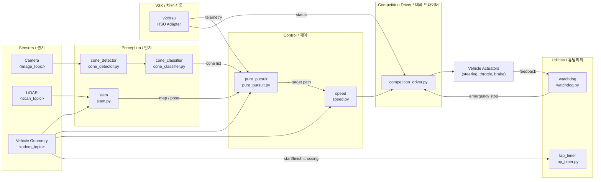

# Formula Student Driverless — Autonomous Racing Stack

> **FSD (Formula Student Driverless) 자율주행 레이싱 소프트웨어 스택**
> Autonomous racing software stack for the Formula Student Driverless competition

이 저장소는 FSD 대회를 위한 완전 자율주행 레이싱 차량 소프트웨어를 제공합니다. SLAM, 콘 감지/분류, Pure Pursuit 추종 제어, 랩 타이머, V2X(차량-사물 통신) 어댑터, 그리고 대회용 Docker 제출 패키지를 포함합니다.

This repository provides a full-stack autonomous driving system for the Formula Student Driverless competition. It bundles SLAM, cone detection/classification, pure-pursuit lane following, lap timing, a V2X adapter, and a competition-ready Docker submission package.

---

## Table of Contents / 목차

1. [Overview / 개요](#overview--개요)
2. [Features / 주요 기능](#features--주요-기능)
3. [Architecture / 아키텍처](#architecture--아키텍처)
4. [Repository Layout / 저장소 구조](#repository-layout--저장소-구조)
5. [Quick Start / 빠른 시작](#quick-start--빠른-시작)
6. [Configuration / 설정](#configuration--설정)
7. [Commands Reference / 명령어 레퍼런스](#commands-reference--명령어-레퍼런스)
8. [Local Development / 로컬 개발](#local-development--로컬-개발)
9. [Testing / 테스트](#testing--테스트)
10. [Simulation / 시뮬레이션](#simulation--시뮬레이션)
11. [Submission Package / 제출 패키지](#submission-package--제출-패키지)
12. [Contributing / 기여](#contributing--기여)
13. [License / 라이선스](#license--라이선스)

---

## Overview / 개요

FSD 대회는 카메라와 LiDAR로 트랙을 인식하고, 노란색/파란색 콘으로 정의된 미니멀 패스 레인을 따라 자율 주행을 수행하며, V2X 인프라(RSU)와 통신해 추가 정보를 받는 종목입니다. 본 스택은 그 파이프라인을 ROS 1 기반 노드들로 구현합니다.

The Formula Student Driverless competition asks teams to detect the track, follow a cone-defined lane (yellow/blue), and exchange data with a Roadside Unit (RSU) over V2X — all without a human driver. This stack implements that pipeline as a set of ROS 1 nodes.

### 대상 사용자 / Target Users

- FSD 대회에 참가하는 팀의 자율주행 SW 엔지니어
  Autonomous-driving SW engineers on FSD teams
- SLAM / computer vision / control 알고리즘을 실제 차량에 배포하려는 연구자
  Researchers who want to deploy SLAM / CV / control algorithms on a real race car
- 본 코드를 베이스라인으로 포크해 팀 고유 알고리즘을 시험하려는 학생 팀
  Student teams forking this codebase as a baseline for team-specific algorithms

### 대회 규칙 요약 / Competition Rule Summary

| 디스시플린 / Discipline | 핵심 태스크 / Core Task | 사용 모듈 / Modules Used |
| --- | --- | --- |
| **Trackdrive** | 미지의 트랙 1랩 완주 / Complete one lap on an unknown track | `cone_detector`, `slam`, `pure_pursuit`, `speed`, `lap_timer` |
| **Skidpad** | 8자 트랙 주행 / Drive a figure-of-eight track | `cone_classifier`, `pure_pursuit`, `speed` |
| **Autocross** | 다중 게이트 고속 주행 / High-speed multi-gate sprint | `cone_detector`, `slam`, `pure_pursuit`, `speed` |
| **EBS (Emergency Brake System)** | 비상 정지 검증 / Verify emergency braking | `watchdog`, `speed` |
| **V2X** | RSU와 데이터 송수신 / Exchange data with RSU | `v2x/rsu` |

---

## Features / 주요 기능

### Perception / 인지

- **Cone Detection** (`src/autonomous/modules/perception/cone_detector.py`): 카메라/점유 그리드에서 콘 후보를 추출
  Extracts cone candidates from camera images and/or occupancy grids.
- **Cone Classification** (`src/autonomous/modules/perception/cone_classifier.py`): HSV/색공간 분석으로 노란색 vs 파란색 콘을 분류
  Classifies yellow vs. blue cones via HSV / color-space analysis.
- **SLAM** (`src/autonomous/modules/perception/slam.py`): LiDAR 기반 동시 위치추정 및 지도작성
  LiDAR-based simultaneous localization and mapping.

### Control / 제어

- **Pure Pursuit** (`src/autonomous/modules/control/pure_pursuit.py`): 콘 중심 경로를 따라가는 기하학적 추종 제어
  Geometric path-following that tracks the cone-defined lane centerline.
- **Speed Control** (`src/autonomous/modules/control/speed.py`): 곡률 기반 속도 프로파일 및 가감속
  Curvature-aware speed profiling with acceleration / deceleration limits.

### Utilities / 유틸리티

- **Lap Timer** (`src/autonomous/modules/utils/lap_timer.py`): 출발선 통과 감지 및 랩 타임 기록
  Detects start/finish line crossings and records lap times.
- **Watchdog** (`src/autonomous/modules/utils/watchdog.py`): 하트비트 모니터링, 통신 두절 시 비상 정지
  Heartbeat monitoring; triggers emergency stop on communication loss.

### V2X / 차량-사물 통신

- **RSU Adapter** (`submission/src/v2x/rsu.py`): RSU 메시지 송수신 어댑터
  Adapter to send / receive Roadside Unit messages.

### Competition Drivers / 대회 드라이버

- **Basic** (`submission/src/drivers/basic.py`)
- **Autonomous** (`submission/src/drivers/autonomous.py`)
- **Advanced** (`submission/src/drivers/advanced.py`)
- **Competition** (`submission/src/drivers/competition.py`) — 프로덕션 진입점 / production entry point
- **Competition Driver** (`src/autonomous/driver/competition_driver.py`)

### Deployment / 배포

- **Dockerized Submission Package** (`submission/Dockerfile` + `docker-compose.yml`)
  대회 조직위에 그대로 제출 가능한 컨테이너
  Container directly submittable to the competition organizers.
- **Autonomous Service Images** (`src/autonomous/Dockerfile` + `src/autonomous/docker-compose.yml`)
  개발·테스트용 독립 실행 이미지
  Standalone image for development and testing.

---

## Architecture / 아키텍처

본 스택은 ROS 1 토픽으로 연결된 모듈형 노드 집합입니다. 센서 입력은 인지 모듈로 들어가고, 인지 결과는 SLAM 맵과 콘 리스트로 추상화되어 제어 모듈에 전달됩니다. 유틸리티 모듈은 안전과 계측을 담당하며, V2X 어댑터가 RSU와 병렬로 통신합니다.

The stack is a collection of modular ROS 1 nodes connected by topics. Sensor feeds flow into the perception layer, whose output is abstracted into a SLAM map and a cone list that the control layer consumes. Utility nodes handle safety and instrumentation, and a V2X adapter communicates with the RSU in parallel.



### 데이터 흐름 요약 / Data Flow Summary

1. **Sensors → Perception**: 카메라/라이다/오도메트리 토픽이 인지 노드로 스트리밍됩니다.
2. **Perception → Control**: 콘 위치/색상, SLAM 맵, 차량 포즈가 Pure Pursuit의 입력으로 합쳐집니다.
3. **Control → Driver**: 곡률 기반 속도 명령과 스티어링 각도가 `competition_driver`로 전달됩니다.
4. **Driver → Actuators**: `competition_driver`가 최종 차량 명령(조향/스로틀/브레이크)을 발행합니다.
5. **Watchdog & Lap Timer**: 모든 단계를 감시해 비상 정지 트리거와 랩 타임 기록을 수행합니다.
6. **V2X (RSU)**: 별도 경로로 RSU 메시지를 송수신하고, 텔레메트리를 제어 경로에 합류시킵니다.

---

## Repository Layout / 저장소 구조

> 실제 최상위 디렉터리 레이아웃을 반영합니다. / Reflects the actual top-level layout.

```
.
├── AGENTS.md
├── CONTRIBUTING.md
├── LICENSE
├── OWNERS
├── README.md
├── in-memoria.db
├── src/
│   ├── autonomous/                 # 개발용 자율주행 워크스페이스
│   │   ├── AGENTS.md
│   │   ├── Dockerfile
│   │   ├── docker-compose.yml
│   │   ├── entrypoint.sh
│   │   ├── start.sh
│   │   ├── run_all.sh
│   │   ├── record_race.sh
│   │   ├── config/
│   │   │   ├── bridge_no_camera.launch
│   │   │   └── params.yaml
│   │   ├── driver/
│   │   │   └── competition_driver.py
│   │   ├── modules/
│   │   │   ├── perception/         # cone_detector, cone_classifier, slam
│   │   │   ├── control/            # pure_pursuit, speed
│   │   │   └── utils/              # lap_timer, watchdog
│   │   ├── scripts/
│   │   │   └── start_race.py
│   │   └── tests/
│   │       └── test_algorithms.py
│   └── simulator/
│       ├── README.md
│       └── settings.json
├── scripts/
│   └── package.sh
├── docs/
│   ├── SUBMISSION_GUIDE.md
│   └── reference_materials/        # 강의 노트 / 강의 노트북
│       ├── lecture1_fsds_install.txt
│       ├── lecture4_slam.ipynb
│       └── lecture6_v2x.ipynb
└── submission/                     # 대회 제출용 패키지 (독립 실행 가능)
    ├── AGENTS.md
    ├── Dockerfile
    ├── docker-compose.yml
    ├── README.md
    ├── dev.sh
    ├── run.sh
    ├── launch/
    │   └── competition.launch
    ├── src/
    │   ├── drivers/                # basic, autonomous, advanced, competition
    │   ├── perception/             # cone_classifier, cone_detector, slam
    │   ├── v2x/                    # rsu
    │   ├── control/                # pure_pursuit, speed
    │   └── utils/                  # lap_timer, watchdog
    └── autonomous/                 # submission 내 내장 워크스페이스
        ├── Dockerfile
        ├── docker-compose.yml
        ├── entrypoint.sh
        ├── run_all.sh
        ├── start.sh
        ├── config/params.yaml
        ├── driver/competition_driver.py
        └── modules/perception/
```

---

## Quick Start / 빠른 시작

### 1. 사전 요구사항 / Prerequisites

- Docker 20.10+ 및 Docker Compose v2
- (네이티브 실행 시) ROS 1 Noetic, Python 3.8+, OpenCV 4.x
- 호스트에 `/dev/video0` 등 카메라/라이다 디바이스 접근 권한

### 2. 대회 제출 패키지 빌드 & 실행 (권장) / Build & Run Submission Package (Recommended)

대회 조직위에 제출되는 그 자체의 이미지를 로컬에서 띄워봅니다.

```bash
cd submission
docker compose build
docker compose up
```

또는 빠른 실행 스크립트 사용 / Or use the convenience scripts:

```bash
cd submission
./run.sh        # 대회 모드 실행 / Run in competition mode
./dev.sh        # 개발 모드 (소스 마운트) / Run in dev mode with source mount
```

### 3. 개발용 워크스페이스 / Development Workspace

`src/autonomous`는 토픽 디버깅과 알고리즘 단위 실험에 적합한 개발용 스택입니다.

```bash
cd src/autonomous
docker compose up
# 또는 / or
./start.sh
```

### 4. 시뮬레이터와 함께 / With Simulator

```bash
# 1) 시뮬레이터 실행 / Launch simulator
# (FSDS 등 호환 시뮬레이터를 src/simulator/settings.json으로 기동)

# 2) 자율주행 스택 실행 / Launch autonomous stack
cd src/autonomous
./run_all.sh
```

---

## Configuration / 설정

### `src/autonomous/config/params.yaml`

인지/제어/V2X 노드의 토픽 이름, 주기, 임계값을 정의합니다.

```yaml
perception:
  cone_detector:
    topic_image: "/fsds/cam/front"
    min_area: 60
  cone_classifier:
    yellow_hsv: [[20, 100, 100], [35, 255, 255]]
    blue_hsv:   [[100, 150, 0], [140, 255, 255]]
  slam:
    topic_scan: "/fsds/scan"
    resolution: 0.05

control:
  pure_pursuit:
    lookahead_min: 1.5
    lookahead_max: 6.0
    wheelbase: 1.55
  speed:
    v_max: 18.0        # m/s
    a_max: 4.0         # m/s^2
    curvature_gain: 2.0

utils:
  lap_timer:
    start_line_topic: "/fsds/track/start_line"
  watchdog:
    heartbeat_hz: 10
    timeout_ms: 500

v2x:
  rsu:
    endpoint: "<rsu_host>:9999"
    period_ms: 200
```

### `src/simulator/settings.json`

FSDS(Full Self-Driving Simulator) 설정: 트랙, 카메라/LiDAR 마운트, 차량 모델, 그래픽 옵션.

### `submission/launch/competition.launch`

대회 모드에서 띄울 노드와 토픽 리매핑을 정의하는 ROS launch 파일.

---

## Commands Reference / 명령어 레퍼런스

| 명령 / Command | 설명 / Description |
| --- | --- |
| `cd submission && docker compose build` | 대회 제출 이미지 빌드 / Build competition submission image |
| `cd submission && docker compose up` | 대회 스택 실행 (포어그라운드) / Run competition stack in foreground |
| `cd submission && ./run.sh` | 대회 모드 원클릭 실행 / One-shot competition run |
| `cd submission && ./dev.sh` | 소스 마운트 개발 모드 / Development mode with source mount |
| `cd src/autonomous && docker compose up` | 개발용 스택 실행 / Run development stack |
| `cd src/autonomous && ./start.sh` | 컨테이너 내부 진입 / Enter container |
| `cd src/autonomous && ./run_all.sh` | 전체 노드 기동 / Launch all nodes |
| `cd src/autonomous && ./record_race.sh` | 레이스 로그 기록 / Record race telemetry |
| `bash scripts/package.sh` | 제출용 tar 아카이브 생성 / Build submission tarball |
| `cd src/simulator && cat settings.json` | 시뮬레이터 설정 확인 / View simulator settings |

---

## Local Development / 로컬 개발

### ROS 1 워크스페이스로 직접 띄우기 / Run as a Native ROS Workspace

```bash
# 의존성 설치 (Ubuntu 20.04 + ROS Noetic)
sudo apt-get install ros-noetic-desktop-full python3-rosdep
sudo rosdep init && rosdep update
rosdep install --from-paths src --ignore-src -r -y

# 빌드 / Build
catkin_make
source devel/setup.bash

# 기동 / Launch
roslaunch src/autonomous/config/bridge_no_camera.launch
rosrun competition_driver competition_driver.py
```

> **팁 / Tip:** `bridge_no_camera.launch`는 카메라 디바이스가 없는 환경에서 시뮬레이터 또는 더미 토픽으로 인지 단계를 우회하기 위한 launch 파일입니다.

### 컨테이너 안에서 개발하기 / Develop Inside the Container

```bash
cd src/autonomous
./start.sh                       # 컨테이너 진입 / enter container
# 컨테이너 안에서 / inside the container:
catkin_make
roslaunch <your_package> <your_launch>.launch
```

### 알고리즘 단위 실험 / Algorithm-level Experimentation

`src/autonomous/tests/test_algorithms.py`는 인지/제어 알고리즘을 데이터셋 단위로 검증하는 진입점입니다. 새로운 콘 감지기나 Pure Pursuit 변형은 이 테스트를 통과한 후 통합하세요.

---

## Testing / 테스트

```bash
cd src/autonomous
python3 -m pytest tests/test_algorithms.py -v
# 또는 ROS 테스트 / or ROS-level:
catkin_make run_tests
```

권장 사항 / Recommendations:

- Pure Pursuit: 합성 경로(직선/S자/8자) 단위 테스트
- Cone Detector/Classifier: 라벨링된 이미지 셋에 대한 precision/recall 측정
- SLAM: KITTI-style 시퀀스 재실행으로 APE(절대 자세 오차) 보고
- Watchdog: 인위적 하트비트 두절로 비상 정지 동작 검증

자세한 절차는 `docs/SUBMISSION_GUIDE.md`를 참조하세요.

---

## Simulation / 시뮬레이션

`src/simulator/settings.json`은 FSDS 호환 설정을 담고 있습니다. 시뮬레이터에서 동일한 토픽 이름(`/fsds/cam/front`, `/fsds/scan`, `/fsds/odom`)을 사용하므로 인지/제어 노드를 시뮬레이션과 실제 차량 양쪽에서 그대로 재사용할 수 있습니다.

`src/simulator/README.md`에 시뮬레이터 기동 절차가 정리되어 있습니다.

강의 자료:
- `docs/reference_materials/lecture1_fsds_install.txt` — FSDS 설치 가이드
- `docs/reference_materials/lecture4_slam.ipynb` — SLAM 튜토리얼
- `docs/reference_materials/lecture6_v2x.ipynb` — V2X 튜토리얼

---

## Submission Package / 제출 패키지

`submission/`은 대회 조직위에 그대로 제출 가능한 독립 실행형 아티팩트입니다.

```
submission/
├── Dockerfile            # 대회용 단일 이미지 빌드
├── docker-compose.yml    # 단일 서비스 기동
├── launch/competition.launch
├── src/                  # 드라이버/인지/제어/V2X 노드
└── autonomous/           # 내부 워크스페이스 (필요 시)
```

### 제출 절차 / Submission Workflow

1. `bash scripts/package.sh`를 실행해 `submission/`을 tar로 묶습니다.
2. 생성된 아티팩트를 대회 운영팀이 제공한 업로드 채널로 전송합니다.
3. 운영팀이 다음 명령으로 재현합니다:

   ```bash
   docker compose build
   docker compose up
   ```

> **재현성 노트 / Reproducibility Note:** `in-memoria.db`는 빌드 시점 상태 스냅샷이며, 실행 시 토픽 그래프는 `submission/launch/competition.launch`로 결정됩니다. 토픽 이름·QoS·주기 변경 시 대회 운영팀과의 사전 합의가 필요합니다.

자세한 내용은 `docs/SUBMISSION_GUIDE.md`를 참조하세요.

---

## Contributing / 기여

기여 절차는 `CONTRIBUTING.md`에 정리되어 있습니다. 일반적인 흐름:

1. 이슈를 먼저 등록해 변경 의도를 공유합니다.
2. 포크 후 기능 브랜치(`feat/<topic>`)를 생성합니다.
3. 코드 스타일: PEP 8 + ROS 1 명명 규칙, 가능한 한 `ament_pep8` / `pycodestyle` 통과.
4. PR 설명에 (a) 변경 요약, (b) 테스트 결과, (c) 대회 규칙 영향도를 포함합니다.
5. OWNERS 파일의 리뷰어 승인을 받아 머지합니다.

기여 시 다음을 지켜주세요:

- 새 외부 의존성은 `package.xml`과 `Dockerfile` 양쪽에 반영
- 인지 알고리즘 변경 시 `src/autonomous/tests/test_algorithms.py` 갱신
- 토픽/메시지 변경 시 `params.yaml`과 `competition.launch`를 함께 갱신

---

## License / 라이선스

본 저장소는 `LICENSE` 파일에 명시된 라이선스를 따릅니다. 외부 코드를 차용한 부분(예: FSDS 예제, ROS 패키지 템플릿)은 원본 라이선스가 우선합니다.

This repository is distributed under the terms described in the `LICENSE` file. Third-party code (e.g., FSDS examples, ROS package templates) retains its original license.