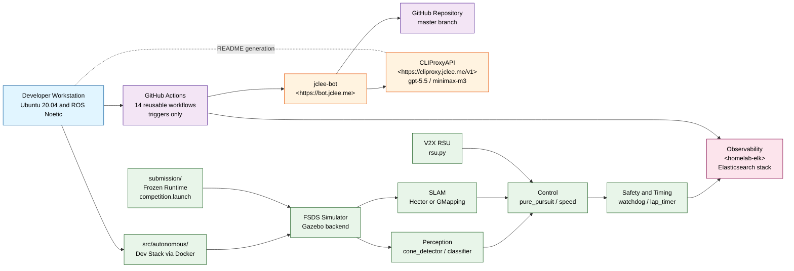

# HYCU FSDS Autonomous Driving / HYCU FSDS 자율주행

> Formula Student Driverless Simulator 기반 자율주행 시스템
> Autonomous driving stack for the Formula Student Driverless Simulator (FSDS)

---

## Overview / 개요

**EN**
HYCU FSDS Autonomous Driving is an autonomous driving project for the Formula Student Driverless Simulator (FSDS). It provides Dockerized ROS Noetic components for perception (cone detection, classification, SLAM), control (pure pursuit, speed planning), safety monitoring (watchdog), lap timing, simulator integration, V2X support, and competition-style submission packaging. The repository is split into a development-oriented stack and a packaged submission stack so that the same algorithms can be iterated locally and re-built as a frozen runtime for evaluation.

**KR**
HYCU FSDS Autonomous Driving은 Formula Student Driverless Simulator(FSDS) 워크플로우를 위한 자율주행 프로젝트입니다. ROS Noetic 기반의 Docker 컨테이너 구성으로 콘 감지·분류·SLAM 인지 모듈, Pure Pursuit·속도 계획 제어 모듈, 워치독 안전 감시, 랩 타이머, 시뮬레이터 연동, V2X 지원, 대회 제출 패키징을 제공합니다. 저장소는 개발용 스택과 제출용 패키지 스택으로 분리되어 있어, 동일한 알고리즘을 로컬에서 반복 개발하고 평가용 동결 런타임(frozen runtime)으로 다시 빌드할 수 있습니다.

The repository provides two execution paths / 저장소는 두 가지 실행 경로를 제공합니다:

1. `src/autonomous/` — Development-oriented stack for algorithm iteration / 알고리즘 반복 개발용 자율주행 스택.
2. `submission/` — Frozen runtime stack for competition submission or evaluation / 대회 제출 또는 평가를 위한 동결 실행 스택.

The `submission/` stack re-uses the same perception, control, and safety modules from `src/autonomous/`, then freezes them into a competition-grade Docker image with a single `competition.launch` entry point. This separation lets you iterate on algorithms in `src/autonomous/` while keeping the submission artifact stable and reproducible.

`submission/` 스택은 `src/autonomous/`의 동일한 인지·제어·안전 모듈을 재사용하되, 이를 단일 `competition.launch` 진입점을 가진 동결 Docker 이미지로 패키징합니다. 이 분리를 통해 `src/autonomous/`에서 알고리즘을 반복 개선하면서도 제출 산출물을 안정적이고 재현 가능하게 유지할 수 있습니다.

---

## Features / 주요 기능

### Perception / 인지

- **Cone Detection** (`cone_detector.py`) — LiDAR-based cone candidate extraction with RANSAC ground segmentation.
- **Cone Classification** (`cone_classifier.py`) — Color and shape-based classification into blue, yellow, and orange track cones.
- **SLAM** (`slam.py`) — Lightweight SLAM wrapper for track mapping and pose estimation.

### Control / 제어

- **Pure Pursuit** (`pure_pursuit.py`) — Geometric path tracker that follows the cone-defined track centerline.
- **Speed Planner** (`speed.py`) — Curvature-aware speed profile with safety margin and acceleration limits.

### Safety and Timing / 안전 및 타이밍

- **Watchdog** (`watchdog.py`) — Heartbeat supervisor that engages a safe-stop on stale sensor data or stalled control loop.
- **Lap Timer** (`lap_timer.py`) — Loop-closure-based lap timing and reporting.

### Simulator Integration / 시뮬레이터 연동

- **FSDS Bridge Launch** (`config/bridge_no_camera.launch`) — ROS launch file bridging FSDS topics into the autonomous stack.
- **Params** (`config/params.yaml`) — Centralized tuning parameters for perception and control.
- **Simulator Settings** (`src/simulator/settings.json`) — FSDS track and sensor configuration.

### V2X / V2X

- **RSU Module** (`submission/src/v2x/rsu.py`) — Roadside-unit simulation exposing trackside telemetry to the ego vehicle.
- **Reference Materials** (`docs/reference_materials/lecture6_v2x.ipynb`) — Lecture notebook covering V2X concepts.

### Drivers / 드라이버

- **Basic / Advanced / Autonomous / Competition** — Tiered driver implementations under `submission/src/drivers/`.
- **Competition Driver** (`competition_driver.py`) — End-to-end driver used for evaluation runs.

### Competition Submission / 대회 제출

- **Competition Launch** (`submission/launch/competition.launch`) — Single entry point for the frozen runtime.
- **Package Script** (`scripts/package.sh`) — Reproducible artifact builder for the submission image.
- **Submission Guide** (`docs/SUBMISSION_GUIDE.md`) — Step-by-step guide for packaging and shipping.

---

## Architecture / 아키텍처

The architecture is layered. A developer workstation drives both the dev stack and the submission stack against the FSDS simulator. Both stacks share the same perception → control → safety pipeline, with V2X injecting external context into the control layer. Operational telemetry and CI artefacts are forwarded to the home-lab observability stack at `<homelab-elk>`, and the entire automation surface is owned by **jclee-bot** (see next section). The 14 GitHub Actions workflow files in `.github/workflows/` are implementation triggers; they fire automations but are not the source of truth.

아키텍처는 계층화되어 있습니다. 개발자 워크스테이션은 FSDS 시뮬레이터에 대해 개발 스택과 제출 스택을 모두 구동합니다. 두 스택은 동일한 인지→제어→안전 파이프라인을 공유하며, V2X가 외부 컨텍스트를 제어 계층에 주입합니다. 운영 텔레메트리 및 CI 산출물은 홈랩 옵저버빌리티 스택(`<homelab-elk>`)으로 전달되며, 전체 자동화 표면은 **jclee-bot**이 소유합니다(다음 절 참조). `.github/workflows/`의 GitHub Actions 워크플로 파일 14개는 자동화를 실행하는 트리거일 뿐, 진실의 원천(Source of Truth)이 아닙니다.

---

## jclee-bot Automation Surfaces / jclee-bot 자동화 표면

**EN**
All mutating automation on this repository — issues, pull requests, releases, branches, and CI-driven remediations — is owned by the **jclee-bot** identity. GitHub Actions workflow files in `.github/workflows/` are the **implementation triggers** that fire those automations; they are not the source of truth. The source of truth is the set of automation surfaces below, each backed by jclee-bot.

**KR**
이 저장소의 모든 변경 자동화(이슈, PR, 릴리스, 브랜치, CI 기반 자동 수정)는 **jclee-bot** 아이덴티티가 소유합니다. `.github/workflows/`의 GitHub Actions 워크플로 파일은 자동화를 **실행하는 트리거**일 뿐, 진실의 원천(Source of Truth)이 아닙니다. 진실의 원천은 아래 나열된 자동화 표면이며, 각각 jclee-bot이 백엔드입니다.

### Issue Lifecycle / 이슈 라이프사이클
- New issues are triaged, labelled, and routed by jclee-bot.
- For accepted issues, jclee-bot creates a working branch and a draft PR linked back to the issue.
- Closing events propagate from the merged PR to the originating issue.
- Behaviour marker for this surface: **jclee-bot에의해자동화됨**.

### PR Review / PR 리뷰
- Code review is produced by [qodo-ai/pr-agent](https://github.com/qodo-ai/pr-agent) and posted by jclee-bot.
- A separate security-focused review pass is also owned by jclee-bot.
- `DOC` PRs are summarized and validated by jclee-bot.

### PR Auto-Merge / PR 자동 병합
- Green PRs that pass review, CI, and required labels are auto-merged by jclee-bot.
- Dependabot PRs are auto-merged on a separate, narrower policy by jclee-bot.

###